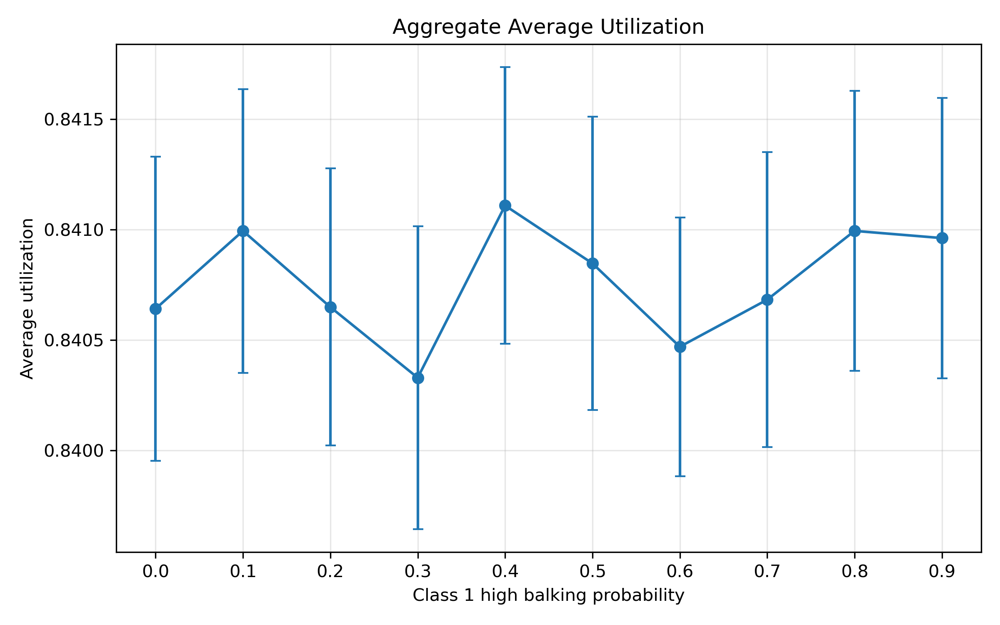
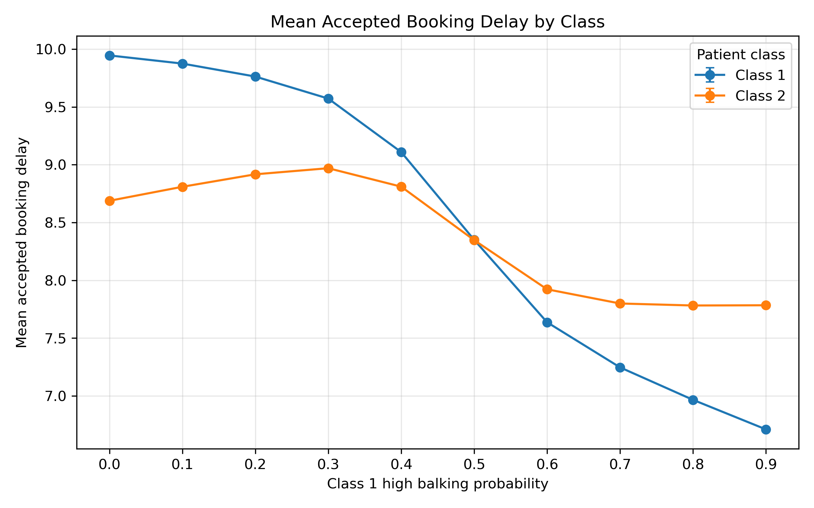
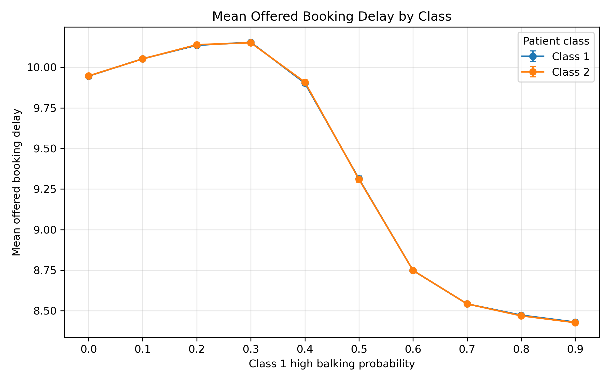
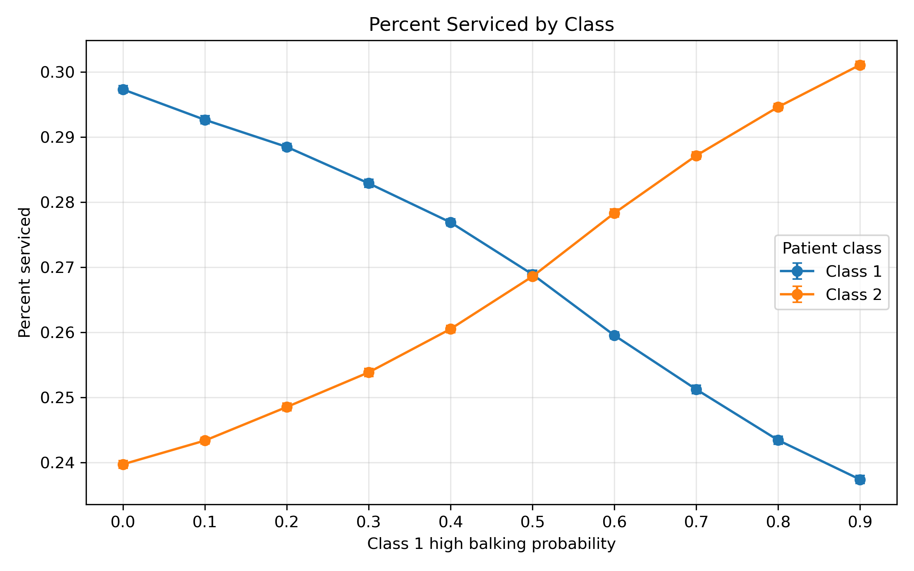

## Overview

This analysis varies only the high balking probability for Class 1 while holding all other simulation parameters fixed. The purpose is to assess how Class 1 balking behavior affects booking delay, utilization, and service access for both patient classes.

The four reported outputs are:

- mean accepted booking delay by class
- mean offered booking delay by class
- aggregate average utilization
- percent serviced by class

## Aggregate Average Utilization

Aggregate utilization remains nearly flat across Class 1 high balking probabilities. The confidence intervals overlap heavily, suggesting that changes in Class 1 balking behavior do not materially affect completed slot use under this parameter setting.

This is likely because total demand remains high enough to keep capacity used even when more Class 1 patients reject long-delay offers. In other words, Class 1 balking changes which patients are served, but it does not substantially change the overall share of clinic slots that become completed visits.

## Mean Accepted Booking Delay

Class 1 accepted delay declines sharply as Class 1 high balking probability increases. This is expected because the metric only includes patients who accept/book an appointment; as Class 1 becomes more likely to reject long-delay offers, the remaining accepted Class 1 appointments are concentrated at shorter delays.

Class 2 shows a more nuanced pattern. Its accepted delay initially rises, then falls. A likely explanation is that moderate Class 1 balking opens some capacity for Class 2, but much of that newly available capacity is still near the back of the booking horizon. At higher Class 1 balking probabilities, congestion falls more substantially, allowing Class 2 to receive shorter accepted delays.

## Mean Offered Booking Delay

Mean offered delay includes both accepted patients and patients who balked, so it is a broader measure of the delay environment than accepted delay alone.

The offered delay remains high at low to moderate Class 1 balking probabilities, then drops sharply once Class 1 balking becomes large enough. This suggests that small increases in Class 1 balking do not immediately relieve horizon congestion. Once enough long-delay Class 1 patients reject offers, the booking calendar becomes less congested and both classes receive shorter offered delays.

The similarity between the two class curves indicates that offered delay is largely determined by shared system congestion rather than class-specific behavior alone.

## Percent Serviced

Percent serviced shows the clearest class-level tradeoff. As Class 1 high balking probability rises, Class 1's serviced share falls while Class 2's serviced share rises.

This suggests that Class 1 balking releases capacity that can be used by Class 2. However, this should not be interpreted as an overall access improvement. The aggregate utilization graph shows little change, meaning the main effect is a redistribution of service access between classes rather than a substantial improvement in total completed service.

## Main Takeaways

Increasing Class 1 high balking probability mainly changes the allocation of service across classes.

Class 1 experiences lower accepted delay, but this occurs partly because more long-delay Class 1 patients reject appointments and are therefore excluded from the accepted-delay calculation.

Class 2 benefits in terms of percent serviced, and eventually receives shorter delays once Class 1 balking becomes sufficiently high.

Aggregate average utilization is largely insensitive to the change, suggesting that the clinic remains capacity-constrained and that total demand is sufficient to keep slots used across the tested parameter range.