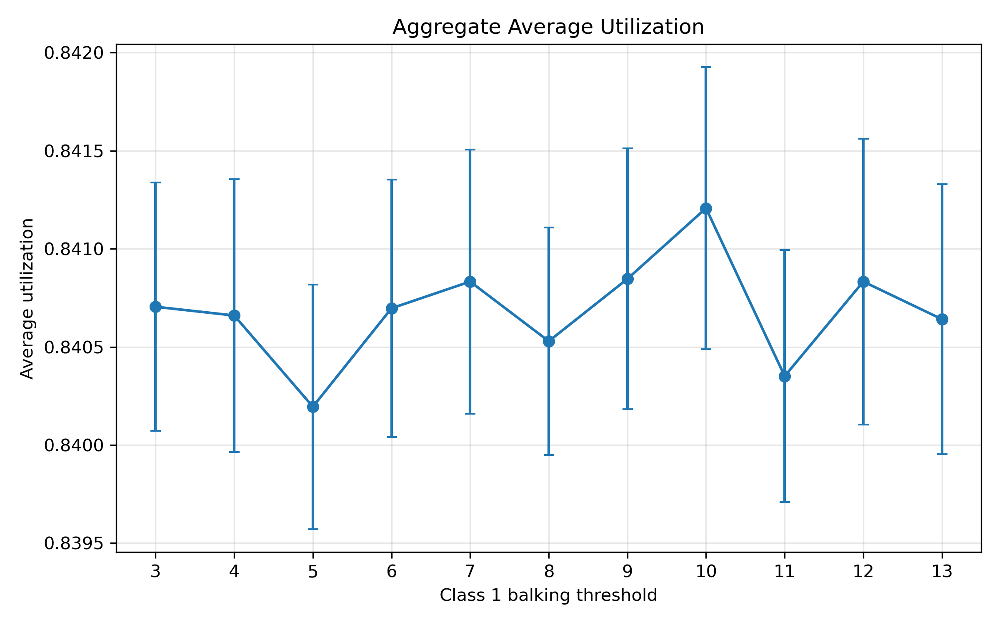
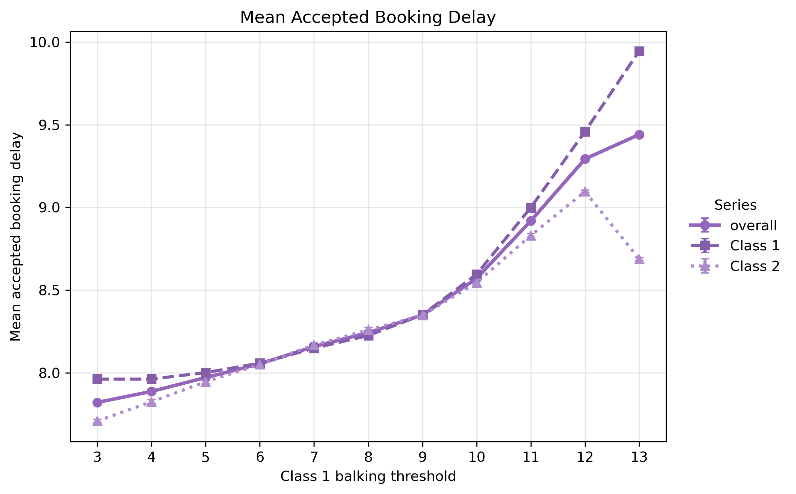
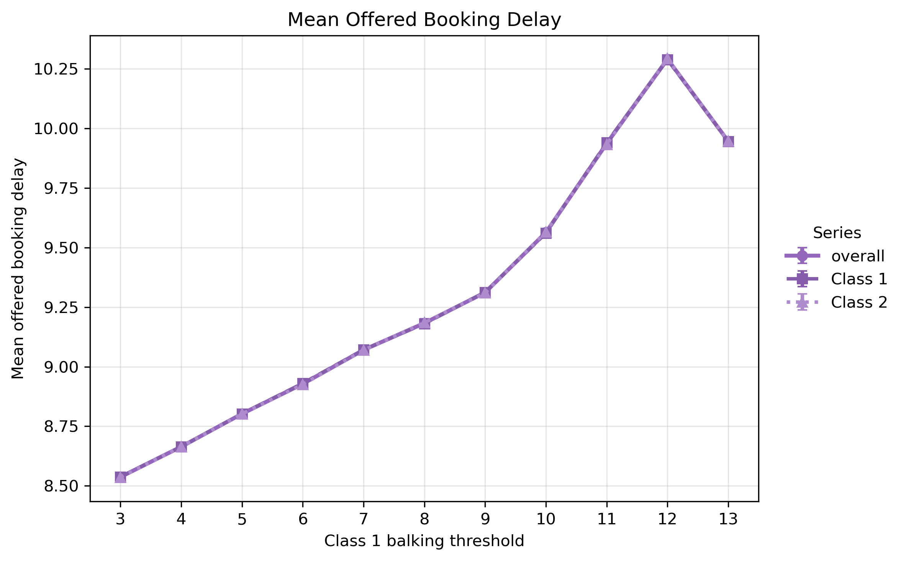
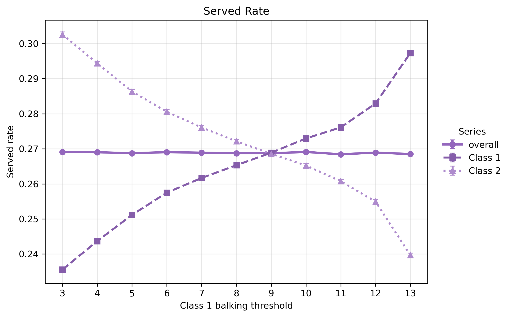
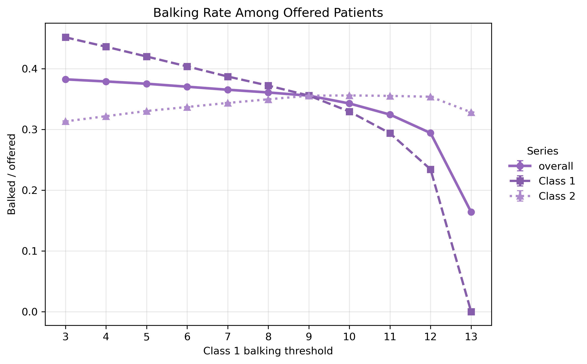
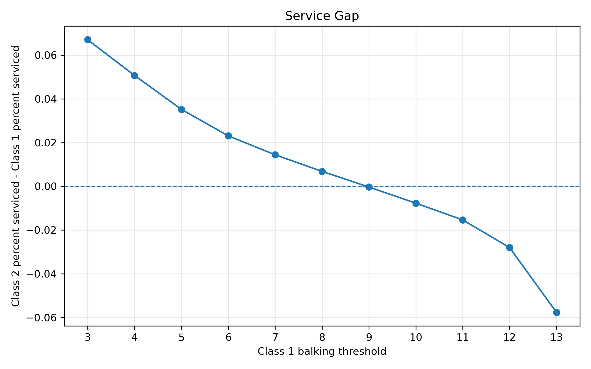

This is a companion extract. The canonical metric-first report is
[`metric_analysis.qmd`](../reports/metric_analysis.qmd), where this sweep is included in
the Balking Deep Dive.

## Overview

This analysis varies only the balking threshold for Class 1 while holding all other simulation parameters fixed. Class 1's low and high balking probabilities remain unchanged; only the delay point at which high balking begins is varied.

The six reported outputs are:

- mean accepted booking delay by class
- mean offered booking delay by class
- aggregate average utilization
- percent serviced by class
- balking rate by class
- service gap between classes

With `horizon_days = 14`, possible offered delays are `tau = 0, 1, ..., 13`. A lower Class 1 balking threshold means Class 1 begins rejecting offers at shorter delays.

## Aggregate Average Utilization

Aggregate utilization should be read as the share of clinic slots that become completed visits, averaged across measured days. Because the system remains capacity-constrained, utilization may not move as sharply as class-level access metrics.

The key question for this figure is whether earlier Class 1 balking reduces no-show losses enough to improve completed slot use, or whether it mostly changes which class receives access. If the curve is relatively flat, then the threshold mainly redistributes service across classes rather than changing total completed capacity.

## Mean Accepted Booking Delay

Class 1 accepted delay generally rises as the balking threshold increases. This is expected: when the threshold is higher, Class 1 tolerates longer waits before high balking applies, so more long-delay appointments remain in the accepted sample.

The comparison with Class 2 is more subtle. Class 2’s balking rule is fixed, so changes in its accepted delay are indirect. If Class 2 delay rises, it suggests that Class 1 is occupying less favorable parts of the horizon and pushing Class 2 farther out. If Class 2 delay falls at the highest thresholds, that may reflect a selection effect: Class 1 captures more far-horizon slots, leaving Class 2’s accepted patients concentrated among shorter-delay bookings.

## Mean Offered Booking Delay

Mean offered delay is the broader congestion measure because it includes both patients who accept and patients who balk. It is therefore less affected by the accepted-sample selection problem.

This figure shows how the booking horizon changes when Class 1 begins balking earlier or later. Lower thresholds remove more Class 1 demand from medium- and long-delay offers. Higher thresholds allow Class 1 to remain in the offer pool for longer waits, which can increase congestion and push offered delays upward for both classes.

Because both classes draw from the same appointment calendar, offered delay can move similarly across classes even though only Class 1’s threshold is being changed.

## Percent Serviced

Percent serviced is the clearest access metric. Lower Class 1 thresholds usually reduce Class 1’s serviced share because more Class 1 patients reject appointments at shorter delays. Class 2 may benefit if those rejected offers free capacity that Class 2 can use.

This figure should be interpreted together with accepted delay. A lower accepted delay is not necessarily an improvement if it occurs because long-delay patients are balking and leaving the system. Percent serviced shows whether patients are actually reaching completed service.

## Balking Rate

The balking-rate plot shows whether the threshold change is actually moving patients into rejection behavior. A lower threshold should raise Class 1 balking when offered waits exceed the new cutoff.

## Service Gap

The service gap directly shows whether the threshold change mainly redistributes completed service between classes.

## Main Takeaways

Changing Class 1’s balking threshold tests when Class 1 begins treating delay as unacceptable. This is different from changing the high balking probability, which tests how strongly Class 1 reacts after the threshold has already been crossed.

The threshold sweep is especially useful because the no-show threshold is fixed. If Class 1 begins balking before or near the no-show threshold, the model may filter out patients who would otherwise have high no-show risk. If Class 1 begins balking only after the no-show threshold, some high-no-show appointments remain in the system.

The most important interpretation is whether earlier Class 1 balking improves aggregate utilization or mainly shifts access from Class 1 to Class 2. If utilization remains stable while percent serviced diverges across classes, the effect is primarily redistributive rather than efficiency-improving.
