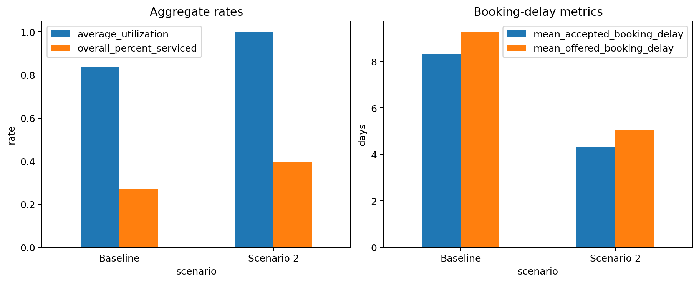
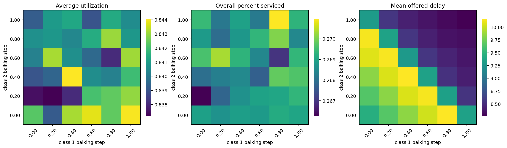
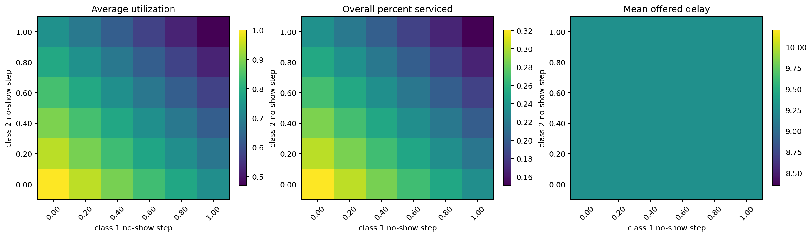
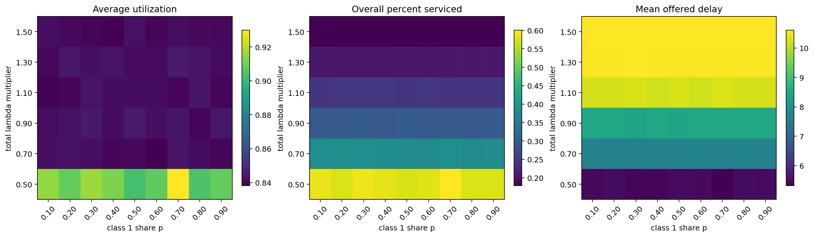
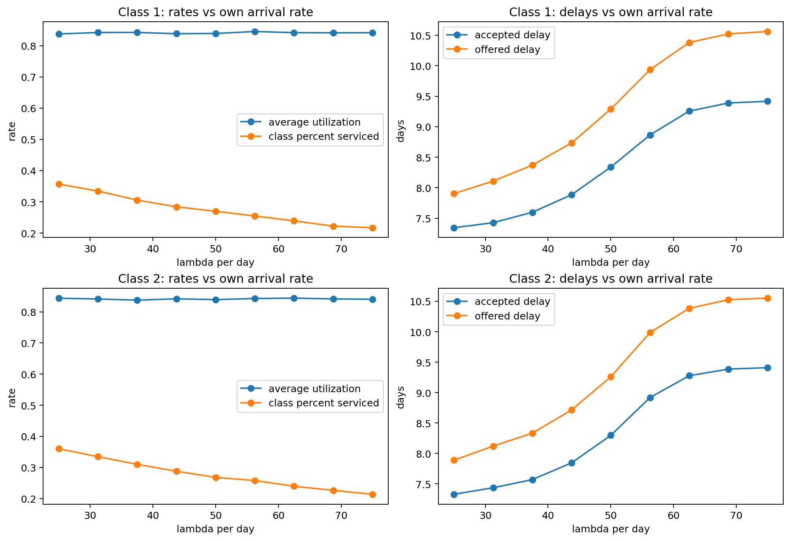

# Metric Definitions And Sensitivity Analysis

This document defines the final metrics used by the simulation and summarizes what the sensitivity plots show. The plots were generated from the current repository configuration, averaging each plotted point across three fixed random seeds.

The current baseline has symmetric patient classes: both classes have the same arrival rate, cancellation probability, balking rule, no-show rule, and value. Because of that, class labels are exchangeable in the baseline. When a class-1-vs-class-2 heatmap is symmetric, that means the absolute level of the parameter matters more than which class has the higher value.

## Notation

Let:

- `i` be patient class, currently `i = 1, 2`.
- `D` be the number of measured days.
- `S` be `slots_per_day`.
- `tau` be the offered booking delay in days.
- `A_i` be measured arrivals for class `i`.
- `B_i` be booked patients for class `i`.
- `K_i` be balked patients for class `i`.
- `N_i` be no-offer patients for class `i`.
- `C_i` be canceled booked patients for class `i`.
- `H_i` be no-show booked patients for class `i`.
- `V_i` be served patients for class `i`.
- `O_i = B_i + K_i` be offered patients for class `i`.

Patients with `no_offer` are not included in offered-delay metrics because they did not receive a slot offer.

## Exact Metric Definitions

### Mean Accepted Booking Delay

Class-level:

```text
mean_accepted_booking_delay_i =
    sum(tau for class-i patients who accepted/booked a slot) / B_i
```

Aggregate:

```text
mean_accepted_booking_delay =
    sum_i total_booking_delay_i / sum_i B_i
```

This is the old `mean_booking_delay`, kept in the model only as a backward-compatible alias.

### Mean Offered Booking Delay

Class-level:

```text
mean_offered_booking_delay_i =
    sum(tau for class-i patients who received an offer) / O_i
```

Aggregate:

```text
mean_offered_booking_delay =
    sum_i total_offered_booking_delay_i / sum_i O_i
```

This includes patients who accepted and patients who balked. It excludes `no_offer`.

### Percent Serviced

Class-level:

```text
percent_serviced_i = V_i / A_i
```

Aggregate:

```text
overall_percent_serviced = sum_i V_i / sum_i A_i
```

This is the main access metric: it measures what share of arrivals ultimately became completed visits.

### Average Utilization

For measured day `d`:

```text
daily_utilization_d = served_slots_d / S
```

Across the measurement window:

```text
average_utilization = (1 / D) * sum_d daily_utilization_d
```

This counts served patients only. No-shows do not count as utilization. Utilization is aggregate only, not class-specific.

### Slot Diagnostics

These are still useful diagnostic counts:

```text
booked_slots  = slots that had a booked appointment at service time, including no-shows
served_slots  = booked slots that became completed visits
no_show_slots = booked slots lost to no-shows
```

`booked_slots` is diagnostic, not a final utilization metric. `empty_slots` and `empty_slot_rate` are not used for final reporting.

## Scenario Comparison



The baseline and scenario 2 differ on several dimensions at once, including arrival rates, horizon length, measurement length, balking threshold, balking step, and no-show threshold. Since the metrics are rates or averages, they are comparable despite different simulation lengths, but the scenario comparison should not be interpreted as a clean one-parameter causal test.

Across the current runs:

| Scenario | Average utilization | Overall percent serviced | Mean accepted delay | Mean offered delay |
|---|---:|---:|---:|---:|
| Baseline | 0.839 | 0.269 | 8.32 | 9.27 |
| Scenario 2 | 1.000 | 0.395 | 4.30 | 5.07 |

Scenario 2 has better access and shorter delays. The main reason is not a class-label difference; it changes absolute system conditions. It has lower total demand, more aggressive balking after shorter delays, and a no-show threshold that avoids no-shows within the available booking horizon.

## Balking Step Sensitivity



The heatmaps vary the balking step size for class 1 and class 2 while holding other baseline settings fixed. With baseline `low = 0`, the step size is the post-threshold balking probability.

Main insight:

- The plots are roughly symmetric across the two class axes.
- That means the aggregate metrics respond mostly to the absolute combined balking level, not to whether class 1 or class 2 has the larger step.
- Higher balking step sizes reduce offered delay because patients reject long-delay offers more often.
- Higher balking does not automatically improve access. A balked patient is still a lost arrival, so percent serviced can remain low even if delays improve.

Interpretation: balking changes the tradeoff between access and delay. It can reduce congestion among patients who accept appointments, but it does so partly by losing demand.

## No-Show Step Sensitivity



The no-show step has the clearest effect on utilization. When the no-show step is low for both classes, average utilization is near 1. When it is high for both classes, utilization falls sharply.

Main insight:

- Absolute no-show probability matters much more than the difference between classes.
- The upper-left and lower-right corners are similar because class labels are symmetric in the baseline.
- Mean offered delay barely changes in this sweep because no-shows happen after booking; they waste booked capacity but do not change the delay that was offered at booking time.

Interpretation: no-show behavior is the most direct driver of utilization loss. If the goal is to improve utilization, no-show reduction is more important than fine-tuning class differences.

## Arrival Rate And Class Mix



This sweep varies:

```text
lambda_total = multiplier * baseline lambda_total
lambda_1     = p * lambda_total
lambda_2     = (1 - p) * lambda_total
```

Main insight:

- Total demand pressure matters strongly.
- Class mix `p` matters weakly in the current baseline because the classes are behaviorally identical.
- As total arrival rate rises, percent serviced drops and offered delay rises.
- Average utilization can stay high even when access is poor.

Interpretation: utilization alone is not enough. A clinic can be highly utilized while serving a small share of arrivals if demand greatly exceeds capacity.

## Class Arrival Rate Sweeps



These plots vary one class's arrival rate at a time while holding the other class fixed.

Main insight:

- The class 1 and class 2 curves are nearly the same because the baseline classes are symmetric.
- Increasing a class's arrival rate lowers that class's percent serviced and increases its booking delays.
- Average utilization changes less than access and delay once the system is already capacity constrained.

Interpretation: in this model configuration, the absolute arrival rate matters more than which class receives the extra arrivals. Class differences would matter more if the classes had different values, different no-show behavior, different balking behavior, or different arrival volumes.

## What Matters Most

1. **No-show absolute level matters most for utilization.**  
   No-shows directly turn booked capacity into lost visits. This is why average utilization responds strongly to no-show step size.

2. **Total arrival pressure matters most for access and delay.**  
   As `lambda_total` increases, percent serviced falls and offered delay rises. Class mix matters little when classes are otherwise identical.

3. **Balking is a tradeoff, not a pure improvement.**  
   Stronger balking can reduce accepted/offered delays, but it also means more arrivals leave without being served.

4. **Class differences matter only when classes are truly different.**  
   In the baseline, classes are symmetric. The class-1-vs-class-2 plots mainly show absolute parameter effects. A real class-difference effect would appear as a strong difference between the upper-left and lower-right heatmap corners.

5. **Use at least two final metrics together.**  
   Recommended reporting pair:
   - `average_utilization` for capacity use
   - `overall_percent_serviced` for access

   Add `mean_offered_booking_delay` when the question is patient-facing access, because it includes patients who balked after receiving long-delay offers.
