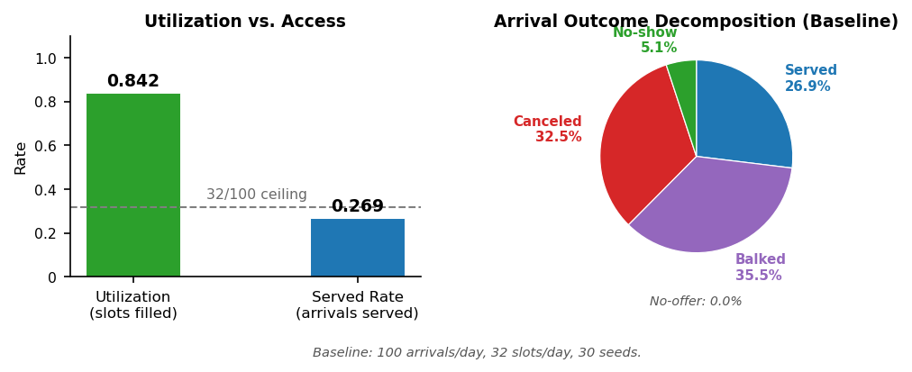
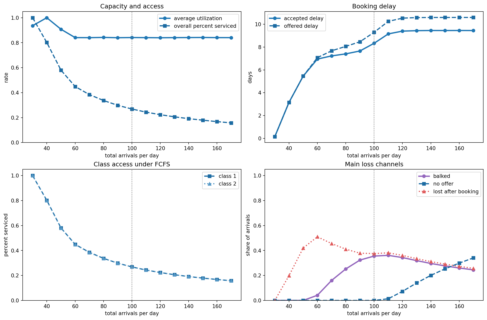
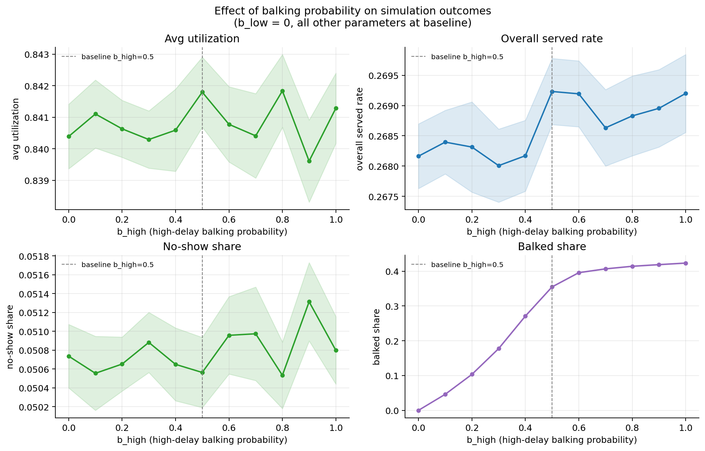
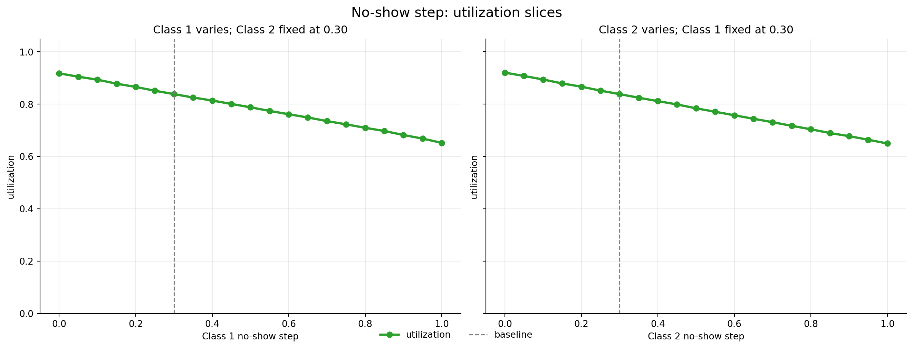
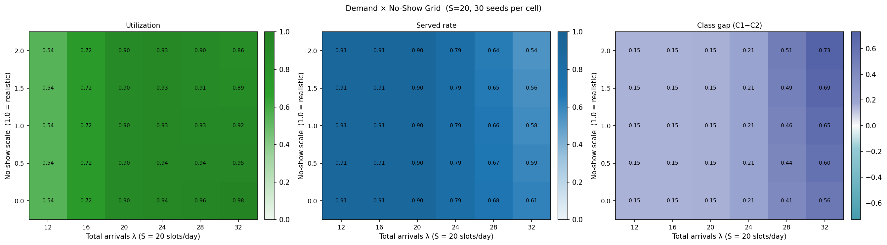
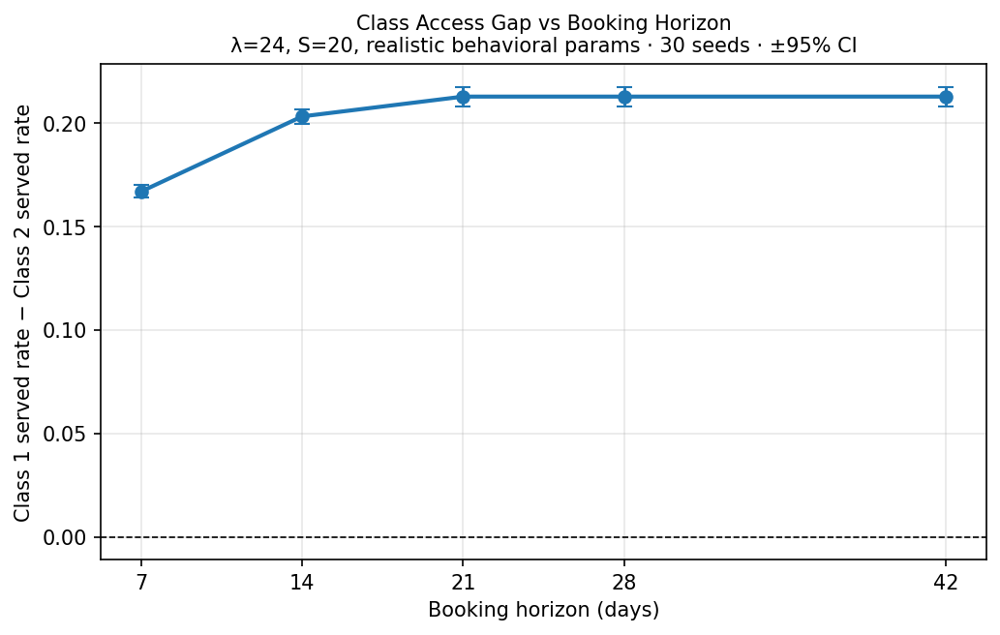
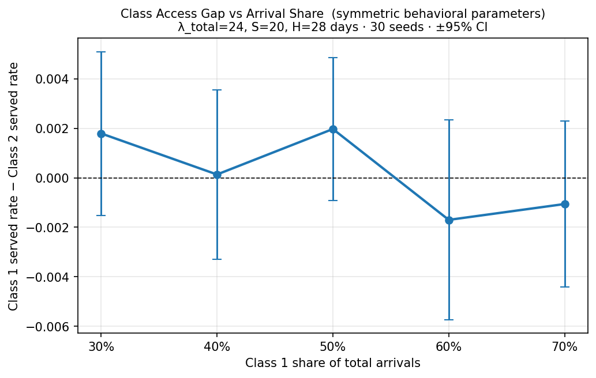

## Purpose

This document is the conclusion layer for the FCFS appointment simulation work. Earlier reports investigated mechanisms; this report states the final hypotheses about how the implemented pooled day-level FCFS simulation works, whether the simulation supports or disproves each claim, and what additional work would be needed beyond the current model.

It keeps the professor-requested format from the original hypothesis synthesis: a hypothesis table, supporting evidence, and a clear verdict. The comparison and consolidation tables later in the document show how the lab partner conclusions and original hypotheses map into the final conclusions.

The original `hypothesis_synthesis.qmd` and `hypothesis_synthesis.html` are not modified.

## Audit Outcome

The hypothesis synthesis is conclusive for the current simulation implementation. The nine final hypotheses below are supported by both the code mechanics and the simulation evidence, with explicit scope qualifiers where the evidence is regime-dependent.

The work is not a claim about a calibrated real clinic. The stress-test results prove how this model behaves under intentionally high demand; the realistic experiments show which mechanisms remain active under the lower-demand parameterization used in the conclusion update.

No additional experiments are required to support the nine conclusions within the current model. Further work is only needed for external-validity or policy-extension questions: recalibrating demand/capacity to a real clinic, changing the no-show model from original offered delay to remaining wait, or adding appointment-priority policies beyond pooled FCFS.

## Conclusion Anchors

The minimum reporting set for this simulation is:

- served rate;
- utilization;
- offered wait;
- no-offer share;
- outcome decomposition;
- class-level served rates.

At the stress-test baseline, the outcome decomposition is also conclusive: about 26.9% of arrivals are served, about 35.5-35.6% balk, about 32.3-32.5% cancel, about 5.1% no-show, and 0.0% receive no offer. Baseline losses are therefore post-offer losses, not horizon-denial losses.

Regression coefficients cited below are standardized associations over sampled parameter configurations. They are useful for ranking drivers in a design space, but they are not standalone policy causal effects. Controlled sweeps and attribution experiments are used for mechanism claims.

## Functional Mechanics Verified

| Implemented mechanic | Consequence for the conclusions |
|---|---|
| Arrivals are generated by class, randomly permuted within each day, and booked through one pooled day-level FCFS process. | Class labels have no priority by construction; class gaps require behavioral asymmetry or interactions. |
| The engine offers the earliest residual day with open capacity, including same-day slots. | Offered wait is a queue-congestion metric conditional on receiving an offer. |
| If the finite horizon is full, the current and remaining daily arrivals are counted as no-offer. | No-offer is a distinct access failure and must be reported with wait metrics. |
| Offered delay is recorded before balking; accepted delay is recorded only after the patient accepts. | Accepted wait can improve by selection when high-delay patients balk. |
| Balking happens before booking and consumes no slot. | Balking reallocates access under high demand; it does not create capacity. |
| Cancellations apply at the start of the day to future bookings only, before new arrivals are processed. | Future cancellations can free rebookable capacity for later arrivals. |
| No-shows are resolved on the service day and no replacement booking is inserted. | No-show slots are unrebookable completed-visit losses. |
| No-show probability depends on original offered delay, not updated remaining wait. | Demand and threshold placement determine when no-show effects become material. |

## Final Hypothesis Table

<table class="final-table">
  <thead>
    <tr>
      <th>ID</th>
      <th>Final hypothesis about the simulation</th>
      <th>Simulation verdict</th>
      <th>Evidence basis</th>
      <th>More to do?</th>
    </tr>
  </thead>
  <tbody>
    <tr>
      <td>P1</td>
      <td>Under oversubscription, utilization can remain high while patient access is poor; served rate is the primary aggregate access metric.</td>
      <td>True</td>
      <td>Baseline utilization is about 0.841 while served rate is about 0.269. With 100 arrivals/day and 32 slots/day, served rate is mechanically capped near 0.32 before behavioral losses.</td>
      <td>No, for the current model. Only calibration to real demand would change interpretation.</td>
    </tr>
    <tr>
      <td>P2</td>
      <td>With fixed capacity, increasing arrivals lowers served rate and raises offered wait; the stress-test baseline is for mechanism diagnosis, not clinic calibration.</td>
      <td>True, scoped</td>
      <td>The final research note reports arrival rate as the dominant driver of overall served rate (beta -0.774) and mean offered wait (beta +0.576).</td>
      <td>No, unless the goal is operational calibration.</td>
    </tr>
    <tr>
      <td>P3</td>
      <td>Offered wait is a better congestion diagnostic than accepted wait, but it must be reported with no-offer share because no-offer patients are excluded from wait metrics.</td>
      <td>True</td>
      <td>The code records offered delay before balking, but no-offer patients have no delay observation. Baseline no-offer is 0.0; no-balking diagnostic no-offer rises to 0.2966.</td>
      <td>No. This is a reporting rule for all future summaries.</td>
    </tr>
    <tr>
      <td>P4</td>
      <td>Balking reduces affected-class access, improves accepted-wait statistics by selection, and reallocates capacity; it does not recover aggregate capacity under the stress-test baseline.</td>
      <td>True</td>
      <td>Class 1 balking sweep lowers Class 1 accepted delay from 9.95 to 6.71 and Class 1 served rate from 0.297 to 0.237, while aggregate served rate stays near 0.269.</td>
      <td>No, for the implemented FCFS queue. Different priority rules would need new tests.</td>
    </tr>
    <tr>
      <td>P5</td>
      <td>Under high demand, future cancellations are reabsorbed by the pool: the canceling class loses access while other patients may gain nearer slots.</td>
      <td>Qualified true</td>
      <td>Class 1 cancellation sweep: offered delay falls from 11.84 to 7.47 days, Class 1 served rate falls from 0.344 to 0.175, Class 2 served rate rises from 0.135 to 0.395.</td>
      <td>No for high-demand mechanics. Do not generalize as a clinic recommendation that cancellations are beneficial.</td>
    </tr>
    <tr>
      <td>P6</td>
      <td>No-shows are unrebookable booked-slot losses. In the tested regimes, their utilization effects become material when offered delays frequently cross the no-show-risk region or when low-delay no-show probability is nonzero.</td>
      <td>Qualified true</td>
      <td>The code resolves no-shows at service time and does not rebook the slot. Stress-test no-show sweep drops utilization from 0.920 to 0.681; realistic lambda/S = 1.2 no-show doubling changes utilization only 0.935 to 0.934.</td>
      <td>No within current assumptions. More work only if no-show should depend on remaining wait instead of original offered delay.</td>
    </tr>
    <tr>
      <td>P7</td>
      <td>Within the tested symmetric arrival-share range, pooled day-level FCFS does not create a meaningful per-arrival class access gap from class labels or arrival share alone.</td>
      <td>True</td>
      <td>The engine randomly permutes arrivals and applies the same FCFS rule to all classes. The symmetric arrival-share experiment keeps the gap between about -0.002 and +0.002 as Class 1 share varies from 0.30 to 0.70.</td>
      <td>No. This refutes the broad statement that arrival share alone creates a gap under symmetric behavior.</td>
    </tr>
    <tr>
      <td>P8</td>
      <td>Asymmetric behavior can create large class gaps, but driver ranking is regime-specific: the broad regression screen emphasizes cancellation gap for class-gap prediction, while the realistic local attribution emphasizes no-show asymmetry.</td>
      <td>Qualified true</td>
      <td>Broad regression screen: cancellation gap has the largest absolute class-gap beta (0.452). Realistic local attribution: no-show asymmetry explains 0.120 of the 0.213 full gap, cancellation 0.073, balking threshold 0.019.</td>
      <td>No. Future reports should always state the regime before ranking drivers.</td>
    </tr>
    <tr>
      <td>P9</td>
      <td>Booking horizon length can amplify the realistic class gap until roughly a three-week horizon, then the effect plateaus.</td>
      <td>True</td>
      <td>Horizon sweep: class gap rises from 0.167 at 7 days to 0.203 at 14 days and 0.213 at 21 days, then remains 0.213 at 28 and 42 days.</td>
      <td>No for this parameterization. Different horizon policies would need policy-specific experiments.</td>
    </tr>
  </tbody>
</table>

## Source Priority

1. Mechanics source of truth: [`fcfs_research_note_final.tex`](../../metric_analysis/research_style/final/note/fcfs_research_note_final.tex)
2. Lab partner conclusion package: [`fcfs_conclusion_sheet.tex`](../../conclusions/paper/fcfs_conclusion_sheet.tex), [`fcfs_supervisor_brief_final.tex`](../../conclusions/paper/fcfs_supervisor_brief_final.tex), and [`fcfs_conclusions_deck.tex`](../../conclusions/deck/fcfs_conclusions_deck.tex)
3. New conclusion update: [`UPDATE.md`](../../conclusions/deck/UPDATE.md)
4. Raw result files in `outputs/`, `results/`, and `docs/reports/metric_analysis/data/`

## Verdict Key

| Label | Meaning |
|---|---|
| True | Supported as stated by the conclusion files and the checked evidence. |
| Qualified true | Mechanism is supported, but the wording needs a denominator, regime, or scope condition. |
| Not supported as stated | The broad statement is misleading or contradicted by a controlled result. |
| New conclusion | Not in the original hypothesis table; emerged from the conclusion update or final research note. |
| Merge | Correct, but should be folded into a broader hypothesis to avoid duplicate rows. |

## Source Comparison Table

This table audits the lab partner conclusions and original hypotheses against the final evidence. It is supporting material for the final P1-P9 table above.

<table class="comparison-table">
  <thead>
    <tr>
      <th>ID</th>
      <th>Lab partner finding or original hypothesis</th>
      <th>Supporting evidence</th>
      <th>Verdict</th>
      <th>Adapted hypothesis or new conclusion</th>
      <th>Redundancy action</th>
    </tr>
  </thead>
  <tbody>
    <tr>
      <td>M1</td>
      <td>Utilization is not an access metric under oversubscription; served rate is the primary aggregate access metric.</td>
      <td>Stress-test baseline has utilization about 0.841 to 0.842 while served rate is about 0.269. With 100 arrivals and 32 slots, served rate is mechanically capped near 0.32 before behavioral losses.</td>
      <td>True</td>
      <td>High utilization can coexist with poor patient access because utilization is normalized by slots and served rate is normalized by arrivals.</td>
      <td>Keep</td>
    </tr>
    <tr>
      <td>M2</td>
      <td>Offered wait must be reported with no-offer share because no-offer patients are absent from wait metrics.</td>
      <td>Baseline no-offer is 0.0, but no-offer appears when the horizon saturates. In the no-balking diagnostic, no-offer rises to 0.2966 while offered-wait summaries still condition on patients who receive offers.</td>
      <td>True</td>
      <td>Mean offered wait is useful, but it is conditional on receiving an offer; report no-offer share alongside it.</td>
      <td>Keep</td>
    </tr>
    <tr>
      <td>M3</td>
      <td>Increasing arrivals lowers served rate and raises offered wait when capacity is fixed.</td>
      <td>The final research note reports total arrival rate as the dominant driver of overall served rate (standardized beta -0.774) and mean offered wait (beta +0.576). No-offer begins to grow once demand is high enough to fill the horizon, around lambda = 110 in the stress test.</td>
      <td>True</td>
      <td>Capacity pressure is the main aggregate access and wait driver under fixed supply.</td>
      <td>Demote under P1/P2 as capacity-pressure support</td>
    </tr>
    <tr>
      <td>H1</td>
      <td>A class with higher cancellation probability shortens offered delay for everyone but lowers its own served rate.</td>
      <td>Class 1 cancellation sweep: as Class 1 cancellation probability rises from 0.00 to 0.30, mean offered delay falls from 11.84 to 7.47 days, Class 1 served rate falls from 0.344 to 0.175, Class 2 served rate rises from 0.135 to 0.395, and utilization rises from 0.752 to 0.889.</td>
      <td>Qualified true</td>
      <td>Future cancellations can be reabsorbed under high demand: they hurt the canceling class, free capacity for the other class, and can shorten offered wait. Do not generalize this as "cancellations improve access" outside the high-demand rebooking regime.</td>
      <td>Keep</td>
    </tr>
    <tr>
      <td>H2</td>
      <td>No-show slots are not rebooked; no-show behavior directly lowers utilization.</td>
      <td>Stress-test no-show sweep: Class 1 high no-show probability from 0.0 to 0.9 lowers utilization from 0.920 to 0.681 and overall served rate from 0.294 to 0.218, while offered and accepted wait stay flat. New demand x no-show grid: at lambda/S = 1.2, utilization changes only from 0.935 to 0.934 when no-show intensity doubles; at lambda/S = 1.6, it falls from 0.978 to 0.864.</td>
      <td>Qualified true</td>
      <td>No-show is an unrebookable service-day loss; its utilization effect becomes material when demand creates enough bookings beyond the no-show-risk threshold or when low-delay no-show probability is nonzero.</td>
      <td>Merge with N1 demand-gating conclusion</td>
    </tr>
    <tr>
      <td>H3</td>
      <td>Higher balking decreases accepted delay but decreases served rate.</td>
      <td>Class 1 balking sweep: as high-delay balking rises from 0.0 to 0.9, Class 1 accepted delay falls from 9.95 to 6.71 days and Class 1 served rate falls from 0.297 to 0.237. Class 2 served rate rises from 0.240 to 0.301, so aggregate served rate remains near 0.269.</td>
      <td>True</td>
      <td>Higher balking improves accepted-wait statistics by selection: long-delay patients leave the accepted sample. It reallocates access through pooled FCFS rather than improving service for the affected class.</td>
      <td>Keep</td>
    </tr>
    <tr>
      <td>H4</td>
      <td>When losses concentrate at balking, utilization is preserved. When losses concentrate at no-show, utilization drops. Served rate decreases in both cases.</td>
      <td>Balking sweep: utilization stays near 0.841 and aggregate served rate near 0.269 as Class 1 balking changes. No-show sweep: utilization falls from 0.920 to 0.681. The no-balking diagnostic confirms that suppressing balking changes utilization by only -0.0014 while shifting losses into no-offer and cancellation.</td>
      <td>Qualified true</td>
      <td>Balking is a pre-booking loss and can be reallocated; no-show is a service-day loss and cannot be rebooked. The served-rate decline applies most clearly to the affected class, not necessarily to the aggregate system under balking.</td>
      <td>Merge with H2 and H3 as the loss-timing synthesis</td>
    </tr>
    <tr>
      <td>G1</td>
      <td>With symmetric parameters, pooled FCFS produces a near-zero expected class access gap; gaps emerge from asymmetric behavior.</td>
      <td>Stress-test symmetric baseline gap is about 0.001 or smaller. The conclusion sheet and final note both describe the symmetric baseline as a neutral reference point. The realistic asymmetric case has a large class-level gap.</td>
      <td>True</td>
      <td>Pooled FCFS is neutral under symmetric behavior; class-level served rates are required once behavior differs.</td>
      <td>Keep</td>
    </tr>
    <tr>
      <td>G2</td>
      <td>In the realistic scenario, aggregate outcomes improve but the class served-rate gap remains substantial.</td>
      <td>Supervisor brief reports gap 0.220 (Class 1: 0.881, Class 2: 0.661). New attribution experiment reports a comparable full realistic gap of 0.213 and decomposes it by source.</td>
      <td>True</td>
      <td>Use the newer 0.213 number for attribution and the older 0.220 number as the earlier brief estimate. Both support the same conclusion: aggregate metrics hide class-level access gaps.</td>
      <td>Keep as evidence for G1 and G3</td>
    </tr>
    <tr>
      <td>G3</td>
      <td>Class-gap driver hierarchy: cancellation dominates the broad regression screen.</td>
      <td>Final research note: cancellation probability gap is the largest broad-screen class-gap driver (absolute beta 0.452), followed by balking threshold gap (0.429) and balking step gap (0.349). New realistic attribution reverses the local ranking: no-show asymmetry contributes 0.120 of the 0.213 gap (56%), cancellation contributes 0.073 (34%), and balking threshold contributes 0.019 (9%).</td>
      <td>Qualified true</td>
      <td>Driver ranking is regime-specific: cancellation gap dominates the broad regression screen for class-gap prediction, while no-show asymmetry dominates the realistic local attribution.</td>
      <td>Keep</td>
    </tr>
    <tr>
      <td>G4</td>
      <td>Class gaps may emerge from asymmetric behavioral parameters or arrival rates.</td>
      <td>The regression screen finds Class 1 arrival share significant for class gap (beta -0.120). But the controlled symmetric arrival-share experiment varies Class 1 share from 0.30 to 0.70 and keeps the gap between about -0.002 and +0.002.</td>
      <td>Not supported as stated</td>
      <td>Arrival share alone does not create a class gap under symmetric behavior. If arrival mix appears important in broad regressions, treat it as an interaction or regime marker unless behavior differs by class.</td>
      <td>Merge into G1 as a correction</td>
    </tr>
    <tr>
      <td>N1</td>
      <td>No-show utilization effects are demand-regime activated.</td>
      <td>New demand x no-show experiment: doubling no-show intensity has essentially no utilization effect at lambda/S = 1.2 (0.935 to 0.934), but a large effect at lambda/S = 1.4 (0.957 to 0.900) and lambda/S = 1.6 (0.978 to 0.864).</td>
      <td>New conclusion</td>
      <td>No-show effects become material once offered delays frequently cross the no-show-risk threshold.</td>
      <td>Merge into H2 as the regime condition</td>
    </tr>
    <tr>
      <td>N2</td>
      <td>Booking horizon length amplifies the realistic class gap until it plateaus.</td>
      <td>Horizon sweep: class gap rises from 0.167 at 7 days to 0.203 at 14 days and 0.213 at 21 days, then stays at 0.213 for 28 and 42 days.</td>
      <td>New conclusion</td>
      <td>Longer horizons amplify the realistic class gap until about a 21-day horizon; extending beyond that does not add gap in this experiment.</td>
      <td>Keep as design modifier</td>
    </tr>
    <tr>
      <td>N3</td>
      <td>Threshold ordering creates an accept-then-miss interval.</td>
      <td>Final research note: the stress-test baseline has no-show threshold 6 days and balking threshold 9 days. Because threshold rules use low probability for tau <= threshold and high probability for tau > threshold, integer offered delays 7 through 9 are accepted while already carrying high no-show risk. The threshold heatmap identifies this region as structurally important for utilization.</td>
      <td>New conclusion</td>
      <td>When the no-show threshold is below the balking threshold, offers with theta_no_show < tau <= theta_balk can be accepted while already carrying high no-show risk, reserving capacity that may later be lost.</td>
      <td>Merge as evidence under the no-show row</td>
    </tr>
  </tbody>
</table>

## Consolidation Map

| Final row | Original row(s) consolidated | Action taken | Reason |
|---|---|---|---|
| P1 | M1, part of M3 | Kept as access-metric conclusion. | Utilization/access decoupling is the main denominator result. |
| P2 | M3 | Kept as capacity-pressure conclusion. | Arrival pressure is the dominant served-rate and offered-wait driver under fixed supply. |
| P3 | M2 | Kept as wait/no-offer reporting rule. | Offered wait is censored by no-offer and accepted wait is selected by balking. |
| P4 | H3, balking part of H4 | Merged. | Balking selection and loss reallocation are one mechanism. |
| P5 | H1, cancellation part of H4 | Merged. | Cancellation is the future-slot rebooking mechanism. |
| P6 | H2, N1, N3, no-show part of H4 | Merged. | No-show loss, demand gating, and threshold ordering are one no-show-exposure mechanism. |
| P7 | G1, G4 | Merged with correction. | Pooled FCFS is neutral under symmetric behavior; arrival share alone did not create a gap in the controlled experiment. |
| P8 | G2, G3 | Kept as class-gap existence and driver-ranking conclusion. | Realistic gaps exist, but driver ranking depends on whether the evidence is a broad regression screen or local attribution. |
| P9 | N2 | Kept as design-lever conclusion. | Booking horizon changes the class gap and is not redundant with behavioral asymmetry. |

## Corrections to the Original Hypothesis Synthesis

1. H1 should not say cancellation has no effect on offered booking. The checked sweep shows mean offered delay falls materially as Class 1 cancellation probability rises.
2. H2 should not be stated as universal. It is true in the stress-test sweep but nearly inert at the realistic demand ratio until demand reaches roughly lambda/S = 1.4.
3. H4 should not say aggregate served rate decreases under balking. The affected class loses access, but the other class absorbs much of the released capacity.
4. The old WIP H5-H7 rows should be replaced by explicit metric, no-offer, and class-gap hypotheses from the conclusion package.
5. The 0.220 and 0.213 realistic class-gap numbers are not a contradiction. The 0.220 value is the earlier brief comparison; the 0.213 value is the newer attribution experiment and should be used for decomposition.

## Evidence Appendix

### A. Metric and Capacity Conclusions

The conclusion package and research note agree that utilization is a slot-completion metric, not an access metric. The baseline stress-test result makes this visible: high utilization around 0.841 coexists with served rate around 0.269.

### B. Cancellation, Balking, and No-Show Mechanics

Cancellation can be reabsorbed because future slots reopen before the service date. Balking can be reallocated because it happens before booking is finalized. No-show cannot be rebooked because the loss occurs on the service day.

### C. New Conclusion Evidence

The newer experiments add three important refinements: local class-gap attribution, demand-gated no-show effects, and horizon saturation.

## Bottom Line

The final conclusions are:

- access must be summarized with served rate, not utilization alone;
- offered wait must always be paired with no-offer share;
- balking, cancellation, and no-show differ because they occur at different points in the booking pipeline;
- pooled FCFS is class-neutral under symmetric behavior, but class-level served rates are required when behavior differs;
- class-gap driver rankings are regime-specific and should not be transferred across stress-test and realistic settings without qualification.
