## Purpose

This document synthesizes the main hypotheses tested in the FCFS clinic appointment simulation. The focus is on how class-specific properties affect access, utilization, delay, balking, and class advantage.

Each hypothesis is assigned a concise verdict: `Supported`, `Supported (condition)`, `Qualified`, or `Not supported`. `Qualified` means the mechanism is present, but the broad version of the claim would be misleading without specifying the relevant denominator, timing, or regime. Sweeps are done with all other baseline assumptions fixed, with each step repeated across 100 seeds.

## Metric Interpretation

Under oversubscription, utilization is not an access metric by itself: served rate is the primary aggregate access metric. Offered wait must be reported with no-offer share because patients who receive no offer have no wait observation, while accepted wait is selected by balking. These metrics should therefore be read together rather than treated as interchangeable summaries.

## Summary Table

<table class="hypothesis-table">
  <thead>
    <tr>
      <th class="id-col">ID</th>
      <th class="hypothesis-col">Hypothesis</th>
      <th class="mechanism-col">Mechanism</th>
      <th class="evidence-col">Evidence</th>
      <th class="conclusion-col">Conclusion</th>
    </tr>
  </thead>
  <tbody>
    <tr>
      <td>H1</td>
      <td>A class with higher cancellation probability can shorten offered delay under high demand, but lowers its own served rate.</td>
      <td>Future cancellations reopen capacity that can be rebooked by later arrivals. Under high demand, this can shorten offered delay and benefit the other class, while the canceling class loses completed visits.</td>
      <td><a href="#h1-cancellation-evidence">Cancellation sweep graphs</a></td>
      <td>Supported (high-demand rebooking regime)</td>
    </tr>
    <tr>
      <td>H2</td>
      <td>No-shows are unrebookable service-day losses, but their utilization impact depends on delay exposure.
</td>
      <td>A no-show consumes a booked slot that is not rebooked on the service day. Therefore, no-shows directly reduce completed visits. However, the aggregate utilization effect becomes material only beyond the no-show-risk threshold, or when low-delay no-show probability is nonzero.</td>
      <td><a href="#h2-no-show-evidence">No-show sweep graphs</a></td>
      <td>Qualified</td>
    </tr>
    <tr>
      <td>H3</td>
      <td>Higher balking decreases affected-class served rate and lowers accepted delay by selection.</td>
      <td>Higher balking removes long-delay patients from the accepted sample. This improves accepted-wait statistics but reduces access for the affected class. Aggregate served rate may remain near baseline if the other class absorbs released capacity.</td>
      <td><a href="#h3-balking-step-evidence">Balking step sweep graphs</a></td>
      <td>Qualified</td>
    </tr>
    <tr>
      <td>H4</td>
      <td>When losses concentrate at balking, utilization is preserved. When losses concentrate at no-show, utilization drops. Served rate decreases in both cases.</td>
      <td>Balking occurs before booking and consumes no slot. Cancellation releases a future slot that can be rebooked. No-show occurs on the service day and cannot be rebooked. This explains why utilization is preserved under balking, redistributed under cancellation, and reduced under no-show.</td>
      <td><a href="#h4-balking-vs-no-show-evidence">Balking vs. no-show loss graphs</a></td>
      <td>Supported</td>
    </tr>
    <tr>
      <td>H5</td>
      <td>Under symmetric behavior, pooled day-level FCFS does not create a meaningful per-arrival class access gap from class labels or arrival share alone.</td>
      <td>The queue randomly permutes daily arrivals and applies the same FCFS rule to both classes. Class gaps require behavioral asymmetry or interactions, not class labels alone.</td>
      <td><a href="#h5-symmetric-fcfs-and-arrival-share">Arrival-share evidence</a></td>
      <td>Supported (symmetric behavior)</td>
    </tr>
    <tr>
      <td>H6</td>
      <td>Class-gap driver rankings are regime-specific.</td>
      <td>Broad regression screens rank standardized associations across sampled configurations, while local attribution decomposes one realistic scenario. These are different questions, so the driver ranking need not be identical.</td>
      <td><a href="#h6-driver-ranking-and-local-attribution">Driver-ranking evidence</a></td>
      <td>Qualified</td>
    </tr>
    <tr>
      <td>H7</td>
      <td>
        For balking, class differences mainly come from relative differences between class balking behavior, while absolute balking levels mainly affect delay composition.
      </td>
      <td>
        Balking occurs before booking is finalized. If both classes have the same balking rule, class gaps should remain small even when the absolute balking level changes. Class advantage appears when one class rejects long-delay offers more often than the other.
      </td>
      <td><a href="#h7-balking-gap-vs-level-evidence">Balking gap vs. level evidence</a></td>
      <td>Supported</td>
    </tr>
    <tr>
      <td>H8</td>
      <td>
        For no-show behavior, absolute no-show levels mainly affect aggregate utilization, while relative differences between classes mainly affect class access advantage.
      </td>
      <td>
        No-shows occur after booking and are not rebooked. If both classes have high no-show risk, completed slot use falls for the whole system. If one class has higher no-show risk than the other, that class loses completed visits relative to the other class.
      </td>
      <td><a href="#h8-no-show-level-vs-gap-evidence">No-show level vs. class difference evidence</a></td>
      <td>Supported</td>
    </tr>
    <tr>
      <td>H9</td>
      <td>
        Balking-threshold changes have nonlinear effects when they cross a high-mass booking-delay region.
      </td>
      <td>
        When many offers occur near a delay such as <code>tau ≈ 11</code>, moving the threshold across that bucket changes the balking decision for many patients at once. Raising the threshold lowers balking and can increase accepted delay and served rate for the affected class.
      </td>
      <td><a href="#h9-balking-threshold-evidence">Balking threshold evidence</a></td>
      <td>Partially Supported</td>
    </tr>
  </tbody>
</table>

## H1 Evidence: Class 1 Cancellation Sweep {#h1-cancellation-evidence}

This sweep varies only Class 1's cancellation probability while holding Class 2 at the baseline cancellation probability of 0.10.

The hypothesis is supported if higher Class 1 cancellation probability lowers offered delay under high demand, lowers Class 1's own served rate, and reallocates some completed visits to Class 2.

### Mean Offered Booking Delay

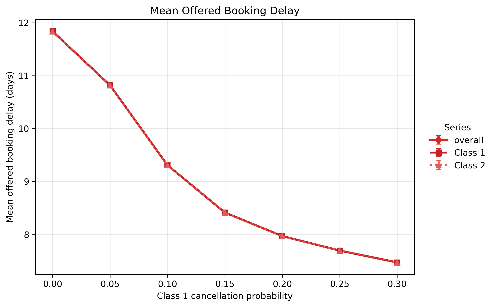

This figure tests whether higher Class 1 cancellation probability shortens offered delay. In the sweep, mean offered delay falls from about 11.84 days to about 7.47 days as Class 1 cancellation probability rises from 0.00 to 0.30. This is consistent with future cancellations reopening slots that the pooled FCFS queue can offer to later arrivals under high demand.

### Served Rate

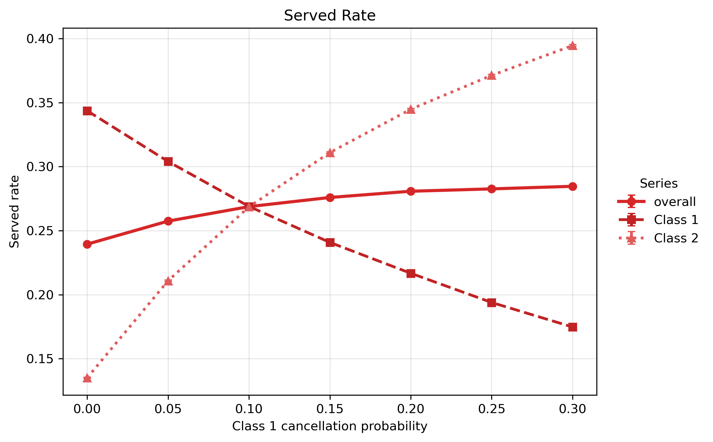

This figure tests whether higher Class 1 cancellation probability lowers Class 1's own served rate. Class 1 served rate falls from about 0.344 to about 0.175, while Class 2 served rate rises from about 0.135 to about 0.395. A cancellation can improve calendar flexibility for the pool while still harming the class whose appointments are being canceled.

### Average Utilization and Class Slot Shares

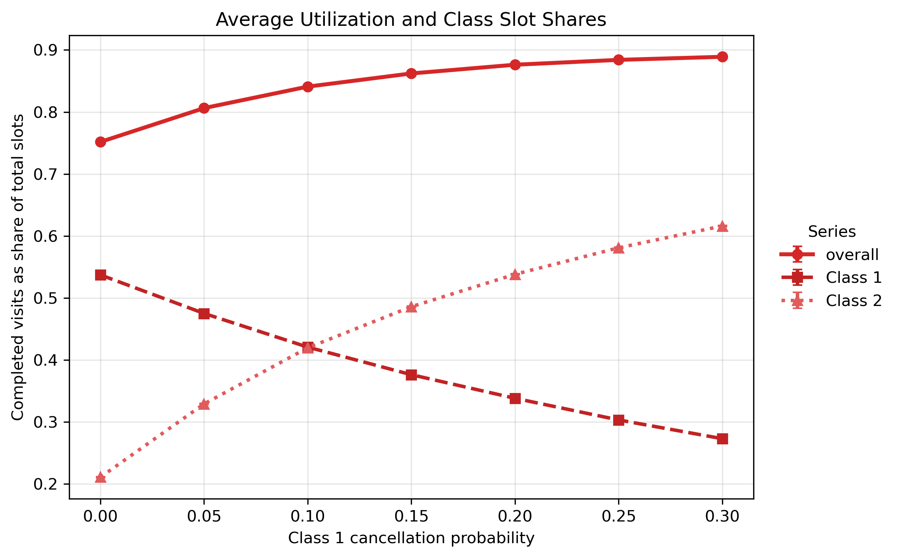

This figure tests whether future cancellations are recycled into completed visits. If aggregate utilization stays flat or rises, then cancellations are not simply wasting capacity under this stress-test regime; they are reopening future slots that can be rebooked.

### H1 Conclusion

H1 is supported. The evidence supports a high-demand reallocation mechanism: the canceling class loses access, and other patients may gain nearer slots. The overclaim to avoid is that cancellations are good for clinic access as a general recommendation.

[Back to summary table](#summary-table)

## H2 Evidence: Class 1 No-Show Sweep {#h2-no-show-evidence}

This sweep varies only Class 1's high-delay no-show probability while holding Class 2 at baseline.

The hypothesis is supported if higher Class 1 no-show probability reduces completed visits when no-shows occur, while the size of the utilization effect depends on whether the regime creates enough no-show-risk exposure.

### Average Utilization and Class Slot Shares

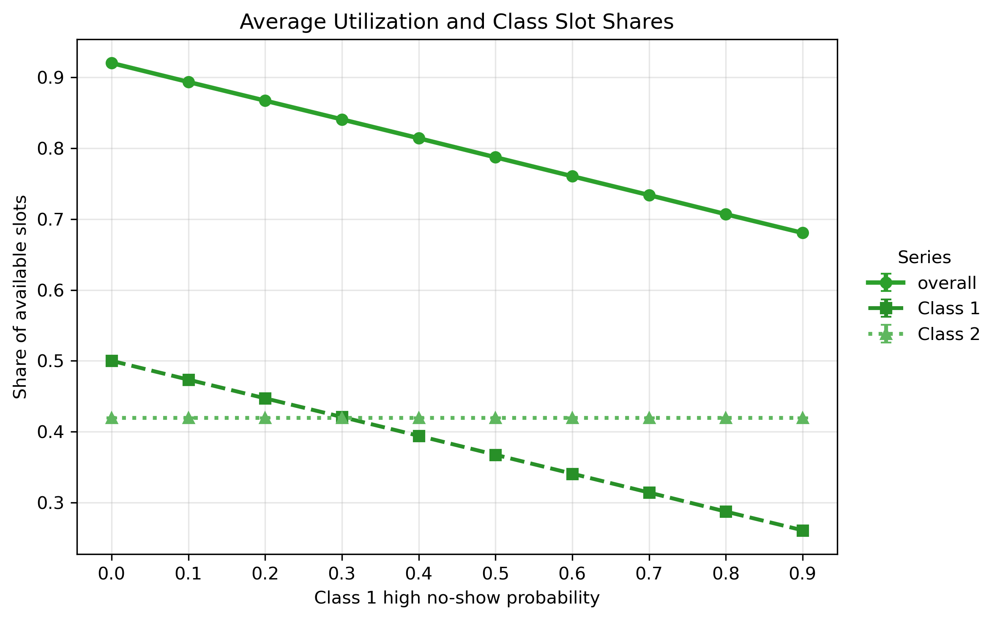

As Class 1's high no-show probability rises, Class 1 contributes fewer completed visits. Because no-show slots are not rebooked under the current implementation, those losses directly reduce completed slots. In the stress-test no-show sweep, utilization falls from about 0.920 to about 0.681.

### Served Rate

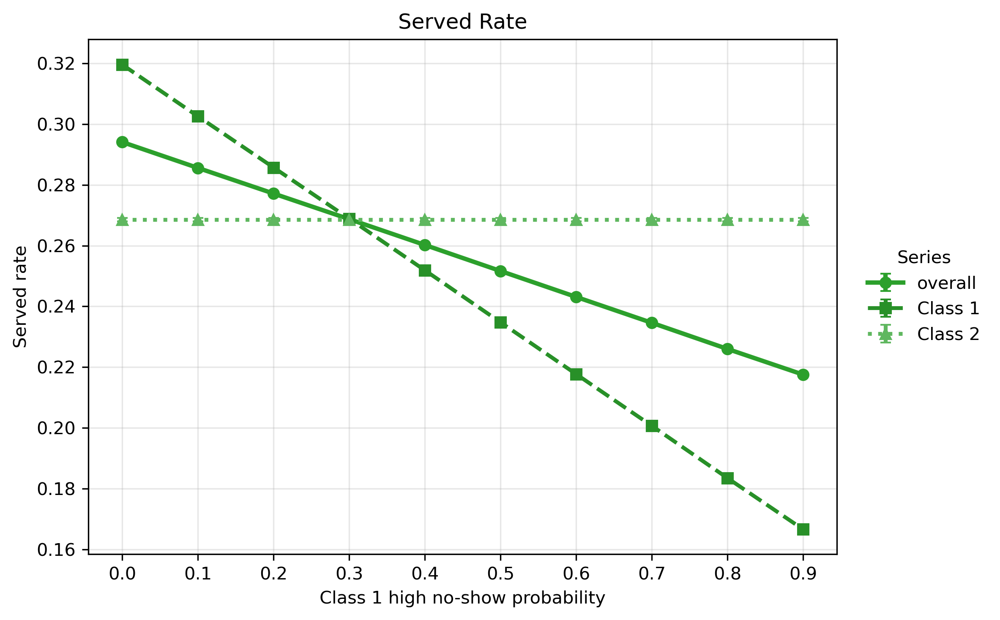

This figure shows that higher no-show risk lowers Class 1's served rate. The loss is direct because a booked appointment reaches the service day but does not become a completed visit.

### Mean Offered Booking Delay

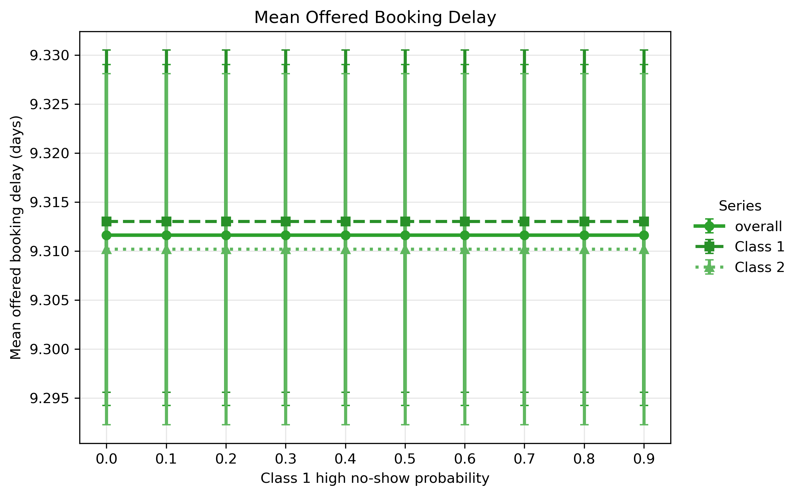

This figure tests whether higher no-show risk improves delay. A flat offered-delay curve supports the view that no-shows are mainly a completion loss rather than a congestion-relief mechanism.

### Balking Rate

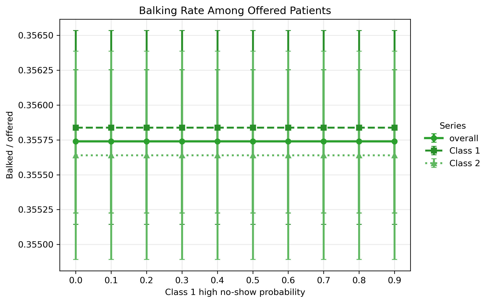

This figure shows the no-show increase is not producing an offsetting benefit through fewer rejected offers.

### H2 Conclusion

H2 is supported. No-shows are unrebookable service-day losses under the current implementation, but the utilization effect is regime-dependent. In the realistic demand/no-show grid at lambda/S = 1.2, doubling no-show intensity changes utilization only from about 0.935 to about 0.934. The overclaim to avoid is that no-show risk has the same aggregate effect in every demand regime; threshold ordering and demand gating belong inside this hypothesis.

[Back to summary table](#summary-table)

## H3 Evidence: Class 1 Balking Step Sweep {#h3-balking-step-evidence}

This sweep varies only Class 1's high-delay balking probability while holding Class 2 at baseline.

The main hypothesis is supported if higher Class 1 balking probability lowers Class 1 accepted booking delay but also lowers Class 1 served rate.

### Mean Accepted Booking Delay

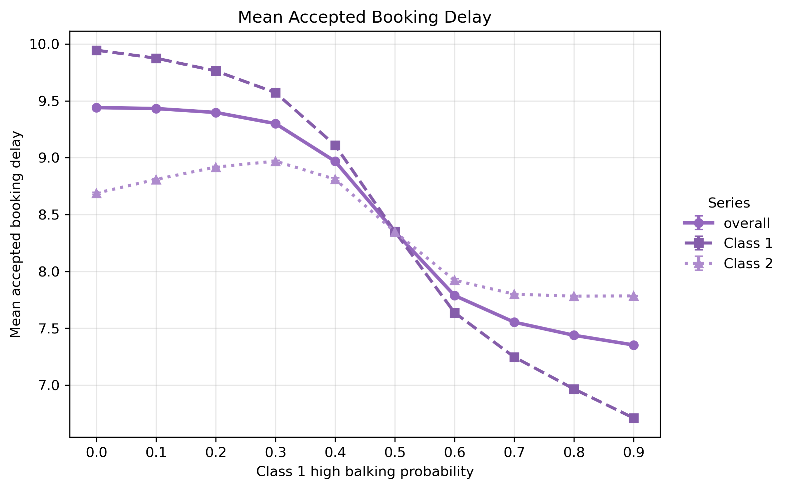

As more long-delay Class 1 patients reject offers, the remaining accepted Class 1 appointments are concentrated at shorter delays. Across the Class 1 high-balking sweep, Class 1 accepted delay falls from about 9.95 days to about 6.71 days.

For Class 2, the initial rise in accepted delay is consistent with the subhypothesis. At low-to-moderate Class 1 balking probabilities, Class 2 gains access to slots that were previously unavailable, but those slots are still relatively far out in the schedule.

### Served Rate

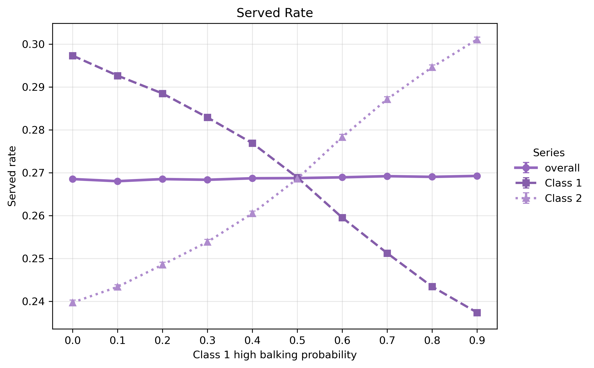

This figure tests whether the lower accepted delay comes at the cost of lower access. Class 1 served rate falls from about 0.297 to about 0.237 as its high-delay balking probability rises from 0.00 to 0.90. Class 2 served rate rises from about 0.240 to about 0.301, so aggregate served rate remains near 0.269 under the stress-test baseline.

### Mean Offered Booking Delay

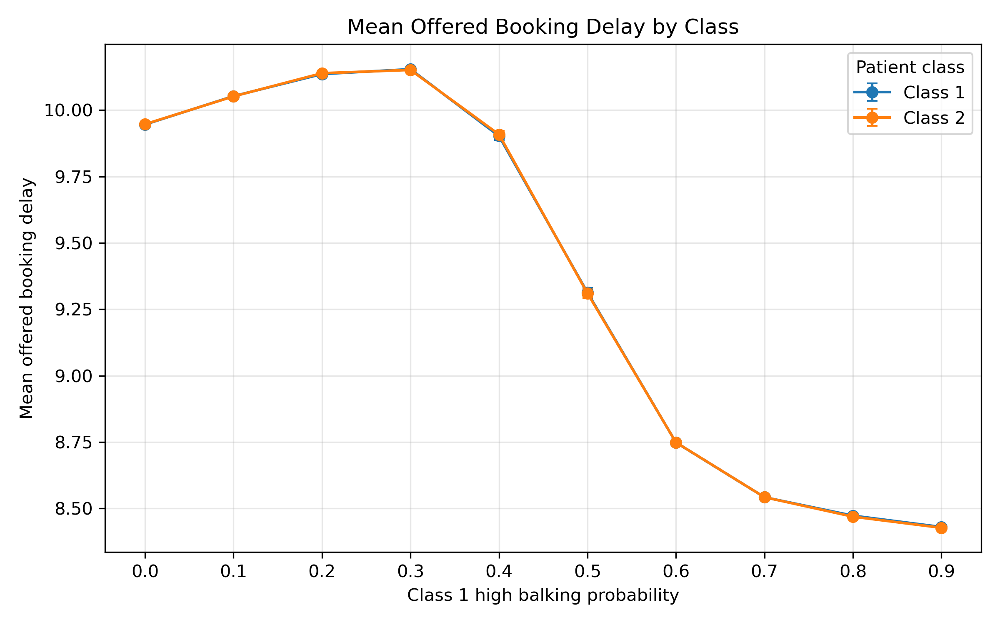

This figure supports the selection interpretation by showing the delay environment faced by patients who receive offers, including those who later balk.

### H3 Conclusion

H3 is supported. Higher balking can make accepted delay look better because long-delay patients leave the accepted sample, while the affected class's served rate worsens. The overclaim to avoid is that aggregate served rate necessarily falls; under the stress-test baseline, the other class can absorb released capacity.

[Back to summary table](#summary-table)

## H4 Evidence: Balking vs. No-Show Loss {#h4-balking-vs-no-show-evidence}

The comparison is best interpreted as a timing mechanism. Balking happens before booking and consumes no slot. Cancellation releases future booked slots before the service day and can be rebooked. No-show occurs on the service day and cannot be rebooked.

The hypothesis is supported if the Class 1 balking sweep shows relatively stable aggregate utilization despite declining Class 1 served rate, while the Class 1 no-show sweep shows declining aggregate utilization and declining Class 1 served rate.

### Balking Sweep: Average Utilization and Class Slot Shares

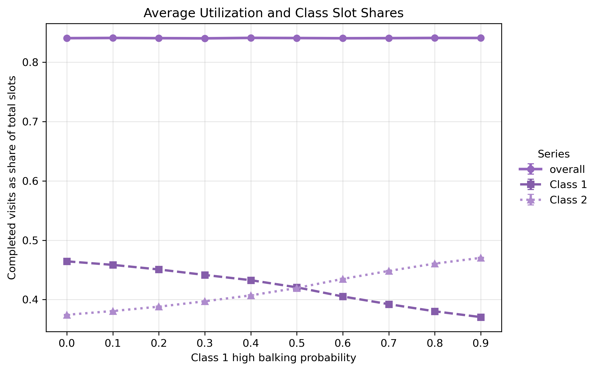

This figure tests whether utilization is preserved when losses occur through balking. Since balking happens before booking, rejected long-delay offers can be taken by other patients. Under the stress-test baseline, aggregate utilization remains relatively stable as Class 1 gives up more appointment opportunities.

### Balking Sweep: Served Rate

This figure tests whether the affected class still loses access under higher balking. As Class 1's high-delay balking probability rises, Class 1's served rate falls. Aggregate utilization can remain stable while Class 1 access worsens, because Class 2 absorbs some of the released capacity.

### No-Show Sweep: Average Utilization and Class Slot Shares

This figure tests the no-show side of the hypothesis. Because no-show slots are not rebooked, higher Class 1 no-show probability reduces completed visits and lowers aggregate utilization within the stress-test sweep.

### No-Show Sweep: Served Rate

This figure tests whether no-show losses also reduce the affected class's served rate. As Class 1's high-delay no-show probability rises, more booked Class 1 appointments fail to become completed visits, lowering Class 1's served rate.

### H4 Conclusion

H4 is supported. The evidence supports the timing distinction: balking is pre-booking, cancellation is future-slot release, and no-show is service-day loss. This interpretation applies under the current implementation; the overclaim to avoid is treating all loss channels as if they had the same capacity consequence.

[Back to summary table](#summary-table)

## H5 Evidence: Symmetric FCFS and Arrival Share {#h5-symmetric-fcfs-and-arrival-share}

The controlled symmetric arrival-share experiment shows that varying Class 1's share does not create a meaningful per-arrival class access gap when behavioral parameters are symmetric. The gap stays around -0.002 to +0.002 as Class 1 share varies from 0.30 to 0.70. This supports the interpretation that pooled FCFS is neutral under symmetric behavior, and that observed class gaps require behavioral asymmetry or interaction effects.

[Back to summary table](#summary-table)

## H6 Evidence: Driver Ranking and Local Attribution {#h6-driver-ranking-and-local-attribution}

The broad regression screen and the realistic attribution experiment answer different questions. The regression screen ranks associations across a sampled design space, while the attribution experiment decomposes one realistic scenario. In the local attribution output, the full gap is about 0.213, with about 0.120 from no-show asymmetry, 0.073 from cancellation, and 0.019 from balking threshold. The relevant conclusion is therefore not that one driver universally dominates, but that class-gap driver rankings are regime-specific.

Booking horizon acts as a design modifier: in the realistic parameterization, it can amplify the class gap until roughly a three-week horizon, after which the effect plateaus.

[Back to summary table](#summary-table)

**Interpretation Across Mechanisms.** Cancellation is best read as high-demand reallocation, no-show loss as regime-dependent service-day loss, balking as accepted-wait selection plus class reallocation, and arrival share alone as insufficient to create a class access gap under symmetric behavior.

## Conclusion

This synthesis sharpens the interpretation along three dimensions. First, the denominator matters: utilization, served rate, offered wait, accepted wait, and no-offer share answer different questions. Second, timing matters: balking, cancellation, and no-show occur at different points in the booking process and therefore have different capacity consequences. Third, regime matters: no-show effects and class-gap driver rankings depend on demand pressure, threshold placement, and parameterization.

## H7 Evidence: Balking Level vs. Class Difference {#h7-balking-gap-vs-level-evidence}

This hypothesis asks whether class differences in outcomes are driven more by the absolute level of balking or by the difference between Class 1 and Class 2 balking behavior.

The hypothesis is supported if class gaps remain small when Class 1 and Class 2 have similar balking steps, but become larger when one class has a higher balking step than the other.

### Balking Step: Class 1 Access Advantage

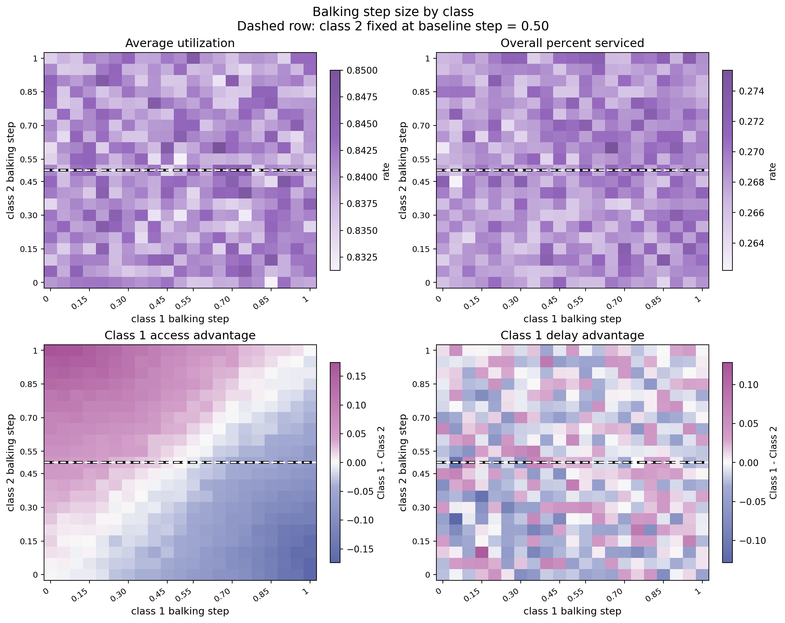

The main evidence is the Class 1 access-advantage panel. The diagonal band is close to neutral, meaning that when Class 1 and Class 2 have similar balking steps, neither class has a large served-rate advantage. Away from the diagonal, the class gap becomes stronger. When Class 1's balking step is higher than Class 2's, Class 1 loses access relative to Class 2. When Class 2's balking step is higher, Class 1 gains access relative to Class 2.

This pattern suggests that class advantage is driven mainly by the relative difference between the two classes' balking behavior, not simply by the absolute level of balking in the system.

### H7 Conclusion

H7 is supported. The class-advantage pattern is clearest off the diagonal, where the two classes have different balking steps. Along the diagonal, where both classes have similar balking behavior, class gaps remain small even when the absolute balking level changes.

This means that symmetric balking changes mostly affect the shared booking environment, while unequal balking behavior shifts access between classes.

[Back to summary table](#summary-table)

## H8 Evidence: No-Show Level vs. Class Difference {#h8-no-show-level-vs-gap-evidence}

This hypothesis asks whether no-show outcomes are driven more by the absolute no-show level or by the difference between Class 1 and Class 2 no-show behavior.

The key distinction is:

- absolute level: both classes have similarly high or low no-show risk;
- relative difference: one class has higher no-show risk than the other.

The hypothesis is supported if aggregate utilization changes when both classes' no-show levels rise together, while class access advantage changes most strongly when one class has higher no-show risk than the other.

### No-Show Step: Aggregate Utilization and Class Advantage

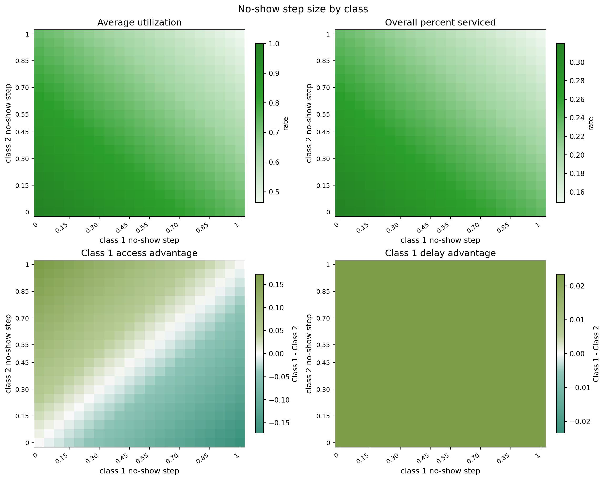

This figure provides the main evidence for H8. The utilization panel should be read as the absolute-level effect: when no-show risk is high for both classes, more booked appointments fail to become completed visits, so aggregate utilization falls.

The class-advantage panel should be read as the relative-difference effect. Along the diagonal, where Class 1 and Class 2 have similar no-show steps, class advantage should remain close to neutral even if the absolute no-show level changes. Away from the diagonal, class advantage becomes stronger because one class loses more completed visits than the other.

### No-Show Step: Class Gap

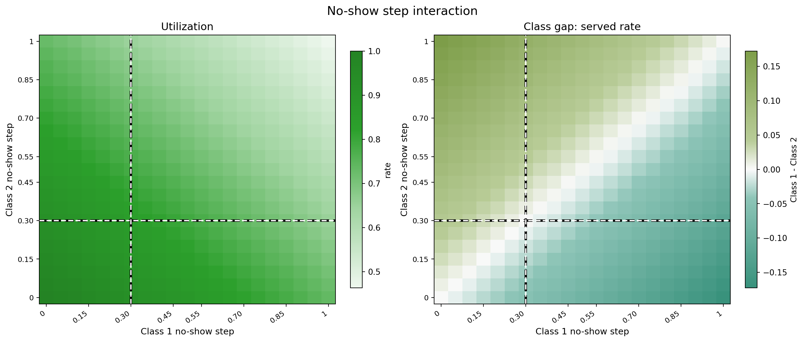

This figure isolates the class-gap interpretation. If Class 1 has a higher no-show step than Class 2, Class 1 should have a lower served rate relative to Class 2. If Class 2 has a higher no-show step, the direction should reverse.

This supports the claim that class differences are driven by relative differences in no-show behavior, not simply by the absolute level of no-shows in the system.

### H8 Conclusion

H8 is supported. Absolute no-show levels matter most for aggregate utilization because no-show slots are lost on the service day and cannot be rebooked. Relative no-show differences matter most for class access advantage because the class with higher no-show risk loses more completed visits relative to the other class.

In short, the average no-show level explains the system-level loss, while the no-show gap explains which class is disadvantaged.

[Back to summary table](#summary-table)

## H9 Evidence: Balking Threshold Crossing a High-Mass Delay Region {#h9-balking-threshold-evidence}

This hypothesis tests whether balking-threshold effects are smooth or nonlinear. The key idea is that threshold changes matter more when they cross delay regions where many patients are being offered or accepting appointments.

The hypothesis is partially supported. The evidence shows that threshold changes have stronger effects in the late part of the booking horizon, but it does not isolate `tau ≈ 11` as the unique point where the largest jump occurs.

### Baseline Accepted Booking Delay Distribution

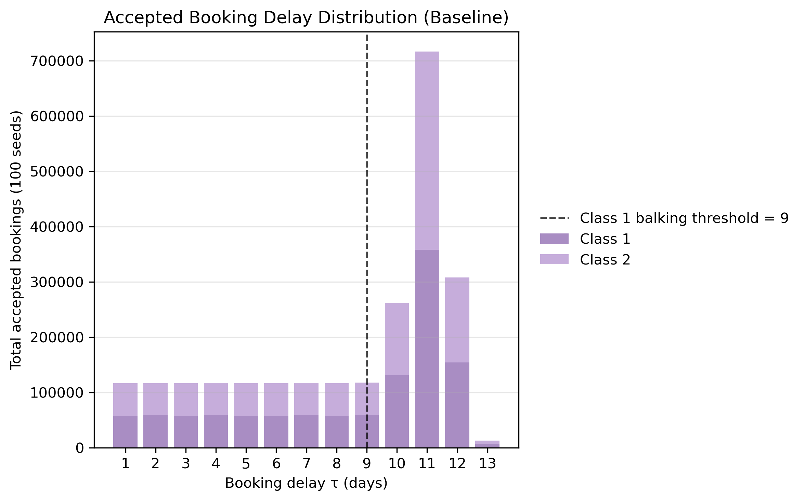

This figure shows where accepted bookings are concentrated under the baseline balking threshold. The mass around later booking delays, including `tau ≈ 11`, suggests that threshold changes in this region can affect many patients.

However, this figure is only a baseline diagnostic. It does not show the accepted-delay distribution under every threshold value in the sweep. Once the balking threshold changes, Class 1 accepts and rejects different offers, which changes the future booking calendar and can shift the accepted-delay distribution.

### Accepted Booking Delay Distribution at Threshold 10

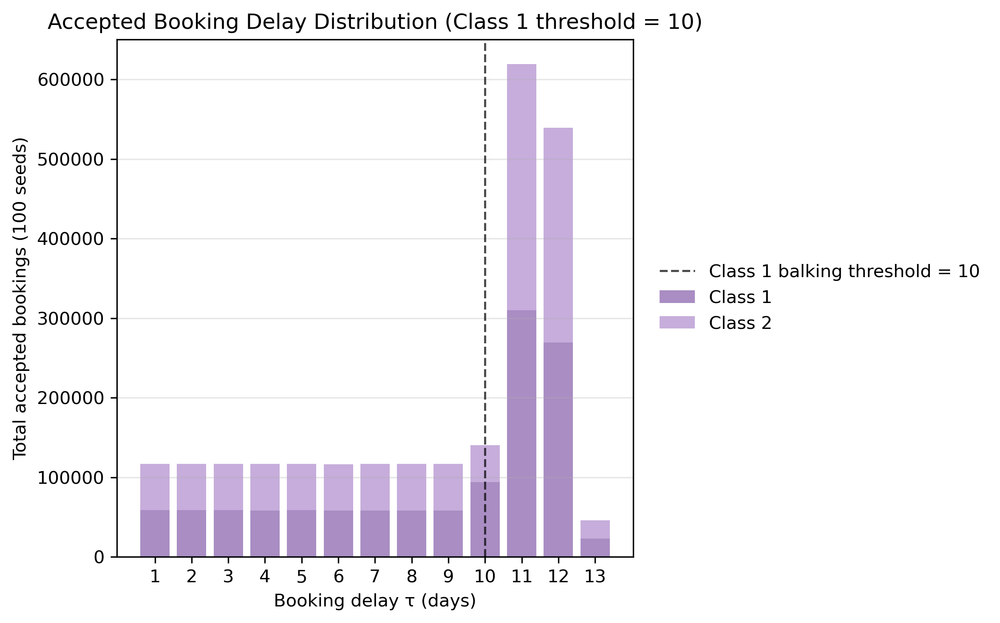

This figure checks whether the accepted-delay distribution remains the same after the Class 1 balking threshold changes. If the mass around `tau ≈ 11` changes, then the baseline histogram should not be treated as a fixed explanation for the threshold-sweep jumps.

This matters because the threshold sweep reruns the whole simulation at each threshold. It does not simply reclassify one fixed baseline group. Each threshold changes the booking calendar, which changes which delays later patients are offered and which delays appear in the accepted sample.

### Balking Rate

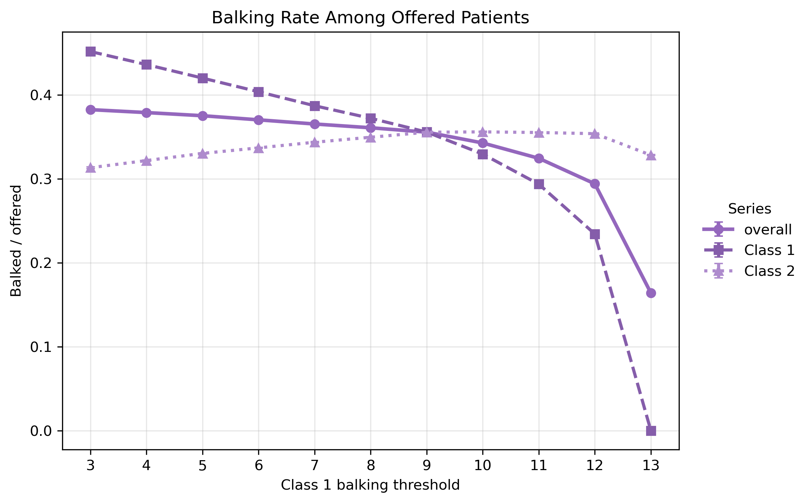

This figure tests the direct behavioral effect of the threshold change. Class 1's balking rate decreases as the threshold rises because fewer offered delays fall into the high-balking region.

The graph supports the claim that threshold effects are nonlinear in the late-horizon region. However, the largest change is not uniquely tied to crossing `tau ≈ 11`. This weakens the stronger version of the hypothesis that a single popular booking day mechanically produces the largest jump.

### Mean Accepted Booking Delay

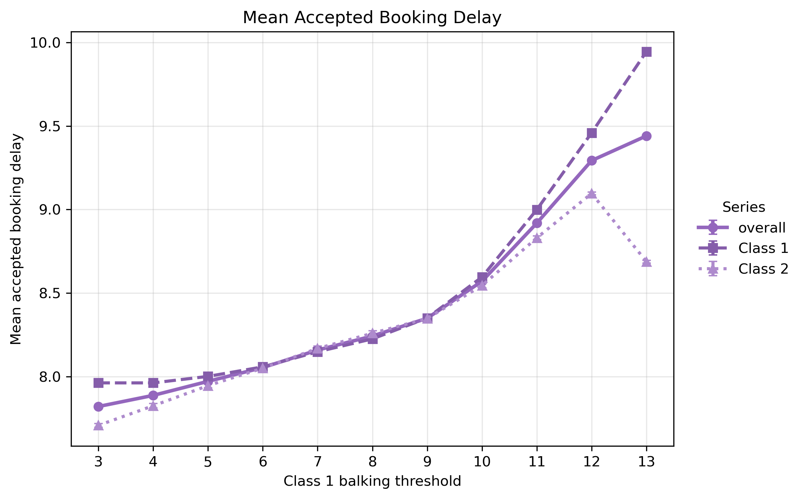

This figure shows how the accepted patient sample changes as the threshold rises. When Class 1 becomes willing to accept longer-delay offers, more long-delay patients remain in the accepted sample, raising Class 1's mean accepted booking delay.

The changes are consistent with nonlinear threshold behavior, but they do not show that the jump at `tau ≈ 11` is uniquely larger than nearby threshold changes.

### Served Rate

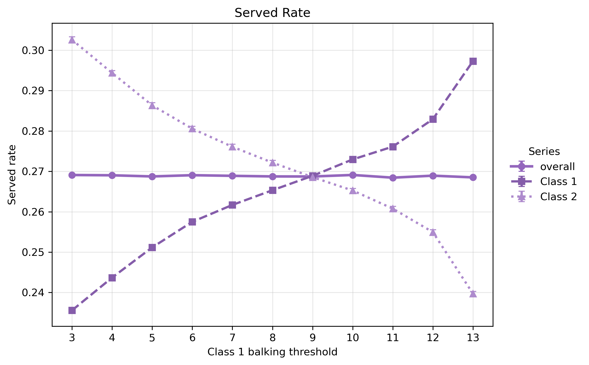

This figure tests whether the threshold effect reaches access outcomes, not only delay composition. As Class 1's threshold rises, Class 1 becomes more willing to accept long-delay appointments, which can increase its served rate and shift access away from Class 2.

The served-rate evidence supports the broader idea that threshold changes affect class outcomes, but it does not isolate `tau ≈ 11` as the only decisive crossing point.

### H9 Conclusion

H9 is partially supported. The evidence supports the broader claim that balking-threshold effects are nonlinear when the threshold moves through the late-horizon booking region. The accepted-delay histograms show that the system has substantial booking mass in this region, and the threshold-sweep graphs show nonlinear changes in balking rate, accepted delay, and served rate.

However, the evidence does not fully support the narrower claim that crossing `tau ≈ 11` specifically produces the largest jump. The baseline accepted-delay distribution changes when the threshold changes, and the largest metric changes may occur at nearby late-horizon thresholds. Therefore, the hypothesis is best interpreted as evidence of late-horizon nonlinear threshold effects, not as proof that `tau ≈ 11` is uniquely decisive.

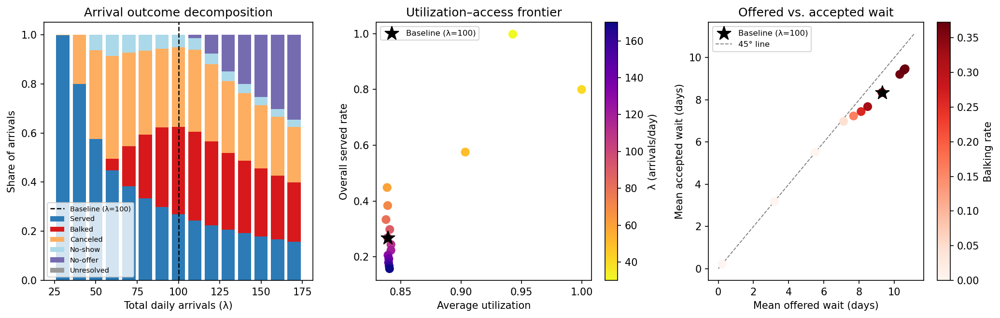

[Back to summary table](#summary-table)
