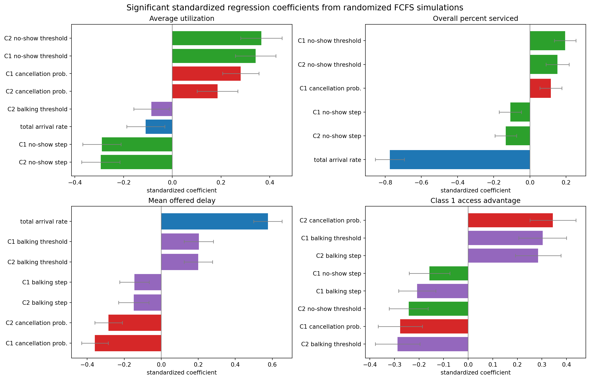
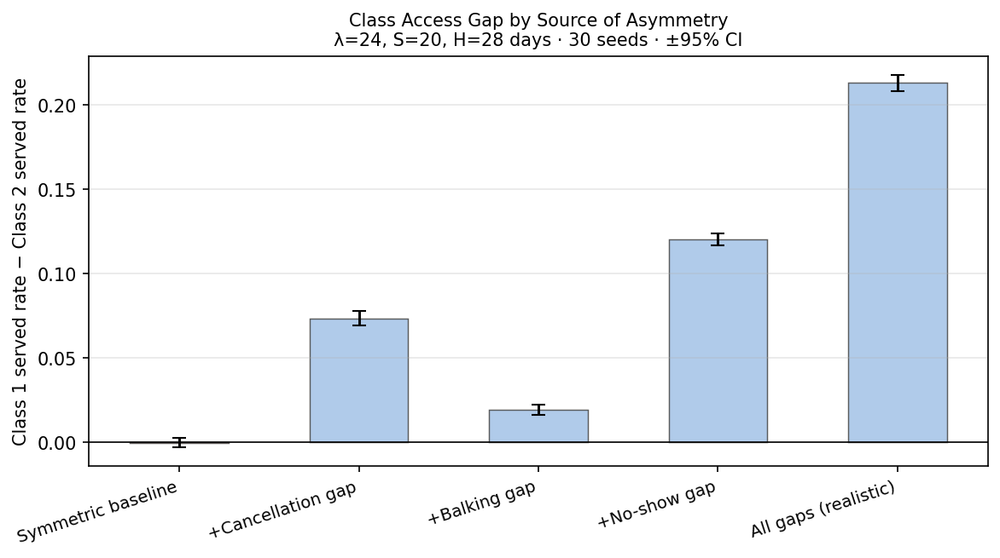

## Purpose

This document synthesizes the main hypotheses tested in the FCFS clinic appointment simulation. The focus is on how class-specific properties affect access, utilization, delay, balking, and class advantage.

Each hypothesis is assigned a concise verdict: `Supported`, `Supported (condition)`, `Qualified`, or `Not supported`. `Qualified` means the mechanism is present, but the broad version of the claim would be misleading without specifying the relevant denominator, timing, or regime. Sweeps are done with all other baseline assumptions fixed, with each step repeated across 100 seeds.

## Metric Interpretation

Under oversubscription, utilization is not an access metric by itself: served rate is the primary aggregate access metric. Offered wait must be reported with no-offer share because patients who receive no offer have no wait observation, while accepted wait is selected by balking. These metrics should therefore be read together rather than treated as interchangeable summaries.

## Summary Table {#summary-table}

<table class="hypothesis-table">
  <thead>
    <tr>
      <th class="id-col">ID</th>
      <th class="hypothesis-col">Hypothesis</th>
      <th class="mechanism-col">Mechanism</th>
      <th class="evidence-col">Evidence</th>
      <th class="conclusion-col">Conclusion</th>
    </tr>
  </thead>
  <tbody>
    <tr class="group-header">
      <td colspan="5">A. Loss Timing and Mechanism</td>
    </tr>
    <tr>
      <td>H1</td>
      <td>A class with higher cancellation probability can shorten offered delay under high demand, but lowers its own served rate.</td>
      <td>Future cancellations reopen capacity that can be rebooked by later arrivals. Under high demand, this can shorten offered delay and benefit the other class, while the canceling class loses completed visits.</td>
      <td><a href="#h1-cancellation-evidence">Cancellation sweep graphs</a></td>
      <td>Supported (high-demand rebooking regime)</td>
    </tr>
    <tr>
      <td>H2</td>
      <td>When losses concentrate at balking, utilization is preserved. When losses concentrate at no-show, utilization drops. Served rate decreases in both cases.</td>
      <td>Balking occurs before booking and consumes no slot. Cancellation releases a future slot that can be rebooked. No-show occurs on the service day and cannot be rebooked. This explains why utilization is preserved under balking, redistributed under cancellation, and reduced under no-show.</td>
      <td><a href="#h2-loss-timing-evidence">Balking vs. no-show loss graphs</a></td>
      <td>Supported</td>
    </tr>
    <tr>
      <td>H3</td>
      <td>No-shows are unrebookable service-day losses, but their utilization impact depends on delay exposure.</td>
      <td>A no-show consumes a booked slot that is not rebooked on the service day. Therefore, no-shows directly reduce completed visits. However, the aggregate utilization effect becomes material only beyond the no-show-risk threshold, or when low-delay no-show probability is nonzero.</td>
      <td><a href="#h3-no-show-evidence">No-show sweep graphs</a></td>
      <td>Qualified</td>
    </tr>
    <tr class="group-header">
      <td colspan="5">B. Balking Decomposition</td>
    </tr>
    <tr>
      <td>H4</td>
      <td>Balking step's effect on offered delay reverses under heavy oversubscription — moderate balking increases offered delay before reducing it.</td>
      <td>At low demand (λ/S ≈ 1.25), balking has no effect on offered delay. At moderate demand, it reduces delay monotonically. At high demand (λ/S ≥ 3), moderate balking converts no-offer patients into long-delay offers, raising the average before demand reduction takes over.</td>
      <td><a href="#h4-balking-arrival-evidence">Balking × arrival rate evidence</a></td>
      <td>Supported</td>
    </tr>
    <tr>
      <td>H5</td>
      <td>Higher balking step lowers accepted delay through selection bias, not through reduced congestion.</td>
      <td>Higher balking removes long-delay patients from the accepted sample. This improves accepted-wait statistics but reduces access for the affected class. Aggregate served rate may remain near baseline if the other class absorbs released capacity.</td>
      <td><a href="#h5-balking-selection-evidence">Balking step sweep graphs</a></td>
      <td>Qualified</td>
    </tr>
    <tr>
      <td>H6</td>
      <td>Balking-threshold changes can produce nonlinear effects because they reclassify whole booking-delay buckets.</td>
      <td>A one-day threshold change does not affect patients gradually. It moves an entire delay bucket from high balking risk to low balking risk, or vice versa. The effect is largest when the affected bucket contains many offers or lies near the end of the booking horizon.</td>
      <td><a href="#h6-balking-threshold-evidence">Balking threshold evidence</a></td>
      <td>Qualified</td>
    </tr>
    <tr>
      <td>H7</td>
      <td>Under the tested baseline, placing a between-class balking-rate difference below the threshold produces a larger served-rate gap than placing the same difference above the threshold.</td>
      <td>The location of the between-class difference changes which delay groups are exposed to unequal balking behavior and therefore changes the resulting allocation of completed visits. The magnitude of this effect depends on the demand regime and the distribution of offered delays.</td>
      <td><a href="#h7-pre-vs-post-threshold-evidence">Pre-threshold vs. post-threshold evidence</a></td>
      <td>Supported (tested regime)</td>
    </tr>
    <tr>
      <td>H8</td>
      <td>Holding Class 1's post-threshold balking rate fixed, an equal increase in the between-class post-threshold balking gap has a larger absolute effect on Class 1 served rate than an equal increase in Class 1's within-class balking step.</td>
      <td>The within-class step is increased by lowering Class 1's pre-threshold balking rate, while the between-class gap is increased independently by lowering Class 2's post-threshold balking rate. Equal 0.10 changes are compared from the same starting configuration and simulation seed.</td>
      <td><a href="#h8-within-vs-between-balking-evidence">Within-class step vs. between-class gap evidence</a></td>
      <td>Not supported</td>
    </tr>
    <tr>
      <td>H9</td>
      <td>Class-gap driver rankings are regime-specific.</td>
      <td>Broad regression screens rank standardized associations across sampled configurations, while local attribution decomposes one realistic scenario. These are different questions, so the driver ranking need not be identical.</td>
      <td><a href="#h9-driver-ranking-and-local-attribution">Driver-ranking evidence</a></td>
      <td>Qualified</td>
    </tr>
    <tr>
      <td>H10</td>
      <td>For balking, class differences mainly come from relative differences between class balking behavior, while absolute balking levels mainly affect delay composition.</td>
      <td>Balking occurs before booking is finalized. If both classes have the same balking rule, class gaps should remain small even when the absolute balking level changes. Class advantage appears when one class rejects long-delay offers more often than the other.</td>
      <td><a href="#h10-balking-gap-vs-level-evidence">Balking gap vs. level evidence</a></td>
      <td>Supported</td>
    </tr>
    <tr>
      <td>H11</td>
      <td>For no-show behavior, absolute no-show levels mainly affect aggregate utilization, while relative differences between classes mainly affect class access advantage.</td>
      <td>No-shows occur after booking and are not rebooked. If both classes have high no-show risk, completed slot use falls for the whole system. If one class has higher no-show risk than the other, that class loses completed visits relative to the other class.</td>
      <td><a href="#h11-no-show-level-vs-gap-evidence">No-show level vs. class difference evidence</a></td>
      <td>Supported</td>
    </tr>
  </tbody>
</table>

---

# A. Loss Timing and Mechanism

Balking, cancellation, and no-show represent three loss channels that occur at different points in the booking process. This group of hypotheses establishes that the timing of a loss determines its capacity consequence: pre-booking losses preserve utilization, cancellation losses can be rebooked, and service-day losses are pure waste.

## H1 Evidence: Class 1 Cancellation Sweep {#h1-cancellation-evidence}

This sweep varies only Class 1's cancellation probability while holding Class 2 at the baseline cancellation probability of 0.10.

The hypothesis is supported if higher Class 1 cancellation probability lowers offered delay under high demand, lowers Class 1's own served rate, and reallocates some completed visits to Class 2.

### Mean Offered Booking Delay

This figure tests whether higher Class 1 cancellation probability shortens offered delay. In the sweep, mean offered delay falls from about 11.84 days to about 7.47 days as Class 1 cancellation probability rises from 0.00 to 0.30. This is consistent with future cancellations reopening slots that the pooled FCFS queue can offer to later arrivals under high demand.

### Served Rate

This figure tests whether higher Class 1 cancellation probability lowers Class 1's own served rate. Class 1 served rate falls from about 0.344 to about 0.175, while Class 2 served rate rises from about 0.135 to about 0.395. A cancellation can improve calendar flexibility for the pool while still harming the class whose appointments are being canceled.

### Average Utilization

Utilization rises from approximately 0.75 to 0.89 as Class 1 cancellation probability increases. Cancellations free future slots, new arrivals book those slots at shorter delays, shorter delays fall below the no-show threshold, and more patients show up. This confirms that cancellations are not simply redistributive — they genuinely improve system-level capacity use under high demand.

### H1 Conclusion

H1 is supported. The evidence supports a high-demand reallocation mechanism: the canceling class loses access, and other patients may gain nearer slots. The overclaim to avoid is that cancellations are good for clinic access as a general recommendation.

[Back to summary table](#summary-table)

## H2 Evidence: Balking vs. No-Show Loss {#h2-loss-timing-evidence}

The comparison is best interpreted as a timing mechanism. Balking happens before booking and consumes no slot. Cancellation releases future booked slots before the service day and can be rebooked. No-show occurs on the service day and cannot be rebooked.

The hypothesis is supported if the Class 1 balking sweep shows relatively stable aggregate utilization despite declining Class 1 served rate, while the Class 1 no-show sweep shows declining aggregate utilization and declining Class 1 served rate.

### Loss Timing Comparison

The left panel overlays overall utilization from both sweeps. Balking (purple) holds flat at approximately 0.84 across the full 0.0–0.9 range, while no-show (green) falls from approximately 0.92 to 0.68. Pre-booking losses consume no slot and are absorbed by other patients in the FCFS queue; service-day losses waste booked slots that cannot be rebooked.

The right panel overlays Class 1 served rate from both sweeps. Both lines decline, confirming that the affected class loses access regardless of when the loss occurs. No-show losses produce a steeper decline because the patient occupies a slot through booking but fails to convert it into a completed visit.

### H2 Conclusion

H2 is supported. The evidence supports the timing distinction: balking is pre-booking, cancellation is future-slot release, and no-show is service-day loss. This interpretation applies under the current implementation; the overclaim to avoid is treating all loss channels as if they had the same capacity consequence.

[Back to summary table](#summary-table)

## H3 Evidence: No-Show Exposure and Utilization Loss {#h3-no-show-evidence}

This hypothesis tests whether no-show losses always have the same utilization effect, or whether the effect depends on how many booked patients are exposed to high no-show risk.

No-shows are service-day losses: once a patient no-shows, the slot is not rebooked. However, increasing the high no-show probability only matters if patients are actually booked at delays above the no-show threshold.

### No-Show Exposure and Utilization

The left panel shows how average utilization changes as Class 1's high no-show probability rises. The separate lines represent different no-show thresholds. Lower thresholds expose more accepted bookings to high no-show risk, so utilization should fall more steeply.

The right panel shows the exposure mechanism directly: the share of Class 1 accepted bookings with `tau > threshold`. When this exposed share is larger, the same increase in high no-show probability has a larger effect on utilization.

### H3 Conclusion

H3 is supported with qualification. No-shows are unrebookable service-day losses, so exposed no-shows directly reduce completed visits. But the aggregate utilization impact depends on delay exposure. If few patients are booked beyond the no-show threshold, increasing the high no-show probability has limited effect. If many patients are exposed to the high-risk delay region, utilization falls more sharply.

[Back to summary table](#summary-table)

---

# B. Balking Decomposition

Balking is governed by a threshold rule with a pre-threshold rate (b₀), a post-threshold rate (b₁), and a threshold day. This group of hypotheses decomposes how each component affects metrics, how the effects depend on demand pressure, and how they differ between within-class and between-class comparisons.

## H4 Evidence: Balking Step × Arrival Rate {#h4-balking-arrival-evidence}

This sweep varies both the high-balking probability (0.0–0.9) and the per-class arrival rate (λ = 20, 35, 50, 65) symmetrically across both classes. The goal is to test whether balking step's effect on mean offered booking delay changes direction under different demand regimes.

The hypothesis is supported if (1) offered delay is unaffected by balking at low demand, (2) offered delay decreases monotonically at moderate demand, and (3) offered delay initially rises before falling at high demand.

### Mean Offered Booking Delay by Arrival Rate

At low demand (λ/S = 1.25), offered delay is flat at approximately 3.1 days regardless of balking step — the calendar is never congested, so balking has nothing to relieve. At moderate demand (λ/S = 2.19), offered delay falls monotonically from approximately 9.1 to 7.5 days as balking removes enough demand to ease congestion.

At high demand (λ/S ≥ 3.12), offered delay rises at low-to-moderate balking before eventually falling. The mechanism: moderate balking reduces the no-offer rate, converting patients who previously received no offer into patients who receive long-delay offers. These new long-delay offers pull the average up. Only at high balking does total demand drop enough to genuinely shorten the calendar. The higher the demand, the more persistent this hump.

### H4 Conclusion

H4 is supported. The same patient behavior produces opposite effects on the same metric depending on demand pressure. Under the stress-test baseline (λ/S = 3.12), moderate balking paradoxically worsens offered delay before improving it — a pattern absent at lower demand levels. This means balking's impact on offered delay cannot be generalized without specifying the demand regime.

[Back to summary table](#summary-table)

## H5 Evidence: Balking Selection Effect {#h5-balking-selection-evidence}

This sweep varies Class 1's high-balking probability (0.0–0.9) while holding Class 2 at baseline. The hypothesis is supported if accepted delay drops while offered delay stays flat or rises — proving the delay improvement is selection, not reduced congestion.

### Offered Delay vs. Accepted Delay

Offered delay stays flat or rises slightly across the sweep (from approximately 9.9 to 10.1 at moderate balking, then falling to approximately 8.4 at 0.9). Accepted delay drops steadily from approximately 9.9 to 6.6 for Class 1. The two metrics diverge because higher balking removes the long-wait patients from the accepted sample without relieving congestion on the calendar. By contrast, the H1 cancellation sweep shows both metrics falling in lockstep — a genuine congestion reduction.

### H5 Conclusion

H5 is qualified. At low-to-moderate balking, the accepted delay drop is primarily a selection artifact — offered delay stays flat or rises while accepted delay falls. At high balking (above 0.5), offered delay also begins to fall, indicating genuine congestion relief contributes alongside selection. Accepted delay remains an unreliable congestion signal when balking is present, but the effect is not purely selection at all levels.

[Back to summary table](#summary-table)

## H6 Evidence: Balking Threshold Effects {#h6-balking-threshold-evidence}

This hypothesis tests whether balking-threshold effects are smooth or nonlinear. The key idea is that a threshold rule changes the treatment of an entire booking-delay bucket at once.

The evidence partially supports the hypothesis. The graphs show that threshold changes have nonlinear effects, especially in the late part of the booking horizon. However, the evidence does not show that one specific delay, such as `tau ≈ 11`, uniquely produces the largest jump.

### Accepted Booking Delay Distribution

This figure shows that accepted bookings are concentrated in the later part of the booking horizon. That matters because a threshold change near this region can affect many patients at once.

However, this distribution is measured under the baseline threshold. When the threshold changes, the booking calendar also changes, so the accepted-delay distribution is not fixed across the sweep.

### Balking Rate

This figure shows the direct behavioral effect of changing the balking threshold. As the threshold rises, fewer delays are treated as high-balking delays, so Class 1's balking rate falls.

The response is not perfectly linear, which supports the idea that threshold effects operate through discrete delay buckets rather than smooth continuous changes. The strongest evidence is therefore for nonlinear late-horizon threshold behavior, not for a single decisive jump at `tau ≈ 11`.

### H6 Conclusion

H6 is qualified. The threshold sweep shows that balking thresholds can create nonlinear behavior because they reclassify entire delay buckets. The accepted-delay distribution helps explain why late-horizon threshold changes matter.

However, the evidence does not prove that crossing `tau ≈ 11` specifically produces the largest effect. The more defensible conclusion is that balking-threshold effects become nonlinear when the threshold moves through delay regions where the system has substantial booking or offer mass.

[Back to summary table](#summary-table)

## H7 Evidence: Pre-Threshold vs. Post-Threshold Balking Difference {#h7-pre-vs-post-threshold-evidence}

This experiment tests whether the location of a between-class balking-rate difference affects the served-rate gap. Class 1 is fixed at \(b_0 = 0.00\) and \(b_1 = 0.50\). For each gap magnitude \(g\), two Class 2 parameterizations are compared.

| Scenario | Class 2 \((b_0, b_1)\) | Class 2 step | Location of class difference |
|----------|-------------------------|--------------|------------------------------|
| Pre-threshold difference | \((g, 0.50)\) | \(0.50-g\) | Below the threshold |
| Post-threshold difference | \((0.00, 0.50-g)\) | \(0.50-g\) | Above the threshold |

At each value of \(g\), the magnitude of the between-class rate difference and the Class 2 step size are identical. The only difference is whether the unequal balking behavior occurs below or above the threshold.

The hypothesis is supported if the pre-threshold difference produces a larger absolute served-rate gap than the post-threshold difference across the tested values of \(g\).

### Served-Rate Gap Across Gap Magnitudes

The two lines have opposite signs because the two scenarios disadvantage different classes. In the pre-threshold scenario, Class 2 has the higher pre-threshold balking rate, so Class 1 has the higher served rate. In the post-threshold scenario, Class 2 has the lower post-threshold balking rate, so Class 2 has the higher served rate.

The relevant comparison is therefore the absolute served-rate gap. Across every tested gap magnitude from 0.05 to 0.50, the pre-threshold difference produces the larger absolute gap. At \(g = 0.30\), the absolute gap is approximately 0.065 under the pre-threshold scenario and 0.038 under the post-threshold scenario. At \(g = 0.50\), the corresponding gaps are approximately 0.130 and 0.060.

The difference between the two scenarios also grows as \(g\) increases. Under the tested baseline, unequal balking behavior below the threshold therefore has a stronger effect on class access than an equal-sized difference above the threshold.

This result suggest that pre-threshold balking rate links more directly to served rate than post, possibly due to its impact on cancellation and no-shows.

### H7 Conclusion

H7 is supported within the tested regime. Placing a between-class balking-rate difference below the threshold produces a larger absolute served-rate gap than placing the same difference above the threshold across all tested gap magnitudes.

The conclusion is regime-specific. The experiment does not establish that pre-threshold differences will dominate under every demand, capacity, horizon, or threshold configuration.

[Back to summary table](#summary-table)

## H8 Evidence: Within-Class Step vs. Between-Class Post-Threshold Gap {#h8-within-vs-between-balking-evidence}

This experiment compares two determinants of Class 1 served rate:

$$
S_1=b_{1,1}-b_{0,1},
$$

the size of Class 1's within-class balking step, and

$$
G_1=b_{1,1}-b_{1,2},
$$

the post-threshold balking-rate gap between Class 1 and Class 2.

Class 1's post-threshold balking rate is fixed at $b_{1,1}=0.50$. The within-class step is increased by lowering Class 1's pre-threshold balking rate, while the between-class post-threshold gap is increased independently by lowering Class 2's post-threshold balking rate.

Both $S_1$ and $G_1$ vary from 0.00 to 0.50 in increments of 0.10, producing 36 factorial configurations. Each configuration is run across the same 100 seeds.

For each common starting configuration and seed, the experiment compares equal 0.10 increases:

$$
\Delta_S
=
R_1(S_1+0.10,G_1)-R_1(S_1,G_1),
$$

and

$$
\Delta_G
=
R_1(S_1,G_1+0.10)-R_1(S_1,G_1),
$$

where $R_1$ is Class 1's served rate.

Increasing $S_1$ lowers Class 1's pre-threshold balking rate, making Class 1 more likely to accept offers below the threshold. Increasing $G_1$ lowers Class 2's post-threshold balking rate, making Class 2 more likely to accept long-delay offers and increasing its competition with Class 1. Because these changes affect Class 1 served rate in opposite directions, the primary comparison uses their absolute magnitudes.

### Equal 0.10 Marginal Effects

An equal 0.10 increase in Class 1's within-class step changes Class 1 served rate by an average absolute magnitude of 1.231 percentage points, with a 95% confidence interval of 1.223 to 1.238 percentage points. By comparison, an equal increase in the between-class post-threshold gap produces an average absolute change of 0.588 percentage points, with a 95% confidence interval of 0.581 to 0.594 percentage points.

The within-class effect is therefore approximately 2.1 times as large as the between-class effect. In substantive terms, reducing Class 1's own pre-threshold balking rate has a considerably larger effect on its served rate than an equal change in Class 2's post-threshold balking rate.

The effects also operate in opposite directions. Increasing the within-class step by lowering $b_{0,1}$ increases Class 1 served rate, whereas increasing the between-class gap by lowering $b_{1,2}$ reduces Class 1 served rate by allowing Class 2 to accept more long-delay offers.

### Consistency Across Starting Configurations

The heatmap reports

$$
|\Delta_G|-|\Delta_S|.
$$

Positive values would indicate that the between-class post-threshold gap has the larger effect, while negative values indicate that the within-class step has the larger effect.

All 25 starting configurations are negative, ranging from approximately $-1.19$ to $-0.15$ percentage points. The within-class step therefore has the larger absolute effect throughout the entire tested grid, rather than only at a particular baseline configuration.

The magnitude of the difference generally narrows as the starting within-class step increases. This suggests diminishing returns from further reductions in Class 1's pre-threshold balking rate, but the between-class post-threshold gap never becomes the dominant effect within the tested range.

### H8 Conclusion

H8 is not supported. Contrary to the proposed hypothesis, Class 1 served rate is more sensitive to an equal change in its own within-class balking step than to an equal change in the post-threshold balking gap between classes.

The result indicates that Class 1 access is influenced more strongly by whether Class 1 accepts offers below its threshold than by an equivalent change in Class 2's willingness to accept offers above the threshold. This conclusion is consistent across all tested starting configurations, although the difference between the two effects becomes smaller when Class 1 already has a large within-class step.

[Back to summary table](#summary-table)

---

# C. Class Gap Drivers

When two patient classes share the same booking queue but differ in behavioral parameters, one class may gain access at the other's expense. This group of hypotheses examines which behavioral differences produce the largest class gaps and whether driver rankings are stable across regimes.

## H9 Evidence: Driver Ranking and Local Attribution {#h9-driver-ranking-and-local-attribution}

The broad regression screen and the realistic attribution experiment answer different questions. The regression screen ranks associations across a sampled design space, while the attribution experiment decomposes one realistic scenario.

In the local attribution output, the full gap is about 0.213, with about 0.120 from no-show asymmetry, 0.073 from cancellation, and 0.019 from balking threshold. The relevant conclusion is therefore not that one driver universally dominates, but that class-gap driver rankings are regime-specific.

Booking horizon acts as a design modifier: in the realistic parameterization, it can amplify the class gap until roughly a three-week horizon, after which the effect plateaus.

### H9 Conclusion

H9 is qualified. The evidence supports the claim that driver rankings depend on the regime and the method of attribution. A broad regression screen and a local decomposition should not be expected to rank mechanisms identically because they answer different questions.

[Back to summary table](#summary-table)

## H10 Evidence: Balking Level vs. Class Difference {#h10-balking-gap-vs-level-evidence}

This hypothesis asks whether balking-driven class gaps come mainly from the absolute level of balking or from the difference between Class 1 and Class 2 balking behavior.

### Balking Step: Class 1 Access Advantage

The bottom-left panel is the main evidence. The diagonal band is close to neutral, meaning that when Class 1 and Class 2 have similar balking steps, neither class has a large access advantage. Away from the diagonal, the class gap becomes stronger.

When Class 1's balking step is higher than Class 2's, Class 1 loses access relative to Class 2. When Class 2's balking step is higher, Class 1 gains access relative to Class 2.

### H10 Conclusion

H10 is supported. Class access gaps are driven mainly by relative differences in balking behavior. Symmetric changes in absolute balking level do not create a large class advantage because both classes are affected similarly.

[Back to summary table](#summary-table)

## H11 Evidence: No-Show Level vs. Class Difference {#h11-no-show-level-vs-gap-evidence}

This hypothesis asks whether no-show outcomes are driven more by the absolute no-show level or by the difference between Class 1 and Class 2 no-show behavior.

The key distinction is:

- absolute level: both classes have similarly high or low no-show risk;
- relative difference: one class has higher no-show risk than the other.

The hypothesis is supported if aggregate utilization changes when both classes' no-show levels rise together, while class access advantage changes most strongly when one class has higher no-show risk than the other.

### No-Show Step: Aggregate Utilization and Class Advantage

This figure provides the main evidence for H11. The utilization panel should be read as the absolute-level effect: when no-show risk is high for both classes, more booked appointments fail to become completed visits, so aggregate utilization falls.

The class-advantage panel should be read as the relative-difference effect. Along the diagonal, where Class 1 and Class 2 have similar no-show steps, class advantage remains close to neutral even if the absolute no-show level changes. Away from the diagonal, class advantage becomes stronger because one class loses more completed visits than the other.

### No-Show Step: Class Gap

This figure isolates the class-gap interpretation. If Class 1 has a higher no-show step than Class 2, Class 1 should have a lower served rate relative to Class 2. If Class 2 has a higher no-show step, the direction should reverse.

This supports the claim that class differences are driven by relative differences in no-show behavior, not simply by the absolute level of no-shows in the system.

### H11 Conclusion

H11 is supported. Absolute no-show levels matter most for aggregate utilization because no-show slots are lost on the service day and cannot be rebooked. Relative no-show differences matter most for class access advantage because the class with higher no-show risk loses more completed visits relative to the other class.

In short, the average no-show level explains the system-level loss, while the no-show gap explains which class is disadvantaged.

[Back to summary table](#summary-table)

---

## Conclusion

This synthesis sharpens the interpretation along three dimensions: timing, measurement, and regime.

**Loss timing and mechanism.** Cancellation, balking, and no-show occur at different points in the booking process and have fundamentally different capacity consequences. Cancellations free future slots that can be rebooked — under high demand, this paradoxically improves system utilization while harming the cancelling class. Balking removes patients before they book, preserving utilization by letting other patients absorb the freed capacity. No-shows waste slots on the service day with no recovery mechanism, making them the only loss channel that directly reduces utilization. The aggregate impact of no-show losses further depends on how many booked patients are exposed to the high-risk delay region: if few patients are booked beyond the no-show threshold, the utilization effect is limited even at high no-show probabilities.

**Balking decomposition.** Balking is not a single parameter — it decomposes into pre-threshold rate, post-threshold rate, threshold day, and their interactions with demand pressure. The effect of balking step on offered delay reverses direction under heavy oversubscription, where moderate balking paradoxically increases offered delay before reducing it. Accepted delay drops under higher balking, but this is primarily a selection artifact at low-to-moderate balking levels rather than genuine congestion relief. Threshold changes produce nonlinear effects when they cross delay regions with high booking mass. Between-class differences in pre-threshold rates produce larger class gaps than the same magnitude difference placed post-threshold, because pre-threshold balking affects a wider portion of the patient pool. However, a class's own served rate is more sensitive to its absolute post-threshold level than to its step size, because the post-threshold rate governs the high-mass delay region where most bookings concentrate.

**Class gap drivers.** Class access gaps arise from behavioral asymmetries, not from absolute levels. For both balking and no-show behavior, symmetric increases affect both classes similarly and do not produce a class advantage — the gap emerges when one class has worse behavioral parameters than the other. Driver rankings are regime-specific: a broad regression screen and a local attribution decomposition rank mechanisms differently because they answer different questions. No single behavioral driver universally dominates the class gap.

These three dimensions — when the loss occurs, how balking decomposes, and what drives class asymmetry — provide the interpretive framework for reading simulation results under the FCFS appointment model.
