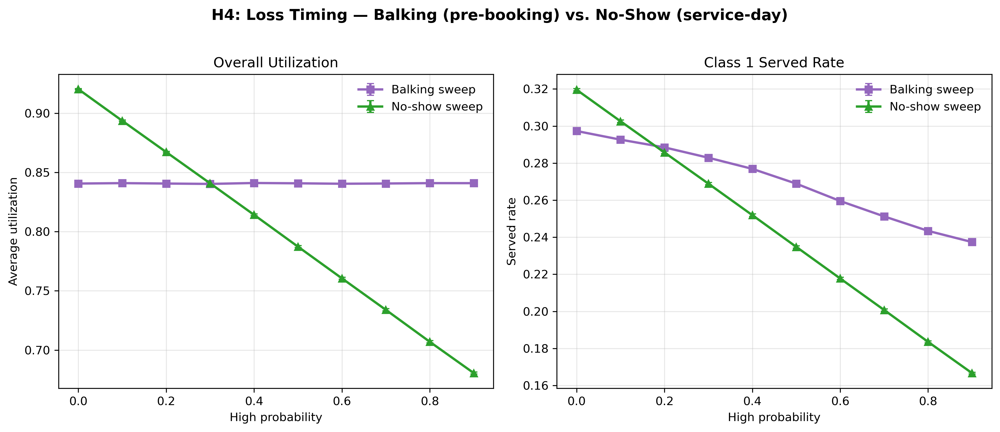
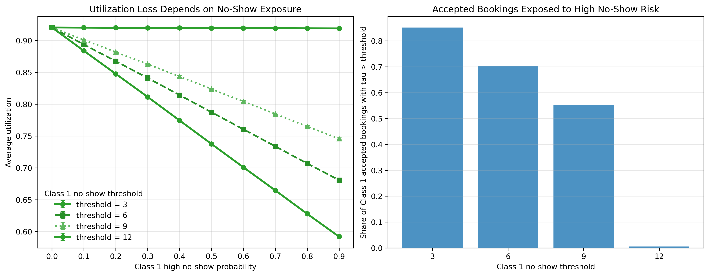
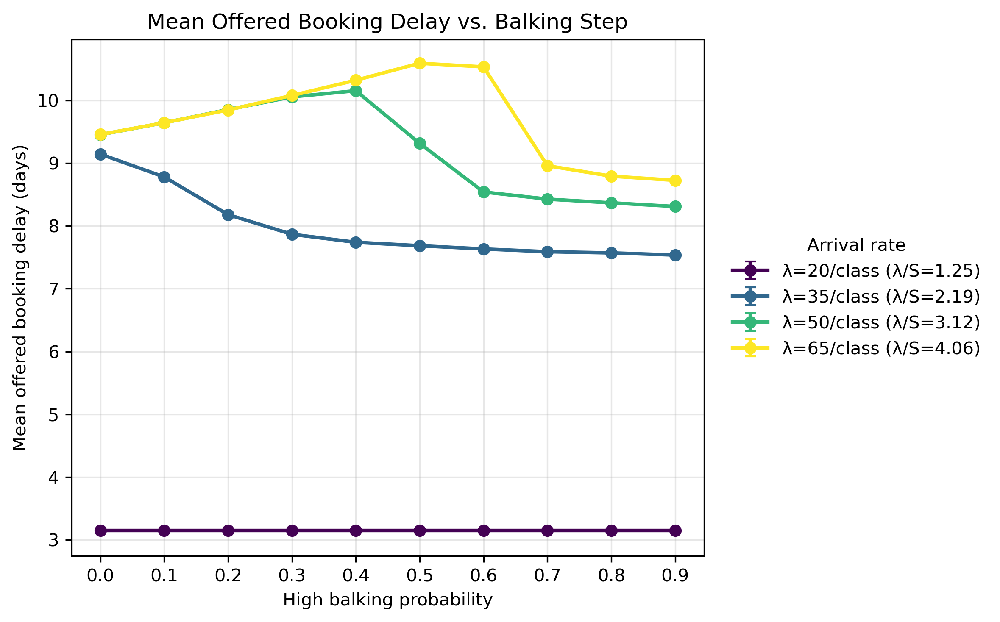
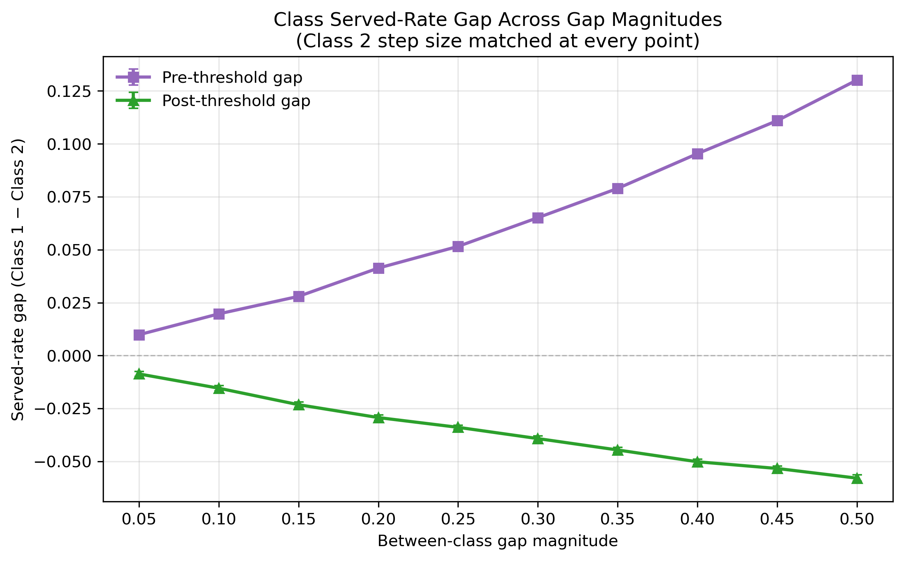
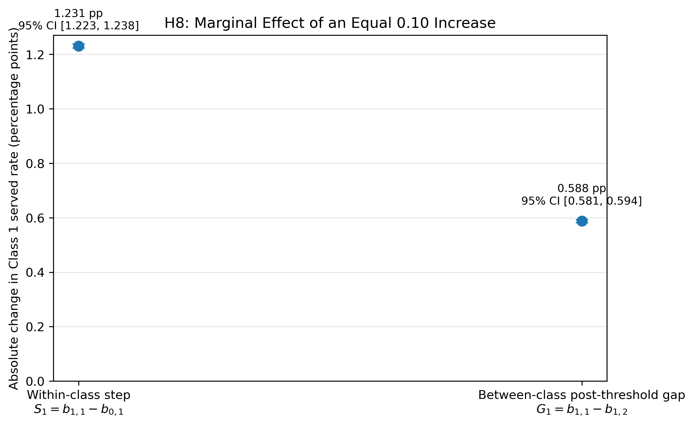
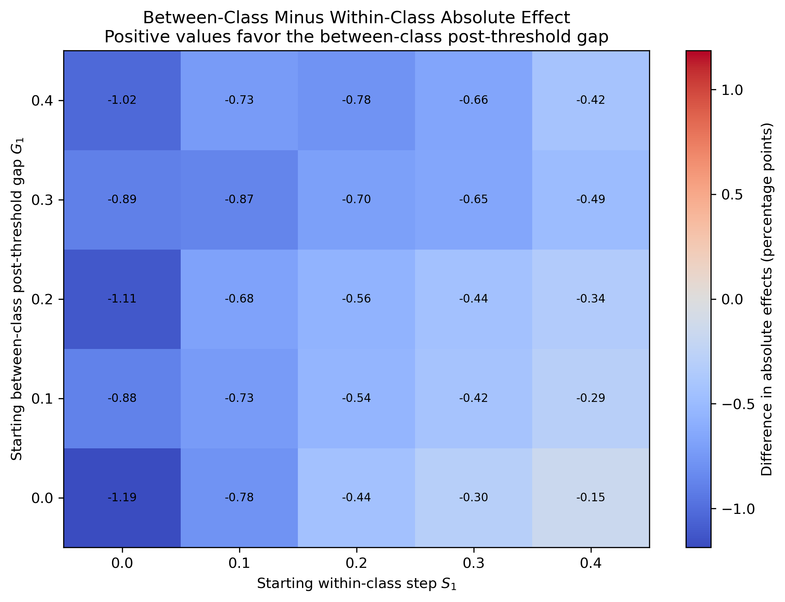

## Purpose

This document synthesizes nine hypotheses tested in the FCFS clinic appointment simulation. The focus is on how class-specific properties affect access, utilization, delay, balking, no-shows, and class advantage.

Each hypothesis is assigned a concise verdict: `Supported`, `Supported (condition)`, `Qualified`, or `Not supported`. `Qualified` means that the evidence supports part of the mechanism, but the full claim requires a narrower regime, a specific denominator, or an additional controlled comparison. Unless otherwise stated, sweeps hold the remaining baseline assumptions fixed and repeat each step across 100 seeds.

## Metric Interpretation

Under oversubscription, utilization is not an access metric by itself: served rate is the primary aggregate access metric. Offered wait must be reported with no-offer share because patients who receive no offer have no wait observation, while accepted wait is selected by balking. These metrics should therefore be read together rather than treated as interchangeable summaries.

## Summary Table {#summary-table}

<table class="hypothesis-table">
  <thead>
    <tr>
      <th class="id-col">ID</th>
      <th class="hypothesis-col">Hypothesis</th>
      <th class="mechanism-col">Mechanism</th>
      <th class="evidence-col">Evidence</th>
      <th class="conclusion-col">Conclusion</th>
    </tr>
  </thead>
  <tbody>
    <tr class="group-header">
      <td colspan="5">A. Loss Timing and Utilization</td>
    </tr>
    <tr>
      <td>H1</td>
      <td>A class with higher cancellation probability can shorten offered delay under high demand, but lowers its own served rate.</td>
      <td>Future cancellations reopen capacity that can be rebooked by later arrivals. Under high demand, this can shorten offered delay and benefit the other class, while the canceling class loses completed visits.</td>
      <td><a href="#h1-cancellation-evidence">Cancellation sweep graphs</a></td>
      <td>Supported (high-demand rebooking regime)</td>
    </tr>
    <tr>
      <td>H2</td>
      <td>When losses concentrate at balking, utilization is preserved. When losses concentrate at no-show, utilization drops. Served rate decreases in both cases.</td>
      <td>Balking occurs before booking and consumes no slot. Cancellation releases a future slot that can be rebooked. No-show occurs on the service day and cannot be rebooked. The timing of the loss therefore determines its capacity consequence.</td>
      <td><a href="#h2-loss-timing-evidence">Balking vs. no-show loss graphs</a></td>
      <td>Supported</td>
    </tr>
    <tr>
      <td>H3</td>
      <td>Increasing the post-threshold no-show probability reduces utilization more when the no-show threshold is lower.</td>
      <td>A lower threshold places a larger share of accepted bookings in the high no-show-risk region. The same increase in post-threshold no-show probability therefore affects more booked patients and produces a larger utilization loss.</td>
      <td><a href="#h3-no-show-threshold-evidence">No-show threshold graphs</a></td>
      <td>Supported</td>
    </tr>
    <tr class="group-header">
      <td colspan="5">B. Balking, Delay, and Threshold Effects</td>
    </tr>
    <tr>
      <td>H4</td>
      <td>The effect of the balking step on offered delay reverses under heavy oversubscription: moderate balking increases offered delay before higher balking reduces it.</td>
      <td>At low demand, balking has little effect on offered delay. At moderate demand, it reduces congestion. At high demand, moderate balking can convert no-offer outcomes into long-delay offers, increasing the observed average before stronger demand reduction shortens the calendar.</td>
      <td><a href="#h4-balking-arrival-evidence">Balking × arrival-rate evidence</a></td>
      <td>Supported</td>
    </tr>
    <tr>
      <td>H5</td>
      <td>A higher balking step lowers accepted delay primarily through selection at low-to-moderate balking levels, rather than through reduced congestion.</td>
      <td>Long-delay patients are removed from the accepted sample when they balk. Accepted delay can therefore fall even when offered delay remains stable or increases; at sufficiently high balking, genuine congestion relief can also contribute.</td>
      <td><a href="#h5-balking-selection-evidence">Offered vs. accepted delay graphs</a></td>
      <td>Qualified</td>
    </tr>
    <tr>
      <td>H6</td>
      <td>Balking-threshold changes can produce nonlinear effects because they reclassify whole booking-delay buckets.</td>
      <td>A one-day threshold change moves an entire delay bucket from high to low balking risk, or vice versa. The resulting effect is larger when the reclassified bucket contains substantial offer or booking mass.</td>
      <td><a href="#h6-balking-threshold-evidence">Balking-threshold evidence</a></td>
      <td>Qualified</td>
    </tr>
    <tr class="group-header">
      <td colspan="5">C. Between-Class Behavioral Effects</td>
    </tr>
    <tr>
      <td>H7</td>
      <td>Under the tested baseline, placing a between-class balking-rate difference below the threshold produces a larger served-rate gap than placing the same difference above the threshold.</td>
      <td>The location of the between-class difference changes which delay groups are exposed to unequal balking behavior and therefore changes the allocation of completed visits. The magnitude depends on the demand regime and offered-delay distribution.</td>
      <td><a href="#h7-pre-vs-post-threshold-evidence">Pre- vs. post-threshold evidence</a></td>
      <td>Supported (tested regime)</td>
    </tr>
    <tr>
      <td>H8</td>
      <td>Holding Class 1's post-threshold balking rate fixed, an equal increase in the between-class post-threshold balking gap has a larger absolute effect on Class 1 served rate than an equal increase in Class 1's within-class balking step.</td>
      <td>The within-class step is increased by lowering Class 1's pre-threshold balking rate, while the between-class gap is increased independently by lowering Class 2's post-threshold balking rate. Equal 0.10 changes are compared from the same starting configuration and seed.</td>
      <td><a href="#h8-within-vs-between-balking-evidence">Within-class step vs. between-class gap evidence</a></td>
      <td>Not supported</td>
    </tr>
    <tr>
      <td>H9</td>
      <td>Increasing both classes' post-threshold no-show probabilities by the same amount has a larger effect on aggregate utilization, while increasing the difference between their probabilities while holding the average fixed has a larger effect on the served-rate gap.</td>
      <td>A common increase raises system-wide no-show risk without directly creating a class asymmetry. A fixed-average redistribution increases the difference between classes without changing their average probability, isolating the effect of no-show asymmetry on class advantage.</td>
      <td><a href="#h9-no-show-common-vs-gap-evidence">Common increase vs. class-gap evidence</a></td>
      <td>Qualified</td>
    </tr>
  </tbody>
</table>

---

# A. Loss Timing and Utilization

Balking, cancellation, and no-show occur at different points in the booking process. These hypotheses examine how the timing of a loss and the location of the no-show threshold determine whether appointment capacity can be recovered and converted into completed visits.

## H1 Evidence: Class 1 Cancellation Sweep {#h1-cancellation-evidence}

This sweep varies only Class 1's cancellation probability while holding Class 2 at the baseline cancellation probability of 0.10.

The hypothesis is supported if higher Class 1 cancellation probability lowers offered delay under high demand, lowers Class 1's own served rate, and reallocates some completed visits to Class 2.

### Mean Offered Booking Delay

This figure tests whether higher Class 1 cancellation probability shortens offered delay. In the sweep, mean offered delay falls from about 11.84 days to about 7.47 days as Class 1 cancellation probability rises from 0.00 to 0.30. This is consistent with future cancellations reopening slots that the pooled FCFS queue can offer to later arrivals under high demand.

### Served Rate

This figure tests whether higher Class 1 cancellation probability lowers Class 1's own served rate. Class 1 served rate falls from about 0.344 to about 0.175, while Class 2 served rate rises from about 0.135 to about 0.395. A cancellation can improve calendar flexibility for the pool while still harming the class whose appointments are being canceled.

### Average Utilization

Utilization rises from approximately 0.75 to 0.89 as Class 1 cancellation probability increases. Cancellations free future slots, new arrivals book those slots at shorter delays, shorter delays fall below the no-show threshold, and more patients show up. Under this high-demand configuration, cancellations improve attended utilization as well as reallocating access between classes.

### H1 Conclusion

H1 is supported. The evidence supports a high-demand reallocation mechanism: the canceling class loses access, while other patients gain access to nearer slots. The result should not be interpreted as a general recommendation that cancellations improve clinic access under all demand conditions.

[Back to summary table](#summary-table)

## H2 Evidence: Balking vs. No-Show Loss {#h2-loss-timing-evidence}

The comparison is best interpreted as a timing mechanism. Balking happens before booking and consumes no slot. Cancellation releases future booked slots before the service day and can be rebooked. No-show occurs on the service day and cannot be rebooked.

The hypothesis is supported if the Class 1 balking sweep shows relatively stable aggregate utilization despite declining Class 1 served rate, while the Class 1 no-show sweep shows declining aggregate utilization and declining Class 1 served rate.

### Loss Timing Comparison

The left panel overlays overall utilization from both sweeps. Balking holds flat at approximately 0.84 across the full 0.0–0.9 range, while no-show falls from approximately 0.92 to 0.68. Pre-booking losses consume no slot and are absorbed by other patients in the FCFS queue; service-day losses waste booked slots that cannot be rebooked.

The right panel overlays Class 1 served rate from both sweeps. Both lines decline, confirming that the affected class loses access regardless of when the loss occurs. No-show losses produce a steeper decline because the patient occupies a slot through booking but fails to convert it into a completed visit.

### H2 Conclusion

H2 is supported. The evidence supports the timing distinction: balking is a pre-booking loss, cancellation releases future capacity, and no-show is an unrecoverable service-day loss. This interpretation applies under the current implementation and should not be generalized to systems with same-day rebooking of no-show slots.

[Back to summary table](#summary-table)

## H3 Evidence: No-Show Threshold and Utilization Loss {#h3-no-show-threshold-evidence}

This hypothesis tests whether the utilization effect of increasing Class 1's post-threshold no-show probability depends on where the no-show threshold is placed.

A lower threshold moves more accepted bookings into the high no-show-risk region. The same increase in post-threshold no-show probability should therefore reduce utilization more strongly when the threshold is lower.

### No-Show Threshold and Utilization

The left panel shows average utilization as Class 1's post-threshold no-show probability rises under different no-show thresholds. Utilization falls more steeply under lower thresholds because high no-show risk applies to a larger portion of accepted bookings.

The right panel shows the mechanism directly: the share of Class 1 accepted bookings scheduled beyond the no-show threshold. Lower thresholds produce greater post-threshold exposure, while higher thresholds leave fewer bookings subject to the elevated no-show probability. When exposure is small, changing the post-threshold probability has little effect on aggregate utilization.

### H3 Conclusion

H3 is supported. Increasing the post-threshold no-show probability reduces utilization more when the no-show threshold is lower because a larger share of accepted bookings is assigned to the high-risk region. The effect becomes small when the threshold lies near the end of the occupied delay distribution and few bookings cross it.

[Back to summary table](#summary-table)

---

# B. Balking, Delay, and Threshold Effects

Balking is governed by a pre-threshold probability, a post-threshold probability, and a threshold day. These hypotheses examine how balking changes the composition of observed delays, how its effect depends on congestion, and why threshold changes can produce discrete rather than smooth responses.

## H4 Evidence: Balking Step × Arrival Rate {#h4-balking-arrival-evidence}

This sweep varies both the high-balking probability (0.0–0.9) and the per-class arrival rate ($\lambda=20,35,50,65$) symmetrically across both classes. The goal is to test whether the balking step's effect on mean offered booking delay changes direction under different demand regimes.

The hypothesis is supported if offered delay is unaffected by balking at low demand, decreases monotonically at moderate demand, and initially rises before falling at high demand.

### Mean Offered Booking Delay by Arrival Rate

At low demand ($\lambda/S=1.25$), offered delay is flat at approximately 3.1 days regardless of the balking step: the calendar is not congested enough for balking to relieve delay. At moderate demand ($\lambda/S=2.19$), offered delay falls monotonically from approximately 9.1 to 7.5 days as balking removes enough demand to ease congestion.

At high demand ($\lambda/S\geq3.12$), offered delay rises at low-to-moderate balking before eventually falling. This pattern is consistent with moderate balking reducing the no-offer rate and expanding the observed offer sample to include additional long-delay offers. Only at high balking does total demand fall enough to shorten the calendar. The higher the demand, the more persistent this hump becomes.

### H4 Conclusion

H4 is supported. The same patient behavior produces different effects on offered delay depending on demand pressure. Under heavy oversubscription, moderate balking can raise observed offered delay before stronger balking reduces congestion, a pattern that is absent at lower demand levels.

[Back to summary table](#summary-table)

## H5 Evidence: Balking Selection Effect {#h5-balking-selection-evidence}

This sweep varies Class 1's high-balking probability from 0.0 to 0.9 while holding Class 2 at baseline. The hypothesis is supported if accepted delay drops while offered delay remains flat or rises, supporting the interpretation that the apparent delay improvement is driven by selection rather than congestion relief.

### Offered Delay vs. Accepted Delay

Offered delay stays flat or rises slightly across the low-to-moderate portion of the sweep, increasing from approximately 9.9 to 10.1 days before falling to approximately 8.4 days at a balking probability of 0.9. Accepted delay drops steadily from approximately 9.9 to 6.6 days for Class 1.

The two metrics diverge because higher balking removes long-wait patients from the accepted sample without initially relieving calendar congestion. At high balking levels, offered delay also begins to fall, indicating that genuine congestion relief contributes alongside selection.

### H5 Conclusion

H5 is qualified. At low-to-moderate balking, the accepted-delay reduction is primarily a selection effect: offered delay remains stable or rises while accepted delay falls. Above approximately 0.5, offered delay also begins to fall, so congestion relief contributes at higher balking levels.

[Back to summary table](#summary-table)

## H6 Evidence: Balking Threshold Effects {#h6-balking-threshold-evidence}

This hypothesis tests whether balking-threshold effects are smooth or nonlinear. A threshold change reclassifies an entire integer booking-delay bucket at once rather than changing patient behavior continuously.

The evidence supports nonlinear effects, especially in the later part of the booking horizon. However, it does not establish that one specific delay, such as $\tau\approx11$, uniquely produces the largest jump.

### Accepted Booking Delay Distribution

This figure shows that accepted bookings are concentrated in the later part of the booking horizon. A threshold change near this region can therefore affect many patients at once.

The distribution is measured under the baseline threshold. When the threshold changes, the booking calendar and the accepted-delay distribution can also change, so the figure should be interpreted as descriptive evidence rather than a fixed exposure distribution across the sweep.

### Balking Rate

As the threshold rises, fewer delays are treated as high-balking delays, so Class 1's balking rate falls. The response is not perfectly linear, which is consistent with discrete delay buckets containing different numbers of offers.

The strongest evidence is therefore for nonlinear threshold behavior when a threshold moves through a region with substantial delay mass, not for a single universally decisive threshold value.

### H6 Conclusion

H6 is qualified. Balking thresholds can produce nonlinear effects because each one-day change reclassifies a complete delay bucket. The evidence does not prove that crossing one specific delay always produces the largest effect; the size of the response depends on how much offer or booking mass lies in the reclassified bucket.

[Back to summary table](#summary-table)

---

# C. Between-Class Behavioral Effects

When two patient classes share the same FCFS calendar, differences in their behavioral parameters can change both individual access and the served-rate gap. These hypotheses compare where a class difference is located, whether within-class or between-class balking changes matter more, and how common versus asymmetric no-show changes affect system-level and class-level outcomes.

## H7 Evidence: Pre-Threshold vs. Post-Threshold Balking Difference {#h7-pre-vs-post-threshold-evidence}

This experiment tests whether the location of a between-class balking-rate difference affects the served-rate gap. Class 1 is fixed at $b_0=0.00$ and $b_1=0.50$. For each gap magnitude $g$, two Class 2 parameterizations are compared.

| Scenario | Class 2 $(b_0,b_1)$ | Class 2 step | Location of class difference |
|----------|----------------------|--------------|------------------------------|
| Pre-threshold difference | $(g,0.50)$ | $0.50-g$ | Below the threshold |
| Post-threshold difference | $(0.00,0.50-g)$ | $0.50-g$ | Above the threshold |

At each value of $g$, the magnitude of the between-class rate difference and the Class 2 step size are identical. The only difference is whether the unequal balking behavior occurs below or above the threshold.

The hypothesis is supported if the pre-threshold difference produces a larger absolute served-rate gap than the post-threshold difference across the tested values of $g$.

### Served-Rate Gap Across Gap Magnitudes

The two lines have opposite signs because the two scenarios disadvantage different classes. In the pre-threshold scenario, Class 2 has the higher pre-threshold balking rate, so Class 1 has the higher served rate. In the post-threshold scenario, Class 2 has the lower post-threshold balking rate, so Class 2 has the higher served rate.

The relevant comparison is therefore the absolute served-rate gap. Across every tested gap magnitude from 0.05 to 0.50, the pre-threshold difference produces the larger absolute gap. At $g=0.30$, the absolute gap is approximately 0.065 under the pre-threshold scenario and 0.038 under the post-threshold scenario. At $g=0.50$, the corresponding gaps are approximately 0.130 and 0.060.

The difference between the two scenarios also grows as $g$ increases. Under the tested baseline, unequal balking behavior below the threshold therefore has a stronger effect on class access than an equal-sized difference above the threshold.

This result should not be interpreted as proof that more patients are always exposed below the threshold. The effect depends on the distribution of offered delays, the demand-to-capacity ratio, and the location of the threshold.

### H7 Conclusion

H7 is supported within the tested regime. Placing a between-class balking-rate difference below the threshold produces a larger absolute served-rate gap than placing the same difference above the threshold across all tested gap magnitudes.

The experiment does not establish that pre-threshold differences will dominate under every demand, capacity, horizon, or threshold configuration.

[Back to summary table](#summary-table)

## H8 Evidence: Within-Class Step vs. Between-Class Post-Threshold Gap
{#h8-within-vs-between-balking-evidence}

This experiment compares two determinants of Class 1 served rate:

$$
S_1=b_{1,1}-b_{0,1},
$$

the size of Class 1's within-class balking step, and

$$
G_1=b_{1,1}-b_{1,2},
$$

the post-threshold balking-rate gap between Class 1 and Class 2.

Class 1's post-threshold balking rate is fixed at $b_{1,1}=0.50$. The within-class step is increased by lowering Class 1's pre-threshold rate, while the between-class post-threshold gap is increased independently by lowering Class 2's post-threshold rate.

Both $S_1$ and $G_1$ vary from 0.00 to 0.50 in increments of 0.10, producing 36 factorial configurations. Each configuration is run across the same 100 seeds.

For each common starting configuration and seed, the experiment compares equal 0.10 increases:

$$
\Delta_S
=
R_1(S_1+0.10,G_1)-R_1(S_1,G_1),
$$

and

$$
\Delta_G
=
R_1(S_1,G_1+0.10)-R_1(S_1,G_1),
$$

where $R_1$ is Class 1's served rate.

Increasing $S_1$ lowers Class 1's pre-threshold balking rate, making Class 1 more likely to accept offers below the threshold. Increasing $G_1$ lowers Class 2's post-threshold balking rate, making Class 2 more likely to accept long-delay offers and increasing its competition with Class 1. Because these changes affect Class 1 served rate in opposite directions, the primary comparison uses their absolute magnitudes.

### Equal 0.10 Marginal Effects

An equal 0.10 increase in Class 1's within-class step changes Class 1 served rate by an average absolute magnitude of 1.231 percentage points, with a 95% confidence interval of 1.223 to 1.238 percentage points. By comparison, an equal increase in the between-class post-threshold gap produces an average absolute change of 0.588 percentage points, with a 95% confidence interval of 0.581 to 0.594 percentage points.

The within-class effect is therefore approximately 2.1 times as large as the between-class effect. Reducing Class 1's own pre-threshold balking rate has a considerably larger effect on its served rate than an equal change in Class 2's post-threshold balking rate.

The effects operate in opposite directions. Increasing the within-class step by lowering $b_{0,1}$ increases Class 1 served rate, whereas increasing the between-class gap by lowering $b_{1,2}$ reduces Class 1 served rate by allowing Class 2 to accept more long-delay offers.

### Consistency Across Starting Configurations

The heatmap reports

$$
|\Delta_G|-|\Delta_S|.
$$

Positive values would indicate that the between-class post-threshold gap has the larger effect, while negative values indicate that the within-class step has the larger effect.

All 25 starting configurations are negative, ranging from approximately $-1.19$ to $-0.15$ percentage points. The within-class step therefore has the larger absolute effect throughout the tested grid rather than only at a particular baseline configuration.

The difference generally narrows as the starting within-class step increases. This suggests diminishing returns from further reductions in Class 1's pre-threshold balking rate, but the between-class post-threshold gap never becomes the dominant effect within the tested range.

### H8 Conclusion

H8 is not supported. Contrary to the proposed hypothesis, Class 1 served rate is more sensitive to an equal change in its own within-class balking step than to an equal change in the post-threshold balking gap between classes.

The result indicates that Class 1 access is influenced more strongly by whether Class 1 accepts offers below its threshold than by an equivalent change in Class 2's willingness to accept offers above the threshold. This conclusion is consistent across all tested starting configurations, although the difference becomes smaller when Class 1 already has a large within-class step.

[Back to summary table](#summary-table)

## H9 Evidence: Common No-Show Increase vs. Between-Class Difference {#h9-no-show-common-vs-gap-evidence}

This hypothesis separates two changes in the classes' post-threshold no-show probabilities.

A common increase changes both classes by the same amount:

$$
(p^{NS}_1,p^{NS}_2)\rightarrow(p^{NS}_1+\delta,p^{NS}_2+\delta).
$$

This raises the average no-show probability while preserving the difference between classes.

A fixed-average increase in the class difference moves the two probabilities in opposite directions:

$$
(p^{NS}_1,p^{NS}_2)\rightarrow
\left(p^{NS}_1+\frac{\delta}{2},p^{NS}_2-\frac{\delta}{2}\right).
$$

This increases the between-class difference by $\delta$ while holding the average probability fixed.

The hypothesis predicts that the common increase has the larger effect on aggregate utilization, while the fixed-average increase in the class difference has the larger effect on the served-rate gap.

### No-Show Levels, Utilization, and Class Advantage

The utilization panel is consistent with the first part of the hypothesis: when both classes move toward higher no-show risk, more booked appointments fail to become completed visits and aggregate utilization falls.

The class-advantage panel is consistent with the second part: outcomes remain near the diagonal when the classes have similar no-show parameters and become more asymmetric as the two classes move farther apart.

### No-Show Difference and Served-Rate Gap

The class-gap heatmap shows that the direction of the served-rate gap changes with which class has the higher no-show risk. A larger no-show probability for Class 1 lowers its served rate relative to Class 2, while a larger probability for Class 2 reverses the advantage.

However, these heatmaps do not directly compare equal-sized common increases against equal-sized fixed-average increases in the class difference from the same baseline. The existing evidence is therefore consistent with the proposed decomposition but does not identify the relative magnitudes required by the revised H9.

### H9 Conclusion

H9 is qualified. The existing results support the directional interpretation that common increases in no-show risk reduce aggregate utilization and between-class differences create a served-rate gap. A direct paired factorial experiment is still required to determine whether the common increase has the larger utilization effect and the fixed-average class difference has the larger served-rate-gap effect.

[Back to summary table](#summary-table)

---

## Conclusion

This synthesis organizes the results around three questions: when a loss occurs, how balking changes observed delay and access, and how behavioral differences redistribute service between classes.

**Loss timing and utilization.** Cancellation, balking, and no-show have different capacity consequences because they occur at different stages of the booking process. Under high demand, future cancellations can be rebooked and pre-booking balking can be absorbed by other arrivals, while service-day no-shows produce unrecoverable capacity loss. The effect of post-threshold no-show probability is larger when the no-show threshold is lower because more accepted bookings enter the high-risk region.

**Balking, delay, and threshold effects.** Balking does not have a single monotonic relationship with delay. Under heavy oversubscription, moderate balking can increase observed offered delay before stronger balking reduces congestion, while accepted delay can improve through selection even without an equivalent improvement in offered delay. Threshold changes can also produce nonlinear responses because they reclassify complete delay buckets whose patient mass varies across the calendar.

**Between-class behavioral effects.** Under the tested baseline, a between-class balking difference below the threshold produces a larger served-rate gap than the same difference above it. However, H8 is not supported: Class 1's own within-class balking step has a larger effect on its served rate than an equal change in the between-class post-threshold gap. For no-shows, the current heatmaps are consistent with common increases affecting utilization and class differences affecting the served-rate gap, but the revised relative-magnitude claim requires a direct controlled experiment.
