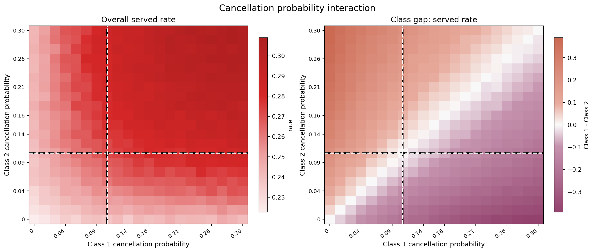
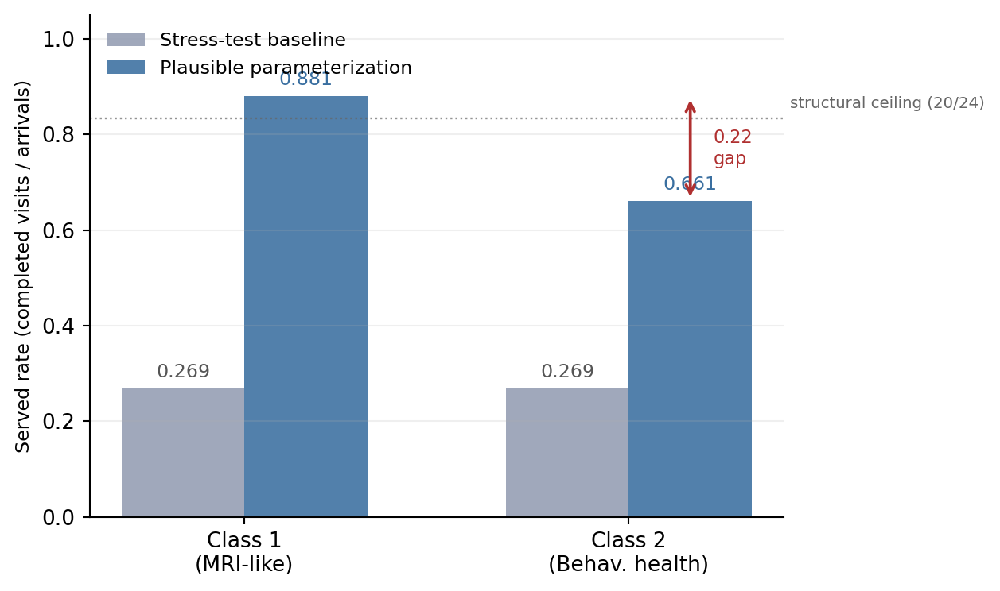
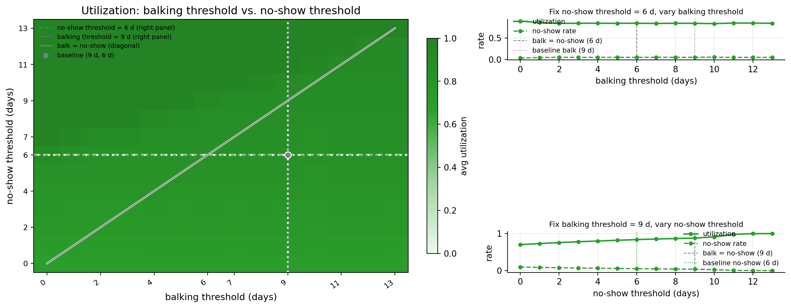

## Purpose

This document reconciles the hypothesis-level investigation with the repo's conclusion materials. It checks the original hypotheses against the conclusion reports, the newer conclusion update experiments, and the full FCFS research note.

The final position is that the original H1-H4 mechanisms are mostly correct, but the synthesis needed three changes:

- H1's cancellation evidence was internally inconsistent: the hypothesis says cancellation shortens offered delay, while the old text said offered-delay lines overlap. The sweep and regression evidence support the delay-shortening mechanism under the stress-test setting.
- H2's no-show claim is true in the stress-test neighborhood, but too broad as a universal claim. New conclusion experiments show no-show utilization effects activate only when demand and offered delays reach the no-show-risk region.
- The WIP H5-H7 rows were not conclusions. They are replaced below by hypotheses that actually emerge from the conclusion package and the final research note.

Source hierarchy used here:

- Full mechanism source of truth: [`fcfs_research_note_final.tex`](../metric_analysis/research_style/final/note/fcfs_research_note_final.tex)
- Meeting conclusions: [`fcfs_conclusion_sheet.tex`](../conclusions/paper/fcfs_conclusion_sheet.tex), [`fcfs_supervisor_brief_final.tex`](../conclusions/paper/fcfs_supervisor_brief_final.tex), and [`fcfs_conclusions_deck.tex`](../conclusions/deck/fcfs_conclusions_deck.tex)
- New conclusion results: [`UPDATE.md`](../conclusions/deck/UPDATE.md)
- Raw result sources: `outputs/*/summary/*.csv`, `docs/reports/metric_analysis/data/*.csv`, and `results/balking_effect_verification.csv`

## Final Position

The simulation should not be summarized as "FCFS works" or "FCFS fails." The stronger conclusion is metric-specific:

1. Utilization is a slot-completion metric, not an access metric.
2. Served rate is the primary aggregate access metric.
3. Offered wait should be reported with no-offer share.
4. Class-level served rates are required because pooled FCFS can still produce large class gaps when patient classes differ in cancellation, no-show, or balking behavior.
5. Behavioral mechanisms are regime-dependent. Stress-test conclusions identify mechanics under high load; the realistic-parameter experiments show which mechanisms remain active at milder demand.

## Hypothesis Crosswalk

| ID | Hypothesis after reconciliation | Original status | Reconciled status | Evidence and conclusion match |
|---|---|---:|---:|---|
| H1 | Higher cancellation probability for one class lowers that class's served rate, frees future capacity for the other class, and can shorten offered wait under high demand. | Supported | Supported, with scope qualifier | Matches the conclusion "cancellation can be reabsorbed." The old synthesis text incorrectly said cancellation does not affect offered booking. |
| H2 | Higher no-show probability is post-booking slot loss: it lowers utilization and the affected class's served rate when enough bookings are exposed to no-show risk. | Supported | Supported locally; qualified globally | Matches stress-test conclusions, but `UPDATE.md` shows the utilization effect is negligible at realistic load and activates around lambda/S >= 1.4. |
| H3 | Higher balking probability lowers own-class served rate and can lower accepted wait through selection, not true congestion relief. | Supported | Supported | Matches the research note's "balking reallocates access; it does not recover aggregate capacity." |
| H4 | Balking losses are reallocatable pre-booking losses; no-show losses are unrecoverable service-day losses. | Partially supported | Supported for utilization; affected-class qualifier for served rate | The original served-rate statement was too broad. Aggregate served rate is nearly flat under balking because the other class absorbs released capacity. |
| H5 | Utilization and access decouple under oversubscription. | New | Supported | Central conclusion in the paper/deck. Baseline utilization is about 0.841 while served rate is about 0.269. |
| H6 | No-offer is a distinct access failure and must be reported with offered wait. | New | Supported | Baseline no-offer is zero, but it appears under horizon saturation and in the no-balking diagnostic. |
| H7 | Under symmetric parameters, pooled FCFS produces near-zero expected class gap; gaps emerge from asymmetric behavior. | WIP replacement | Supported | Matches all conclusion documents and the realistic comparison. |
| H8 | The dominant class-gap driver is regime-specific. Cancellation dominates the broad stress-test regression screen, while no-show asymmetry dominates the realistic attribution experiment. | New, flagged | Supported by newer experiments | This is a genuine new conclusion from `UPDATE.md`; it refines, rather than contradicts, the regression screen. |
| H9 | No-show effects on utilization are demand-regime activated. | New, flagged | Supported by newer experiments | New conclusion: no-show scale is inert at lambda/S = 1.2 but large at 1.4 and 1.6. |
| H10 | Arrival share alone does not create a class access gap when behavior is symmetric. | WIP replacement | Supported by controlled experiment | This qualifies the regression association between class 1 arrival share and class gap. |
| H11 | Booking horizon length amplifies the realistic class gap up to roughly three weeks, then plateaus. | New, flagged | Supported by newer experiments | New conclusion from the horizon sweep. |
| H12 | Threshold ordering matters: when the no-show threshold is below the balking threshold, an accept-then-miss interval can lower utilization. | New, flagged | Supported by research note | This mechanism is in the final research note but was absent from the old hypothesis synthesis. |

## Conclusion-by-Conclusion Check

### C1. Utilization alone is not an access summary

Conclusion result: utilization measures completed visits per slot; served rate measures completed visits per arrival. The minimum reporting set is served rate, utilization, offered wait, no-offer share, outcome decomposition, and class-level served rates.

This was missing from the original hypothesis table even though it is the central conclusion in the paper and deck. It becomes H5.

Evidence:

- Baseline stress test: `lambda = 100`, `S = 32`.
- Baseline utilization: `0.8406` in `baseline_summary.csv`, or `0.8418` in the 30-seed no-balking verification set.
- Baseline served rate: about `0.269`.
- Mechanical served-rate ceiling before behavioral loss: `32 / 100 = 0.32`.

Interpretation: high utilization can coexist with poor access. This is not a contradiction; the two metrics have different denominators.

### C2. Capacity pressure drives served rate and offered wait

Conclusion result: increasing arrivals with fixed capacity lowers served rate and raises offered wait.

This conclusion is broader than any original H1-H4 hypothesis and should be kept as a separate synthesis hypothesis, tied to H5 and H6.

Evidence:

- Regression screen: total arrival rate is the dominant driver of overall served rate (`beta = -0.774`) and mean offered wait (`beta = +0.576`).
- Stress-test baseline is explicitly for mechanism diagnosis, not clinic calibration.
- No-offer remains zero at baseline because cancellations keep freeing future slots, but no-offer grows once the booking horizon saturates above roughly `lambda = 110`.

### C3. Balking reallocates access; it does not recover aggregate capacity

Original match: H3 and H4.

The original H3 is supported, but the evidence should be framed more sharply. Higher Class 1 high-delay balking probability lowers Class 1 served rate and lowers Class 1 accepted wait because high-delay Class 1 patients leave the accepted sample. This is a selection effect, not a service improvement.

Evidence:

- Class 1 balking sweep, 100 seeds per point:
  - Class 1 served rate falls from `0.297` at `b_high = 0.0` to `0.237` at `b_high = 0.9`.
  - Class 2 served rate rises from `0.240` to about `0.305`, absorbing released capacity.
  - Aggregate served rate stays near `0.269`.
  - Aggregate utilization stays near `0.841`.
- No-balking diagnostic, 30 matched seeds:
  - Removing balking raises booked rate by `+0.0585`.
  - Utilization changes by only `-0.0014`.
  - No-offer rises from `0.0000` to `0.2966`.
  - Canceled share rises from `0.3248` to `0.3836`.

Interpretation: balking changes where unmet demand is recorded. It reallocates access between classes and between loss channels; it does not materially increase completed visits under the stress-test baseline.

#### Same Discussion, Stronger Evidence

The original subhypothesis about Class 2 delay is directionally right but incomplete. The final research note identifies a non-monotone Class 2 effect:

- At low Class 1 balking, rejected far-out slots are repeatedly re-offered, increasing Class 2 exposure to high-delay offers.
- At high Class 1 balking, the booking calendar clears enough that offered delays fall for both classes.

This explains why Class 2 balking first rises and then falls even though Class 2's own balking parameter is fixed.

### C4. Cancellation can be reabsorbed; no-show capacity is lost

Original match: H1, H2, and H4.

#### Cancellation

The old synthesis H1 is supported, but one evidence sentence was wrong. It said all offered-delay lines overlap because cancellation does not affect offered booking. The actual Class 1 cancellation sweep shows offered wait falling as Class 1 cancellation probability rises.

Evidence from `outputs/class1_cancellation/summary/*.csv`:

- As Class 1 cancellation probability rises from `0.00` to `0.30`:
  - Mean offered delay falls from `11.84` days to `7.47` days.
  - Class 1 served rate falls from `0.344` to `0.175`.
  - Class 2 served rate rises from `0.135` to `0.395`.
  - Overall served rate rises from `0.239` to `0.285`.
  - Utilization rises from `0.752` to `0.889`.
- Regression screen:
  - Average cancellation probability is positively associated with utilization (`beta = +0.320`) and overall served rate (`beta = +0.117`).
  - Average cancellation probability is negatively associated with offered wait (`beta = -0.441`).

Interpretation: under high demand, future cancellations are not pure loss because they reopen future slots before new arrivals are booked. The canceling class loses access, but the other class can capture freed capacity.

This should not be generalized as "cancellations are good." It is a high-demand rebooking-chain result under the current model.

#### No-show

The old H2 is supported in the stress-test OAT sweep but needs a regime qualifier.

Evidence from `outputs/class1_no_show/summary/*.csv`:

- As Class 1 high-delay no-show probability rises from `0.0` to `0.9`:
  - Utilization falls from `0.920` to `0.681`.
  - Overall served rate falls from `0.294` to `0.218`.
  - Class 1 served rate falls from `0.320` to `0.167`.
  - Class 2 served rate stays flat near `0.269`.
  - Offered and accepted wait stay flat because no-show happens after booking.

Interpretation: no-show is a service-day loss. It does not release capacity to other arrivals because the missed slot is not rebooked.

### C5. Symmetric FCFS is neutral, but aggregate metrics hide class gaps

Original match: old H7 WIP.

The WIP statement was directionally right but should be split into two supported hypotheses:

- H7: symmetric parameters imply near-zero expected class gap under pooled FCFS.
- H8: asymmetric behavior creates class gaps, and the dominant driver depends on regime.

Evidence:

- Symmetric stress-test baseline class gap: about `0.001` or smaller.
- Realistic comparison in the supervisor brief: class gap reported as `0.220` (`0.881 - 0.661`).
- New attribution experiment in `UPDATE.md`: full realistic gap is `0.213`; this is the newer number used for attribution.

The difference between `0.220` and `0.213` is a same-discussion discrepancy across conclusion artifacts. It does not change the conclusion: both show a large class-level access gap that is invisible in aggregate utilization and overall served rate. For attribution, use the newer `0.213` experiment because it decomposes the gap by source.

## New Hypotheses Flagged by the Conclusion Results

### H8. Class-gap driver hierarchy is regime-specific

The final research note's broad randomized regression screen says cancellation gap is the largest class-gap driver:

- cancellation probability gap: `|beta| = 0.452`
- balking threshold gap: `|beta| = 0.429`
- balking step gap: `|beta| = 0.349`

The newer realistic attribution experiment gives a different local ranking:

| Source of asymmetry | Class gap | Share of full gap |
|---|---:|---:|
| Symmetric baseline | `-0.001` | -- |
| No-show asymmetry only | `+0.120` | `56%` |
| Cancellation asymmetry only | `+0.073` | `34%` |
| Balking threshold only | `+0.019` | `9%` |
| All three together | `+0.213` | `100%` |

This is not a contradiction. The regression screen averages across a broad stress-test-like design space; the attribution experiment is local to the realistic parameterization. The conclusion that emerges is stronger: class-gap mechanisms must be reported by regime, not only by global regression ranking.

### H9. No-show only bites when demand is high enough

This is a new hypothesis from the conclusion update.

The old synthesis and deck phrasing "no-show is the most direct behavioral driver of utilization" is true in the stress-test setting but too broad. The new demand x no-show grid shows that no-show intensity matters only when offered delays cross the no-show threshold often enough.

| Demand ratio | Utilization at no-show scale 0 | Utilization at no-show scale 2x | Difference |
|---:|---:|---:|---:|
| `lambda/S = 1.0` | `0.903` | `0.903` | `0.000` |
| `lambda/S = 1.2` | `0.935` | `0.934` | `0.001` |
| `lambda/S = 1.4` | `0.957` | `0.900` | `0.057` |
| `lambda/S = 1.6` | `0.978` | `0.864` | `0.114` |

Conclusion: no-show is a direct slot-loss mechanism, but the system must first create enough risky-delay bookings for the mechanism to activate.

### H10. Arrival share alone does not create a class gap under symmetric behavior

This replaces the old H6 WIP.

The final research note's regression screen finds Class 1 arrival share significant for class gap (`beta = -0.120`). The controlled symmetric arrival-share experiment clarifies what that means.

Evidence from `outputs/exp4_arrival_share_symmetric/summary/summary.csv`:

- Class 1 share from `0.30` to `0.70`.
- Access gap stays between about `-0.002` and `+0.002`.
- Utilization and served rates remain symmetric within simulation noise.

Interpretation: arrival share alone is not a class-priority mechanism under symmetric behavior. The regression association likely reflects interaction with asymmetric behavioral settings in the sampled design space.

### H11. Booking horizon amplifies the realistic class gap until it plateaus

This is another new conclusion from `UPDATE.md`.

Evidence from `outputs/exp3_horizon_sweep/summary/summary.csv`:

| Horizon | Class gap | 95% CI |
|---:|---:|---:|
| 7 days | `0.167` | `0.003` |
| 14 days | `0.203` | `0.003` |
| 21 days | `0.213` | `0.005` |
| 28 days | `0.213` | `0.005` |
| 42 days | `0.213` | `0.005` |

Conclusion: extending the booking horizon increases the realistic class gap up to about 21 days, then the effect saturates. A short horizon partially suppresses the gap by limiting how far future cancellation and survival advantages can compound.

### H12. Threshold ordering creates an accept-then-miss interval

This hypothesis is not in the old synthesis, but it is explicit in the final research note.

At the stress-test baseline:

- No-show threshold: 6 days.
- Balking threshold: 9 days.
- Therefore, patients with offered delay between 6 and 9 days accept the appointment but already face high no-show risk.

This interval reserves capacity that may be lost on the service day. When the ordering reverses, patients reach the balking threshold before entering the high no-show-risk interval, so fewer slots are wasted as no-shows.

Conclusion: threshold ordering is a structural mechanism, not just a parameter detail. It should be included in any future hypothesis set.

## Revised Original Hypotheses

### H1. Class 1 Cancellation Sweep {#h1-cancellation-evidence}

This sweep varies only Class 1's cancellation probability while holding Class 2 at the baseline cancellation probability of `0.10`.

Revised hypothesis: higher Class 1 cancellation probability lowers Class 1's own served rate, raises Class 2's served rate by freeing future slots, and shortens offered wait under the stress-test high-demand regime.

Conclusion: supported with a regime qualifier. The result depends on high demand and future-slot rebooking. It should not be stated as a general recommendation that cancellations improve access.

### H2. Class 1 No-Show Sweep {#h2-no-show-evidence}

This sweep varies only Class 1's high-delay no-show probability while holding Class 2 at baseline.

Revised hypothesis: higher Class 1 no-show probability lowers utilization and Class 1 served rate when enough accepted bookings are exposed to no-show risk; it does not improve offered wait or reallocate capacity to Class 2.

Conclusion: supported locally in the stress-test OAT sweep, but the global claim must be qualified by H9.

### H3. Class 1 Balking Step Sweep {#h3-balking-step-evidence}

This sweep varies only Class 1's high-delay balking probability while holding Class 2 at baseline.

Revised hypothesis: higher Class 1 balking probability lowers Class 1 served rate and lowers Class 1 accepted wait by removing long-delay Class 1 patients from the accepted sample. Class 2 may gain served rate through the shared FCFS pool.

Conclusion: supported. Accepted wait is not a reliable congestion improvement metric when balking changes.

### H4. Balking Losses vs. No-Show Losses {#h4-balking-vs-no-show-evidence}

Revised hypothesis: when losses occur through balking, utilization is preserved because rejected offers can be reallocated under high demand. When losses occur through no-show, utilization drops because the slot is lost on the service day. Served rate decreases for the affected class in both cases; aggregate served rate is nearly flat under balking because the other class absorbs capacity.

Conclusion: supported with an affected-class qualifier. The old "partially supported" label was caused by an ambiguous aggregate served-rate statement, not by weak evidence for the utilization mechanism.

## Synthesis

The original hypothesis document was focused on class-specific behavioral sweeps. That focus is useful, but it missed the repo's main conclusion hierarchy:

- Report access with served rate, not utilization alone.
- Report offered wait with no-offer share.
- Treat accepted wait as selective when balking changes.
- Separate pre-booking losses, future rebookable losses, and service-day unrebookable losses.
- Always show class-level served rates when behavior differs by class.

The new hypotheses flagged here are not speculative. They are supported by the newer conclusion experiments and by the final research note:

- H8: class-gap driver ranking is regime-specific.
- H9: no-show utilization effects activate only once demand produces no-show-risk delay exposure.
- H10: arrival share alone does not create a class gap under symmetric behavior.
- H11: horizon length amplifies class gap until about 21 days, then plateaus.
- H12: threshold ordering creates an accept-then-miss interval.

These should be carried forward as explicit hypotheses or design checks in future simulation work.
