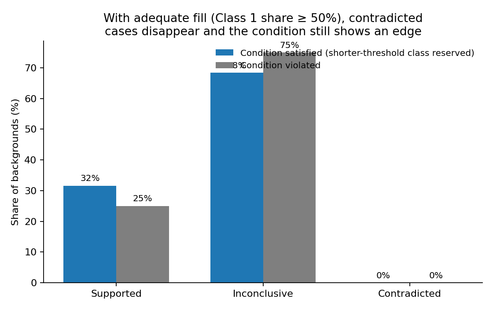
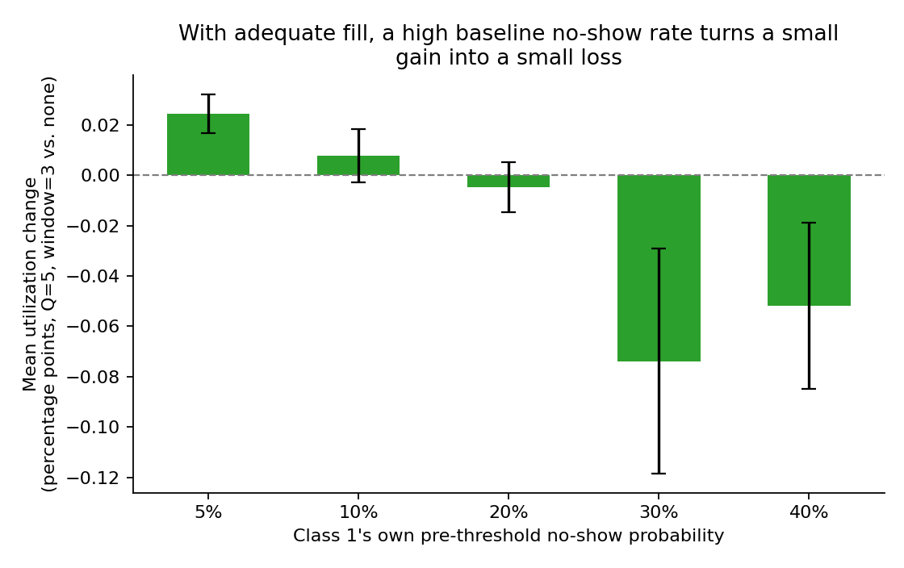
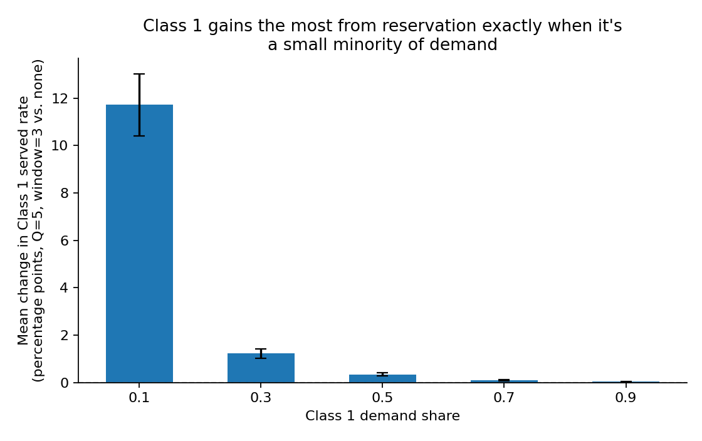

## Purpose and method, shared by both hypotheses

This document covers two new booking-policy hypotheses, separate from the nine-hypothesis robustness study behind `clinic_facing_conclusions.qmd`. Those nine describe how the *existing* first-come-first-served engine behaves. The two here test whether adding a *new* booking policy changes outcomes, and whether each hypothesis's stated condition is actually the condition under which it helps.

Both are tested against the same background bank (`experiments/hypothesis_scenario_bank.py`), Sobol-sampled across every dimension in the design brief and stratified evenly across seven booking horizons. No background is filtered out for failing to match a hypothesis's stated condition — the point is to let the data show whether the stated conditions are the right ones, not assume it.

Effects are classified supported, contradicted, or inconclusive from a paired-seed bootstrap CI over the same 20 seeds run with a policy on and off, using the robustness study's own 0.005 practical-equivalence tolerance.

> **Note on the numbers below:** the value grids in this section reflect the current design (wider booking-horizon range, revised threshold grids, horizon treated as a swept policy lever for H1, reservation window swept across the full booking horizon, H1's reservation now searched via a coarse-to-fine grid rather than brute force, and a strict-vs-release reservation comparison plus a weighted-utilization objective — see the policy-parameters table below). The narrative findings later in this document still describe an older run (four booking horizons, earlier threshold grids, a fixed {3,4,5,6,7} reservation-window candidate set, a single strict-only reservation policy, and no weighted-utilization objective) and will be refreshed once the experiments are re-run under the design below on the Columbia research grid.

### Parameters tested

**Problem parameters** — facts about the clinic's environment, not chosen by anyone, shared by both hypotheses. Every per-class row is sampled independently for Class 1 and Class 2 — no ordering is forced between them — so it's possible to test whether each hypothesis's ordering condition actually matters. Balking threshold is always sampled strictly above no-show threshold within the same class, since a patient who would already have no-showed by their own no-show cutoff has no later point left at which to balk instead. Within each pre/post pair below, the pre-threshold probability is always sampled strictly below the post-threshold probability — never equal — since an equal pair would describe a rule with no real threshold effect (the same probability regardless of delay), which defeats the purpose of sampling a delay-dependent rule at all. The pre-threshold grids top out one step below the post-threshold grids' own maximum (0.4), so 0.4 is reserved as a post-threshold-only value.

| Parameter | Tested values |
|---|---|
| Demand-to-capacity ratio (&rho;) | 0.8, 1.0, 1.2, 1.4, 1.6, 2.0, 3.0 |
| Class 1 demand share | 0.1, 0.3, 0.5, 0.7, 0.9 |
| Daily capacity (slots/day) | 20, 30, 40, 50 |
| Cancellation probability (per class) | 0.1, 0.2, 0.3 |
| Balking threshold (per class, days) | 5, 9, 16, 22, 24 |
| Pre-threshold balking probability (per class) | 0.05, 0.1, 0.2, 0.3 |
| Post-threshold balking probability (per class) | 0.1, 0.2, 0.3, 0.4 |
| No-show threshold (per class, days) | 4, 7, 14, 20, 22 |
| Pre-threshold no-show probability (per class) | 0.05, 0.1, 0.2, 0.3 |
| Post-threshold no-show probability (per class) | 0.1, 0.2, 0.3, 0.4 |

Booking horizon is not listed above because it is treated as a policy lever rather than a fixed environmental fact (see the policy-parameters table below), but it still underlies every row above operationally: for H2, and for H1's `baseline` and `reservation_only` conditions, each background carries its own bank-assigned horizon; for H1's `horizon_only` and `both_flexible` conditions, horizon is additionally swept, holding a background's other parameters (the rows above) fixed at their bank-assigned values. Whenever a sampled balking or no-show threshold would exceed the booking horizon in play for a given task, it is capped dynamically at (horizon &minus; 1) days rather than the row being discarded, so every threshold/horizon combination is usable, including the shortest 2-day horizon.

**Policy parameters** — the actual levers each hypothesis switches on or tunes.

| Parameter | Applies to |
|---|---|
| Reserved slots per day (Q) — 0 (off), then 1 up to the entire daily capacity, searched via coarse-to-fine grid (see below), not brute force | H1 only |
| Reservation window (days) — 1 day up to the entire booking horizon, same coarse-to-fine search | H1 only |
| Booking horizon (days) — 2, 6, 10, 14, 18, 22, 26, swept holding a background's other parameters fixed | H1 only (`horizon_only` and `both_flexible` conditions) |
| Reservation-release rule — strict (reserved capacity is never available to Class 2) vs release (an idle reserved slot is pooled with general capacity, same-day only) | H1 only, run as two separate passes |
| Standby-join probability — 0.0 (off) up to 0.8, in steps of 0.1 | H2 only |
| Standby queue expiry cap — uncapped (no maximum) | H2 only |

**H1's four flexibility conditions.** Rather than one fixed policy, H1 now searches for the *optimal* (Q, window[, horizon]) at each background, under four regimes: `baseline` (no reservation, horizon fixed at the background's own value — plain FCFS), `horizon_only` (no reservation, but horizon is swept to find the best value alone), `reservation_only` (horizon fixed, but Q and window are optimized), and `both_flexible` (horizon, Q, and window all jointly optimized). `both_flexible`'s search space contains the other three, so its optimum should never be meaningfully worse than any of them — this is checked directly in the summary output as a sanity check on the search itself, not assumed. Every condition is run once under the strict rule and once under the release rule (`experiments/h1_short_horizon_reservation.py --variant strict|release`), with same-day cancellations enabled uniformly across every condition and both variants so that the only thing differing between a strict run and a release run is whether idle reserved capacity actually gets released to Class 2.

Because Q now spans up to 50 candidate values and horizon is swept too, brute-force search became impractically expensive (roughly 7,850 simulations per background per seed). Instead each (Q, window) search runs coarse-to-fine: a coarse joint grid (Q in steps of 5, window in steps of 2) finds an approximate winner, then a "+"-shaped refinement (each dimension swept at step 1 within a radius matching its own coarse step, holding the other dimension at its coarse-winning value) recovers full step-1 resolution in the immediate neighborhood. The reported optimum is the true best of every cell actually evaluated, coarse and fine combined.

**Weighted utilization.** Alongside the existing (unweighted) `average_utilization`, every run now also reports `weighted_utilization`: a weighted average of each class's own service rate, w1&middot;(Y1/A1) + w2&middot;(Y2/A2), normalized by (w1+w2), where Yi/Ai are class i's served count and arrival count. Default weights are w1=2, w2=1 — Class 1's own access counts twice as much as Class 2's in the combined score, rather than each class mattering only in proportion to its arrival volume. This is the objective the coarse-to-fine search actually optimizes against (not `average_utilization`); both metrics are recorded at every evaluated cell regardless, so which one is treated as "the optimum" can be revisited without rerunning anything.

## Hypothesis 1: short-horizon reservation for the shorter-no-show-threshold class

**Claim:** if Class 1's no-show threshold is shorter than Class 2's, reserving some daily slots for Class 1 — but only within a short near-term window, not the whole horizon — should raise utilization.

### When does reservation not work at all, and when is it ideal?

Two conditions rule the policy out on their own, before the threshold-gap question even comes up.

- **Demand below 1.0.** At &rho; &lt; 1.0 (65 backgrounds), the effect is a dead zero: 0 supported, 0 contradicted, mean utilization change of +0.02 points. There's no contention for near-term slots to redistribute, so reserving any of them does nothing. Above that floor, supported rate stays in the low single digits even at the highest tested demand: 0% at &rho; 1.0–1.5, peaking at 3.9% at &rho; 2.0–2.5, then 1.7% at &rho; 2.5–3.0.
- **Class 1's own volume too small to fill the reservation.** At high demand (&rho; &ge; 2), a too-small Class 1 share leaves the reservation partly empty and drags utilization down: **−0.79 points** at a 10% share, **−0.29** at 30%, flattening to roughly zero at 50% and up (@fig-h1-share). It never turns meaningfully positive.

{#fig-h1-share width=62%}

So reservation avoids being actively harmful once demand is comfortably above 1 and Class 1's own arrival volume is large enough to fill it — but "not harmful" is a lower bar than "beneficial." The rest of this section assumes both conditions hold, and asks what's left once they do.

Why does moving overall utilization at all require demand this high? Not because the reservation itself is slow to fill — it isn't: the reserved slots are already ~94-96% full by &rho; 1.0-1.5 (and ~96%+ once Class 1's share is 30% or more), so filling the reservation is not the bottleneck. The bottleneck is that *utilization* measures total slots filled, and at high &rho; almost every slot fills anyway, with or without a policy — there's little headroom left to move. What reservation mainly does is redistribute who gets served, shifting some outcomes from Class 2 to Class 1, and that redistribution is invisible to an aggregate utilization number unless it also happens to open up capacity that would otherwise have gone empty. That redistribution effect is real and often larger than the utilization numbers suggest — see the next section.

### Does the threshold-gap condition help, once demand and fill are adequate?

This is the question that most directly tests the original hypothesis: with demand and fill rate already favorable, does it matter whether the reservation goes to the class with the shorter no-show threshold? The dedicated, condition-balanced sample built for this question (50 backgrounds, 25 condition-satisfied, 25 condition-violated, all &rho; &gt; 1.2) was only screened on demand, not on fill — so it includes backgrounds where Class 1's share is too small to fill the reservation, the same failure mode as the first section. Restricting to the 35 backgrounds that also clear that bar (Class 1 share &ge; 50%) isolates the question this section is actually asking.

Testing at each background's own *optimal* policy (the best (Q, window) from a full grid search) among those 35: utilization was supported in **32%** of condition-satisfied backgrounds versus **25%** of condition-violated ones, with **zero** contradicted cases in either bucket (@fig-h1-condition-optimal). The mean gain over no reservation is now uniformly positive — **+0.49 points** for condition-satisfied, **+0.25** for condition-violated.

{#fig-h1-condition-optimal width=68%}

So, given adequate demand and fill, reservation is a small, one-directional positive on average, and the threshold-gap condition roughly doubles the average gain (+0.49 vs. +0.25 points) and modestly raises the odds of a detectable win (32% vs. 25%). There's a further gradient worth noting within this adequate-fill group: mean gain climbs from **+0.17 points** at &rho; 1.2–1.6 to **+0.64 points** at &rho; 2.5–3.0 — demand and fill being adequate is not a flat plateau — additional demand keeps adding to the gain on top of it.

### How does the effect change across different reservation sizes and windows?

Tested across a full Q &times; window grid at 12 curated backgrounds, the picture is small and inconsistent rather than showing one dominant driver. These 12 were curated to cover four conditions of interest (strong gap at high demand, no gap at high demand, gap at low demand, and a spread of capacities and horizons) — not to have unique &rho;/share combinations — so it's expected, not an error, that a few pairs share the same &rho; and Class 1 share while differing on other parameters like capacity or horizon (labeled separately on @fig-h1-tuning's x-axis).

- **Best-tuned reservation is a wash on average, and sometimes a real loss.** Searching the full grid for the best (Q, window) per background, mean change vs. no reservation is **+0.3 points**, ranging from **−3.7 points** at the worst background tested to **+3.3 points** at the best (@fig-h1-tuning) — a couple of points at most in either direction, for most backgrounds tested. One such same-&rho;/share pair (&rho;=3, share=50%) landed on opposite ends of that range (near zero vs. +3.3 points) despite differing only in capacity (30 vs. 50 slots/day) and horizon (7 vs. 14 days) — so &rho; and share alone don't fully explain the size of the gain, and this 12-background sample is too small to isolate what does.

{#fig-h1-tuning width=78%}

- **Shorter windows edge out longer ones, but by little.** Across every background and Q value where both a 3-day and 4-day window were tested, window=3 matched or beat window=4 in 61% of cells, by 0.2 points on average. The direction is consistent; the size of the advantage is small.

### What other background parameters matter?

The 12-background grid above is too small to pin down what explains cases like the two identical-&rho;-and-share backgrounds that landed on opposite ends of the range. Regressing utilization change on every sampled background parameter at once, across the full 480-background screen, turns up one other real driver beyond demand and share: **Class 1's own pre-threshold no-show probability** — how often Class 1 patients no-show even when booked within their own threshold.

Restricting to the adequate-fill group (Class 1 share &ge; 50%, so the low-share drag doesn't dominate the picture), the pattern is small but consistent (@fig-h1-noshow-low): mean utilization change runs **+0.02 points** when that baseline no-show rate is a low 5%, crossing to **−0.07 points** by the time it reaches 30-40%. The direction makes mechanical sense — reservation's benefit comes from keeping Class 1 under their threshold to get the *lower* of their two no-show rates, and there's less of that favorable rate left to capture when it's already high — but the size of the effect here is modest, an order of magnitude smaller than the share effect. Capacity and cancellation rates showed no independent effect once share and no-show rate were accounted for.

{#fig-h1-noshow-low width=65%}

Put together, three things affect whether reservation helps clinic-wide utilization: overall demand, Class 1's own volume, and Class 1's baseline no-show rate — but only the first two move the needle by more than a fraction of a point. The no-show effect is real, not just noise, but small next to the others.

### What happens to Class 1 patients specifically?

Clinic-wide utilization can understate what reservation does for the class it targets. Across all 480 backgrounds, Class 1's own served rate was supported in **126 (26%)** and contradicted in just **1** — the single contradicted background (&rho;=1.0, 10% share, threshold gap negative) stacks all three unfavorable conditions from earlier at once. Gains scale with demand as before, but are considerably larger: mean improvement runs from +0.9 points at &rho; 1.0–1.5 to +4.8 points at &rho; 2.5–3.0.

The share pattern inverts the utilization story (@fig-h1-class1-share): Class 1's served rate gains the *most* — **+11.7 points** — at the same 10% share that drags down clinic-wide utilization. A reservation small relative to the whole clinic is large relative to a small Class 1 population, so a minority class gets a near-complete safety net from a handful of slots, at the majority class's expense.

{#fig-h1-class1-share width=62%}

That's a real tradeoff, not just a quirk of the utilization metric: reservation for a small minority class is a strong, reliable win for that class specifically, at some cost to the majority class and to clinic-wide throughput. Whether that tradeoff is worth making is an equity and priorities question this dataset can't answer on its own — but it's worth being explicit that "reservation doesn't help utilization at low share" and "reservation dramatically helps Class 1 at low share" are both true at the same time.

### Bottom line: reservation vs. FCFS

If the goal is clinic-wide utilization, reservation is worth setting up only for a clinic that clears three bars at once — demand-to-capacity above roughly 1.0–1.5, the would-be-reserved class supplying at least about half of total demand (so the reservation doesn't sit partly empty), and, ideally, that class having the shorter no-show threshold. A clinic missing any of those — low overall demand, or a small minority class — should stay on plain FCFS, where reservation is either inert or a measurable drag. Even for clinics that clear all three, the expected gain is modest (a few points at best), so this is a policy to adopt for low downside rather than a large expected upside.

If the goal is protecting a specific class instead, the calculus flips: a *small* minority class (around a 10% share) is exactly where reservation delivers its largest, most reliable win for that class — at the cost of clinic-wide utilization and the majority class's own served rate. Which goal to optimize for is a priorities question, not something this dataset resolves on its own.

## Hypothesis 2: reject-and-requeue for long-horizon, high-demand clinics

**Claim:** in clinics with long booking horizons (3+ weeks), wait-sensitive patients, and high demand, letting a patient decline a far-out offer and queue for an earlier opening (instead of balking outright) should reduce no-shows and raise utilization.

The standby-queue policy parameters are the join probability and an optional recall-eligibility delay and expiry cap. Both the delay and the cap were left off throughout: the cap is a second lever that would make it hard to tell whether a weak result came from standby not working or from the cap cutting membership short, and the eligibility delay turned out not to be structurally required by the engine at all — it was tested and removed (see below). The run's own cooldown boundary already limits how long any entry can wait regardless.

### Is the stated condition actually necessary?

This is close to a null result, and it holds up across a much wider policy search than the original test — not just at one fixed setting:

- At a join probability of 80% with no eligibility delay — double the original probability, with the delay removed entirely — across all 480 backgrounds: utilization was supported in only 4, contradicted in 3, and inconclusive in the remaining 473. That is the *identical* split to the original, far more conservative policy (40% probability, 5-day delay), which rules out both the probability and the delay as the reason the effect doesn't show up.
- All 88 condition-satisfying backgrounds (horizon &ge; 21, &rho; &ge; 2) were inconclusive on utilization. The condition-violating backgrounds did no worse (4/392 supported).
- No-show rate — the metric this policy targets — is inconclusive in 478-479 of 480 backgrounds for both classes.
- The dose-response sweep, across the full 0.0-0.8 range at 48 backgrounds, confirms it (@fig-h2-dose): mean utilization drifts by under a tenth of a point end to end (0.813 to 0.813), and no single background moves by more than half a point, in either condition bucket.

{#fig-h2-dose width=75%}

The mechanism is visible in the queue diagnostics (@fig-h2-recall), and widening the probability range actually makes it worse, not better:

- Patients now join the queue by the hundreds to thousands (median ~820 for Class 1, ~640 for Class 2 per background) — roughly double the volume at 40% probability — but recalls did not scale with them. **73%** of backgrounds (353/480) show zero recalls for either class, and only **7%** exceed a 5% recall rate for either class.
- More joiners chasing the same pool of freed slots spreads recalls thinner, not thicker: this is the FIFO queue-depth mechanic working as expected, and it means raising the join probability further would only worsen the ratio, not fix it.
- Most queued patients simply wait until the run ends without ever being recalled, and are logged as never receiving an offer — functionally identical to an ordinary balk, just recorded under a different label.

{#fig-h2-recall width=70%}

As implemented, the queue mechanism mostly relabels a rejected far-out offer in the data. It does not change what happens to the patient or the clinic's capacity, across the full range of join probabilities tested.

### Effect on other metrics

Because the core mechanism rarely triggers, every secondary metric tells the same flat story: mean accepted delay, mean offered delay, and both classes' served rates all moved by roughly a hundredth of a point on average, condition-satisfying or not.

### Is the condition justified, and could it be adjusted?

Given the near-null result even inside the condition's own target region, the long-horizon-and-high-demand condition is not the binding constraint — the recall mechanics are. Requiring even longer horizons or higher demand would not fix a queue whose head rarely turns over, and this round of testing closes off two of the likely tuning fixes directly: raising the join probability and removing the eligibility delay both leave the result unchanged, and a higher probability measurably thins out the already-low recall rate rather than improving it.

One policy change remains untested and is the more promising lead: restricting standby eligibility to patients who balked via the post-threshold, high-probability branch specifically, so the queue holds genuinely long-wait rejections rather than a mix of long- and short-wait ones. That's a follow-up sweep, not something this dataset resolves on its own.

## Caveats that apply across both hypotheses

- The paired-seed bootstrap (20 seeds/background) reliably detects effects of a few points but will mark many backgrounds "inconclusive" simply because the true effect is smaller than that resolution — not necessarily zero. This matters here because most individual backgrounds for both hypotheses show effects in the tenths-of-a-point-to-low-single-digits range, close enough to this floor that "inconclusive" should usually be read as "too small to resolve," not "confirmed zero."
- The 0.005 tolerance is deliberately conservative, and it cuts both ways. A background can have a nonzero point estimate and classify as inconclusive if the CI crosses zero or the mean is too small — so counts likely understate small true effects more than they overstate false ones. The flip side matters for H1 too: with typical effects this small, a background labeled "supported" usually means a real but modest effect (often under two points) that cleared this threshold, not a large win. Treat "supported" as "detectably nonzero," not "substantial."
- The background bank deliberately includes scenarios that violate each hypothesis's own condition, which is what makes the necessity analysis possible — but it also means the raw "all 480 backgrounds" counts mix in scenarios the hypothesis was never meant to cover. The condition-split breakdowns are the more relevant read.
- H1's Q &times; window grid (the "how does the effect change across sizes and windows" section) draws on only 12 curated backgrounds, versus 480 for the screen stage and 50 for the condition-balanced optimal-policy comparison. Treat those specific figures and numbers as more exploratory and noisier than the larger-N results elsewhere in this document — they illustrate a pattern, not a precisely estimated one.
