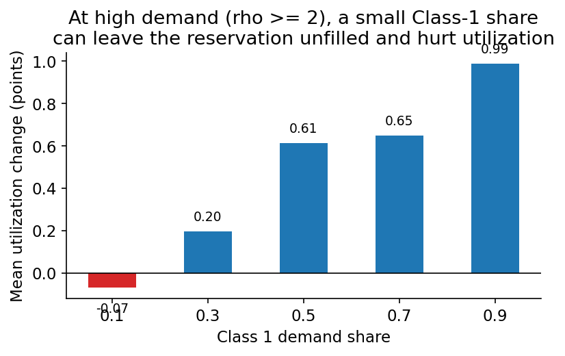
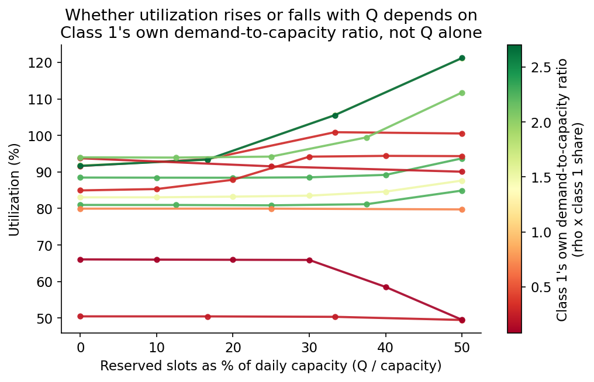
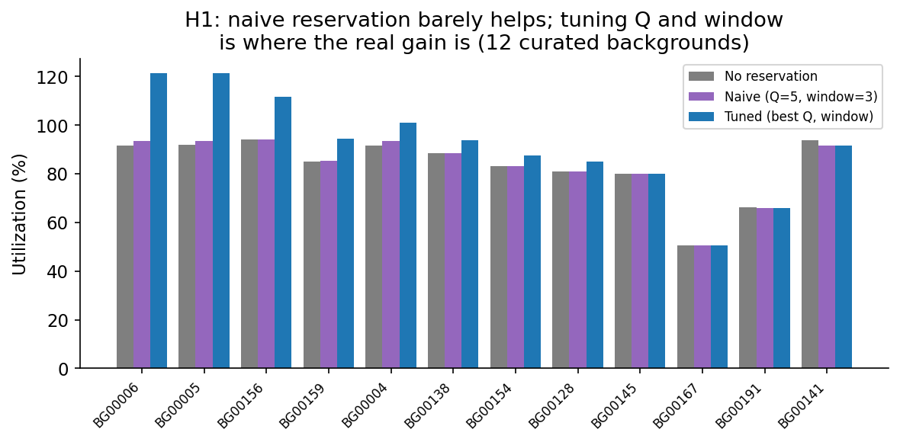
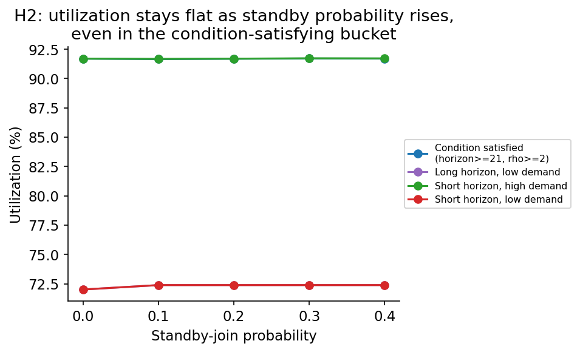
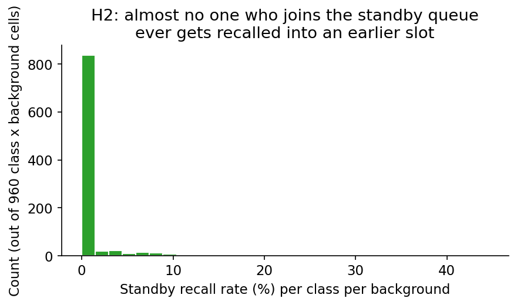

## Purpose and method, shared by both hypotheses

This document covers two new booking-policy hypotheses, separate from the nine-hypothesis robustness study behind `clinic_facing_conclusions.qmd`. Those nine describe how the *existing* first-come-first-served engine behaves. The two here test whether adding a *new* booking policy changes outcomes, and whether each hypothesis's stated condition is actually the condition under which it helps.

Both were tested against the same 480-scenario background bank (`experiments/hypothesis_scenario_bank.py`), Sobol-sampled across every dimension in the original design brief and stratified evenly across four booking horizons. No background was filtered out for failing to match a hypothesis's stated condition — the point was to let the data show whether the stated conditions are the right ones, not assume it.

Effects are classified supported, contradicted, or inconclusive from a paired-seed bootstrap CI over the same 20 seeds run with a policy on and off, using the robustness study's own 0.005 practical-equivalence tolerance.

### Parameters tested

**Problem parameters** — facts about the clinic's environment, not chosen by anyone, shared by both hypotheses. Booking horizon is the clearest example: it describes how far out the clinic already lets patients book, the same way it is an existing per-class operating fact in the robustness study, not something either hypothesis tests as an intervention. Every per-class row was sampled independently for Class 1 and Class 2 — no ordering was forced between them — so it's possible to test whether each hypothesis's ordering condition actually matters.

| Parameter | Tested values |
|---|---|
| Demand-to-capacity ratio (&rho;) | 0.8, 1.0, 1.2, 1.4, 1.6, 2.0, 2.5, 3.0 |
| Booking horizon (days) | 7, 14, 21, 28 |
| Class 1 demand share | 0.1, 0.3, 0.5, 0.7, 0.9 |
| Daily capacity (slots/day) | 20, 30, 40, 50 |
| Cancellation probability (per class) | 0.1, 0.2, 0.3 |
| Balking threshold (per class, days) | 4, 8, 12, 16, 20, 24 |
| Pre-threshold balking probability (per class) | 0.05, 0.1, 0.2, 0.3, 0.4 |
| Post-threshold balking probability (per class) | 0.1, 0.2, 0.3, 0.4 |
| No-show threshold (per class, days) | 4, 6, 8, 10, 12, 14, 18, 20, 22, 24 |
| Pre-threshold no-show probability (per class) | 0.05, 0.1, 0.2, 0.3, 0.4 |
| Post-threshold no-show probability (per class) | 0.1, 0.2, 0.3, 0.4 |

**Policy parameters** — the actual levers each hypothesis switches on or tunes.

| Parameter | Applies to |
|---|---|
| Reserved slots per day (Q) — 0 (off), then 5 up to half of daily capacity, in steps of 5 | H1 only |
| Reservation window (days) — 3, 4, 5, 6, 7, capped at Class 1's own no-show threshold | H1 only |
| Standby-join probability — 0.0 (off), 0.1, 0.2, 0.3, 0.4 | H2 only |
| Standby recall-eligibility delay (days) — 5 (fixed) | H2 only |
| Standby queue expiry cap — uncapped (no maximum) | H2 only |

## Hypothesis 1: short-horizon reservation for the shorter-no-show-threshold class

**Claim:** if Class 1's no-show threshold is shorter than Class 2's, reserving some daily slots for Class 1 — but only within a short near-term window, not the whole horizon — should raise utilization.

### When does reservation not work at all, and when is it ideal?

Two conditions rule the policy out on their own, before the threshold-gap question even comes up.

- **Demand below 1.0.** At &rho; &lt; 1.0 (65 backgrounds), the effect is a dead zero: 0 supported, 0 contradicted, mean utilization change of +0.02 points. There's no contention for near-term slots to redistribute, so reserving any of them does nothing. Above that floor, the benefit keeps climbing with demand: supported rate rises from 2% at &rho; 1.0–1.5 to 37% at &rho; 2.5–3.0.
- **Class 1's own volume too small to fill the reservation.** Even at high demand (&rho; &ge; 2), if Class 1's daily arrival volume is smaller than Q, the reservation sits partly empty and drags utilization down. Mean utilization change by Class 1's demand share runs −0.07 points at a 10% share, versus +0.20 to +0.99 points at 30% and up (@fig-h1-share).

{#fig-h1-share width=62%}

So reservation is at its best when demand is comfortably above 1 and Class 1's own arrival volume is large enough to actually use the slots reserved for it. The rest of this section assumes both are true, and asks what else matters once they are.

### Does the threshold-gap condition still help, once demand and fill are adequate?

This is the question that most directly tests the original hypothesis: given that demand and fill rate are already favorable, does it still matter whether the reservation goes to the class with the shorter no-show threshold? Answering it at large sample size needs the fixed Q=5/window=3 policy held constant (rather than the 12-background tuning grid below) — restricted to &rho; &gt; 1.2 and reserved-slot fill rate &ge; 99% (254 of 480 backgrounds):

- Mean utilization change was **+0.59 points** when the condition was satisfied (Class 1's threshold shorter) versus **+0.37 points** when it wasn't, with a lower contradicted rate (1.3% vs. 3.4%) where the condition held.
- Class 1's *served rate* improved about equally either way (marginally more, in fact, when the condition was violated) — reserving slots mechanically raises the reserved class's booking odds regardless of its no-show behavior. It's specifically the utilization payoff — whether that booked slot turns into an attended visit rather than a no-show — that benefits from matching the reservation to the shorter-threshold class.

So yes, modestly: once demand and fill rate are already adequate, the threshold-gap condition adds a real but secondary boost. It is not the dominant driver — demand level and fill rate matter more, and the next section shows the naive Q=5 policy used here is itself far from the best available policy.

### How does the effect change across different reservation sizes and windows?

Every result above used one fixed policy, Q=5 with a 3-day window. Tested more broadly across a full Q &times; window grid at 12 curated backgrounds, the picture is far more varied — and reveals a cleaner driver than either demand or class share alone.

- **The real driver is Class 1's own demand-to-capacity ratio** (&rho;1 = &rho; &times; class-1 share — how oversubscribed the clinic would be from Class 1's demand alone, ignoring Class 2). Below &rho;1 &asymp; 0.3, utilization *declines* as Q increases — there isn't enough Class 1 demand to fill even a small reservation, so larger Q only takes more from Class 2 for no return. Above &rho;1 &asymp; 1.5, utilization *keeps climbing* with Q across every tested value, often steeply, because Class 1 alone would already fill the whole clinic (@fig-h1-q-response).

{#fig-h1-q-response width=78%}

- **Naive sizing badly undershoots the best case.** Naive (Q=5, window=3) gains just **0.3 points** on average over no reservation. Tuning Q properly (using the &rho;1 logic above) adds another **8.6 points** on average, up to **27.9** at the largest — up to **29.5 points** total over no reservation (@fig-h1-tuning). The best-performing Q was often 3-5x the naive value.

{#fig-h1-tuning width=78%}

- **Shorter windows beat longer ones, at the same Q.** Across every background and Q value where both a 3-day and 4-day window were tested, window=3 matched or beat window=4 in 84% of cells, by 2.5 points on average — and the gap widens at larger Q (up to 9 points at the largest tested). The one background where windows up to 6 days could be tested showed the same pattern: window=3 was the best of the four at every Q. A longer window locks up more total capacity from Class 2 across more days without adding much benefit for Class 1, who already gets near-term priority under a short window. Keep the window as short as the no-show threshold allows.

Reservation sizing should track Class 1's own arrival volume (not just its share of demand, and not the size of its threshold gap), and the window should be kept short.

### Suggested revision to the hypothesis

The original wording — "when Class 1 has a shorter no-show threshold, offer Class 1 reservation slots in short-horizon days to improve utilization" — treats the threshold gap as the trigger. The data says the threshold gap is a real but secondary refinement, not the trigger. A better-supported version:

> Reserve near-term slots for a class when (1) demand-to-capacity ratio exceeds roughly 1.2-1.5, (2) that class's own demand-to-capacity ratio (&rho; &times; its share) is at least comparable to the number of slots being reserved, and (3) the reservation window is kept short (matching or below the class's own no-show threshold, not the full horizon). Under those three conditions, sizing Q to track the class's own demand and preferring the shorter-no-show-threshold class when choosing between them will reliably raise utilization; outside them, expect no effect or a loss.

## Hypothesis 2: reject-and-requeue for long-horizon, high-demand clinics

**Claim:** in clinics with long booking horizons (3+ weeks), wait-sensitive patients, and high demand, letting a patient decline a far-out offer and queue for an earlier opening (instead of balking outright) should reduce no-shows and raise utilization.

The standby-queue policy parameters are the join probability, the recall-eligibility delay, and an optional expiry cap. The cap was left uncapped throughout, per the simpler baseline design: a cap is a second lever that would make it hard to tell whether a weak result came from standby not working, or from the cap cutting membership short before it could work. The run's own cooldown boundary already limits how long any entry can wait regardless.

### Is the stated condition actually necessary?

This is close to a null result, and it does not depend on the stated condition:

- At the fixed standard policy (40% join probability, 5-day eligibility delay) across all 480 backgrounds: utilization was supported in only 4, contradicted in 3, and inconclusive in the remaining 473.
- No-show rate — the metric this policy targets — is inconclusive in 479/480 backgrounds for Class 1 and 478/480 for Class 2.
- All 88 condition-satisfying backgrounds (horizon &ge; 21, &rho; &ge; 2) were inconclusive on utilization. The condition-violating backgrounds did no worse (4/392 supported).
- The finer-grained dose-response sweep confirms it (@fig-h2-dose): utilization stays flat within a few tenths of a point as standby probability rises from 0 to 0.4, in every condition bucket, including the one the hypothesis targets.

{#fig-h2-dose width=75%}

The mechanism is visible in the queue diagnostics (@fig-h2-recall):

- Patients join the queue by the hundreds (median ~400 per background, up to several thousand), but almost none are ever recalled. Median recall rate across all 480 backgrounds is effectively **0%**; the mean is **1.4%**. Only 15% of backgrounds saw a recall rate above 5% for either class.
- This is structural, not a tuning problem: a recall needs both a canceled slot and, under the engine's FIFO queue discipline, the recalled patient must be at the head of their class's queue that day. With queues in the hundreds and cancellation rates of 10-30%, the arithmetic doesn't favor frequent recalls.
- Most queued patients simply wait until the queue's effective lifetime runs out and are logged as never receiving an offer — functionally identical to an ordinary balk, just recorded under a different label.

{#fig-h2-recall width=70%}

As implemented, the queue mechanism mostly relabels a rejected far-out offer in the data. It does not change what happens to the patient or the clinic's capacity.

### Effect on other metrics

Because the core mechanism rarely triggers, every secondary metric tells the same flat story: mean accepted delay, mean offered delay, and both classes' served rates all moved by under a tenth of a point on average, condition-satisfying or not.

One nuance worth flagging: among the minority of patients who *were* recalled, their original offered wait was often modest — median well under a day, mean about 1.5 days. That's smaller than the "far-out appointment" framing suggests. The engine lets any would-be balk join the queue, including low-probability pre-threshold balks at short delays, not only the far-out, high-probability tail. Short-delay queue joins are common enough to pull the recalled population's average wait down, which dilutes the "reduce no-shows on long waits" mechanism the hypothesis describes.

### Is the condition justified, and could it be adjusted?

Given the near-null result even inside the condition's own target region, the long-horizon-and-high-demand condition is not the binding constraint — the recall mechanics are. Requiring even longer horizons or higher demand would not fix a queue whose head rarely turns over.

Two changes to the *policy*, rather than the condition, would be worth testing before writing off the underlying idea:

- Fewer patients competing per freed slot — e.g. a lower standby-join probability, or testing at higher cancellation rates.
- Restricting standby eligibility to patients who balked via the post-threshold, high-probability branch specifically, so the queue holds genuinely long-wait rejections rather than a mix of long- and short-wait ones.

Both are follow-up sweeps, not something this dataset resolves on its own.

## Caveats that apply across both hypotheses

- The paired-seed bootstrap (20 seeds/background) reliably detects effects of a few points but will mark many backgrounds "inconclusive" simply because the true effect is smaller than that resolution — not necessarily zero.
- The 0.005 tolerance is deliberately conservative: a background can have a nonzero point estimate and still classify as inconclusive if the CI crosses zero or the mean is too small. Counts here likely understate small true effects more than they overstate false ones.
- The background bank deliberately includes scenarios that violate each hypothesis's own condition, which is what makes the necessity analysis possible — but it also means the raw "all 480 backgrounds" counts mix in scenarios the hypothesis was never meant to cover. The condition-split breakdowns are the more relevant read.
