## Motivation

This analysis evaluates class-specific booking horizons under oversubscribed FCFS scheduling. A longer horizon gives a patient class access to more future appointment capacity, but it can also expose that class to longer delays, higher balking, and greater no-show risk.

The central question is therefore not whether longer booking horizons are always preferable, but how the preferred horizon depends on class weights and delay-dependent patient behavior.

## Objective Function

The primary objective is the additive weighted served rate:

$$
U(H_1,H_2)
=
w_1\frac{Y_1}{A_1}
+
w_2\frac{Y_2}{A_2},
$$

where:

- $H_i$ is the booking horizon for class $i$;
- $Y_i$ is the number of served patients in class $i$;
- $A_i$ is the number of arrivals in class $i$; and
- $w_i$ is the objective weight assigned to class $i$.

When $w_1=w_2=1$, the objective is the sum of the two class-specific served rates. When $w_1>1$, improvements in Class 1 access contribute more heavily to the objective.

Because the objective is additive, its numerical scale changes when the weights change. Comparisons should therefore focus on the preferred horizon configuration within each weight regime rather than directly comparing objective levels across regimes.

## Experimental Design

Each simulation assigns separate booking horizons $(H_1,H_2)$ and balking thresholds $(\tau_1,\tau_2)$ to the two patient classes. All remaining parameters are held at their baseline values, and each configuration is repeated across 50 simulation seeds.

| Parameter | Values |
|-----------|--------|
| Booking horizons $(H_1,H_2)$ | 2, 5, 7, 10, 14 — all 25 pairs |
| Balking thresholds $(\tau_1,\tau_2)$ | (9,9), (5,9), (9,5), (12,12), (5,12) |
| Post-threshold balking rate | 0.3, 0.5, 0.7 |
| Weight regimes | $w_1=1.0$ and $w_1=2.0$, with $w_2=1.0$ |
| Total configurations | 375 configurations × 50 seeds = 18,750 runs |

## Equal Weights and Booking Horizons

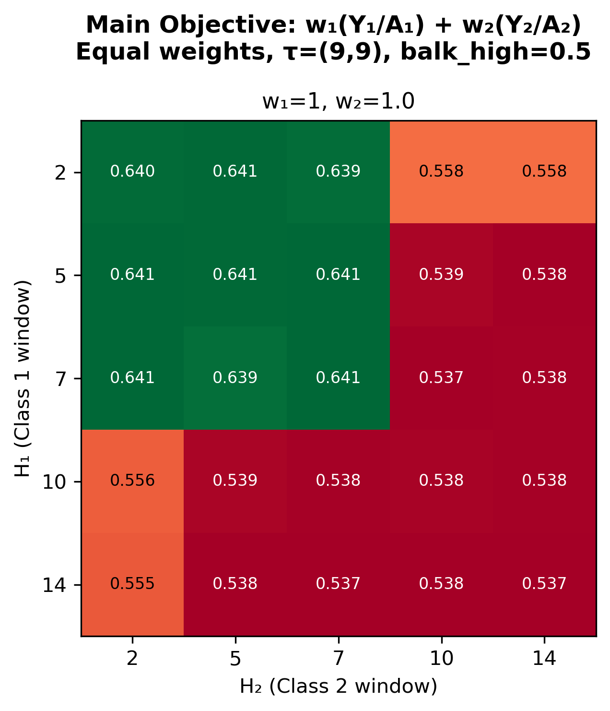

Under equal weights, the objective is effectively maximized when both horizons are seven days or shorter, with $(H_1,H_2)=(7,7)$ representing the widest symmetric optimum. Because same-day appointments are counted as delay zero, a seven-day horizon allows delays from zero through six and ends immediately before the model's elevated no-show-risk region; extending the horizon to 10 or 14 days introduces bookings with higher no-show risk and reduces the completed served rate.

## Class 1 Higher Weighted

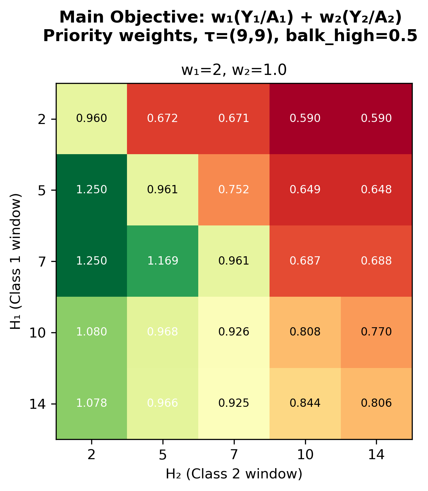

When Class 1 receives twice the weight of Class 2, the preferred configuration becomes asymmetric: $(H_1,H_2)=(5,2)$ and $(7,2)$ attain the highest displayed objective of 1.250. The wider Class 1 horizon expands access for the prioritized class, while the short Class 2 horizon limits Class 2's competition for future capacity.

Extending the Class 1 horizon beyond seven days lowers the weighted objective because it introduces bookings in the elevated no-show-risk region without producing a sufficient increase in completed Class 1 visits.

## Balking Interaction with Booking Horizons

### Balking Threshold

The following panels compare booking-horizon performance under five combinations of class-specific balking thresholds. The class weights are equal and the post-threshold balking rate is fixed at 0.5.

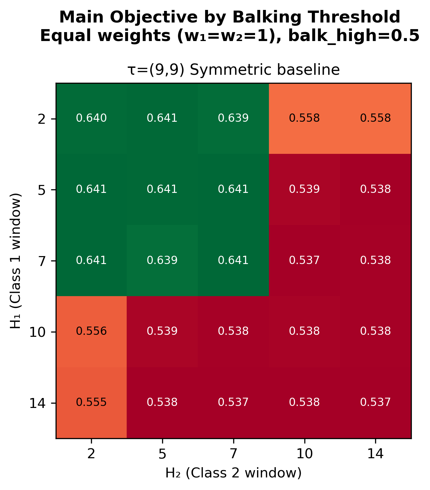

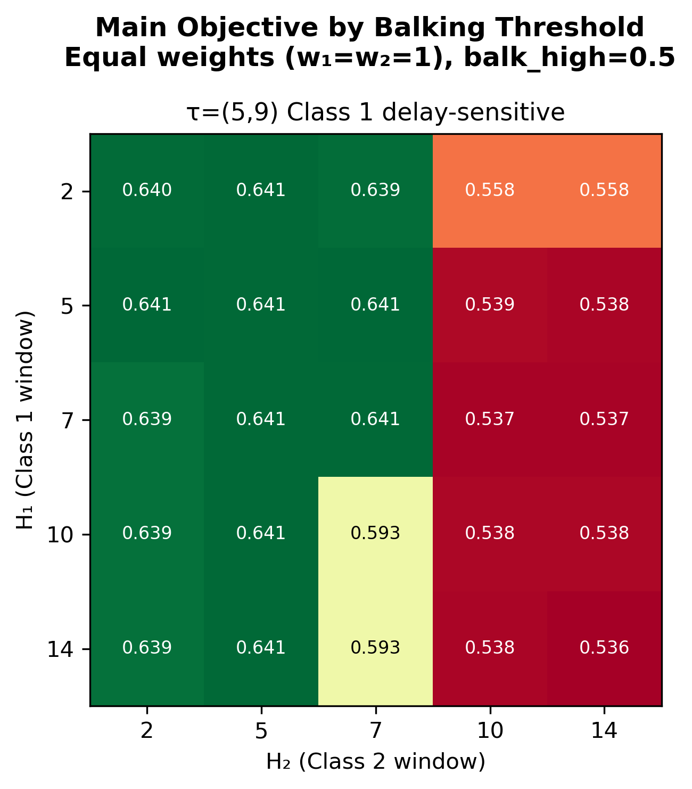

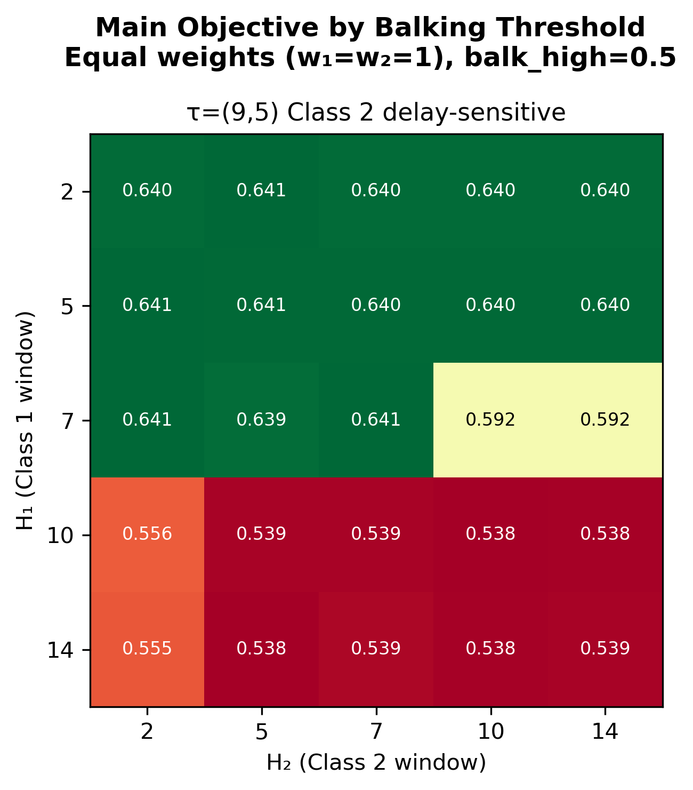

With symmetric thresholds, the high-objective region is concentrated among configurations in which both booking horizons are seven days or shorter. A similar pattern appears when both classes are relatively tolerant, indicating that extending either horizon into the 10- or 14-day range generally reduces completed service under the baseline no-show process.

When one class has a lower balking threshold, the objective can remain high even when that class receives a longer nominal horizon. For example, when Class 1 has threshold 5, the objective remains near its maximum with a Class 1 horizon of 10 or 14 days, provided that the Class 2 horizon remains short. The corresponding pattern appears for Class 2 when its threshold is reduced to 5.

A lower threshold does not make long waits beneficial. Instead, it causes the class to reject more long-delay offers before those offers become bookings. Those rejected offers consume no appointment capacity and can be offered to other patients, while fewer long-delay bookings remain exposed to elevated no-show risk. The longer nominal horizon is therefore partly filtered by balking, allowing the aggregate objective to remain high even though many of the additional long-delay offers are not accepted.

### Balking Rate

The following panels hold both balking thresholds at $(9,9)$ and vary the common post-threshold balking rate.

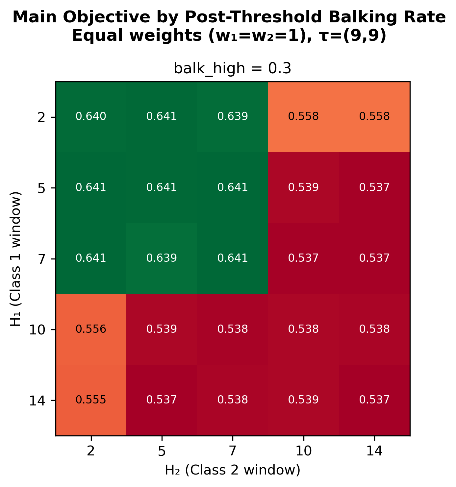

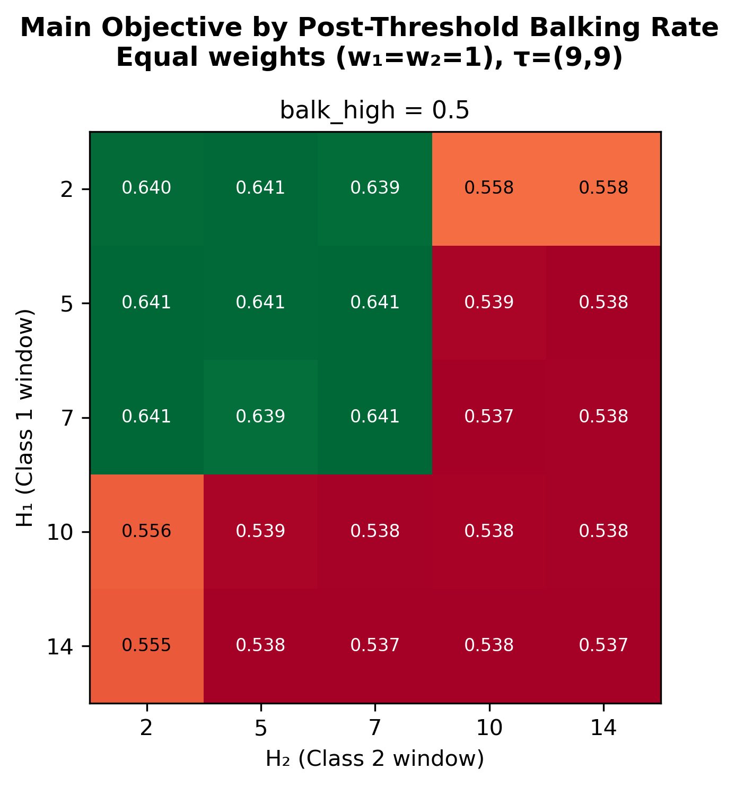

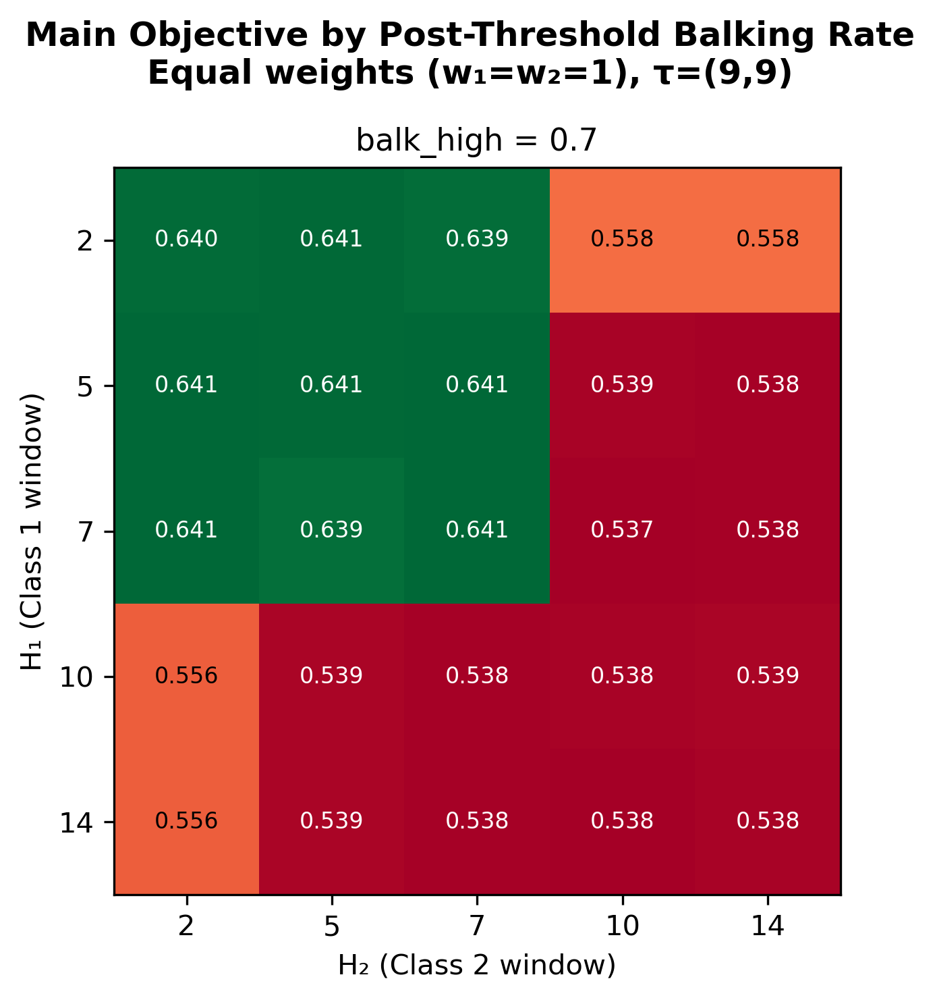

Changing the common post-threshold balking rate from 0.3 to 0.7 has no meaningful effect on the objective surface. The preferred horizon region remains unchanged, and the displayed objective values differ only negligibly across the three panels.

In this symmetric and heavily oversubscribed regime, a patient who balks does not occupy a slot and can generally be replaced by another arrival. The common post-threshold balking rate therefore changes which patients receive appointments more than it changes the total weighted number of completed visits.

## No-Offer Rate and Offered Delay Diagnostics

The no-offer rate captures the direct access effect of the booking horizon. Short horizons mechanically restrict the appointment dates available to a class, while longer horizons increase the chance that an offer can be found.

Mean offered delay must be interpreted together with the no-offer rate. A shorter mean offered delay does not necessarily indicate better access because patients who receive no offer have no delay observation.

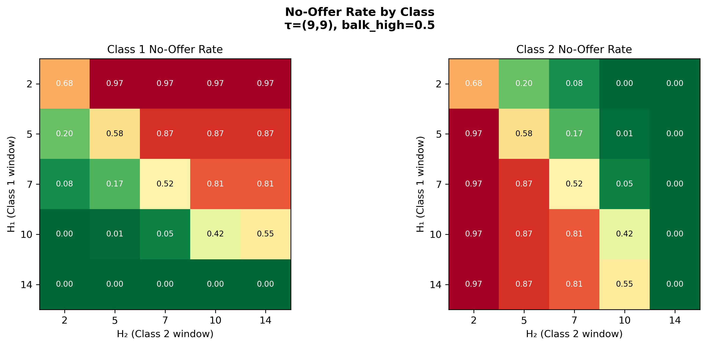

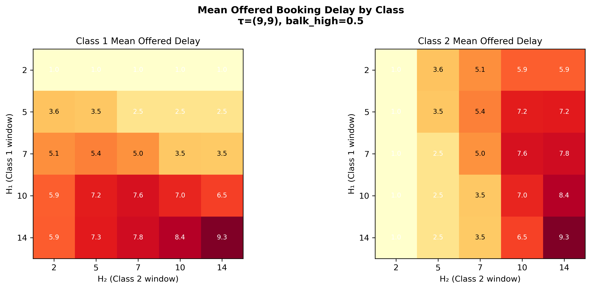

Each class's no-offer rate falls sharply as its own booking horizon increases. At the same time, extending the other class's horizon generally raises the focal class's no-offer rate because the competing class gains access to more of the shared future capacity.

A longer own-class horizon also increases mean offered delay because more distant appointments become available. In some configurations, extending the competing class's horizon lowers the focal class's observed offered delay, but this is a composition effect rather than an access improvement: the focal class receives fewer offers overall, and the remaining observed offers are concentrated at shorter delays.

The two diagnostics therefore describe a clear trade-off. Longer horizons reduce the probability of receiving no offer, but they do so by expanding access to more distant appointments; shorter horizons improve the observed delay among offered patients partly by excluding patients who would otherwise have received long-delay offers.

## Objective Function Comparison

The secondary objective is the pooled weighted served rate:

$$
U_{\text{pooled}}(w_1,w_2)
=
\frac{w_1Y_1+w_2Y_2}
{w_1A_1+w_2A_2}.
$$

Unlike the additive objective, the pooled objective returns a single weighted rate bounded between zero and one.

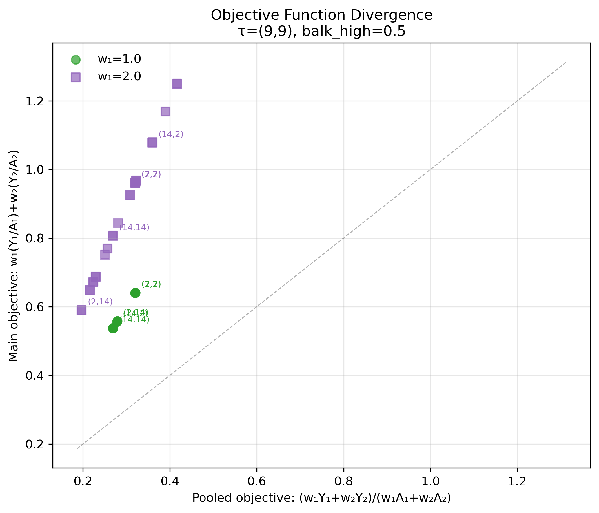

The figure does not show a substantive disagreement between the two objectives. Because the two classes have equal arrival totals, the additive and pooled objectives are proportional: under equal weights, the additive objective is twice the pooled objective, and when $w_1=2$ it is three times the pooled objective.

The two objectives therefore rank the booking-horizon configurations identically in this experiment. Their apparent divergence reflects only their different numerical scales, not a different policy recommendation.

## Conclusion

1. **Under equal weights, horizons of seven days or less perform best.** The widest symmetric optimum is $(7,7)$, which expands access without entering the elevated no-show-risk delay region.

2. **Giving Class 1 greater weight produces an asymmetric horizon policy.** The highest weighted objective occurs with a Class 1 horizon of five or seven days and a Class 2 horizon of two days.

3. **Extending a horizon beyond seven days generally reduces completed service.** The additional appointment dates expose accepted bookings to longer delays and higher no-show risk.

4. **A lower balking threshold can make a long nominal horizon less harmful.** Long-delay offers are more likely to be rejected before booking, preserving the slot for another patient and reducing exposure to unrecoverable no-show losses.

5. **The common post-threshold balking rate has little effect on the aggregate objective in the tested regime.** Under heavy oversubscription, patients who balk can generally be replaced by later arrivals.

6. **A longer own-class horizon lowers the class's no-offer rate but increases its offered delay.** Booking-horizon policies therefore trade broader access against longer waits among patients who receive offers.

7. **One class's longer horizon can reduce access for the other class.** Because both classes compete for the same future capacity, expanding one class's booking window generally raises the other class's no-offer rate.

8. **Offered delay should never be interpreted without the no-offer rate.** A low observed delay may result from excluding long-wait patients from the offer sample rather than from improving access.

9. **The additive and pooled objectives produce the same policy ranking here.** With equal class arrival totals, they differ only by a constant scaling factor.
