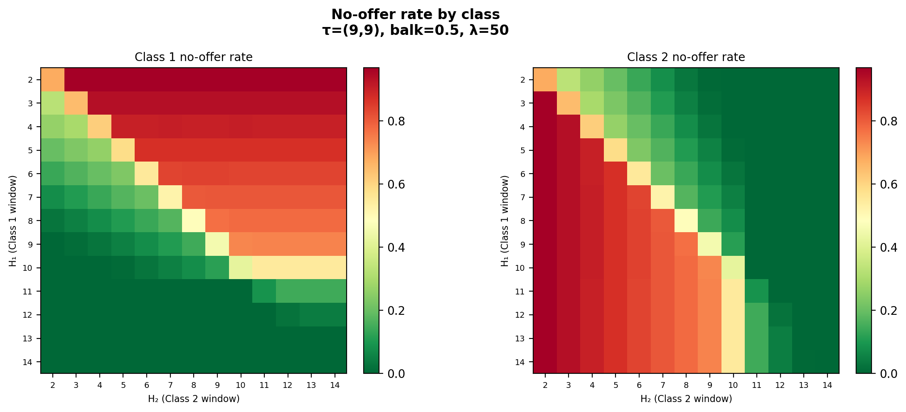
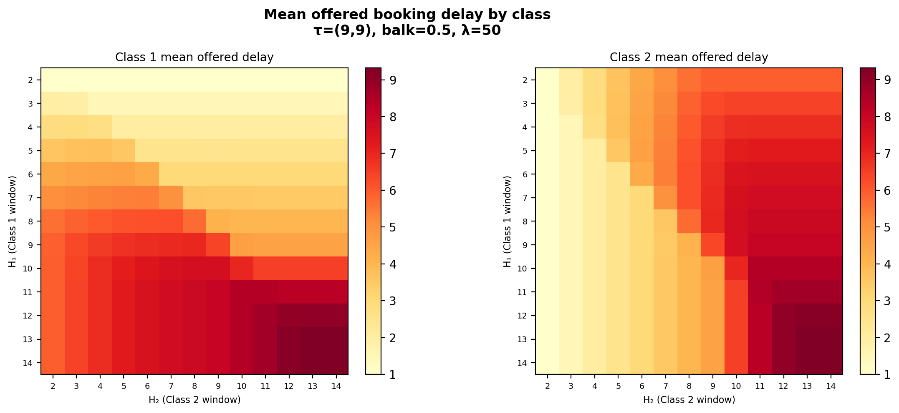

## Motivation

This analysis evaluates class-specific booking horizons under oversubscribed FCFS scheduling. A longer horizon gives a class access to more future capacity but also exposes it to longer delays, higher balking, and greater no-show risk. The question is how the preferred horizon depends on class weights and delay-dependent patient behavior.

## Objective Functions

Two additive objectives are evaluated, both applied as post-processing over the served counts.

Service rate:

$$
U_{\text{service}}(H_1,H_2) = w_1\frac{Y_1}{A_1} + w_2\frac{Y_2}{A_2}.
$$

Slot utilization:

$$
U_{\text{slot}}(H_1,H_2) = w_1\frac{Y_1}{S} + w_2\frac{Y_2}{S},
$$

where $H_i$ is the booking horizon, $Y_i$ the served count, $A_i$ the arrivals for class $i$, $S$ the number of slots per day, and $w_i$ the class weight. The slot-utilization objective is unbounded and scales with the measurement window; only the preferred configuration within a weight regime is compared, not objective levels across regimes.

## Experimental Design

Each run assigns separate booking horizons $(H_1,H_2)$ and balking thresholds $(\tau_1,\tau_2)$ to the two classes. Weights are applied in post-processing. Each configuration is repeated across 30 seeds (169 horizon pairs × 5 thresholds × 3 balking rates × 2 arrival rates × 30 seeds = 152,100 runs). Baseline figures use arrival rate 50 and balking rate 0.5 unless stated.

Problem parameters:

| Parameter | Values |
|-----------|--------|
| Balking thresholds $(\tau_1,\tau_2)$ | (9,9), (5,9), (9,5), (12,12), (5,12) |
| Post-threshold balking rate | 0.3, 0.5, 0.7 |
| Arrival rate (per class) | 25, 50 |

Policy parameters:

| Parameter | Values |
|-----------|--------|
| Booking horizons $(H_1,H_2)$ | 2–14, all 169 pairs |
| Weight regimes ($w_2=1$) | $w_1 \in \{0.25, 1, 2, 3\}$; 0.5-step grid for the counterbalance figure |

## Equal Weights and Booking Horizons

Under equal weights the objective is maximized across the entire region where both horizons are seven days or shorter; differences within that block are within seed noise. Extending either horizon past seven reduces completed service by entering the elevated no-show-risk region.

## Class 1 Higher Weighted

With $w_1=2$ the optimum is asymmetric: the Class 2 horizon collapses to 2 while the Class 1 horizon sits in the 3–7 range. A short Class 2 window frees future capacity for the prioritized class.

## Balking Interaction with Booking Horizons

### Balking Threshold

With symmetric or tolerant thresholds the high-objective region is both horizons ≤ 7. When one class has the lower threshold (5), the near-optimal region extends along that class's horizon axis out to 14, with the other horizon held ≤ 7. The lower threshold filters long-delay offers through balking before they book, so a longer nominal horizon for that class is not harmful.

### Class 1 Weight Counterbalance

At $\tau=(9,5)$, the extended Class 2 horizon is counterbalanced by weighting Class 1. The optimal Class 2 horizon falls from 4 at $w_1=1$ to 2 at $w_1=1.5$ and remains at 2 above it. A Class 1 weight of about 1.5 is sufficient to pull the Class 2 horizon back to its minimum.

### Balking Rate

Varying the common balking rate from 0.3 to 0.7 leaves the objective surface and the preferred horizon region unchanged. Under heavy oversubscription a balking patient is replaced by another arrival.

### Balking Rate × Weight

The optimum is identical across all three balking rates at every weight. Balking rate does not interact with weight: the optimal horizon policy is set by the weight alone ($w_1=0.25$ favors a short Class 1 / longer Class 2 window, $w_1=1$ the symmetric ≤ 7 block, $w_1 \ge 2$ a Class 2 horizon of 2) and is invariant to the balking rate.

## Arrival Rate

Halving the arrival rate raises the achievable served rate but leaves the ≤ 7 preferred region unchanged. Arrival rate scales the objective without altering the horizon policy.

## No-Offer Rate and Offered Delay Diagnostics

A class's no-offer rate falls as its own horizon increases and rises as the competing class's horizon increases. A longer own horizon also raises mean offered delay. Where extending the competing class's horizon lowers observed delay, this is a composition effect from receiving fewer offers, not improved access; offered delay must be read together with the no-offer rate.

## Slot-Utilization Objective

The slot-utilization objective yields the same horizon policy as the service-rate objective: the ≤ 7 block under equal weights and a Class 2 horizon of 2 under $w_1 \ge 2$. Under equal weights it sits at the capacity ceiling (≈ 365, full annual utilization) across the entire block, so it is less discriminating than the service-rate objective; the threshold, counterbalance, balking-rate, and arrival-rate results match those above.

## Conclusion

1. **Under equal weights, horizons of seven days or less perform best.** The optimum is the full block with both horizons ≤ 7.

2. **Weighting Class 1 produces an asymmetric policy.** At $w_1=2$ the Class 2 horizon drops to 2 and the Class 1 horizon sits at 3–7.

3. **Extending a horizon beyond seven days reduces completed service** by exposing bookings to elevated no-show risk.

4. **A lower balking threshold extends that class's near-optimal horizon to 14**, because long-delay offers are balked before booking.

5. **A Class 1 weight of about 1.5 counterbalances a low Class 2 threshold**, pulling the optimal Class 2 horizon back to its minimum.

6. **The post-threshold balking rate does not affect the objective or interact with weight.** The optimal policy is set by the weight alone and is invariant across balking rates.

7. **Arrival rate scales the objective but not the horizon policy.** The ≤ 7 region holds at both arrival rates.

8. **A longer own-class horizon lowers the no-offer rate but raises offered delay**, and offered delay must be interpreted with the no-offer rate.

9. **The two objectives produce the same horizon policy.** Slot utilization is pinned at the capacity ceiling under equal weights and is less discriminating than the service rate.
