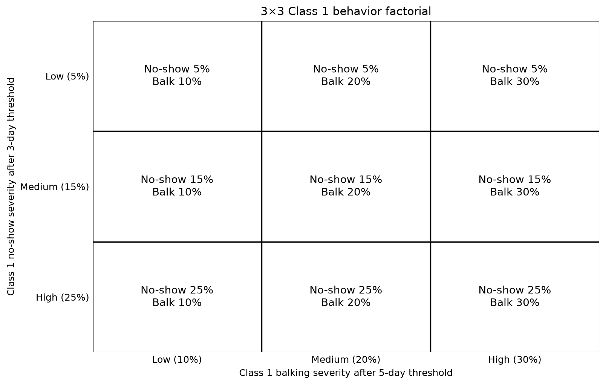
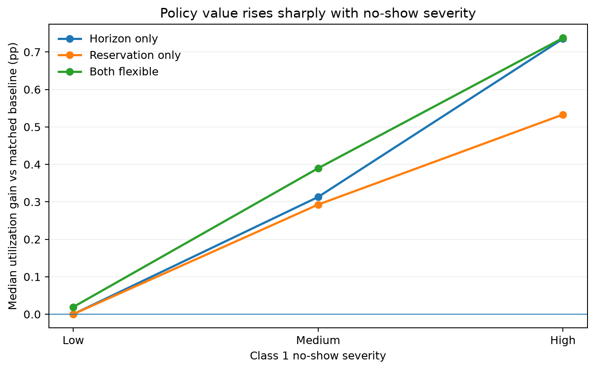
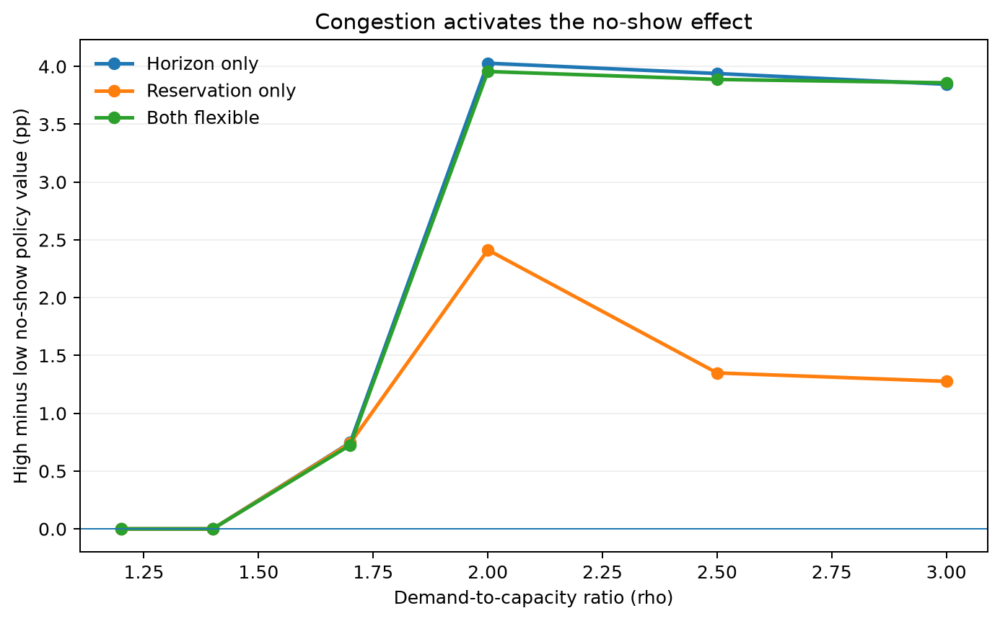

```{python}
from pathlib import Path
import numpy as np
import pandas as pd
import matplotlib.pyplot as plt
from IPython.display import display, Markdown

# -------------------------------------------------------------------
# Paths and inputs
# -------------------------------------------------------------------
cwd = Path.cwd().resolve()
repo_candidates = [cwd, *cwd.parents]

REPO = next(
    (
        p for p in repo_candidates
        if (p / "full_run_summaries").exists()
        and (p / "outputs").exists()
    ),
    None,
)

if REPO is None:
    raise FileNotFoundError(
        "Could not locate the CUIMC-Appointment-Simulation repository root."
    )

ROOT = REPO / "full_run_summaries" / "patient_behavior_factorial_3_5" / "release"

required = [
    ROOT / "pairwise_policy_deltas.csv",
    ROOT / "selected_policy_outcomes.csv",
    ROOT / "factorial_contrasts_overall.csv",
]

missing = [p for p in required if not p.exists()]
if missing:
    missing_text = "\n".join(str(p) for p in missing)
    raise FileNotFoundError(
        "The report-data files are missing from the local clone.\n"
        "Copy the GRID release folder to:\n"
        f"{ROOT}\n\nMissing files:\n{missing_text}"
    )

FIG = Path("figures")
FIG.mkdir(parents=True, exist_ok=True)

pair = pd.read_csv(ROOT / "pairwise_policy_deltas.csv")
sel = pd.read_csv(ROOT / "selected_policy_outcomes.csv")
fac = pd.read_csv(ROOT / "factorial_contrasts_overall.csv")

pair = pair[pair["selection_objective"] == "average_utilization"].copy()
sel = sel[sel["selection_objective"] == "average_utilization"].copy()
fac = fac[fac["selection_objective"] == "average_utilization"].copy()

main = pair[pair["rho"] <= 2.5].copy()

BAND = 0.005

comparison_labels = {
    "horizon_only_vs_baseline": "Horizon only",
    "reservation_only_vs_baseline": "Reservation only",
    "both_flexible_vs_baseline": "Both flexible",
}
policy_order = ["Horizon only", "Reservation only", "Both flexible"]
level_order = ["low", "medium", "high"]
level_labels = {"low": "Low", "medium": "Medium", "high": "High"}

def access_status(r):
    c1 = r["delta_class_1_percent_serviced"]
    c1lo = r["delta_class_1_percent_serviced_ci_low"]
    c1hi = r["delta_class_1_percent_serviced_ci_high"]

    c2 = r["delta_class_2_percent_serviced"]
    c2lo = r["delta_class_2_percent_serviced_ci_low"]
    c2hi = r["delta_class_2_percent_serviced_ci_high"]

    c1gain = c1 >= BAND and c1lo > 0
    c2gain = c2 >= BAND and c2lo > 0
    c1harm = c1 <= -BAND and c1hi < 0
    c2harm = c2 <= -BAND and c2hi < 0
    c1neutral = c1lo >= -BAND and c1hi <= BAND
    c2neutral = c2lo >= -BAND and c2hi <= BAND

    if c1gain and c2gain:
        return "Win-win"
    if c1gain and c2neutral:
        return "C1 win / C2 neutral"
    if c2gain and c1neutral:
        return "C2 win / C1 neutral"
    if c1gain and c2harm:
        return "C1 gain / C2 harm"
    if c2gain and c1harm:
        return "C2 gain / C1 harm"
    if c1neutral and c2neutral:
        return "Both neutral"
    return "Uncertain / mixed"


def save_design_grid():
    fig, ax = plt.subplots(figsize=(9.0, 5.8))

    ns_probs = {"low": 5, "medium": 15, "high": 25}
    bk_probs = {"low": 10, "medium": 20, "high": 30}

    for i, ns in enumerate(level_order):
        for j, bk in enumerate(level_order):
            rect = plt.Rectangle(
                (j, i), 1, 1, fill=False, linewidth=1.3
            )
            ax.add_patch(rect)
            ax.text(
                j + 0.5,
                i + 0.5,
                f"No-show {ns_probs[ns]}%\nBalk {bk_probs[bk]}%",
                ha="center",
                va="center",
                fontsize=11,
            )

    ax.set_xlim(0, 3)
    ax.set_ylim(3, 0)
    ax.set_xticks(
        [0.5, 1.5, 2.5],
        ["Low (10%)", "Medium (20%)", "High (30%)"],
    )
    ax.set_yticks(
        [0.5, 1.5, 2.5],
        ["Low (5%)", "Medium (15%)", "High (25%)"],
    )
    ax.set_xlabel("Class 1 balking severity after 5-day threshold")
    ax.set_ylabel("Class 1 no-show severity after 3-day threshold")
    ax.set_title("3×3 Class 1 behavior factorial")
    for spine in ax.spines.values():
        spine.set_visible(False)
    ax.tick_params(length=0)
    fig.tight_layout()
    fig.savefig(
        FIG / "pbf_avg_concise_00_design_grid.png",
        dpi=180,
        bbox_inches="tight",
    )
    plt.close(fig)


def no_show_policy_value_figure():
    z = main[main["comparison"].isin(comparison_labels)].copy()
    g = (
        z.groupby(["comparison", "noshow_level"], as_index=False)
        ["delta_average_utilization"]
        .median()
    )

    fig, ax = plt.subplots(figsize=(7.6, 4.8))
    for comp, label in comparison_labels.items():
        y = (
            g[g["comparison"] == comp]
            .set_index("noshow_level")
            .reindex(level_order)["delta_average_utilization"]
            .to_numpy()
            * 100
        )
        ax.plot(
            ["Low", "Medium", "High"],
            y,
            marker="o",
            linewidth=2,
            label=label,
        )

    ax.axhline(0, linewidth=0.8)
    ax.set_xlabel("Class 1 no-show severity")
    ax.set_ylabel("Median utilization gain vs matched baseline (pp)")
    ax.set_title("Policy value rises sharply with no-show severity")
    ax.legend(frameon=False)
    ax.grid(axis="y", alpha=0.2)
    fig.tight_layout()
    fig.savefig(
        FIG / "pbf_avg_concise_01_noshow_policy_value.png",
        dpi=180,
        bbox_inches="tight",
    )
    plt.close(fig)


def demand_activation_figure():
    z = pair[pair["comparison"].isin(comparison_labels)].copy()
    g = (
        z.groupby(["comparison", "rho", "noshow_level"], as_index=False)
        ["delta_average_utilization"]
        .median()
    )

    rows = []
    for (comp, rho), grp in g.groupby(["comparison", "rho"]):
        vals = grp.set_index("noshow_level")["delta_average_utilization"]
        if "low" in vals.index and "high" in vals.index:
            rows.append({
                "comparison": comp,
                "rho": rho,
                "high_minus_low": 100 * (vals["high"] - vals["low"]),
            })

    d = pd.DataFrame(rows)

    fig, ax = plt.subplots(figsize=(7.8, 4.9))
    for comp, label in comparison_labels.items():
        s = d[d["comparison"] == comp].sort_values("rho")
        ax.plot(
            s["rho"],
            s["high_minus_low"],
            marker="o",
            linewidth=2,
            label=label,
        )

    ax.axhline(0, linewidth=0.8)
    ax.set_xlabel("Demand-to-capacity ratio (rho)")
    ax.set_ylabel("High minus low no-show policy value (pp)")
    ax.set_title("Congestion activates the no-show effect")
    ax.legend(frameon=False)
    ax.grid(axis="y", alpha=0.2)
    fig.tight_layout()
    fig.savefig(
        FIG / "pbf_avg_concise_02_demand_activation.png",
        dpi=180,
        bbox_inches="tight",
    )
    plt.close(fig)


# -------------------------------------------------------------------
# Win/neutral classification and conditions
# -------------------------------------------------------------------
access_cases = main[
    main["comparison"].isin(comparison_labels)
].copy()
access_cases["Policy"] = access_cases["comparison"].map(comparison_labels)
access_cases["Access classification"] = access_cases.apply(
    access_status,
    axis=1,
)

wanted = [
    "Win-win",
    "C1 win / C2 neutral",
    "C2 win / C1 neutral",
    "Both neutral",
    "C1 gain / C2 harm",
    "C2 gain / C1 harm",
    "Uncertain / mixed",
]

counts = (
    access_cases.groupby(["Policy", "Access classification"])
    .size()
    .rename("n")
    .reset_index()
)
totals = counts.groupby("Policy")["n"].transform("sum")
counts["Percent"] = 100 * counts["n"] / totals

access_classification = (
    counts.pivot(
        index="Policy",
        columns="Access classification",
        values="Percent",
    )
    .reindex(index=policy_order, columns=wanted)
    .fillna(0)
    .round(1)
    .reset_index()
)
access_classification.columns.name = None

policy_code_map = {
    "Horizon only": "horizon_only",
    "Reservation only": "reservation_only",
    "Both flexible": "both_flexible",
}

win_neutral_cases = access_cases[
    access_cases["Access classification"].eq("C1 win / C2 neutral")
].copy()
win_neutral_cases["policy"] = win_neutral_cases["Policy"].map(policy_code_map)

sel_main = sel[
    (sel["rho"] <= 2.5)
    & (sel["policy"].isin(policy_code_map.values()))
].copy()

setting_cols = [
    c for c in [
        "background_id",
        "policy",
        "selected_horizon_days",
        "selected_Q",
        "selected_window",
    ]
    if c in sel_main.columns
]

if {"background_id", "policy"}.issubset(setting_cols):
    settings = (
        sel_main[setting_cols]
        .drop_duplicates(["background_id", "policy"])
    )
    win_neutral_cases = win_neutral_cases.merge(
        settings,
        on=["background_id", "policy"],
        how="left",
        validate="many_to_one",
    )

# Generate only figures used in the findings below.
save_design_grid()
no_show_policy_value_figure()
demand_activation_figure()
```

This report asks one question: **which Class 1 behavior changes the utilization value of scheduling policy, and under what clinic conditions?**

Average utilization is the share of measured appointment capacity that becomes completed visits:

$$
U = \frac{Y_1 + Y_2}{M},
$$

where $Y_1$ and $Y_2$ are completed Class 1 and Class 2 visits and $M$ is measured appointment capacity.

The headline analysis uses $\rho=1.2,1.4,1.7,2.0,$ and $2.5$. The $\rho=3.0$ setting is retained as a heavy-demand stress condition.

# 3×3 behavior experiment



The design isolates **severity**, not threshold timing:

- No-show threshold: **3 days**
- Balking threshold: **5 days**
- Pre-threshold probability: **5%** for both behaviors
- Class 2 behavior is fixed throughout

Each behavior cell is compared with its **own matched no-policy baseline** with the same behavior values, demand, Class 1 share, and capacity.

The 3×3 cells are crossed with six demand levels, five Class 1 shares, and two capacities: **540 backgrounds total**, including **450** in the headline range.

| Policy | Booking horizon | Reservation |
|---|---|---|
| Baseline | 100 days | None |
| Horizon only | Optimized over 2–26 days | None |
| Reservation only | 100 days | Quantity/window optimized |
| Both flexible | Optimized over 2–26 days | Quantity/window optimized |

# Finding 1 — No-show severity determines the utilization value of policy

**High no-show produces the largest utilization benefit from policy change.** Low no-show produces almost no median gain; medium no-show produces a moderate gain; high no-show produces the largest gain under every optimized policy.



The 3×3 cell medians make the pattern concrete:

| Policy | Low no-show | Medium no-show | High no-show |
|---|---:|---:|---:|
| Horizon only | ~0.00 pp | ~+0.32 pp | **~+0.73 pp** |
| Reservation only | ~0.00 pp | ~+0.29 pp | **~+0.53 pp** |
| Both flexible | ~+0.02 pp | ~+0.38 pp | **~+0.75 pp** |

**Evidence from the matched factorial contrasts:**

| Policy | No-show low → high | Balking low → high |
|---|---:|---:|
| Horizon only | **+2.11 pp** | −0.03 pp |
| Reservation only | **+1.18 pp** | −0.02 pp |
| Both flexible | **+2.11 pp** | −0.03 pp |

The policy value is therefore primarily a response to **delay-sensitive no-show risk**, not to patient attrition in general.

# Finding 2 — Balking has little main effect, and it does not materially change the no-show effect

Two conclusions follow directly from the 3×3 design:

1. **Balking severity does not have a comparable main effect on utilization.**
2. **The no-show effect is largely stable across balking levels.**

Within each no-show row, moving from low to high balking changes the median utilization gain by only a few hundredths of a percentage point.

Examples:

- Horizon only, high no-show: **+0.74 / +0.73 / +0.73 pp** across low / medium / high balking.
- Reservation only, high no-show: **+0.53 / +0.53 / +0.53 pp**.
- Both flexible, high no-show: **+0.77 / +0.75 / +0.74 pp**.

The formal no-show × balking interaction is also very small: approximately **−0.05 to −0.06 pp** across the three policies.

**Interpretation:** higher balking does not materially amplify or suppress the utilization opportunity created by higher no-show risk.

# Finding 3 — Congestion activates the no-show effect

The behavioral difference matters only when delays become long enough to cross the **3-day no-show threshold**.



- At $\rho=1.2$ and $1.4$, policy has little utilization value because offered delays rarely activate the behavior thresholds.
- The no-show separation begins to matter around $\rho=1.7$.
- It becomes operationally important around $\rho=2.0$–$2.5$.
- $\rho=3.0$ is best interpreted as a stress condition rather than part of the headline range.

This explains why the pooled mean policy effect is much larger than the pooled median: **policy value is concentrated in congested backgrounds where delay-sensitive no-show risk is actually exposed.**

# Finding 4 — The optimizer responds to no-show risk by shortening the booking horizon

The selected policies move in the direction predicted by the utilization result.

| Policy | Low no-show | Medium no-show | High no-show |
|---|---:|---:|---:|
| Horizon only: mean selected H | 3.99 days | 3.06 days | **2.98 days** |
| Both flexible: mean selected H | 6.85 days | 5.95 days | **5.84 days** |

**Point:** when no-show risk becomes more severe after three days, the optimizer responds by reducing exposure to long waits.

The selected horizon changes much more systematically with no-show severity than with balking severity. This provides a mechanism check for the main utilization finding.

# Win/neutral situations — favorable access outcomes are rare

Average-utilization optimization is evaluated not only on utilization but also on whether it improves Class 1 access without harming Class 2.

Definitions:

- **Win-win:** both classes improve by at least +0.5 pp and both 95% CIs are above zero.
- **C1 win / C2 neutral:** Class 1 improves by at least +0.5 pp with CI above zero, while the entire Class 2 CI lies inside ±0.5 pp.
- **Both neutral:** both class-specific CIs lie inside ±0.5 pp.

```{python}
#| label: tbl-access-classification
#| tbl-cap: "Class-specific access classification for average-utilization-optimal policies, headline range (rho <= 2.5)."
display(
    access_classification.style
    .format({
        c: "{:.1f}%"
        for c in access_classification.columns
        if c != "Policy"
    })
    .hide(axis="index")
)
```

**Supported win-win cases are absent in the headline range.** C1-win/C2-neutral outcomes exist, but they are uncommon enough that their clinic conditions matter more than the pooled percentage.

## What patterns appear in the C1-win / C2-neutral cases?

Rather than listing every favorable background, the report summarizes the **recurring conditions** among the cases that satisfy the win/neutral criterion.

```{python}
#| label: txt-win-neutral-patterns
if len(win_neutral_cases) == 0:
    display(Markdown("- **No C1-win / C2-neutral cases were found in the headline range.**"))
else:
    trend_lines = []

    for policy_name, group in win_neutral_cases.groupby("Policy", dropna=False):
        n_policy = len(group)

        trend_lines.append(
            f"- **{policy_name}:** {n_policy} C1-win / C2-neutral background"
            + ("." if n_policy == 1 else "s.")
        )

        candidate_patterns = [
            ("rho", "demand level"),
            ("class1_share", "Class 1 share"),
            ("capacity", "capacity"),
            ("daily_capacity", "capacity"),
            ("noshow_level", "no-show severity"),
            ("balk_level", "balking severity"),
            ("selected_horizon_days", "selected horizon"),
            ("selected_Q", "selected Q"),
            ("selected_window", "selected window"),
        ]

        used_labels = set()
        recurring = []

        for col, label in candidate_patterns:
            if col not in group.columns or label in used_labels:
                continue

            used_labels.add(label)
            vc = group[col].value_counts(dropna=False)
            if len(vc) == 0:
                continue

            top_count = int(vc.iloc[0])
            share = top_count / n_policy

            # Only surface a characteristic when it appears in at least
            # half of the favorable cases for that policy.
            if share >= 0.5:
                top_values = vc[vc == top_count].index.tolist()

                def fmt(v):
                    if pd.isna(v):
                        return "NA"
                    if label in {"demand level", "Class 1 share"}:
                        return f"{float(v):.1f}"
                    try:
                        f = float(v)
                        return str(int(f)) if f.is_integer() else f"{f:.1f}"
                    except Exception:
                        return str(v).title()

                recurring.append(
                    f"{label} = {', '.join(fmt(v) for v in top_values)} "
                    f"({top_count}/{n_policy})"
                )

        if n_policy == 1:
            trend_lines.append(
                "  - Only one favorable background is present, so its characteristics "
                "should be treated as a case description rather than a recurring pattern."
            )
        elif recurring:
            trend_lines.append(
                "  - Recurring features: " + "; ".join(recurring) + "."
            )
        else:
            trend_lines.append(
                "  - No single clinic or behavior characteristic appears in at least "
                "half of the favorable cases."
            )

    display(Markdown("\n".join(trend_lines)))
```

**How to read this section:** a characteristic is reported only when the same value appears in at least **50%** of that policy's win/neutral cases. This keeps the focus on repeated patterns rather than individual scenarios.

# Conclusions

- **No-show severity is the dominant behavioral driver of utilization policy value.**
- **Balking severity has little direct utilization effect.**
- **The no-show effect is largely stable across balking levels.**
- **Congestion is necessary for these behavioral differences to matter.**
- **The optimizer responds to higher no-show risk by shortening the booking horizon.**
- **Win-win access outcomes are absent; C1-win/C2-neutral cases are rare and should be interpreted through the clinic conditions in which they occur.**

For a clinic, the practical sequence is simple:

1. Ask whether delays are long enough to activate delay-sensitive behavior.
2. If no-show risk rises with delay, horizon control has clear utilization value.
3. Do not treat balking and no-show as interchangeable sources of attrition.
4. If Class 1 access is a separate priority, inspect the win/neutral conditions rather than relying on utilization alone.

---

Primary data inputs:

- `full_run_summaries/patient_behavior_factorial_3_5/release/selected_policy_outcomes.csv`
- `full_run_summaries/patient_behavior_factorial_3_5/release/pairwise_policy_deltas.csv`
- `full_run_summaries/patient_behavior_factorial_3_5/release/factorial_contrasts_overall.csv`
