```{python}
from pathlib import Path
import numpy as np
import pandas as pd
import matplotlib.pyplot as plt
from IPython.display import display

# -------------------------------------------------------------------
# Paths and inputs
# -------------------------------------------------------------------
cwd = Path.cwd().resolve()
repo_candidates = [cwd, *cwd.parents]

REPO = next(
    (
        p for p in repo_candidates
        if (p / "full_run_summaries").exists()
        and (p / "outputs").exists()
    ),
    None,
)

if REPO is None:
    raise FileNotFoundError(
        "Could not locate the CUIMC-Appointment-Simulation repository root."
    )

ROOT = REPO / "full_run_summaries" / "patient_behavior_factorial_3_5" / "release"

required = [
    ROOT / "pairwise_policy_deltas.csv",
    ROOT / "selected_policy_outcomes.csv",
    ROOT / "factorial_contrasts_overall.csv",
]

missing = [p for p in required if not p.exists()]
if missing:
    missing_text = "\n".join(str(p) for p in missing)
    raise FileNotFoundError(
        "The report-data files are missing from the local clone.\n"
        "Copy the GRID release folder to:\n"
        f"{ROOT}\n\nMissing files:\n{missing_text}"
    )

FIG = Path("figures")
FIG.mkdir(parents=True, exist_ok=True)

pair = pd.read_csv(ROOT / "pairwise_policy_deltas.csv")
sel = pd.read_csv(ROOT / "selected_policy_outcomes.csv")
fac = pd.read_csv(ROOT / "factorial_contrasts_overall.csv")

pair = pair[pair["selection_objective"] == "average_utilization"].copy()
sel = sel[sel["selection_objective"] == "average_utilization"].copy()
fac = fac[fac["selection_objective"] == "average_utilization"].copy()

main = pair[pair["rho"] <= 2.5].copy()
stress = pair[pair["rho"] == 3.0].copy()

BAND = 0.005

comparison_labels = {
    "horizon_only_vs_baseline": "Horizon only",
    "reservation_only_vs_baseline": "Reservation only",
    "both_flexible_vs_baseline": "Both flexible",
}

policy_order = ["Horizon only", "Reservation only", "Both flexible"]
level_order = ["low", "medium", "high"]
level_labels = {"low": "Low", "medium": "Medium", "high": "High"}

def util_status(r):
    m = r["delta_average_utilization"]
    lo = r["delta_average_utilization_ci_low"]
    hi = r["delta_average_utilization_ci_high"]

    if m >= BAND and lo > 0:
        return "Meaningful increase"
    if m <= -BAND and hi < 0:
        return "Meaningful decrease"
    if lo >= -BAND and hi <= BAND:
        return "Supported neutral"
    return "Uncertain"

def access_status(r):
    c1 = r["delta_class_1_percent_serviced"]
    c1lo = r["delta_class_1_percent_serviced_ci_low"]
    c1hi = r["delta_class_1_percent_serviced_ci_high"]

    c2 = r["delta_class_2_percent_serviced"]
    c2lo = r["delta_class_2_percent_serviced_ci_low"]
    c2hi = r["delta_class_2_percent_serviced_ci_high"]

    c1gain = c1 >= BAND and c1lo > 0
    c2gain = c2 >= BAND and c2lo > 0
    c1harm = c1 <= -BAND and c1hi < 0
    c2harm = c2 <= -BAND and c2hi < 0
    c1neutral = c1lo >= -BAND and c1hi <= BAND
    c2neutral = c2lo >= -BAND and c2hi <= BAND

    if c1gain and c2gain:
        return "Win-win"
    if c1gain and c2neutral:
        return "C1 win / C2 neutral"
    if c2gain and c1neutral:
        return "C2 win / C1 neutral"
    if c1gain and c2harm:
        return "C1 gain / C2 harm"
    if c2gain and c1harm:
        return "C2 gain / C1 harm"
    if c1neutral and c2neutral:
        return "Both neutral"
    return "Uncertain / mixed"


def save_design_grid():
    fig, ax = plt.subplots(figsize=(9.6, 6.8))

    ns_probs = {"low": 5, "medium": 15, "high": 25}
    bk_probs = {"low": 10, "medium": 20, "high": 30}

    for i, ns in enumerate(level_order):
        for j, bk in enumerate(level_order):
            rect = plt.Rectangle(
                (j, i),
                1,
                1,
                fill=False,
                linewidth=1.3,
            )
            ax.add_patch(rect)

            ax.text(
                j + 0.5,
                i + 0.5,
                f"No-show {ns_probs[ns]}%\nBalk {bk_probs[bk]}%",
                ha="center",
                va="center",
                fontsize=11.5,
                linespacing=1.25,
            )

    ax.set_xlim(0, 3)
    ax.set_ylim(3, 0)

    ax.set_xticks(
        [0.5, 1.5, 2.5],
        ["Low (10%)", "Medium (20%)", "High (30%)"],
    )
    ax.set_yticks(
        [0.5, 1.5, 2.5],
        ["Low (5%)", "Medium (15%)", "High (25%)"],
    )

    ax.set_xlabel(
        "Class 1 balking severity after 5-day threshold  →",
        labelpad=16,
        fontsize=11.5,
    )
    ax.set_ylabel(
        "Class 1 no-show severity after 3-day threshold  ↓",
        labelpad=18,
        fontsize=11.5,
    )

    ax.set_title(
        "3×3 Class 1 behavior factorial",
        pad=18,
        fontsize=15,
    )

    fig.text(
        0.5,
        0.035,
        "Pre-threshold probability is 5% for both behaviors; only the post-threshold severity changes across the grid.",
        ha="center",
        va="bottom",
        fontsize=10,
    )

    for spine in ax.spines.values():
        spine.set_visible(False)

    ax.tick_params(length=0, labelsize=10.5)
    fig.subplots_adjust(
        left=0.19,
        right=0.98,
        top=0.88,
        bottom=0.20,
    )
    fig.savefig(
        FIG / "pbf_avg_00_design_grid.png",
        dpi=180,
        bbox_inches="tight",
    )
    plt.close(fig)


def behavior_profile_plot(
    frame,
    comparison,
    metric,
    title,
    ylabel,
    filename,
    scale=100,
):
    z = frame[frame["comparison"] == comparison].copy()

    g = (
        z.groupby(["noshow_level", "balk_level"], as_index=False)[metric]
        .median()
    )

    fig, ax = plt.subplots(figsize=(7.4, 4.9))

    for ns in level_order:
        y = (
            g[g["noshow_level"] == ns]
            .set_index("balk_level")
            .reindex(level_order)[metric]
            .to_numpy()
            * scale
        )

        ax.plot(
            ["Low", "Medium", "High"],
            y,
            marker="o",
            linewidth=1.8,
            label=f"No-show {level_labels[ns]}",
        )

    ax.axhline(0, linewidth=0.8)
    if metric == "delta_average_utilization":
        ax.axhline(0.5, linestyle="--", linewidth=1)

    ax.set_xlabel("Balking severity")
    ax.set_ylabel(ylabel)
    ax.set_title(title)
    ax.legend(frameon=False)
    fig.tight_layout()
    fig.savefig(FIG / filename, dpi=180)
    plt.close(fig)


def merged_demand_profile_plot(
    frame,
    comparison,
    title,
    filename,
):
    z = frame[frame["comparison"] == comparison].copy()

    ns = (
        z.groupby(["rho", "noshow_level"], as_index=False)
        ["delta_average_utilization"]
        .median()
    )

    bk = (
        z.groupby(["rho", "balk_level"], as_index=False)
        ["delta_average_utilization"]
        .median()
    )

    # Behavior is encoded by color; severity by marker and line style.
    behavior_colors = {
        "No-show": "#1f77b4",
        "Balking": "#ff7f0e",
    }

    line_styles = {
        "low": ":",
        "medium": "--",
        "high": "-",
    }

    markers = {
        "low": "o",
        "medium": "s",
        "high": "^",
    }

    fig, ax = plt.subplots(figsize=(8.3, 5.3))

    for level in level_order:
        s = ns[ns["noshow_level"] == level].sort_values("rho")
        ax.plot(
            s["rho"],
            100 * s["delta_average_utilization"],
            color=behavior_colors["No-show"],
            linestyle=line_styles[level],
            marker=markers[level],
            markerfacecolor="white",
            markeredgecolor=behavior_colors["No-show"],
            markeredgewidth=1.5,
            linewidth=2.0,
            markersize=7,
            label=f"No-show {level_labels[level]}",
        )

    for level in level_order:
        s = bk[bk["balk_level"] == level].sort_values("rho")
        ax.plot(
            s["rho"],
            100 * s["delta_average_utilization"],
            color=behavior_colors["Balking"],
            linestyle=line_styles[level],
            marker=markers[level],
            markerfacecolor="white",
            markeredgecolor=behavior_colors["Balking"],
            markeredgewidth=1.5,
            linewidth=2.0,
            markersize=7,
            label=f"Balking {level_labels[level]}",
        )

    ax.axhline(0, linewidth=0.8)
    ax.axhline(0.5, linestyle="--", linewidth=1)
    ax.set_xlabel("Demand-to-capacity ratio (rho)")
    ax.set_ylabel("Median utilization change (pp)")
    ax.set_title(title)
    ax.legend(
        frameon=False,
        ncol=2,
        title="Color = behavior; marker/line = severity",
        columnspacing=1.5,
        handlelength=2.8,
    )

    fig.tight_layout()
    fig.savefig(FIG / filename, dpi=180)
    plt.close(fig)


def selected_setting_plot(
    frame,
    policy,
    metric,
    title,
    ylabel,
    filename,
):
    z = frame[
        (frame["rho"] <= 2.5)
        & (frame["policy"] == policy)
    ].copy()

    g = (
        z.groupby(["noshow_level", "balk_level"], as_index=False)[metric]
        .mean()
    )

    fig, ax = plt.subplots(figsize=(7.4, 4.9))

    for ns in level_order:
        y = (
            g[g["noshow_level"] == ns]
            .set_index("balk_level")
            .reindex(level_order)[metric]
            .to_numpy()
        )

        ax.plot(
            ["Low", "Medium", "High"],
            y,
            marker="o",
            linewidth=1.8,
            label=f"No-show {level_labels[ns]}",
        )

    ax.set_xlabel("Balking severity")
    ax.set_ylabel(ylabel)
    ax.set_title(title)
    ax.legend(frameon=False)
    fig.tight_layout()
    fig.savefig(FIG / filename, dpi=180)
    plt.close(fig)


def access_behavior_profile_plot(
    frame,
    comparison,
    metric,
    title,
    ylabel,
    filename,
):
    z = frame[frame["comparison"] == comparison].copy()

    g = (
        z.groupby(["noshow_level", "balk_level"], as_index=False)[metric]
        .median()
    )

    x = np.arange(3, dtype=float)

    # Small display-only horizontal offsets keep coincident lines visible.
    offsets = {
        "low": -0.035,
        "medium": 0.0,
        "high": 0.035,
    }

    colors = {
        "low": "#1f77b4",
        "medium": "#ff7f0e",
        "high": "#2ca02c",
    }

    line_styles = {
        "low": "-",
        "medium": "--",
        "high": ":",
    }

    markers = {
        "low": "o",
        "medium": "s",
        "high": "^",
    }

    fig, ax = plt.subplots(figsize=(7.6, 5.0))

    for ns in level_order:
        y = (
            g[g["noshow_level"] == ns]
            .set_index("balk_level")
            .reindex(level_order)[metric]
            .to_numpy()
            * 100
        )

        ax.plot(
            x + offsets[ns],
            y,
            color=colors[ns],
            linestyle=line_styles[ns],
            marker=markers[ns],
            markerfacecolor="white",
            markeredgecolor=colors[ns],
            markeredgewidth=1.7,
            markersize=7.5,
            linewidth=2.0,
            label=f"No-show {level_labels[ns]}",
            zorder=3,
        )

    ax.axhline(0, linewidth=0.8)
    ax.set_xticks(x, ["Low", "Medium", "High"])
    ax.set_xlabel("Balking severity")
    ax.set_ylabel(ylabel)
    ax.set_title(title)
    ax.legend(frameon=False)
    fig.tight_layout()
    fig.savefig(FIG / filename, dpi=180)
    plt.close(fig)


def access_classification_table():
    x = main[main["comparison"].isin(comparison_labels)].copy()
    x["Policy"] = x["comparison"].map(comparison_labels)
    x["classification"] = x.apply(access_status, axis=1)

    wanted = [
        "Win-win",
        "C1 win / C2 neutral",
        "C2 win / C1 neutral",
        "Both neutral",
        "C1 gain / C2 harm",
        "C2 gain / C1 harm",
        "Uncertain / mixed",
    ]

    counts = (
        x.groupby(["Policy", "classification"])
        .size()
        .rename("n")
        .reset_index()
    )

    totals = counts.groupby("Policy")["n"].transform("sum")
    counts["Percent"] = 100 * counts["n"] / totals

    table = (
        counts.pivot(
            index="Policy",
            columns="classification",
            values="Percent",
        )
        .reindex(index=policy_order, columns=wanted)
        .fillna(0)
        .round(1)
        .reset_index()
    )

    table.columns.name = None
    return table

access_classification = access_classification_table()


# Exact Class 1 win / Class 2 neutral cases for reservation-based policies.
# These are the cases behind the small percentages in the summary table.

# Build the background-level access classifications explicitly here.
access_cases = main[
    main["comparison"].isin(comparison_labels)
].copy()
access_cases["Policy"] = access_cases["comparison"].map(comparison_labels)
access_cases["Access classification"] = access_cases.apply(
    access_status,
    axis=1,
)

policy_code_map = {
    "Reservation only": "reservation_only",
    "Both flexible": "both_flexible",
}

win_neutral_cases = access_cases[
    (access_cases["Access classification"] == "C1 win / C2 neutral")
    & (access_cases["Policy"].isin(policy_code_map))
].copy()

win_neutral_cases["policy"] = win_neutral_cases["Policy"].map(policy_code_map)

# Bring in the actual average-utilization-optimal policy settings.
sel_main = sel[
    (sel["rho"] <= 2.5)
    & (sel["policy"].isin(["reservation_only", "both_flexible"]))
].copy()

setting_cols = [
    c for c in [
        "background_id",
        "policy",
        "selected_horizon_days",
        "selected_Q",
        "selected_window",
    ]
    if c in sel_main.columns
]

if {"background_id", "policy"}.issubset(setting_cols):
    settings = (
        sel_main[setting_cols]
        .drop_duplicates(["background_id", "policy"])
    )
    win_neutral_cases = win_neutral_cases.merge(
        settings,
        on=["background_id", "policy"],
        how="left",
        validate="many_to_one",
    )

# Format effect estimates and confidence intervals so it is clear why
# each background satisfies the win/neutral classification.
win_neutral_cases["Class 1 change (pp)"] = (
    100 * win_neutral_cases["delta_class_1_percent_serviced"]
).map(lambda x: f"{x:+.2f}")

win_neutral_cases["Class 1 95% CI (pp)"] = [
    f"[{100*lo:+.2f}, {100*hi:+.2f}]"
    for lo, hi in zip(
        win_neutral_cases["delta_class_1_percent_serviced_ci_low"],
        win_neutral_cases["delta_class_1_percent_serviced_ci_high"],
    )
]

win_neutral_cases["Class 2 change (pp)"] = (
    100 * win_neutral_cases["delta_class_2_percent_serviced"]
).map(lambda x: f"{x:+.2f}")

win_neutral_cases["Class 2 95% CI (pp)"] = [
    f"[{100*lo:+.2f}, {100*hi:+.2f}]"
    for lo, hi in zip(
        win_neutral_cases["delta_class_2_percent_serviced_ci_low"],
        win_neutral_cases["delta_class_2_percent_serviced_ci_high"],
    )
]

win_neutral_cases["Utilization change (pp)"] = (
    100 * win_neutral_cases["delta_average_utilization"]
).map(lambda x: f"{x:+.2f}")

# Section 2.1.1 is intended to show the exact CONDITIONS behind the
# reservation-based win/neutral cases, so keep only clinic characteristics
# and selected policy settings. Outcome-delta columns are intentionally omitted.
detail_columns = [
    ("Policy", "Policy"),
    ("rho", "rho"),
    ("class1_share", "Class 1 share"),
    ("capacity", "Capacity"),
    ("daily_capacity", "Capacity"),
    ("noshow_level", "No-show"),
    ("balk_level", "Balking"),
    ("selected_horizon_days", "Selected H"),
    ("selected_Q", "Selected Q"),
    ("selected_window", "Selected window"),
]

# Avoid duplicate Capacity if both candidate capacity columns exist.
seen_labels = set()
chosen = []
rename_map = {}

for source, label in detail_columns:
    if source in win_neutral_cases.columns and label not in seen_labels:
        chosen.append(source)
        rename_map[source] = label
        seen_labels.add(label)

win_neutral_detail = (
    win_neutral_cases[chosen]
    .rename(columns=rename_map)
    .sort_values(
        [
            c for c in [
                "Policy",
                "rho",
                "Class 1 share",
                "No-show",
                "Balking",
            ]
            if c in rename_map.values()
        ]
    )
    .reset_index(drop=True)
)

# Display rho with one decimal place.
if "rho" in win_neutral_detail.columns:
    win_neutral_detail["rho"] = win_neutral_detail["rho"].map(
        lambda x: f"{x:.1f}"
    )


# Summarize similarities among the reservation-based win/neutral cases.
def _format_common_value(value, characteristic):
    if pd.isna(value):
        return "NA"

    if characteristic in {"rho", "Class 1 share"}:
        return f"{float(value):.1f}"

    if characteristic in {
        "Capacity",
        "Selected H",
        "Selected Q",
        "Selected window",
    }:
        try:
            f = float(value)
            return str(int(f)) if f.is_integer() else f"{f:.1f}"
        except Exception:
            return str(value)

    return str(value).title()


similarity_source_columns = [
    ("rho", "rho"),
    ("Class 1 share", "Class 1 share"),
    ("Capacity", "Capacity"),
    ("No-show", "No-show"),
    ("Balking", "Balking"),
    ("Selected H", "Selected H"),
    ("Selected Q", "Selected Q"),
    ("Selected window", "Selected window"),
]

similarity_rows = []

for policy_name, group in win_neutral_detail.groupby("Policy", dropna=False):
    n_policy = len(group)

    for source_col, characteristic in similarity_source_columns:
        if source_col not in group.columns or n_policy == 0:
            continue

        counts = group[source_col].value_counts(dropna=False)
        top_count = int(counts.iloc[0])
        top_values = counts[counts == top_count].index.tolist()

        similarity_rows.append({
            "Policy": policy_name,
            "Characteristic": characteristic,
            "Most common value": ", ".join(
                _format_common_value(v, characteristic)
                for v in top_values
            ),
            "Cases with value": top_count,
            "Total win/neutral cases": n_policy,
            "Share of cases": top_count / n_policy,
        })

win_neutral_similarity = pd.DataFrame(similarity_rows)

if len(win_neutral_similarity):
    win_neutral_similarity["Share of cases"] = (
        100 * win_neutral_similarity["Share of cases"]
    ).map(lambda x: f"{x:.0f}%")

# Build concise recurring-pattern statements.
common_pattern_lines = []

for policy_name, group in win_neutral_cases.groupby("Policy", dropna=False):
    n_policy = len(group)
    if n_policy == 0:
        continue

    candidate_patterns = [
        ("rho", "rho"),
        ("class1_share", "Class 1 share"),
        ("capacity", "capacity"),
        ("daily_capacity", "capacity"),
        ("noshow_level", "no-show severity"),
        ("balk_level", "balking severity"),
        ("selected_horizon_days", "selected horizon"),
        ("selected_Q", "selected Q"),
        ("selected_window", "selected window"),
    ]

    used_labels = set()
    policy_patterns = []

    for col, label in candidate_patterns:
        if col not in group.columns or label in used_labels:
            continue

        used_labels.add(label)
        counts = group[col].value_counts(dropna=False)
        if len(counts) == 0:
            continue

        top_count = int(counts.iloc[0])
        share = top_count / n_policy

        if share >= 0.5:
            top_values = counts[counts == top_count].index.tolist()
            val_text = ", ".join(str(v) for v in top_values)
            policy_patterns.append(
                f"{label} = {val_text} ({top_count}/{n_policy} cases)"
            )

    if n_policy == 1:
        common_pattern_lines.append(
            f"**{policy_name}:** there is only one win/neutral background, "
            "so its characteristics are a case description rather than a recurring pattern."
        )
    elif policy_patterns:
        common_pattern_lines.append(
            f"**{policy_name}:** recurring features are "
            + "; ".join(policy_patterns)
            + "."
        )
    else:
        common_pattern_lines.append(
            f"**{policy_name}:** no single clinic or behavior characteristic "
            "appears in at least half of the win/neutral cases."
        )

common_pattern_markdown = "\n\n".join(common_pattern_lines)

def access_scatter_figure():
    access = main[main["comparison"].isin(comparison_labels)].copy()
    access["Policy"] = access["comparison"].map(comparison_labels)

    fig, ax = plt.subplots(figsize=(7.2, 6.0))

    colors = {
        "Horizon only": "#1f77b4",
        "Reservation only": "#ff7f0e",
        "Both flexible": "#2ca02c",
    }

    for label in policy_order:
        z = access[access["Policy"] == label]
        ax.scatter(
            100 * z["delta_class_1_percent_serviced"],
            100 * z["delta_class_2_percent_serviced"],
            s=22,
            alpha=0.45,
            label=label,
            color=colors[label],
        )

    ax.axvline(0, linewidth=0.8)
    ax.axhline(0, linewidth=0.8)
    ax.axvline(0.5, linestyle="--", linewidth=0.8)
    ax.axvline(-0.5, linestyle="--", linewidth=0.8)
    ax.axhline(0.5, linestyle="--", linewidth=0.8)
    ax.axhline(-0.5, linestyle="--", linewidth=0.8)

    ax.set_xlabel("Class 1 served-rate change (pp)")
    ax.set_ylabel("Class 2 served-rate change (pp)")
    ax.set_title("Access consequences of optimized average-utilization policies")
    ax.legend(frameon=False)

    fig.tight_layout()
    fig.savefig(FIG / "pbf_avg_02b_access_scatter.png", dpi=180)
    plt.close(fig)

def overall_figures():
    status_rows = []

    for comp, label in comparison_labels.items():
        x = main[main["comparison"] == comp].copy()
        x["status"] = x.apply(util_status, axis=1)
        s = x["status"].value_counts(normalize=True)

        status_rows.append({
            "Policy": label,
            "Meaningful increase":
                100 * s.get("Meaningful increase", 0),
            "Supported neutral":
                100 * s.get("Supported neutral", 0),
            "Uncertain":
                100 * s.get("Uncertain", 0),
            "Meaningful decrease":
                100 * s.get("Meaningful decrease", 0),
        })

    status = (
        pd.DataFrame(status_rows)
        .set_index("Policy")
        .loc[policy_order]
    )

    fig, ax = plt.subplots(figsize=(8.2, 4.8))
    left = np.zeros(len(status))

    for col in [
        "Meaningful increase",
        "Supported neutral",
        "Uncertain",
        "Meaningful decrease",
    ]:
        ax.bar(
            status.index,
            status[col],
            bottom=left,
            label=col,
        )
        left += status[col].to_numpy()

    ax.set_ylim(0, 100)
    ax.set_ylabel("Share of clinic backgrounds (%)")
    ax.set_title("Evidence classification for utilization effects")
    ax.legend(
        frameon=False,
        bbox_to_anchor=(1.02, 1),
        loc="upper left",
    )

    fig.tight_layout()
    fig.savefig(FIG / "pbf_avg_02_status.png", dpi=180)
    plt.close(fig)

def access_share_figure():
    res = main[
        main["comparison"] == "reservation_only_vs_baseline"
    ]

    share = (
        res.groupby("class1_share", as_index=False)
        .agg(
            c1=("delta_class_1_percent_serviced", "median"),
            c2=("delta_class_2_percent_serviced", "median"),
        )
    )

    share["c1"] *= 100
    share["c2"] *= 100

    fig, ax = plt.subplots(figsize=(7.2, 4.8))

    ax.plot(
        share["class1_share"],
        share["c1"],
        marker="o",
        label="Class 1",
    )
    ax.plot(
        share["class1_share"],
        share["c2"],
        marker="o",
        label="Class 2",
    )

    ax.axhline(0, linewidth=0.8)
    ax.set_xlabel("Class 1 share of arrivals")
    ax.set_ylabel("Median served-rate change (pp)")
    ax.set_title(
        "Reservation-only access redistribution by Class 1 share"
    )
    ax.legend(frameon=False)

    fig.tight_layout()
    fig.savefig(
        FIG / "pbf_avg_20_share_tradeoff.png",
        dpi=180,
    )
    plt.close(fig)

# -------------------------------------------------------------------
# Generate figures
# -------------------------------------------------------------------
save_design_grid()
overall_figures()
access_scatter_figure()

# Full 3x3 utilization profiles: one figure per policy.
behavior_profile_plot(
    main,
    "horizon_only_vs_baseline",
    "delta_average_utilization",
    "Horizon only: utilization value across the 3×3 behavior design",
    "Median utilization change (pp)",
    "pbf_avg_03_horizon_behavior_profile.png",
)

behavior_profile_plot(
    main,
    "reservation_only_vs_baseline",
    "delta_average_utilization",
    "Reservation only: utilization value across the 3×3 behavior design",
    "Median utilization change (pp)",
    "pbf_avg_04_reservation_behavior_profile.png",
)

behavior_profile_plot(
    main,
    "both_flexible_vs_baseline",
    "delta_average_utilization",
    "Both flexible: utilization value across the 3×3 behavior design",
    "Median utilization change (pp)",
    "pbf_avg_05_both_behavior_profile.png",
)

# Demand profiles: merge no-show and balking sensitivity into one figure per policy.
for comp, stem, label in [
    ("horizon_only_vs_baseline", "horizon", "Horizon only"),
    ("reservation_only_vs_baseline", "reservation", "Reservation only"),
    ("both_flexible_vs_baseline", "both", "Both flexible"),
]:
    merged_demand_profile_plot(
        pair,
        comp,
        f"{label}: demand profile by Class 1 behavior severity",
        f"pbf_avg_06_{stem}_demand_behavior.png",
    )

# Policy structure across the 3x3 design.
selected_setting_plot(
    sel,
    "horizon_only",
    "selected_horizon_days",
    "Horizon only: selected booking horizon across behavior cells",
    "Mean selected horizon (days)",
    "pbf_avg_08_horizon_selected_H.png",
)

selected_setting_plot(
    sel,
    "both_flexible",
    "selected_horizon_days",
    "Both flexible: selected booking horizon across behavior cells",
    "Mean selected horizon (days)",
    "pbf_avg_09_both_selected_H.png",
)


# Class-specific access profiles by behavior cell.
for comp, stem, label in [
    ("horizon_only_vs_baseline", "horizon", "Horizon only"),
    ("reservation_only_vs_baseline", "reservation", "Reservation only"),
    ("both_flexible_vs_baseline", "both", "Both flexible"),
]:
    access_behavior_profile_plot(
        main,
        comp,
        "delta_class_1_percent_serviced",
        f"{label}: Class 1 access across the 3×3 behavior design",
        "Median Class 1 served-rate change (pp)",
        f"pbf_avg_12_{stem}_class1_access.png",
    )

    access_behavior_profile_plot(
        main,
        comp,
        "delta_class_2_percent_serviced",
        f"{label}: Class 2 access across the 3×3 behavior design",
        "Median Class 2 served-rate change (pp)",
        f"pbf_avg_13_{stem}_class2_access.png",
    )

access_share_figure()
```

This report analyzes the **3×3 Class 1 behavior factorial** used in the current patient-behavior experiment. The purpose is not only to ask which scheduling policy improves average utilization, but to identify **which patient characteristic drives the improvement, when the effect appears, and how the optimizer changes the policy in response**.

Average utilization is the share of measured appointment capacity that becomes completed visits:

$$
U = \frac{Y_1 + Y_2}{M},
$$

where $Y_1$ and $Y_2$ are completed Class 1 and Class 2 visits and $M$ is measured appointment capacity.

The headline analysis uses $\rho=1.2,1.4,1.7,2.0,$ and $2.5$. The $\rho=3.0$ setting is retained as a heavy-demand stress condition.

# 3×3 behavior experiment

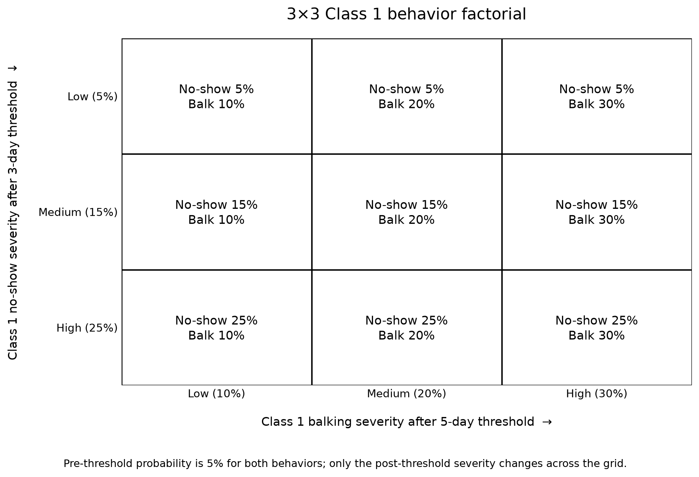

The figure above contains the complete 3×3 behavior design, so the cell values are not repeated in a second table.

The **activation thresholds remain fixed**:

- No-show threshold: **3 days**
- Balking threshold: **5 days**
- Pre-threshold no-show probability: **5%**
- Pre-threshold balking probability: **5%**

This is the key identification feature of the redesign. Moving **vertically** through the grid isolates no-show severity. Moving **horizontally** isolates balking severity. Comparing the slopes across rows identifies whether the two behaviors interact.

Each of the 3×3 behavior cells is evaluated against its **own matched baseline** with the same behavior values, demand, Class 1 share, and capacity. The only difference in the baseline comparison is that the baseline policy has no horizon optimization and no reservations.

## Other problem parameters and policy regimes

Class 2 is held **fixed throughout all 3×3 Class 1 behavior changes**. Only Class 1 no-show and balking severity vary across the design.

| Parameter | Value(s) |
|---|---|
| Demand-to-capacity ratio, $\rho$ | 1.2, 1.4, 1.7, 2.0, 2.5, 3.0 |
| Class 1 share of arrivals | 0.1, 0.3, 0.5, 0.7, 0.9 |
| Daily capacity | 30, 50 |
| Class 1 cancellation probability | 20% |
| **Class 2 no-show rule** | Threshold 14 days; 5% before threshold, 15% after |
| **Class 2 balking rule** | Threshold 16 days; 5% before threshold, 15% after |
| **Class 2 cancellation probability** | 20% |
| Search seeds | 5 paired seeds |
| Independent evaluation seeds | 10 paired seeds |
| Bootstrap | 2,000 paired resamples |

Thus, when Class 1 moves from low to medium to high no-show or balking severity, the Class 2 behavioral process is unchanged. This makes Class 2 a fixed reference population while the experiment isolates Class 1 behavior.

The 3×3 behavior cells are crossed with the six demand levels, five Class 1 shares, and two capacities, producing **540 backgrounds** in total and **450 backgrounds** in the headline range $\rho\le2.5$.

Four policy regimes are evaluated:

| Policy | Booking horizon | Reservation |
|---|---|---|
| Baseline | Effectively open, 100 days | None |
| Horizon only | Optimized over 2–26 days | None |
| Reservation only | Effectively open, 100 days | Quantity/window optimized |
| Both flexible | Optimized over 2–26 days | Quantity/window optimized |

# Overall summary

Each point in the detailed figures below is a **policy effect relative to the no-policy baseline within the same behavior cell and clinic context**. In other words, for a given no-show/balking scenario, demand level, Class 1 share, and capacity, we compare the optimized policy to the baseline policy with:

- effectively open booking horizon (100 days), and
- no reservations.

So the low/medium/high behavior cells are **not** being compared to the low/low cell. Each cell has its own matched baseline.

Across the full headline range, the overall central tendency is still useful as a high-level summary:

| Policy | Median change | Mean change |
|---|---:|---:|
| Horizon only | +0.03 pp | **+0.87 pp** |
| Reservation only | +0.03 pp | **+0.53 pp** |
| Both flexible | +0.06 pp | **+0.87 pp** |

The mean is much larger than the median because policy value is concentrated in congested backgrounds.

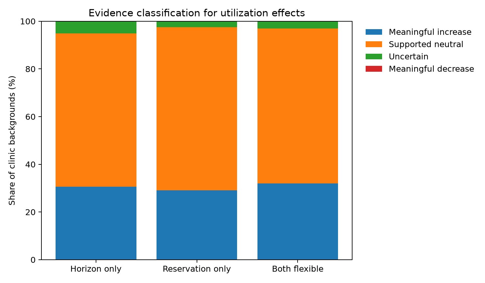

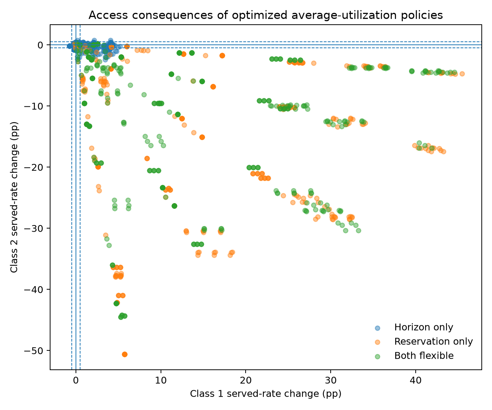

This scatterplot shows the access consequences of the optimized average-utilization policies. The x-axis is the change in **Class 1 served rate** and the y-axis is the change in **Class 2 served rate**, both relative to the matched no-policy baseline in the same clinic background. The dashed lines mark the ±0.5 percentage-point practical band.


## Win-win and win/neutral cases

As in the earlier expanded average-utilization analysis, the class-specific access effects are also classified using the **±0.5 percentage-point practical band** and the 95% confidence intervals from the independent evaluation seeds:

- **Win-win:** both Class 1 and Class 2 improve by at least +0.5 pp, and both 95% CIs are above zero.
- **Class 1 win / Class 2 neutral:** Class 1 improves by at least +0.5 pp with its 95% CI above zero, while the entire Class 2 95% CI lies within ±0.5 pp.
- **Class 2 win / Class 1 neutral:** the symmetric case for Class 2.
- **Both neutral:** both classes' 95% CIs lie entirely within ±0.5 pp.
- The table also retains the gain/harm and uncertain/mixed categories so the win/neutral rates are not interpreted without the competing access tradeoffs.

```{python}
#| label: tbl-access-classification
#| tbl-cap: "Class-specific access classification for average-utilization-optimal policies, headline range (rho <= 2.5)."
display(
    access_classification.style
    .format({
        c: "{:.1f}%"
        for c in access_classification.columns
        if c != "Policy"
    })
    .hide(axis="index")
)
```

Supported win-win cases are absent in the headline range. The small **Class 1 win / Class 2 neutral** rates under reservation-based policies are therefore worth inspecting directly rather than summarizing only as percentages.

### Exact reservation-based win/neutral backgrounds

The table below lists **every** headline-range background classified as **Class 1 win / Class 2 neutral** for **reservation-only** or **both-flexible**. It focuses on the **conditions under which these cases occur**: the Class 1 behavior cell, demand level, Class 1 share, capacity, and the selected policy settings.

```{python}
#| label: tbl-reservation-win-neutral-details
#| tbl-cap: "Exact reservation-based Class 1 win / Class 2 neutral backgrounds."
if len(win_neutral_detail) == 0:
    display(pd.DataFrame({"Result": ["No reservation-based win/neutral cases found."]}))
else:
    display(
        win_neutral_detail.style
        .hide(axis="index")
    )
```

### Similarities across the win/neutral cases

The exact-case table is useful for inspection, but the next summary makes repeated conditions easier to see. For each policy and characteristic, it reports the **most common value** and the share of win/neutral cases with that value.

```{python}
#| label: tbl-win-neutral-similarities
#| tbl-cap: "Most common characteristics among reservation-based Class 1 win / Class 2 neutral cases."
if len(win_neutral_similarity) == 0:
    display(pd.DataFrame({"Result": ["No reservation-based win/neutral cases found."]}))
else:
    display(
        win_neutral_similarity.style
        .hide(axis="index")
    )
```

```{python}
#| label: txt-win-neutral-patterns
if common_pattern_markdown:
    display(Markdown(common_pattern_markdown))
```

A **100%** entry means every win/neutral case for that policy shares that characteristic. A lower percentage means the win/neutral result occurs across multiple values. Because reservation-only has very few win/neutral cases, its repeated-value percentages should not be interpreted as broad evidence unless there is more than one case.

This table is the direct answer to where the **0.2% reservation-only** and **2.0% both-flexible** win/neutral rates come from. A row appears only when:

- Class 1 gains at least **+0.5 pp** and its 95% CI is above zero; and
- the entire Class 2 95% CI remains inside the **±0.5 pp neutral band**.

All comparisons are relative to the **matched no-policy baseline within the same behavior cell and clinic context**.

# The 3×3 behavior response within each policy

These figures follow the factorial directly:

- **x-axis:** balking severity, low → medium → high;
- **separate lines:** no-show severity, low / medium / high;
- **separate figure:** each policy.

A flat line means changing balking severity has little effect at that no-show level. Vertical separation between the three lines means no-show severity changes policy value.

## Horizon only

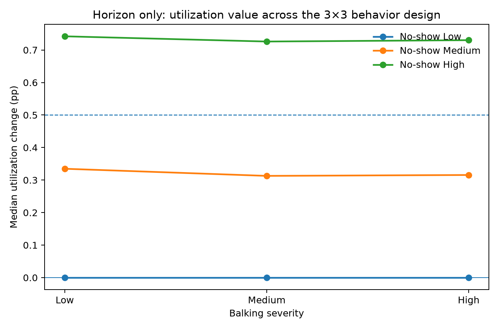

Median utilization gain:

| No-show severity | Balk low | Balk medium | Balk high |
|---|---:|---:|---:|
| Low | 0.00 pp | 0.00 pp | 0.00 pp |
| Medium | +0.33 pp | +0.31 pp | +0.32 pp |
| High | **+0.74 pp** | **+0.73 pp** | **+0.73 pp** |

The three no-show profiles are clearly separated. Within each profile, however, the balking line is almost flat.

**Interpretation:** once the booking delay reaches the no-show threshold, higher no-show severity creates progressively more utilization loss that a shorter horizon can prevent. Increasing balking severity from 10% to 30% does not create the same utilization opportunity.

## Reservation only

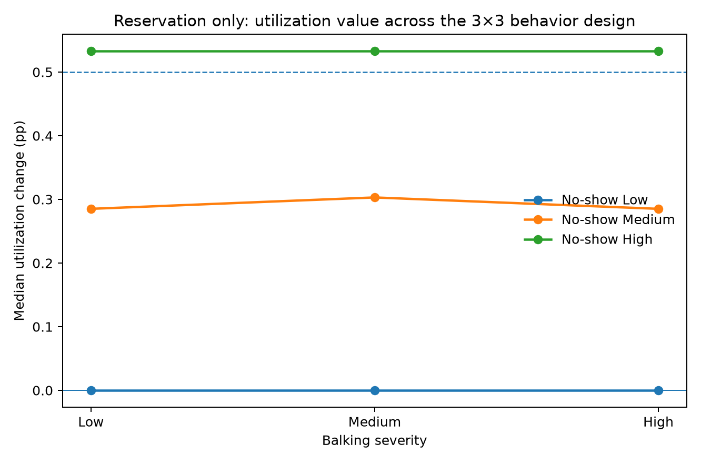

| No-show severity | Balk low | Balk medium | Balk high |
|---|---:|---:|---:|
| Low | 0.00 pp | 0.00 pp | 0.00 pp |
| Medium | +0.29 pp | +0.30 pp | +0.29 pp |
| High | **+0.53 pp** | **+0.53 pp** | **+0.53 pp** |

Reservation-only shows the same factorial structure, although the utilization gain is smaller than under horizon flexibility at high no-show severity.

The important point is that the result is again **row-driven rather than column-driven**: no-show severity changes the level of the curve; balking severity barely changes its slope.

## Both flexible

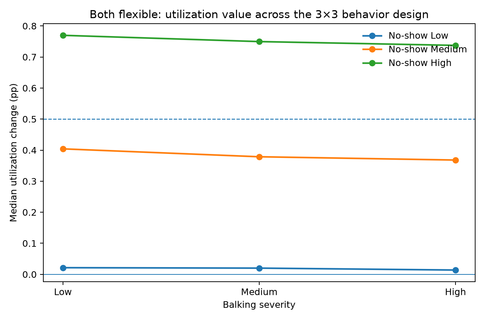

| No-show severity | Balk low | Balk medium | Balk high |
|---|---:|---:|---:|
| Low | +0.02 pp | +0.02 pp | +0.01 pp |
| Medium | +0.40 pp | +0.38 pp | +0.37 pp |
| High | **+0.77 pp** | **+0.75 pp** | **+0.74 pp** |

Both-flexible reproduces the same pattern. The policy receives most of its utilization value from the ability to control delay when no-show risk rises with delay.

# Demand activates the behavioral differences

The 3×3 behavior effects matter only if the system generates delays long enough for the 3-day no-show and 5-day balking thresholds to become relevant.

For each policy, the figure below combines **all six sensitivity profiles**:

- **blue = no-show behavior**;
- **orange = balking behavior**;
- **circle / square / triangle and dotted / dashed / solid lines = low / medium / high severity**.

For the no-show curves, each point averages across the three balking levels. For the balking curves, each point averages across the three no-show levels. This lets the two behavioral mechanisms be compared directly within the same policy and demand regime while keeping behavior and severity visually distinct.

## Horizon only

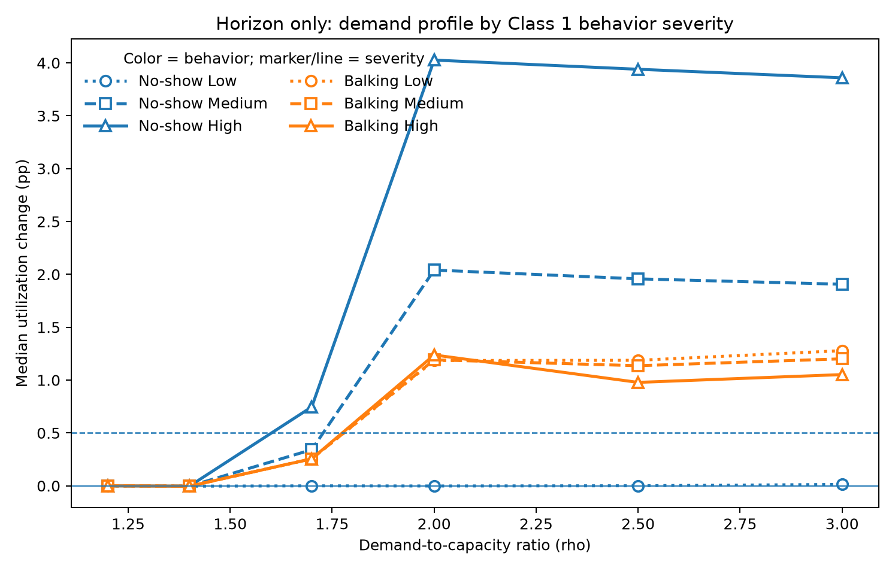

The no-show profiles separate as congestion rises, while the balking profiles remain much closer together. This is the clearest visual indication that the utilization value of horizon control is driven primarily by delay-sensitive no-show risk rather than by comparable changes in balking severity.

## Reservation only

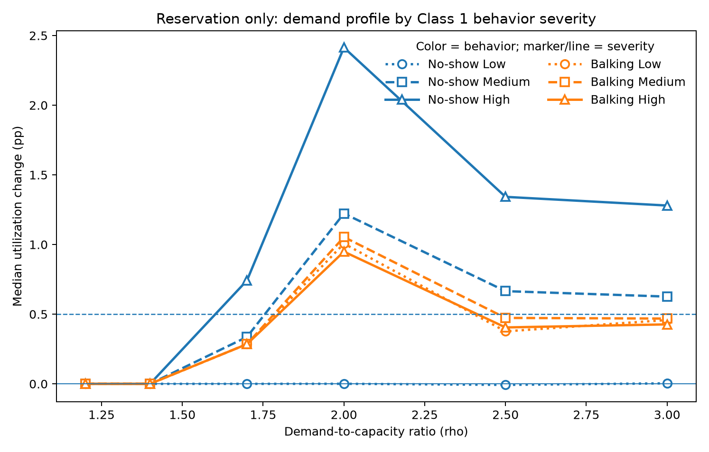

Reservation-only shows the same qualitative contrast, although its aggregate utilization benefit is weaker than horizon flexibility under heavy congestion.

## Both flexible

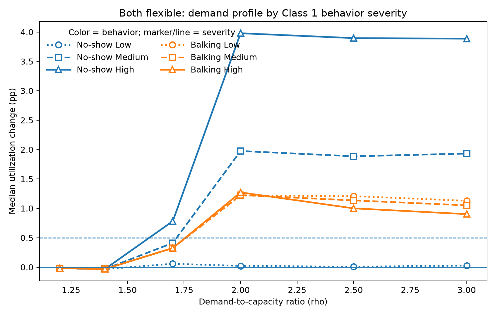

The combined policy again shows much stronger separation across no-show severity than across balking severity. This indicates that most of the additional utilization value associated with patient behavior is still tied to the no-show mechanism.

# Factorial contrasts: which patient characteristic changes policy value?

The matched low-to-high contrasts provide a formal summary of the patterns above:

| Policy | Characteristic changed | Change in policy's utilization value |
|---|---|---:|
| Horizon only | No-show low → high | **+2.11 pp** |
| Horizon only | Balking low → high | −0.03 pp |
| Reservation only | No-show low → high | **+1.18 pp** |
| Reservation only | Balking low → high | −0.02 pp |
| Both flexible | No-show low → high | **+2.11 pp** |
| Both flexible | Balking low → high | −0.03 pp |

The no-show × balking interaction in utilization is also very small: approximately **−0.05 to −0.06 pp** across the three policies.

This yields three distinct conclusions:

1. **No-show severity changes the utilization value of policy.**
2. **Balking severity does not have a comparable main effect on utilization.**
3. **The no-show effect is largely stable across balking levels.**

These are effects on **policy value relative to baseline**, not raw differences in patient outcomes across behavior groups.

# How the optimizer changes the policy across the 3×3 design

The factorial should affect not only outcomes but also the policy selected by the optimizer. The next figures use the same presentation as the outcome figures: balking on the x-axis, no-show as separate lines, and policies shown separately.

## Selected booking horizon

### Horizon only

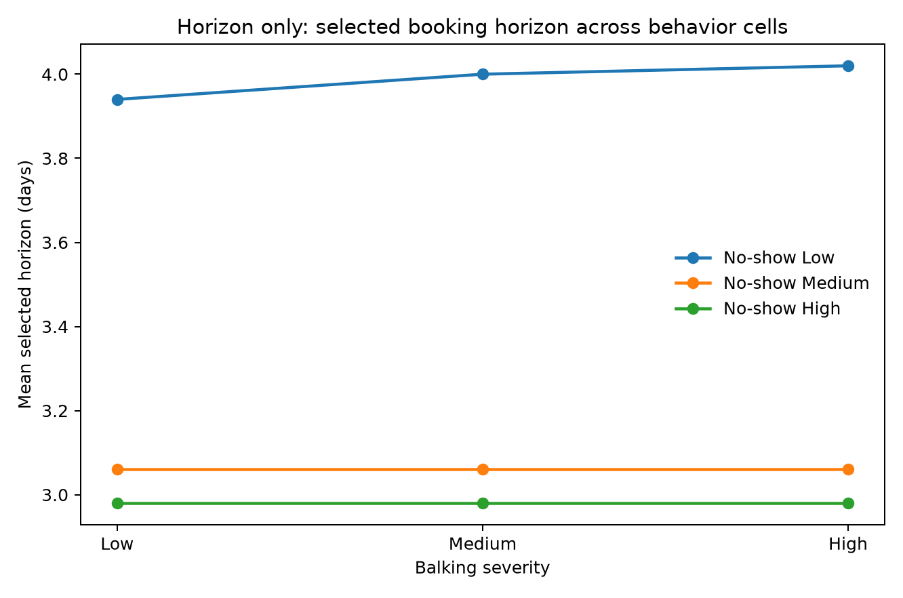

For horizon-only, the **average selected horizon** falls from **3.99 days** under low no-show severity to **3.06 days** under medium and **2.98 days** under high no-show severity.

The most important visual check is whether the curves are separated vertically by no-show severity but remain relatively flat across balking severity. That pattern would show that the optimizer responds specifically to the no-show mechanism rather than merely to generic patient attrition.

### Both flexible

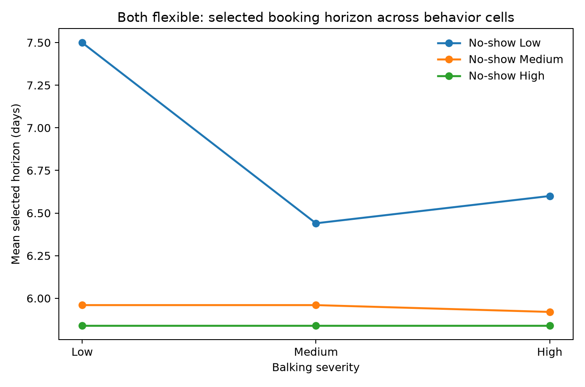

Both-flexible also shifts toward shorter horizons as no-show severity rises: the **average selected horizon** falls from **6.85 days** under low no-show severity to **5.95 days** under medium and **5.84 days** under high severity. Its horizon remains longer than under horizon-only because the reservation mechanism gives the optimizer an additional lever.

# Access consequences by behavior cell

Average-utilization optimization is not access-neutral. The figures below apply the same 3×3 decomposition to Class 1 and Class 2 served rates.

Because some low/medium/high profiles are nearly identical, the access figures use **different markers, line styles, and very small horizontal display offsets**. The offsets are only for visibility; every point still corresponds to the same low, medium, or high balking level. This prevents one profile from disappearing behind another when the values overlap.

## Horizon only

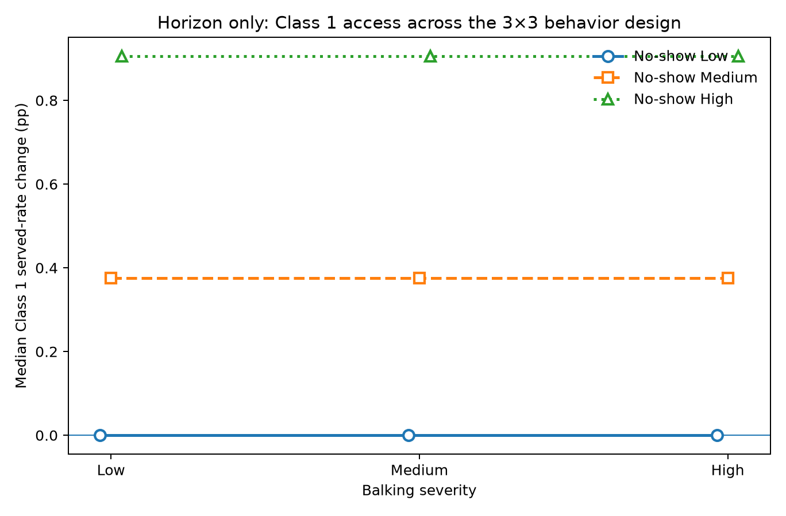

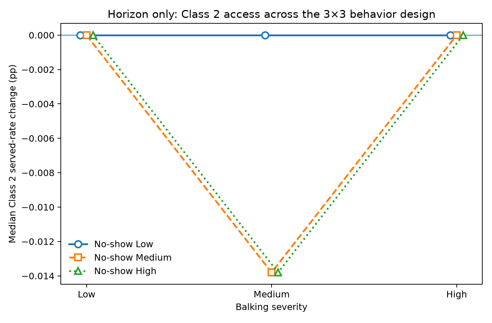

In the pooled main-range results, horizon-only has a median Class 1 served-rate change of approximately **+0.1 pp** and a median Class 2 change near **0.0 pp**. The behavior-specific figures show whether those near-zero pooled medians conceal particular cells with larger class-specific effects.

## Reservation only

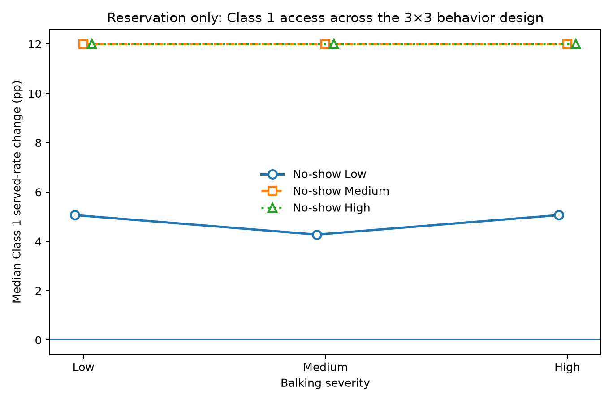

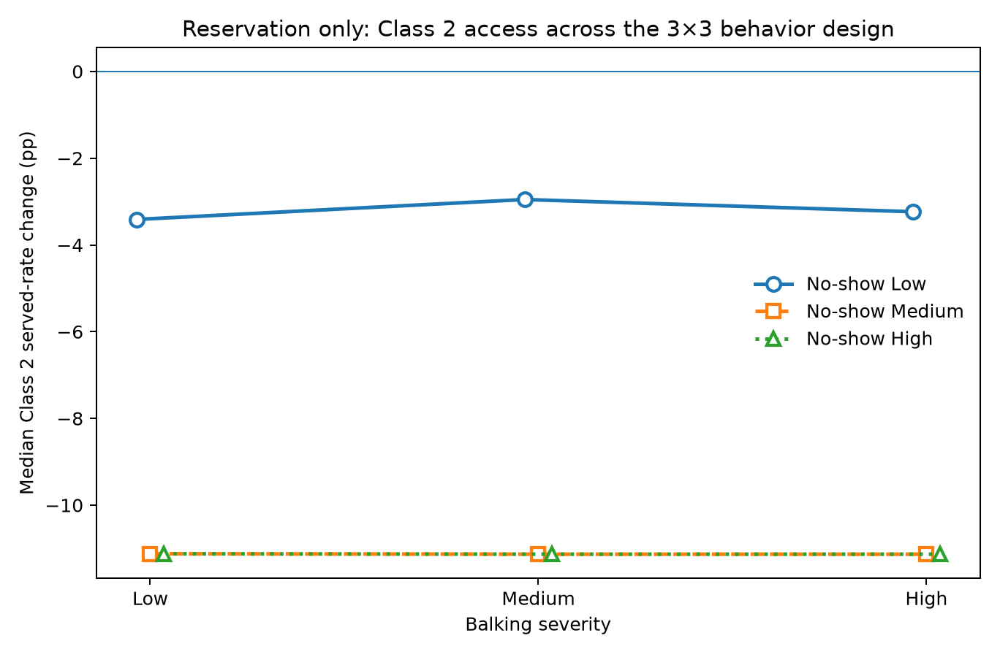

Across all main-range backgrounds, reservation-only produces a median **+8.3 pp** change for Class 1 and **−8.5 pp** for Class 2.

The detailed figures should be read jointly: a behavior cell in which Class 1 rises sharply while Class 2 falls sharply is primarily an **access redistribution** result, even if average utilization is positive.

## Both flexible

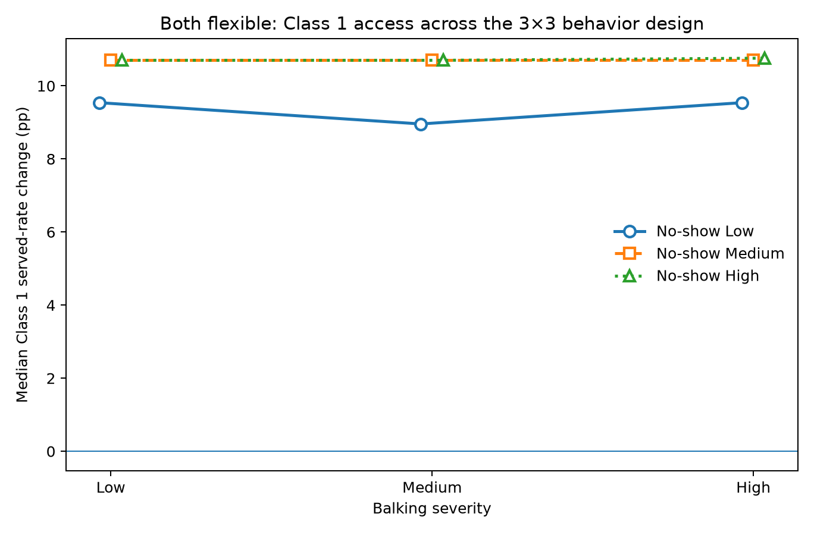

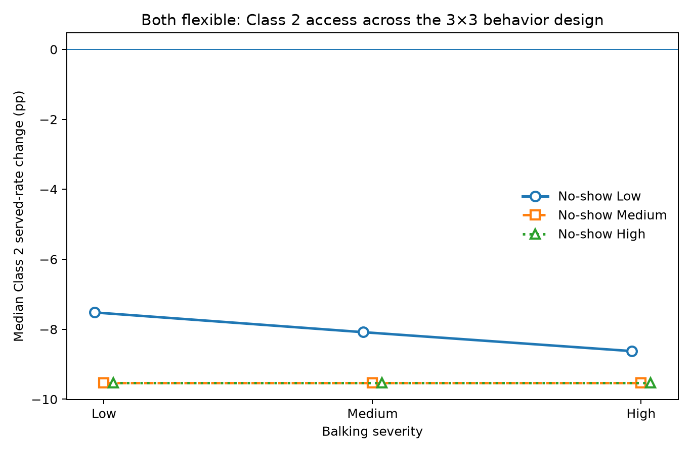

Both-flexible produces an even larger pooled redistribution: median Class 1 access rises by **10.2 pp**, while median Class 2 access falls by **9.5 pp**.

This is why the utilization-optimal reservation solution should not automatically be interpreted as the clinic's preferred access policy.

# Class 1 share and displacement

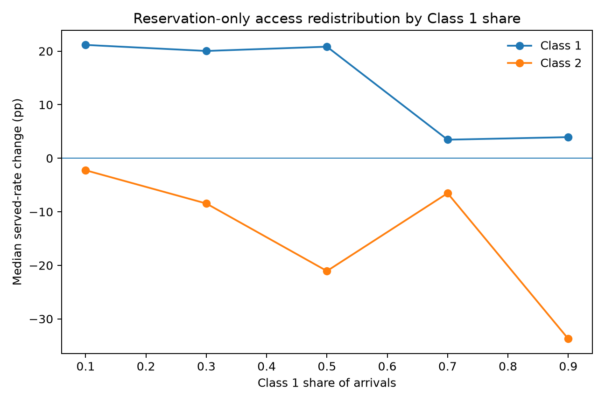

For reservation-only versus baseline:

| Class 1 share | Median $\Delta U$ | Median Class 1 change | Median Class 2 change |
|---:|---:|---:|---:|
| 0.1 | +0.03 pp | **+21.16 pp** | −2.25 pp |
| 0.3 | +0.03 pp | **+20.04 pp** | −8.45 pp |
| 0.5 | 0.00 pp | **+20.83 pp** | **−21.06 pp** |
| 0.7 | +0.03 pp | +3.46 pp | −6.53 pp |
| 0.9 | +0.05 pp | +3.94 pp | **−33.72 pp** |

The exact relationship is not monotone because the optimizer changes the amount of protection across clinic contexts. The central result is nevertheless clear: **large Class 1 access gains can coexist with almost no change in clinic-wide utilization and substantial Class 2 displacement**.

# Main findings from the factorial experiment

## 1. No-show severity is the dominant behavioral driver of utilization policy value

Increasing post-threshold no-show probability from 5% to 25% materially increases the value of horizon-only, reservation-only, and both-flexible optimization. The effect is visible as vertical separation between the low-, medium-, and high-no-show profiles.

## 2. Balking severity has little direct effect on average utilization

Across each no-show level, moving from low to high balking produces very little change in the utilization benefit of the optimized policies. The lines across balking levels are nearly flat.

## 3. The no-show × balking utilization interaction is small

The no-show effect remains similar at low, medium, and high balking severity. In other words, higher balking does not materially amplify or suppress the utilization benefit created by higher no-show risk.

## 4. Congestion is required for the behavioral differences to become operationally relevant

At $\rho=1.2$ and $1.4$, optimized policies have almost no utilization value. Benefits emerge around $\rho=1.7$ and become substantial around $\rho=2.0$–$2.5$, when offered delays more frequently cross the behavioral thresholds.

## 5. The optimizer responds to no-show risk by shortening the booking horizon

The policy-parameter figures provide a mechanism check: higher no-show severity produces shorter selected horizons, whereas changing balking severity has little effect on horizon-only selections.

## 6. Reservation policies should be interpreted primarily as access-prioritization mechanisms

Their class-specific effects are much larger than their aggregate utilization effects. They substantially increase Class 1 served rates while reducing Class 2 served rates in many backgrounds.

# Clinic-facing conclusions

- **First identify whether the clinic is congested enough for delay-sensitive behavior to activate.** If offered delays rarely cross the behavioral thresholds, changing the scheduling policy has little utilization value.

- **If no-show risk rises materially with appointment delay, reducing the booking horizon is the clearest utilization intervention.** This result survives across all three balking levels.

- **Do not treat balking and no-show as interchangeable forms of attrition.** Their positions in the scheduling process produce different capacity consequences.

- **Use reservations when the clinic explicitly values Class 1 access, not simply because reservations appear in the average-utilization optimum.** Their strongest effect is often redistribution rather than additional completed service.

- **Inspect the behavior cell rather than relying only on the pooled policy average.** The 3×3 factorial shows that the same policy can be operationally inactive in low-no-show cells and materially valuable in high-no-show cells.

- **The current factorial design provides cleaner behavioral evidence than the earlier bundled profiles.** Threshold timing is held fixed, so the low/medium/high comparison isolates severity rather than simultaneously changing when the behavior begins.

---

Primary data inputs:

- `full_run_summaries/patient_behavior_factorial_3_5/release/selected_policy_outcomes.csv`
- `full_run_summaries/patient_behavior_factorial_3_5/release/pairwise_policy_deltas.csv`
- `full_run_summaries/patient_behavior_factorial_3_5/release/factorial_contrasts_overall.csv`

This report treats the 3-day no-show / 5-day balking factorial as the primary patient-behavior analysis.
