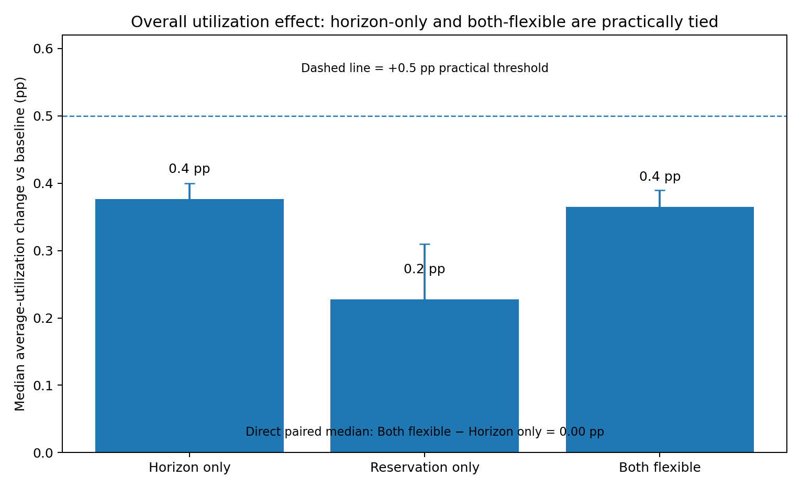
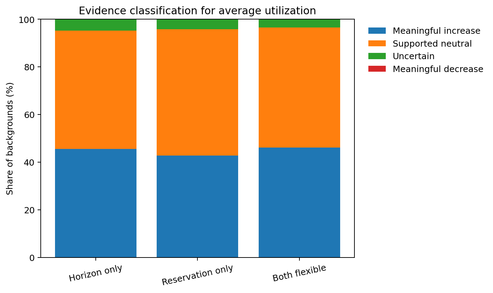
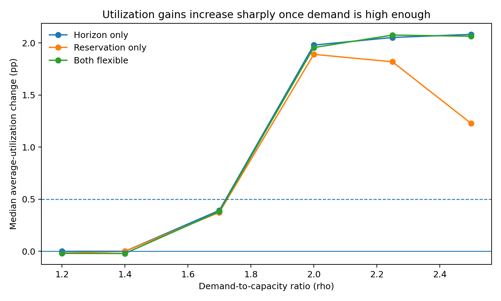
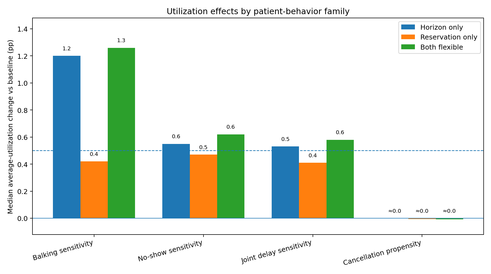
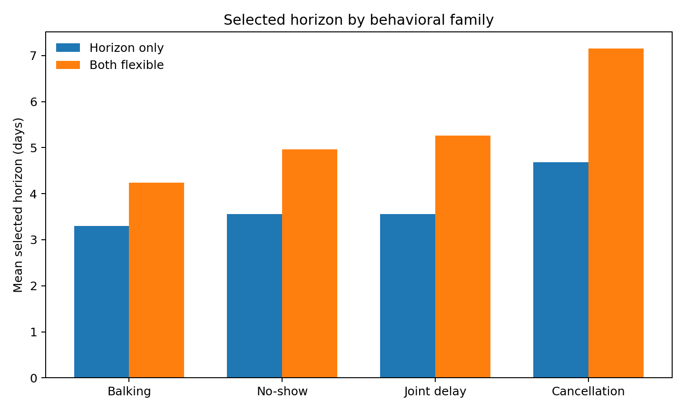
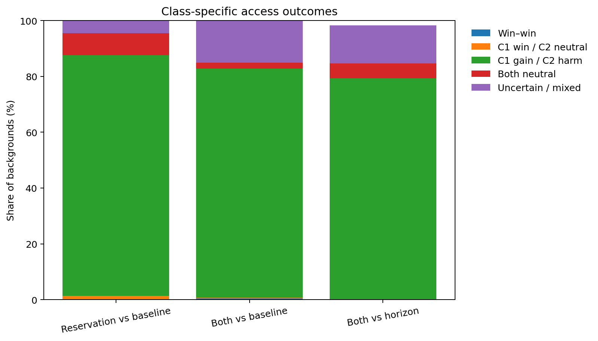
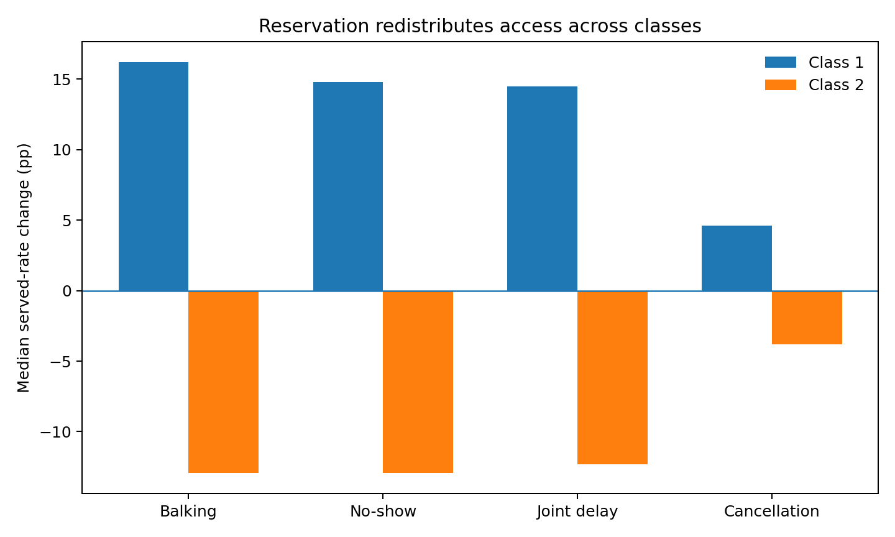
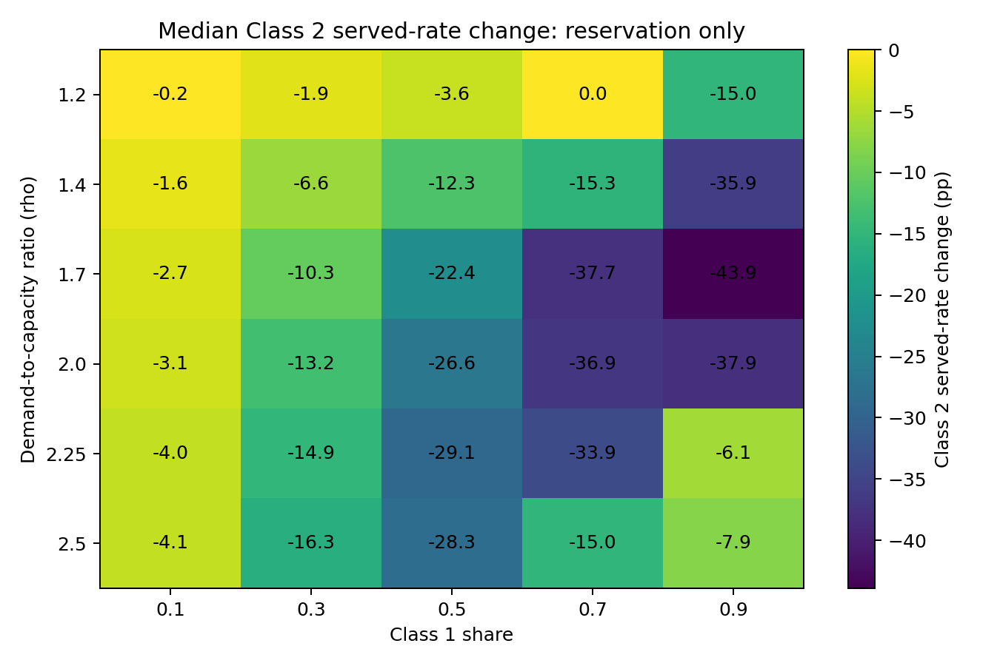
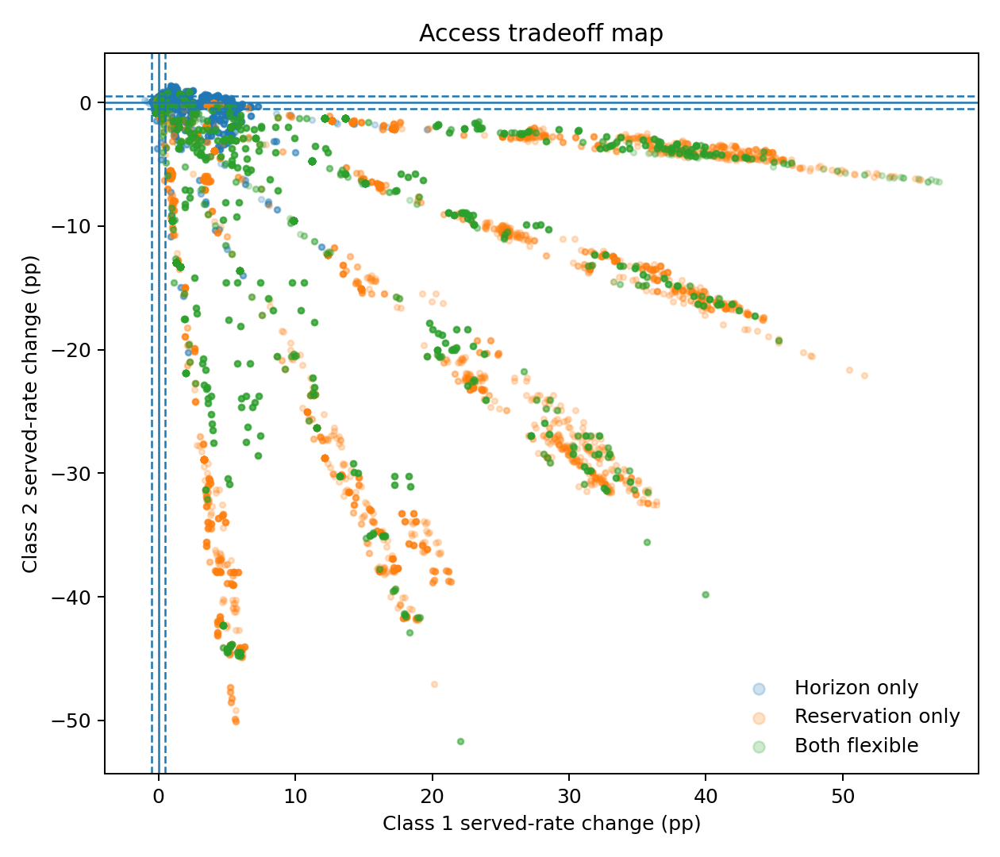

This is the **primary average-utilization analysis going forward**. It uses the expanded experiment directly, including the added demand ratio $\rho=2.25$ and the very-strong delay-sensitive profiles.

Average utilization is the share of measured appointment capacity that becomes completed visits:

$$
U=\frac{Y_1+Y_2}{M},
$$

where $Y_1$ and $Y_2$ are completed Class 1 and Class 2 visits and $M$ is measured appointment capacity.

The main analysis uses demand-to-capacity ratios **1.2, 1.4, 1.7, 2.0, 2.25, and 2.5**. The ratio **3.0** remains a heavy-demand stress condition.

# Simulation overview

The expanded experiment contains **5,670 clinic backgrounds** from **27 behavioral profiles** and 210 clinic contexts per profile. Seven same-behavior profiles are retained as matched controls.

**All headline medians, means, percentages, heatmaps, and evidence classifications exclude the same-behavior controls.** Headline results use:

- **3,600 heterogeneous backgrounds** in the main demand range ($\rho\leq2.5$).
- **600 heterogeneous backgrounds** at $\rho=3.0$.
- **20 heterogeneous behavioral profiles**, including mild, strong, and very-strong delay-sensitive profiles.
- Same-behavior profiles only as matched controls.

Five paired search seeds select policy cells. Ten independent evaluation seeds estimate how those frozen selections perform out of sample. Pairwise confidence intervals use **2,000 paired bootstrap resamples**.

The independent evaluation stage is important because the optimizer searches many candidate cells. Reporting the same five search seeds would favor cells that happened to look best in those particular simulations. The ten new seeds measure whether the selected policy's performance reproduces on new simulation draws.

**Behavioral severity definitions.** The labels **mild, strong, and very strong** describe the Class 1 behavioral setting relative to the matched Class 2 reference. For delay-sensitive behavior, $(T,p_{\leq T},p_{>T})$ gives the delay threshold, the probability at or below the threshold, and the probability above it.

| Behavioral family | Mild Class 1 | Strong Class 1 | Very-strong Class 1 |
|---|---|---|---|
| Balking sensitivity | $(6,0.05,0.20)$ | $(4,0.05,0.25)$ | $(4,0.05,0.30)$ |
| No-show sensitivity | $(5,0.05,0.20)$ | $(3,0.05,0.25)$ | $(3,0.05,0.30)$ |
| Joint delay sensitivity | Balking $(6,0.05,0.20)$ and no-show $(5,0.05,0.20)$ | Balking $(4,0.05,0.25)$ and no-show $(3,0.05,0.25)$ | Balking $(4,0.05,0.30)$ and no-show $(3,0.05,0.30)$ |
| Cancellation propensity | Class 1 cancellation $0.20$ | Class 1 cancellation $0.30$ | Not included |

For balking, no-show, and joint-delay families, Class 2 has either a **low** or **moderate** reference setting. The balking references are $(16,0.05,0.15)$ and $(9,0.05,0.20)$; the no-show references are $(14,0.05,0.15)$ and $(8,0.05,0.20)$. In the cancellation family, Class 2 cancellation is $0.10$. The seven **same** profiles make Class 1 match the corresponding Class 2 reference and are used only as controls, not in headline medians.

## Problem parameters

| Component | Values |
|---|---|
| Demand-to-capacity ratio | 1.2, 1.4, 1.7, 2.0, **2.25**, 2.5, 3.0 |
| Class 1 share | 0.1, 0.3, 0.5, 0.7, 0.9 |
| Daily capacity | 30, 50 |
| Native booking horizon | 10, 14, 22 days |
| Behavioral profiles | 27 total: 20 heterogeneous + 7 matched controls |
| Search horizon | 2, 4, 6, ..., **30 days** |
| Search seeds | 5 paired seeds |
| Evaluation seeds | 10 independent paired seeds |
| Bootstrap | 2,000 paired draws |
| Primary practical-neutral band | **±0.5 percentage points** |

Behavior uses a threshold rule $(T,p_{\leq T},p_{>T})$. The very-strong profiles retain the strong threshold but raise the post-threshold probability from **0.25 to 0.30**.

## Policy regimes

| Policy | Horizon | Reservations |
|---|---|---|
| Baseline | Native horizon | None |
| Horizon only | Optimized | None |
| Reservation only | Native horizon | Quantity and window optimized |
| Both flexible | Optimized | Quantity and window optimized |

Unused protected capacity is released to the pooled system on the service day.

**Evidence classification** uses the independent evaluation seeds:

- **Meaningful utilization increase:** point estimate at least +0.5 pp and 95% CI above zero.
- **Meaningful utilization decrease:** point estimate at most −0.5 pp and 95% CI below zero.
- **Supported neutral:** entire 95% CI lies within ±0.5 pp.
- **Uncertain:** neither of the above is supported.

For example, an estimate of **+0.3 pp with a 95% CI from −0.1 to +0.8 pp** is uncertain: the estimate is below the +0.5 pp meaningful threshold, but the interval is too wide to establish practical neutrality.

# Overall result

| Policy | Median change from baseline | 95% bootstrap interval for median |
|---|---:|---:|
| Horizon only | **+0.4 pp** | +0.29 to +0.40 pp |
| Reservation only | **+0.2 pp** | +0.16 to +0.31 pp |
| Both flexible | **+0.4 pp** | +0.29 to +0.39 pp |

**Horizon only and both flexible should be interpreted as tied for average utilization.** Their unrounded baseline-relative medians are +0.376 pp and +0.365 pp, but the direct paired comparison of **both flexible minus horizon only has median 0.00 pp**, and all **3,600** headline backgrounds are classified as supported neutral for that direct utilization comparison.

This does not contradict the optimization structure. During the five search seeds, both-flexible weakly dominates horizon-only because $Q=0$ is available and reproduces a horizon-only policy. After the cells are frozen, the ten independent evaluation seeds can make two practically equivalent cells reverse by a few hundredths of a percentage point. The graph therefore reports the result at a precision appropriate to the ±0.5 pp practical threshold rather than visually ranking a 0.01 pp difference.

| Policy vs baseline | Meaningful increase | Supported neutral | Uncertain | Meaningful decrease |
|---|---:|---:|---:|---:|
| Horizon only | **45.5%** | 49.7% | 4.8% | 0.0% |
| Reservation only | **42.7%** | 53.1% | 4.2% | 0.0% |
| Both flexible | **46.2%** | 50.4% | 3.4% | 0.0% |

Almost half of heterogeneous main-range backgrounds show a **meaningful utilization increase** under horizon-only or both-flexible optimization. No policy has a headline background classified as a meaningful utilization decrease.

At the $\rho=3.0$ stress condition:

- Horizon only: median **+2.14 pp**; **89.3%** meaningful increase.
- Reservation only: median **+1.69 pp**; **69.3%** meaningful increase.
- Both flexible: median **+2.15 pp**; **89.3%** meaningful increase.

# Demand is the central utilization regime

| Demand ratio $\rho$ | Horizon only | Reservation only | Both flexible |
|---:|---:|---:|---:|
| 1.20 | 0.00 pp | −0.02 pp | −0.02 pp |
| 1.40 | 0.00 pp | 0.00 pp | −0.02 pp |
| 1.70 | +0.39 pp | +0.37 pp | +0.38 pp |
| 2.00 | **+1.98 pp** | **+1.89 pp** | **+1.96 pp** |
| **2.25** | **+2.05 pp** | **+1.82 pp** | **+2.08 pp** |
| 2.50 | **+2.08 pp** | **+1.23 pp** | **+2.06 pp** |

The key break occurs between moderate and high congestion. At $\rho=1.2$ or 1.4, there is enough slack that changing the booking policy cannot create many additional completed visits. Around $\rho=1.7$, benefits begin to appear. At $\rho=2.0$ through 2.5, the median gain from horizon optimization is roughly **2 percentage points**.

The added **$\rho=2.25$** setting confirms that the high-demand utilization gain persists through the intermediate congestion level.

# Patient behavior determines how much utilization can be recovered

| Behavioral family | Horizon only | Reservation only | Both flexible |
|---|---:|---:|---:|
| Balking sensitivity | **+1.2 pp** | +0.4 pp | **+1.3 pp** |
| No-show sensitivity | +0.6 pp | +0.5 pp | +0.6 pp |
| Joint delay sensitivity | +0.5 pp | +0.4 pp | +0.6 pp |
| Cancellation propensity | **0.0 pp** | **≈0.0 pp** | **≈0.0 pp** |

The cancellation result should be read as **no utilization effect**, not as a negative effect. The unrounded independent-evaluation medians are −0.0066 pp for reservation only and −0.0091 pp for both flexible. Those values are negligible relative to the ±0.5 pp practical threshold:

- Horizon only: **360/360** cancellation backgrounds supported neutral.
- Reservation only: **359/360** supported neutral and one uncertain.
- Both flexible: **357/360** supported neutral and three uncertain.
- **Zero** cancellation backgrounds show a meaningful utilization decrease.

The tiny negative medians arise because many nearly equivalent policy cells are being reevaluated on new seeds. They are not evidence that optimizing the policy reduces utilization.

The mechanisms differ:

- **Balking:** shortening delay can keep more patients in the system; under high demand, retained patients can fill capacity.
- **No-show:** reducing delay can prevent unused appointment slots, so stronger post-threshold no-show behavior increases the value of horizon control.
- **Joint delay sensitivity:** combines both channels.
- **Cancellation:** cancellation probability is not delay-dependent, and future cancellations reopen capacity. The policy therefore has little systematic utilization opportunity to recover.

Within no-show and joint-delay profiles, the utilization gain rises materially from mild to strong and very-strong severity under horizon-only optimization:

| Family | Mild | Strong | Very strong |
|---|---:|---:|---:|
| No-show sensitivity | +0.04 pp | +0.87 pp | **+1.08 pp** |
| Joint delay sensitivity | +0.04 pp | +0.70 pp | **+0.92 pp** |
| Balking sensitivity | +1.20 pp | +1.17 pp | +1.20 pp |

Raising post-threshold no-show risk makes horizon control more valuable because no-shows waste realized capacity. Increasing post-threshold balking severity does not produce the same monotonic utilization increase because a patient who balks can often be replaced when demand is high.

# Which horizons are selected?

| Behavioral family | Horizon only: median / mean | Both flexible: median / mean |
|---|---:|---:|
| Balking sensitivity | 4 / 3.3 days | 4 / 4.2 days |
| No-show sensitivity | 4 / 3.6 days | 4 / 5.0 days |
| Joint delay sensitivity | 4 / 3.6 days | 4 / 5.3 days |
| Cancellation propensity | 4 / 4.7 days | 6 / 7.2 days |

For balking, no-show, and joint-delay sensitivity, the **median selected horizon is the same: 4 days**. Joint delay does not typically choose a longer horizon than the other delay-sensitive families. Its mean is slightly higher because a small minority of backgrounds select much longer horizons, pulling up the average.

Extending the candidate grid to 30 days does not materially change the average-utilization solution: horizon only never selects $H\geq28$ in headline main-range backgrounds, and both flexible does so in only about **0.4%** of backgrounds.

# Reservations: utilization benefit versus access redistribution

Reservations can improve average utilization in high-demand, delay-sensitive backgrounds, but they remain a much stronger **access-allocation mechanism** than a pure utilization mechanism.

| Comparison | Win–win | C1 win / C2 neutral | C1 gain / C2 harm | Both neutral | Uncertain / mixed |
|---|---:|---:|---:|---:|---:|
| Reservation only vs baseline | 0.0% | 1.3% | **86.3%** | 7.8% | 4.6% |
| Both flexible vs baseline | 0.5% | 0.2% | **82.1%** | 2.0% | 15.1% |
| Both flexible vs horizon only | 0.0% | 0.1% | **79.1%** | 5.4% | 13.7% |

For reservation only versus baseline, median effects are:

- Average utilization: **+0.23 pp**.
- Class 1 served rate: **+14.4 pp**.
- Class 2 served rate: **−12.3 pp**.

This disparity is central: reservations can substantially change **who receives service** while changing total completed visits much less.

## When can reservations help Class 1 without materially hurting Class 2?

The favorable categories are rare and concentrated in specific environments. The table below reports both the **baseline served-rate level** and the served rate under the selected policy, so the size of the improvement can be interpreted relative to starting access.

| Favorable case | $n$ | Baseline C1 served rate | Policy C1 served rate | Baseline C2 served rate | Policy C2 served rate | Median $\Delta U$ |
|---|---:|---:|---:|---:|---:|---:|
| Reservation only: C1 win / C2 neutral | 48 | 79.17% | **83.18%** | 78.80% | 78.73% | +0.03 pp |
| Both flexible: win-win, $Q=0$ | 12 | 45.47% | **47.35%** | 46.59% | **47.36%** | +1.95 pp |
| Both flexible: win-win, $Q=11$ | 6 | 46.49% | **48.13%** | 46.49% | **47.14%** | +1.96 pp |
| Both flexible: C1 win / C2 neutral, balking cases | 6 | 45.64% | **48.13%** | 47.17% | 47.14% | +1.88 pp |
| Both flexible: C1 win / C2 neutral, cancellation cases | 3 | 50.23% | **52.04%** | 75.09% | 74.91% | +0.09 pp |

**Reservation only: Class 1 win / Class 2 neutral — 48 of 3,600 backgrounds (1.3%).**

- **47 of 48** occur at $\rho=1.2$, Class 1 share **0.1**, and capacity **50**.
- Median Class 1 served rate rises from **79.17% to 83.18%**. Median Class 2 served rate is essentially unchanged, **78.80% to 78.73%**.
- The mechanism is slack capacity plus a small priority population: protection can improve Class 1 access while leaving enough capacity that Class 2 is not meaningfully displaced.

**Both flexible: win-win — 18 of 3,600 backgrounds (0.5%).**

- All occur at $\rho=2.0$, capacity **30**, and balking-sensitive profiles with selected horizon **4 days**.
- **12 of the 18 select $Q=0$**, so those are effectively horizon-only win-wins. Their median served rates move from **45.47% to 47.35% for Class 1** and **46.59% to 47.36% for Class 2**.
- The remaining **6** use $H=4$, $Q=11$, $W=4$ in mild balking profiles with Class 1 share **0.5**. Their median served rates move from **46.49% to 48.13% for Class 1** and from **46.49% to 47.14% for Class 2**; utilization rises **+1.96 pp**.
- In those six cases, shortening the horizon recovers enough utilization by reducing delay-sensitive attrition that a modest reservation can prioritize Class 1 without offsetting Class 2's recovered access.

**Both flexible: Class 1 win / Class 2 neutral — 9 of 3,600 backgrounds (0.25%).**

- Six are $\rho=2.0$, Class 1 share 0.5, capacity 30, strong balking profiles using $H=4$, $Q=11$, $W=4$. Their median Class 1 served rate rises from **45.64% to 48.13%**, while Class 2 is essentially unchanged at **47.17% versus 47.14%**.
- Three are $\rho=1.4$, Class 1 share 0.3, capacity 50, strong cancellation profiles using $H=6$, $Q=11$, $W=5$. Their median Class 1 served rate rises from **50.23% to 52.04%**, while Class 2 changes only from **75.09% to 74.91%**.
- The common mechanism is **slack or recovered capacity**. Class 1 can gain without meaningful Class 2 harm only when prioritization does not require substantial displacement.

## Behavior and reservation tradeoffs

| Behavioral family | Median Class 1 change | Median Class 2 change |
|---|---:|---:|
| Balking sensitivity | +16.2 pp | −12.9 pp |
| No-show sensitivity | +14.8 pp | −12.9 pp |
| Joint delay sensitivity | +14.5 pp | −12.3 pp |
| Cancellation propensity | +4.6 pp | −3.8 pp |

Cancellation has the smallest access shift because the policy has less delay-dependent attrition to exploit.

# When does Class 2 lose access?

Class 1 population share remains the clearest driver of the reservation tradeoff.

| Class 1 share | Class 1 served-rate change | Class 2 served-rate change |
|---:|---:|---:|
| 0.1 | +28.1 pp | −2.8 pp |
| 0.3 | +26.1 pp | −10.8 pp |
| 0.5 | +22.7 pp | −21.9 pp |
| 0.7 | +12.0 pp | −27.1 pp |
| 0.9 | +3.5 pp | −30.4 pp |

The heatmap should be read as the access consequence of the **selected utilization-optimal policy**, not as a smooth causal effect of demand alone. Baseline Class 2 access falls as congestion rises, while the optimizer also changes the intensity of protection.

# Served-rate tradeoff map

- **Horizon-only** policies remain concentrated close to the origin in class-specific access space.
- **Reservation-only** policies move strongly toward higher Class 1 served rate and lower Class 2 served rate.
- **Both flexible** spans both regimes because horizon control can improve utilization without requiring aggressive protection in every background.

This distinction is why horizon optimization is the cleaner utilization lever, while reservations should be interpreted as a deliberate prioritization decision.

# Clinic-facing conclusions

- **Average-utilization optimization matters primarily in congested clinics.** At $\rho=2.0$, 2.25, and 2.5, horizon-only and both-flexible policies improve median utilization by about **2 pp**.
- **Horizon only and both flexible are effectively tied for clinic-wide utilization.** Their direct paired median difference is **0.00 pp**; the tiny difference between separately calculated baseline-relative medians is independent-evaluation noise.
- **The ten independent evaluation seeds prevent in-sample optimization bias.** They are retained for inference; the headline graph reports results only to decision-relevant precision rather than visually ranking hundredths of a percentage point.
- **Shorter booking horizons are the most robust utilization lever.** Median selected horizon is about four days across delay-sensitive behavioral families.
- **No-show severity increases the value of horizon control.**
- **Cancellation-only heterogeneity produces no meaningful utilization effect.** Tiny unrounded negative medians are simulation noise around zero, with no meaningful decreases.
- **Reservations remain primarily an access-redistribution tool.**
- **Rare win-neutral or win-win reservation outcomes require slack or recovered capacity.** Most both-flexible win-wins are actually $Q=0$ horizon-only solutions.

---

Primary data inputs:

- `full_run_summaries/h1_patient_characteristics_expanded/release/selected_policy_outcomes.csv`
- `full_run_summaries/h1_patient_characteristics_expanded/release/pairwise_group_deltas.csv`

The earlier smaller-grid average-utilization report is retained only as a historical reference.
