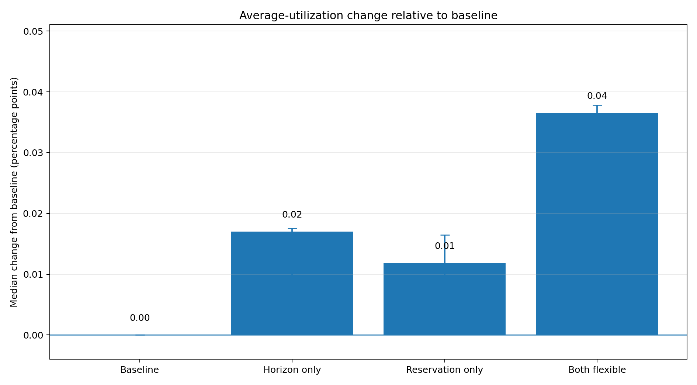
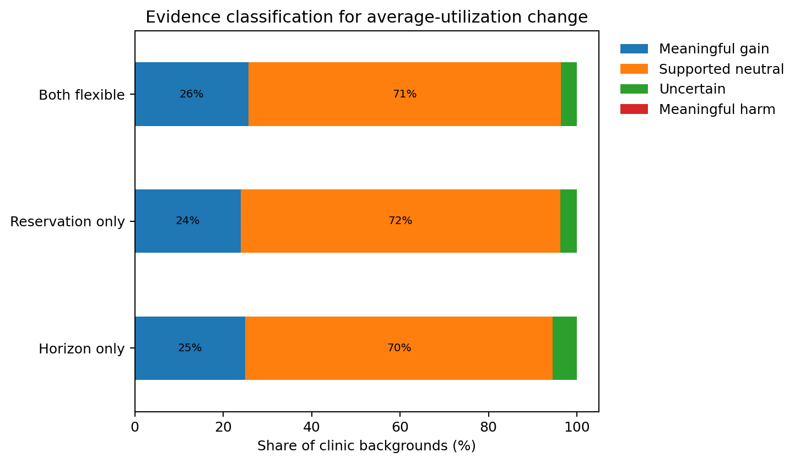
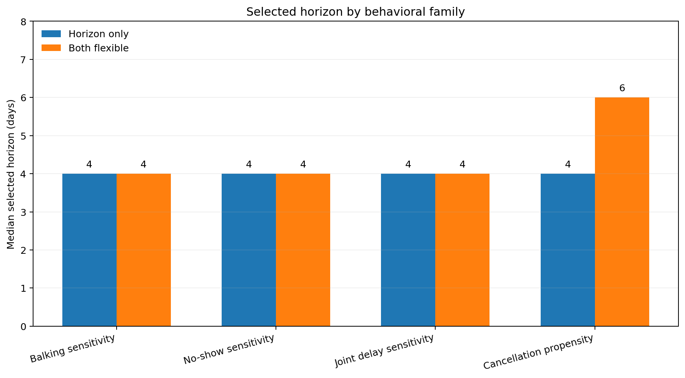
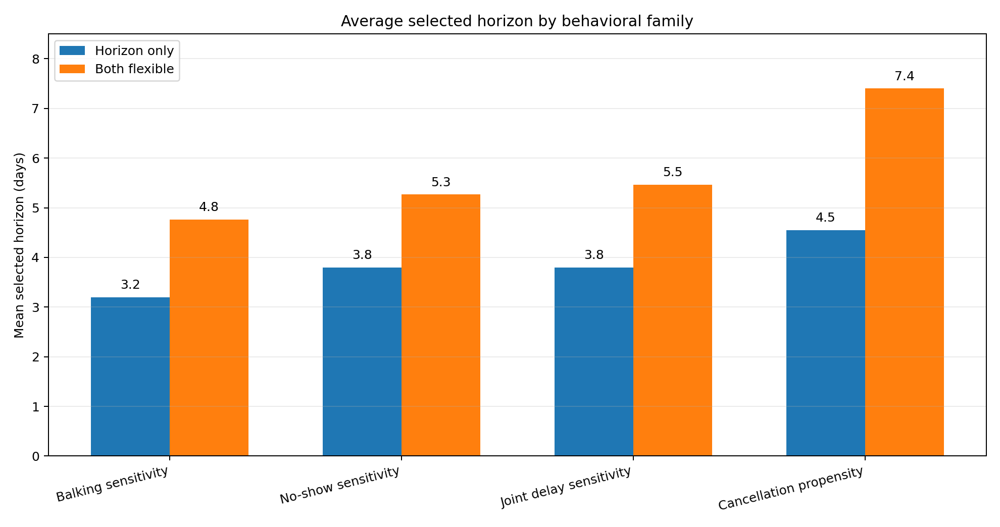
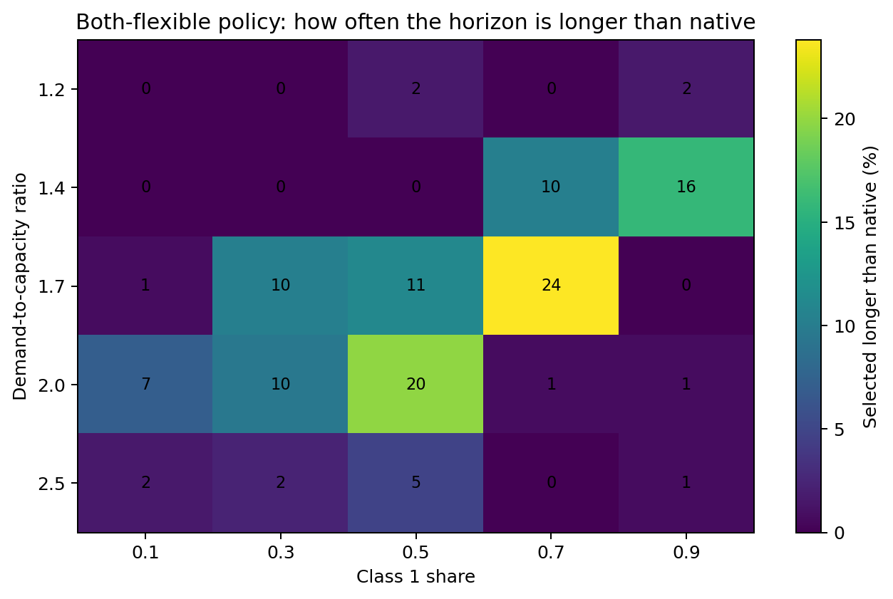
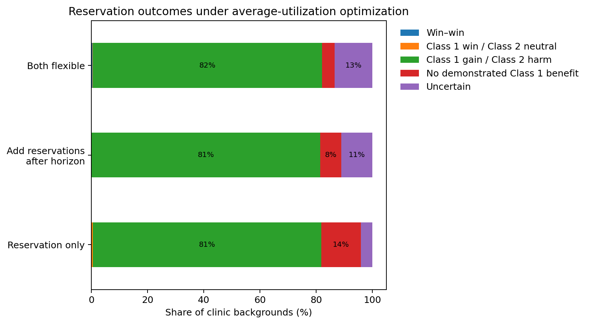
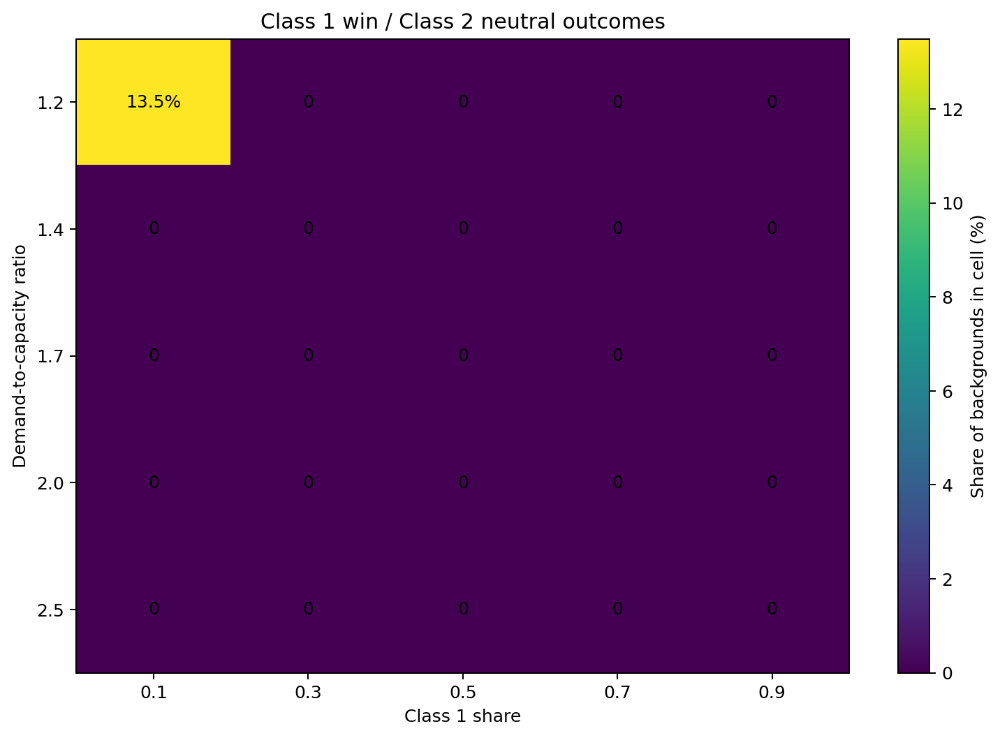
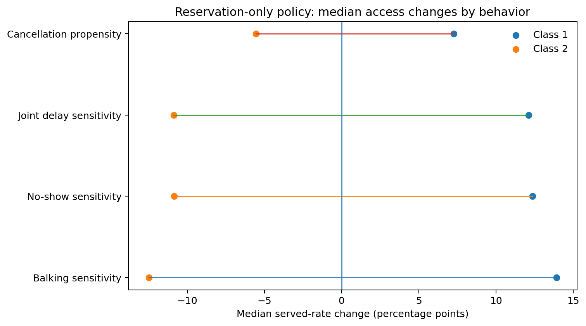
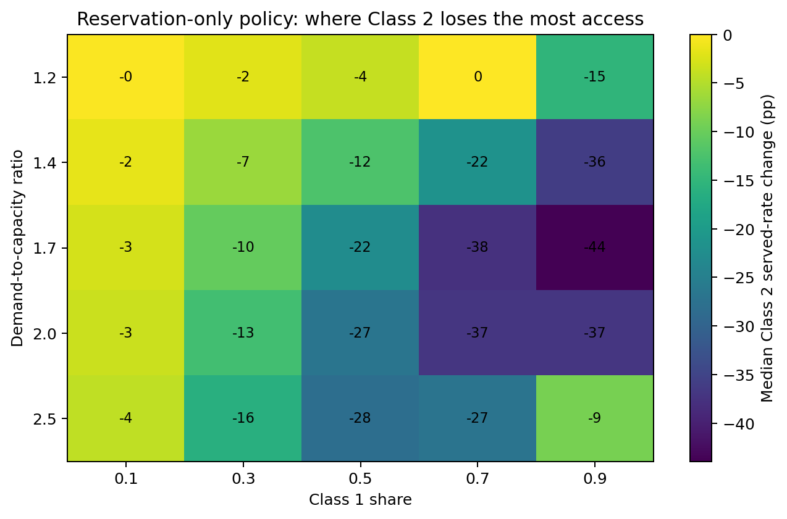

This report evaluates four appointment-scheduling policy regimes when policy parameters are selected to maximize **average utilization**.

Average utilization is the share of measured appointment capacity that becomes completed visits:

$$
U=\frac{Y_1+Y_2}{M},
$$

where $Y_1$ and $Y_2$ are completed Class 1 and Class 2 visits, and $M$ is the number of measured appointment slots.

The main results use demand-to-capacity ratios from **1.2 through 2.5**. A ratio of **3.0** is reported separately as a heavy-demand stress condition.

# Simulation overview

The experiment contains **3,780 clinic backgrounds**:

$$
21\text{ behavioral profiles}\times180\text{ clinic contexts}.
$$

Each background is evaluated under four policy regimes. Five search seeds select policy cells. Ten independent evaluation seeds produce the reported outcomes and confidence intervals.

## Problem parameters

| Component | Values | Interpretation |
|---|---:|---|
| Demand-to-capacity ratio | 1.2, 1.4, 1.7, 2.0, 2.5, 3.0 | Expected total arrivals divided by daily capacity |
| Class 1 share | 0.1, 0.3, 0.5, 0.7, 0.9 | Share of arrivals belonging to Class 1 |
| Daily capacity | 30, 50 | Available appointment slots per day |
| Native booking horizon | 10, 14, 22 days | Clinic setting before optimization |
| Behavioral profiles | 21 | No-show, balking, cancellation, and joint-delay profiles |
| Search seeds | 5 paired seeds | Used only to select policy cells |
| Evaluation seeds | 10 paired seeds | Independent seeds used for reported outcomes |
| Bootstrap | 2,000 paired draws | Confidence intervals for policy differences |
| Practical threshold | 0.005 | A change below 0.5 percentage points is not practically meaningful |

Behavior uses a threshold rule $(T,p_{\leq T},p_{>T})$. For example, $(5,0.05,0.20)$ means a 5% probability at delays of five days or less and a 20% probability above five days.

## Behavioral profiles

### No-show sensitivity

Balking is fixed at $(16,0.05,0.15)$ and cancellation at 20% for both classes.

| Class 2 reference | Class 2 no-show | Class 1 same | Class 1 mild | Class 1 strong |
|---|---|---|---|---|
| Low | (14, 0.05, 0.15) | (14, 0.05, 0.15) | (5, 0.05, 0.20) | (3, 0.05, 0.25) |
| Moderate | (8, 0.05, 0.20) | (8, 0.05, 0.20) | (5, 0.05, 0.20) | (3, 0.05, 0.25) |

### Balking sensitivity

No-show is fixed at $(3,0.05,0.10)$ and cancellation at 20% for both classes.

| Class 2 reference | Class 2 balking | Class 1 same | Class 1 mild | Class 1 strong |
|---|---|---|---|---|
| Low | (16, 0.05, 0.15) | (16, 0.05, 0.15) | (6, 0.05, 0.20) | (4, 0.05, 0.25) |
| Moderate | (9, 0.05, 0.20) | (9, 0.05, 0.20) | (6, 0.05, 0.20) | (4, 0.05, 0.25) |

### Cancellation propensity

Balking is $(16,0.05,0.15)$ and no-show is $(14,0.05,0.15)$ for both classes.

| Contrast | Class 1 cancellation | Class 2 cancellation |
|---|---:|---:|
| Same | 10% | 10% |
| Mild | 20% | 10% |
| Strong | 30% | 10% |

### Joint delay sensitivity

Cancellation is fixed at 20% for both classes.

| Class 2 reference | Class 2 no-show / balking | Class 1 same | Class 1 mild | Class 1 strong |
|---|---|---|---|---|
| Low | (14, .05, .15) / (16, .05, .15) | Same as Class 2 | (5, .05, .20) / (6, .05, .20) | (3, .05, .25) / (4, .05, .25) |
| Moderate | (8, .05, .20) / (9, .05, .20) | Same as Class 2 | (5, .05, .20) / (6, .05, .20) | (3, .05, .25) / (4, .05, .25) |

Thresholds remain fixed when the optimizer selects a shorter horizon. They are not capped to the selected horizon.

## Policy and search parameters

| Policy | Horizon | Reservations |
|---|---|---|
| Baseline | Native horizon | None |
| Horizon only | Optimized | None |
| Reservation only | Native horizon | Quantity and window optimized |
| Both flexible | Optimized | Quantity and window optimized |

| Search parameter | Values or procedure |
|---|---|
| Horizon | 2, 4, 6, ..., 26 days |
| Reserved quantity $Q$ | 0 through daily capacity; coarse increments of 5 and unit refinement |
| Reservation window $W$ | 1 through the selected horizon; coarse increments of 2 and unit refinement |
| Refinement | Top three coarse reservation cells are refined |
| Release rule | Unused protected capacity is released to the pooled system on the service day |
| Tie handling | Lower $Q$, shorter window, and shorter horizon break exact objective ties |

**How the reported evidence is evaluated:**

- Policy cells are selected with five paired search seeds.
- Reported effects use ten independent paired evaluation seeds.
- Pairwise 95% confidence intervals use 2,000 paired bootstrap resamples.
- For average utilization, a meaningful change must be at least 0.005 and have its confidence interval on the corresponding side of zero.
- Reservation access outcomes use Class 1 and Class 2 **served-rate** confidence intervals.
- The words **gain**, **neutral**, and **harm** refer to class-specific served rate, not clinic-wide utilization.

# Overall comparison

The figure reports each policy's **median clinic-wide average-utilization change relative to baseline**. Baseline is included and fixed at **0 percentage points**.

| Policy | Median change from baseline | 95% bootstrap interval for the median |
|---|---:|---:|
| Baseline | 0.00 pp | 0.00 to 0.00 pp |
| Horizon only | +0.02 pp | +0.01 to +0.02 pp |
| Reservation only | +0.01 pp | 0.00 to +0.02 pp |
| Both flexible | +0.04 pp | +0.03 to +0.04 pp |

The error bars summarize the median across the **3,150 main-range backgrounds**. They are separate from the paired simulation confidence intervals calculated within each background.

Main findings:

- Typical utilization changes are small.
- Horizon only and both flexible have the largest median improvements, but both remain below one-tenth of a percentage point.
- Flexible policies matter most in the subset of backgrounds where baseline utilization is relatively poor.
- Reservation only changes the distribution of access much more than it changes the total number of completed visits.

The next figure classifies each flexible policy's **average-utilization change relative to baseline**. Baseline itself has no change classification because it is the reference.

| Policy vs baseline | Meaningful utilization increase | Supported no material utilization change | Uncertain | Meaningful utilization decrease |
|---|---:|---:|---:|---:|
| Horizon only | 25.0% | 69.6% | 5.4% | 0.0% |
| Reservation only | 23.9% | 72.3% | 3.7% | 0.0% |
| Both flexible | 25.7% | 70.7% | 3.6% | 0.0% |

At the heavy-demand stress condition $\rho=3.0$:

- Horizon only and both flexible have median utilization increases of about **2.0 percentage points**.
- Approximately **77%** of backgrounds show a meaningful utilization increase.
- Reservation only has a median increase of **1.3 percentage points**, with meaningful increases in approximately **59%** of backgrounds.
# Horizons: when shorter or longer

The **native horizon** is the clinic's original booking window before optimization: 10, 14, or 22 days. A selected horizon is:

- **Shorter than native** when $H^*<H_0$.
- **Native** when $H^*=H_0$.
- **Longer than native** when $H^*>H_0$.

## Median selected horizon by behavioral family

- Horizon only selects a median horizon of **4 days** in every behavioral family.
- Both flexible also selects **4 days** for balking, no-show, and joint-delay profiles, but **6 days** for cancellation profiles.

The 6-day cancellation result is not a meaningful utilization advantage over 4 days. In all 450 main-range cancellation backgrounds, both flexible versus horizon only is classified as **supported neutral** for average utilization.

Cancellations are constant rather than delay-dependent, and canceled future appointments reopen before that day's new arrivals. Reservations protect near-term Class 1 capacity; extending the horizon from 4 to 6 days adds a small amount of future pooled inventory without activating a higher cancellation probability. Because utilization is nearly flat across these cells, the joint optimizer can select 6 days even though it is not materially better than 4.

## Average selected horizon by behavioral family

| Behavioral family | Horizon only | Both flexible |
|---|---:|---:|
| Balking sensitivity | 3.2 days | 4.8 days |
| No-show sensitivity | 3.8 days | 5.3 days |
| Joint delay sensitivity | 3.8 days | 5.5 days |
| Cancellation propensity | 4.5 days | 7.4 days |

The means are higher than the medians because a minority of backgrounds select much longer horizons. Cancellation profiles have the clearest upper tail, especially when horizon and reservations are optimized together.

## The 12 win–win cases

In **12 of 3,150 main-range backgrounds**, both Class 1 and Class 2 have a supported served-rate increase for **both flexible versus baseline**.

| Pattern | Backgrounds | Clinic conditions | Both-flexible selection | Average-utilization change | Class 1 served-rate change | Class 2 served-rate change |
|---|---:|---|---|---:|---:|---:|
| Strong Class 1 balking sensitivity; low or moderate Class 2 reference | 6 | $\rho=2.0$; Class 1 share 0.1; capacity 30; native horizons 10, 14, and 22 | $H=4$, $Q=0$ | +1.84 pp | +1.54 pp | +0.70 pp |
| Moderate Class 2 reference; Class 1 same or mild balking sensitivity | 6 | $\rho=2.0$; Class 1 share 0.5; capacity 30; native horizons 10, 14, and 22 | $H=4$, $Q=11$, $W=4$ | +1.96 pp | +1.64 pp | +0.65 pp |

All 12 cases share three features:

- They are **balking profiles**.
- Demand is $\rho=2.0$ and daily capacity is 30.
- Both flexible selects a **four-day horizon**, reducing mean offered delay from about 3.2 days under baseline to about 2.2 days.

### Why both classes improve

No-show behavior in the balking profiles has a threshold at three days. The shorter horizon reduces appointments offered beyond that threshold and lowers no-shows for both classes.

In the strong-balking cases, Class 1 balking also falls from approximately **9.7% to 5.1%** because fewer offers exceed its four-day balking threshold.

The shorter horizon creates more no-offers, but the reduction in balking and no-shows is large enough to increase completed visits and the served rate of both classes.

### Are reservations responsible?

Mostly no.

- In **6 cases**, the selected both-flexible cell has $Q=0$. It is effectively horizon only.
- In the other **6 cases**, horizon only is already win–win. Adding the reservation increases the Class 1 benefit but reduces the Class 2 benefit.
- Class 2 remains above baseline because the horizon-related efficiency gain is large enough to absorb that redistribution.

These rare win–wins are therefore best interpreted as **short-horizon efficiency gains**, sometimes combined with a modest reservation overlay. They are not evidence that strong Class 1 reservations are generally win–win.

## Which clinic parameters show clear horizon trends?

- **Native horizon:** the optimized median remains close to 4 days whether the clinic starts at 10, 14, or 22 days. Clinics with longer native horizons therefore undergo larger reductions.
- **Demand:** short horizons dominate across the grid. Longer-than-native choices appear mainly at intermediate congestion. At very high demand, short horizons again dominate because near-term capacity can already be filled.

Class 1 share is discussed through its interaction with demand in the next figure. Capacity is omitted because it does not show a clear horizon-selection trend.
## Why do longer horizons shift toward lower Class 1 shares as demand rises?

The key issue is **advance access to protected slots**. Class 2 can book farther-out pooled appointments, but it cannot book unused near-term protected slots in advance. Those slots are released only on the service day.

When the Class 1 arrival volume is too low to fill the protected near-term capacity:

- Some protected slots may remain unavailable to Class 2 during advance booking.
- A longer horizon does not unlock those near-term slots.
- It may only place Class 2 farther into the future, increasing delay without increasing completed visits.

At intermediate demand, a smaller Class 1 share can still produce enough Class 1 arrivals to use the protected near-term capacity. Class 2 demand can then use farther-out pooled slots, so a longer horizon occasionally adds value.

At very high demand, a short horizon already provides enough demand to keep capacity full. Extending the horizon adds little utilization and can expose more patients to delay-related balking or no-show risk.

Thus, the mechanism is not that Class 2 is unable to use longer-horizon appointments. It is that a longer horizon does not solve **stranded near-term protection** when Class 1 demand is too low. This interpretation is consistent with the observed selection pattern but is not a separate causal experiment.

# Reservations and patient access

Reservation outcomes are classified using the **paired 95% confidence intervals for Class 1 and Class 2 served-rate changes**:

- **Win–win:** both classes have a meaningful served-rate increase.
- **Class 1 win / Class 2 neutral:** Class 1 has a meaningful increase and Class 2's entire interval lies within $[-0.005,0.005]$.
- **Class 1 gain / Class 2 harm:** Class 1 has a meaningful increase and Class 2 has a meaningful decrease.
- **No demonstrated Class 1 benefit:** Class 1 does not have a meaningful increase.
- **Uncertain:** the intervals do not support one of the preceding conclusions.

## Reservation only versus baseline

- 81.4% of backgrounds are **Class 1 gain / Class 2 harm**.
- 14.0% show no demonstrated Class 1 benefit.
- 4.1% are uncertain.
- 0.5% are Class 1 win / Class 2 neutral.
- No main-range background is classified as win–win.

Median effects:

- Class 1 served rate: **+12.4 percentage points**.
- Class 2 served rate: **−10.5 percentage points**.
- Average utilization: approximately unchanged.

## When does Class 1 gain while Class 2 remains neutral?

Win-neutral outcomes are rare: **17 of 3,150 backgrounds (0.5%)**.

All 17 occur under the same broad clinic conditions:

- Demand-to-capacity ratio: **1.2**.
- Class 1 share: **0.1**.
- Daily capacity: **50**.
- Behavioral family: **balking sensitivity**.

Within the $\rho=1.2$, Class 1 share 0.1 cell, 13.5% of backgrounds are win-neutral. Native horizon, Class 2 reference, and contrast strength do not show a clear pattern within these cases.

Median effects in the win-neutral cases:

- Class 1 served rate: **+4.0 percentage points**.
- Class 2 served rate: **−0.07 percentage points**.
- Average utilization: **+0.03 percentage points**.

Here, “Class 2 can absorb the change” means that the reservation reallocates a small amount of near-term access toward Class 1 without producing a statistically or practically measurable change in the **proportion of Class 2 arrivals served**.

The 17 win-neutral backgrounds share several features:

- Class 2 represents 90% of arrivals, so a small number of appointments shifted to Class 1 is spread across a large Class 2 denominator.
- Total demand is only 1.2 times capacity. After balking, cancellation, and no-show losses, the clinic is not severely congested.
- The median no-offer rate is zero for both classes under both policies.
- Median offered delay remains below one day. Reservation reduces Class 1 offered delay from about 0.64 to 0.39 days, while Class 2 delay rises only from about 0.64 to 0.72 days.
- The median Class 2 served-rate change is only −0.07 percentage points, and its full confidence interval remains within the ±0.5 percentage-point neutral range.

Thus, Class 1 receives measurably earlier access, while Class 2 still receives almost the same fraction of service.

# How behavior changes reservation outcomes

| Behavioral family | Median Class 1 change | Median Class 2 change |
|---|---:|---:|
| Balking sensitivity | +13.9 pp | −12.5 pp |
| No-show sensitivity | +12.4 pp | −10.9 pp |
| Joint delay sensitivity | +12.1 pp | −10.9 pp |
| Cancellation propensity | +7.3 pp | −5.6 pp |

Key points:

- Reservation effects are largest in the balking and no-show families.
- Higher Class 1 cancellation reduces the median access shift, but does not eliminate the trade-off.
- Reservations also create large access shifts in same-behavior controls. Differential sensitivity is not required for redistribution.
- Relative to matched same-behavior controls, strong no-show and joint-delay sensitivity add about 0.8 percentage points to the median Class 1 effect. Balking heterogeneity adds little to the median incremental effect.

# When Class 2 suffers in served rate

## Class 1 population share

The table reports median **served-rate changes** for each class under reservation only versus baseline. Each entry is a percentage-point change in the share of that class's arrivals that are ultimately served.

| Class 1 share | Class 1 served-rate change | Class 2 served-rate change |
|---:|---:|---:|
| 0.1 | +26.3 pp | −2.7 pp |
| 0.3 | +25.0 pp | −10.2 pp |
| 0.5 | +15.6 pp | −15.4 pp |
| 0.7 | +10.9 pp | −24.9 pp |
| 0.9 | +3.5 pp | −30.4 pp |

Class 1 population share is the clearest clinic-level driver of Class 2 harm. When Class 1 is small, a limited number of protected appointments can greatly improve its served rate while displacing relatively few Class 2 patients. As Class 1 becomes dominant, protected demand occupies much more of the schedule and the remaining Class 2 group loses a much larger fraction of its access.

## Demand and other drivers

Demand interacts with Class 1 share rather than producing a simple monotonic effect. The largest Class 2 losses generally occur when demand is congested and Class 1 is common, but the exact pattern also depends on the reservation quantity and window selected under a nearly flat average-utilization objective.

Other factors are:

- **Behavioral family:** median Class 2 served-rate loss is largest for balking profiles (−12.5 pp), followed by no-show and joint-delay profiles (about −10.9 pp), and smallest for cancellation profiles (−5.6 pp).
- **Reservation intensity:** larger protected shares and longer reservation windows are strongly associated with greater Class 2 loss. These are the direct mechanisms through which advance access is withheld from Class 2.
- **Native horizon:** 10-, 14-, and 22-day native horizons have nearly identical median Class 2 losses.
- **Capacity:** capacities of 30 and 50 do not show a clear or consistent difference after reservation quantity is scaled to the clinic.
- **Contrast strength and Class 2 reference:** these create smaller shifts than population share, demand, and reservation intensity.

### Why is the $\rho=2.0$, Class 1 share 0.9 cell less harmful than the $\rho=1.7$ cell?

It is still highly harmful to Class 2. The median served-rate loss is about **37.1 percentage points**. It only appears lower relative to the 43.9-point loss at $\rho=1.7$.

| Demand ratio | Baseline Class 2 served rate | Reservation-only Class 2 served rate | Change | Median protected share | Median window |
|---:|---:|---:|---:|---:|---:|
| 1.7 | 55.5% | 11.4% | −43.9 pp | 100% | 14 days |
| 2.0 | 47.3% | 9.5% | −37.1 pp | 100% | 13 days |
| 2.5 | 38.0% | 29.5% | −9.1 pp | 90% | 9 days |

Two mechanisms explain the non-monotonic pattern:

- **Floor effect:** as demand rises, Class 2's baseline served rate is already lower. There is less remaining served rate for the reservation policy to take away.
- **Policy selection changes:** at $\rho=2.5$, the average-utilization optimizer selects a shorter reservation window and a slightly smaller protected share. This leaves more advance capacity pooled for Class 2.

Because the optimization target is total utilization rather than class balance, many reservation cells are nearly tied on the objective. Their Class 2 effects can therefore vary substantially even when their utilization is almost identical. The heatmap should be read as an access consequence of the selected utilization-optimal cells, not as a smooth causal law in demand.

# Executive summary

- **Median utilization changes relative to baseline are small.** Horizon only, reservation only, and both flexible improve median utilization by about 0.02, 0.01, and 0.04 percentage points, respectively.
- **Shortening the horizon is the main efficiency mechanism.** Balking, no-show, and joint-delay profiles all select a median horizon of 4 days.
- **Longer-than-native horizons are exceptions.** They appear mainly at intermediate congestion, when Class 1 demand can use protected near-term slots and Class 2 can use farther-out pooled capacity.
- **Class 1 win / Class 2 neutral outcomes are rare.** They occur only in low-demand, small-Class-1, capacity-50 balking backgrounds.
- **Class 2 harm is greatest when Class 1 is common and demand is congested.**
- **Heavy demand strengthens the case for shorter horizons.** At $\rho=3.0$, horizon-based policies produce median utilization increases near 2 percentage points.

---

Data inputs:

- `full_run_summaries/h1_patient_characteristics_full/release/selected_policy_outcomes.csv`
- `full_run_summaries/h1_patient_characteristics_full/release/pairwise_group_deltas.csv`
- `full_run_summaries/h1_patient_characteristics_full/release/heterogeneity_increment_deltas.csv`
