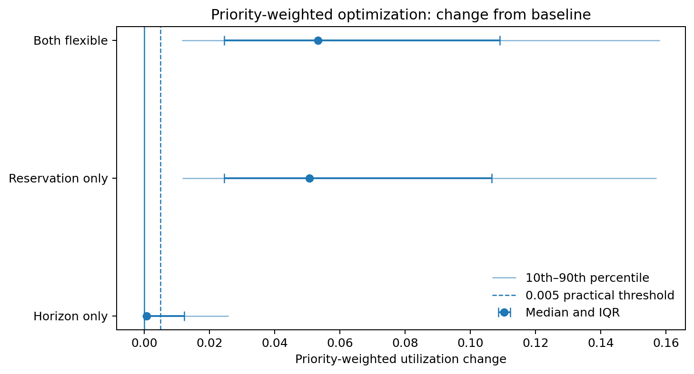
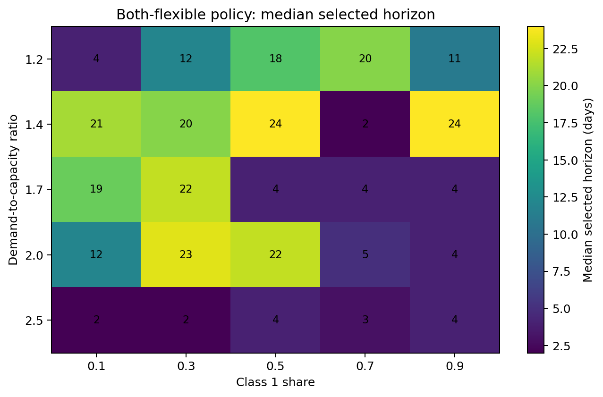
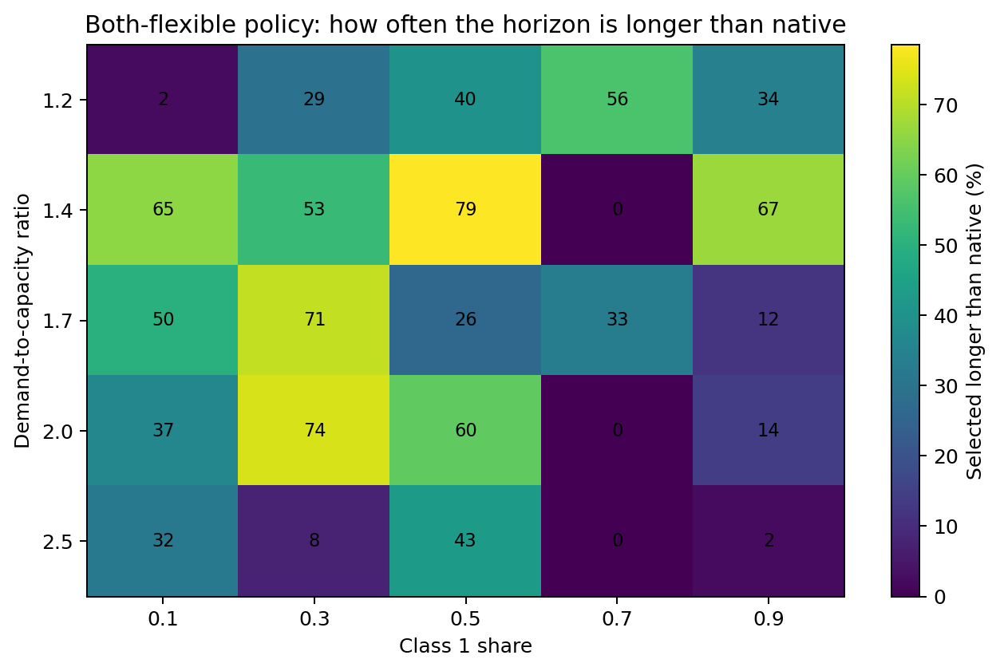
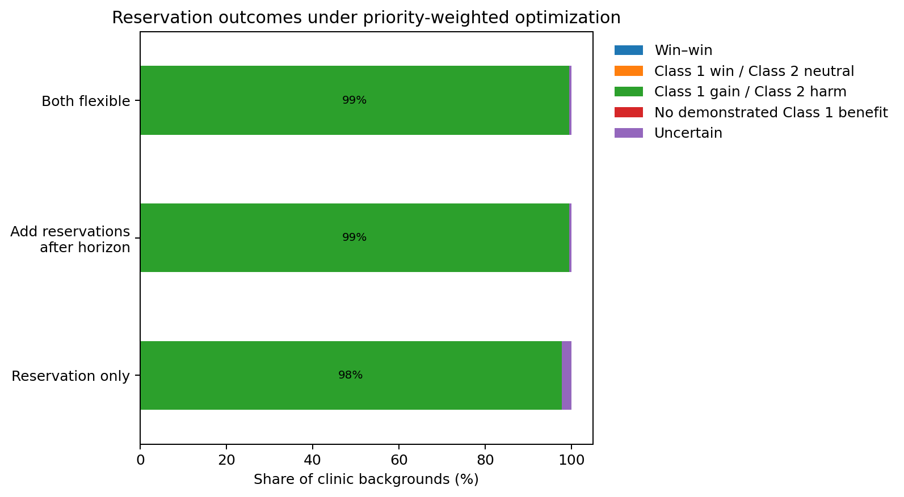
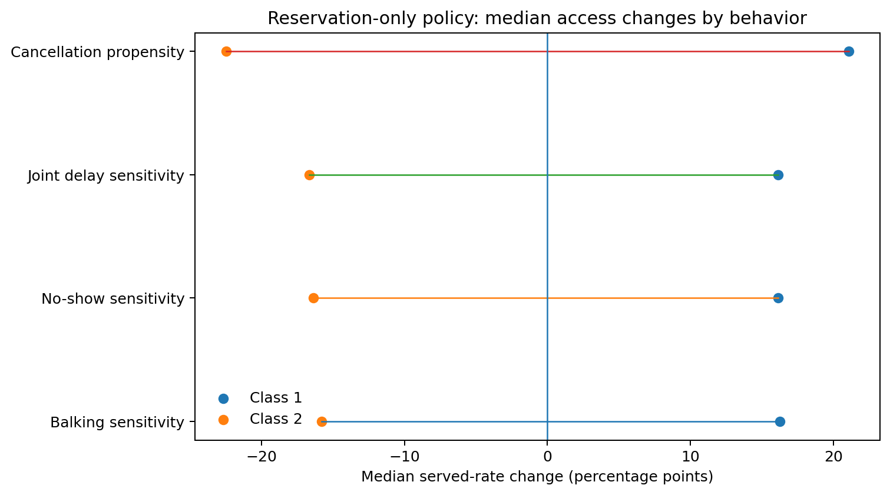
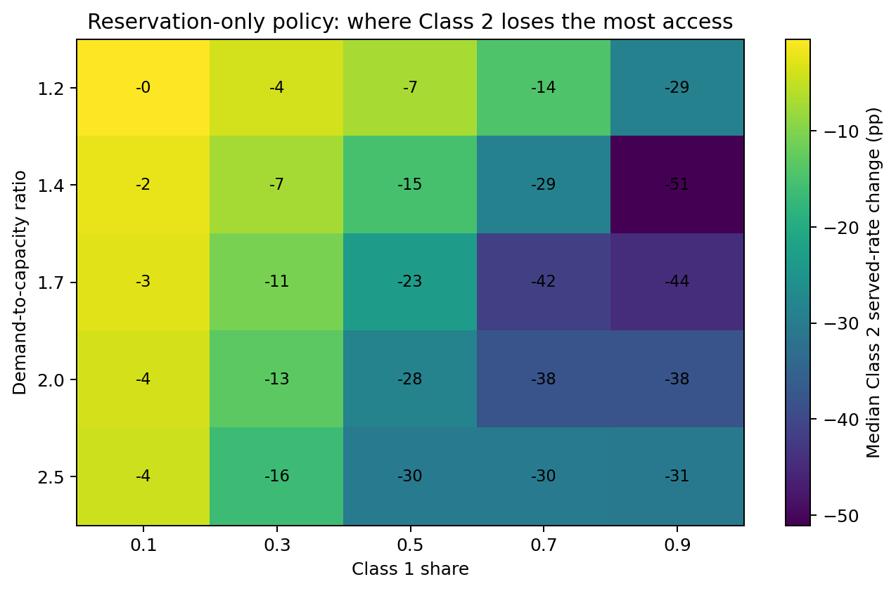
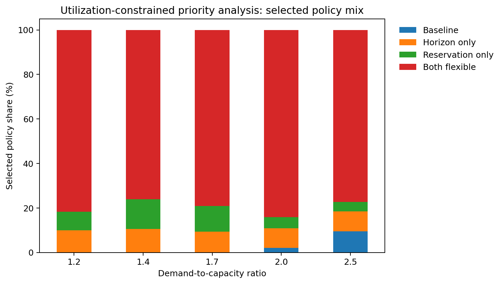
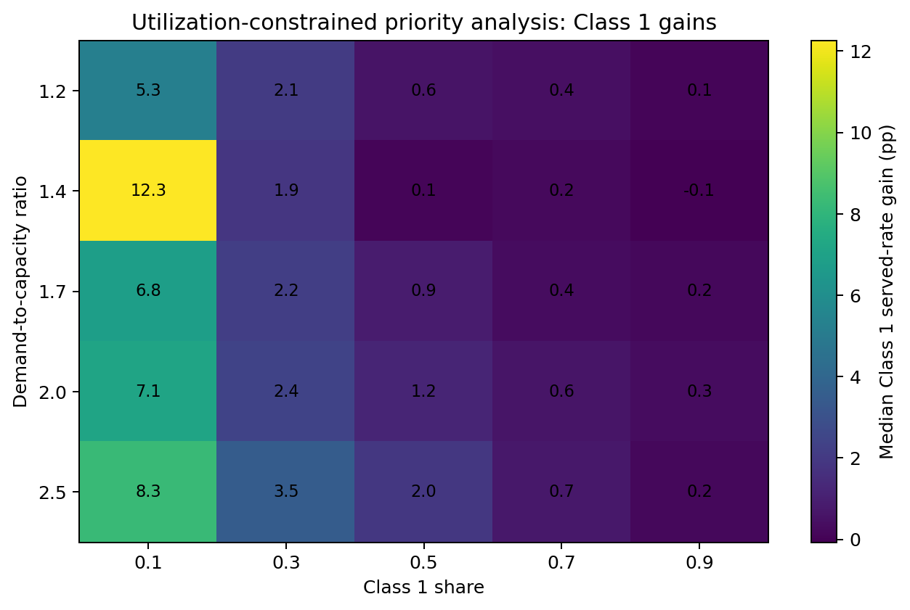

This report evaluates the same controlled simulation when policy parameters are selected to maximize **priority-weighted utilization**.

Each completed Class 1 visit receives twice the value of a completed Class 2 visit:

$$
U_w=\frac{2Y_1+Y_2}{2M},
$$

where $Y_1$ and $Y_2$ are completed visits and $M$ is measured appointment capacity.

The objective values each Class 1 completion twice as much. It does not require total utilization or Class 2 access to improve.

The main results use demand-to-capacity ratios from **1.2 through 2.5**. A ratio of **3.0** is treated as a heavy-demand stress condition.

# Simulation overview

The experiment contains **3,780 clinic backgrounds**:

$$
21\text{ behavioral profiles}\times180\text{ clinic contexts}.
$$

Five paired search seeds select policy cells. Ten independent evaluation seeds produce the reported outcomes and confidence intervals.

## Problem parameters

| Component | Values | Interpretation |
|---|---:|---|
| Demand-to-capacity ratio | 1.2, 1.4, 1.7, 2.0, 2.5, 3.0 | Expected total arrivals divided by daily capacity |
| Class 1 share | 0.1, 0.3, 0.5, 0.7, 0.9 | Share of arrivals belonging to Class 1 |
| Daily capacity | 30, 50 | Available appointment slots per day |
| Native booking horizon | 10, 14, 22 days | Clinic setting before optimization |
| Behavioral profiles | 21 | No-show, balking, cancellation, and joint-delay profiles |
| Search seeds | 5 paired seeds | Used only to select policy cells |
| Evaluation seeds | 10 paired seeds | Independent seeds used for reported outcomes |
| Bootstrap | 2,000 paired draws | Confidence intervals for policy differences |
| Practical threshold | 0.005 | Minimum practically meaningful change |
| Class 2 constrained tolerance | 0.01 | Maximum allowed Class 2 served-rate reduction in the constrained analysis |

Class-specific arrival rates are:

$$
\lambda_1=\rho C s_1,\qquad \lambda_2=\rho C(1-s_1).
$$

Behavior uses a threshold rule $(T,p_{\leq T},p_{>T})$.

## Behavioral profiles

### No-show sensitivity

Balking is fixed at $(16,0.05,0.15)$ and cancellation at 20% for both classes.

| Class 2 reference | Class 2 no-show | Class 1 same | Class 1 mild | Class 1 strong |
|---|---|---|---|---|
| Low | (14, 0.05, 0.15) | (14, 0.05, 0.15) | (5, 0.05, 0.20) | (3, 0.05, 0.25) |
| Moderate | (8, 0.05, 0.20) | (8, 0.05, 0.20) | (5, 0.05, 0.20) | (3, 0.05, 0.25) |

### Balking sensitivity

No-show is fixed at $(3,0.05,0.10)$ and cancellation at 20% for both classes.

| Class 2 reference | Class 2 balking | Class 1 same | Class 1 mild | Class 1 strong |
|---|---|---|---|---|
| Low | (16, 0.05, 0.15) | (16, 0.05, 0.15) | (6, 0.05, 0.20) | (4, 0.05, 0.25) |
| Moderate | (9, 0.05, 0.20) | (9, 0.05, 0.20) | (6, 0.05, 0.20) | (4, 0.05, 0.25) |

### Cancellation propensity

Balking is $(16,0.05,0.15)$ and no-show is $(14,0.05,0.15)$ for both classes.

| Contrast | Class 1 cancellation | Class 2 cancellation |
|---|---:|---:|
| Same | 10% | 10% |
| Mild | 20% | 10% |
| Strong | 30% | 10% |

### Joint delay sensitivity

Cancellation is fixed at 20% for both classes.

| Class 2 reference | Class 2 no-show / balking | Class 1 same | Class 1 mild | Class 1 strong |
|---|---|---|---|---|
| Low | (14, .05, .15) / (16, .05, .15) | Same as Class 2 | (5, .05, .20) / (6, .05, .20) | (3, .05, .25) / (4, .05, .25) |
| Moderate | (8, .05, .20) / (9, .05, .20) | Same as Class 2 | (5, .05, .20) / (6, .05, .20) | (3, .05, .25) / (4, .05, .25) |

Thresholds are not capped when the optimizer selects a shorter booking horizon.

## Policy and search parameters

| Policy | Horizon | Reservations |
|---|---|---|
| Baseline | Native horizon | None |
| Horizon only | Optimized | None |
| Reservation only | Native horizon | Quantity and window optimized |
| Both flexible | Optimized | Quantity and window optimized |

| Search parameter | Values or procedure |
|---|---|
| Horizon | 2, 4, 6, ..., 26 days |
| Reserved quantity $Q$ | 0 through daily capacity; coarse increments of 5 and unit refinement |
| Reservation window $W$ | 1 through the selected horizon; coarse increments of 2 and unit refinement |
| Refinement | Top three coarse reservation cells are refined |
| Release rule | Unused protected capacity is released to the pooled system on the service day |
| Tie handling | Lower $Q$, shorter window, and shorter horizon break exact objective ties |

**How the reported evidence is evaluated:**

- Policy cells are selected with five paired search seeds.
- Reported effects use ten independent paired evaluation seeds.
- Pairwise 95% confidence intervals use 2,000 paired bootstrap resamples.
- A meaningful served-rate or objective change must be at least 0.005 and have its confidence interval on the corresponding side of zero.
- Supported neutral requires the entire confidence interval to lie within $[-0.005,0.005]$.
- Reservation access outcomes use Class 1 and Class 2 **served-rate** confidence intervals.
- The words **gain**, **neutral**, and **harm** refer to class-specific served rate.

# Overall comparison

| Policy vs baseline | Median weighted change | Meaningful gain | Supported neutral | Uncertain | Meaningful harm |
|---|---:|---:|---:|---:|---:|
| Horizon only | +0.08 pp | 32.2% | 63.8% | 4.0% | 0.0% |
| Reservation only | +5.07 pp | 96.4% | 3.5% | 0.1% | 0.0% |
| Both flexible | +5.33 pp | 96.4% | 3.5% | 0.1% | 0.0% |

Main findings:

- Reservations dominate the priority-weighted objective.
- Horizon flexibility alone produces modest weighted gains.
- Both flexible is only slightly better than reservation only in the median background.
- The weighted objective can improve while total utilization remains approximately unchanged.

At $\rho=3.0$:

- Both flexible has a median weighted gain of approximately **13.8 percentage points**.
- Reservation only has a median gain of approximately **11.8 percentage points**.
- Both reservation-based regimes have meaningful gains in all stress-condition backgrounds.

# Horizons: when shorter or longer

## Horizon-only policy

When no reservations are available, the priority-weighted optimizer behaves similarly to the average-utilization optimizer:

- Median selected horizon: **4 days**.
- 99.7% of main-range backgrounds select a shorter horizon.
- Longer horizons are almost never selected.

Shortening the horizon reduces exposure to delay-sensitive behavior for both groups. It does not create a strong preferential-access mechanism by itself.

## Both-flexible policy

The combination of reservations and horizon flexibility produces a mixed horizon pattern:

- Median selected horizon: **6 days**.
- 60.8% select a shorter horizon.
- 3.7% retain the native horizon.
- 35.5% select a longer horizon.

Longer horizons are most common when:

- Demand is moderate rather than extreme, especially around $\rho=1.4$.
- Class 1 represents approximately 30%–50% of arrivals.
- The profile concerns balking, no-show, or joint delay sensitivity.

Longer horizons are uncommon in the cancellation profiles. They are also less common at the highest main-range demand level, where near-term congestion makes short horizons more valuable.

The mechanism is different from horizon-only optimization. Reservations protect Class 1 near-term access, allowing the pooled booking window to remain longer without removing the priority advantage.

# Reservations and patient access

## Reservation only versus baseline

- 97.7% of main-range backgrounds are **Class 1 gain / Class 2 harm**.
- 2.3% are uncertain.
- No background is classified as win–win or Class 1 win / Class 2 neutral.

Median effects:

- Class 1 served rate: **+16.2 percentage points**.
- Class 2 served rate: **−18.0 percentage points**.
- Average utilization: approximately unchanged.
- Priority-weighted utilization: **+5.1 percentage points**.

## Adding reservations after horizon optimization

- 99.4% of backgrounds are Class 1 gain / Class 2 harm.
- 0.6% are uncertain.
- Median Class 1 gain is approximately 16.0 percentage points.
- Median Class 2 loss is approximately 16.4 percentage points.

Priority-weighted optimization therefore uses reservations as an access-transfer mechanism. The objective improves because each Class 1 completion receives twice the value of a Class 2 completion.

# How behavior changes reservation outcomes

| Behavioral family | Median Class 1 change | Median Class 2 change |
|---|---:|---:|
| Balking sensitivity | +16.3 pp | −15.8 pp |
| No-show sensitivity | +16.1 pp | −16.4 pp |
| Joint delay sensitivity | +16.1 pp | −16.6 pp |
| Cancellation propensity | +21.1 pp | −22.5 pp |

Key points:

- The trade-off is present in every behavioral family.
- Cancellation profiles produce the largest median transfer under the weighted objective.
- Mild, same, and strong contrasts have similar median effects.
- Priority weighting, not behavioral heterogeneity alone, drives the main shift.

The same-behavior controls are important. They show that reservations prioritize Class 1 even when the two classes have identical delay behavior.

# When Class 2 suffers in served rate

## Class 1 population share

For reservation only versus baseline:

| Class 1 share | Median Class 1 change | Median Class 2 change | Median weighted change |
|---:|---:|---:|---:|
| 0.1 | +27.1 pp | −2.7 pp | +2.4 pp |
| 0.3 | +25.4 pp | −10.7 pp | +6.6 pp |
| 0.5 | +23.0 pp | −23.0 pp | +9.9 pp |
| 0.7 | +14.2 pp | −31.1 pp | +10.7 pp |
| 0.9 | +4.5 pp | −38.0 pp | +3.7 pp |

The weighted objective is most favorable numerically at intermediate-to-high Class 1 shares, but the distributional cost to Class 2 rises sharply.

When Class 1 is only 10% of arrivals, its served rate can increase substantially with a smaller Class 2 served-rate loss. This is the most promising region for a constrained-priority policy.

## Demand

- Class 1 median gain rises from approximately 6 pp at $\rho=1.2$ to 32 pp at $\rho=2.5$.
- Class 2 median loss grows from approximately 7 pp to 30 pp.
- Weighted gains rise with congestion because protected access becomes more consequential.

Class 2 harm is greatest when:

- Demand is high.
- Class 1 is a large share of arrivals.
- The reservation window protects most or all daily capacity.

# Utilization-constrained priority analysis

This secondary analysis asks:

> Among policy cells that preserve near-best average utilization and limit Class 2 harm, which cell provides the highest priority-weighted utilization?

A policy cell is eligible when:

1. Average utilization is within 0.005 of the maximum available average utilization.
2. Class 2 served rate is no more than 0.01 below baseline in the search sample.

The eligible cell with the highest priority-weighted utilization is frozen and evaluated on the independent seeds.

## Overall result

In the main demand range:

- 97.7% of backgrounds have at least one feasible cell in the search sample.
- 80.4% satisfy both constraints again on the independent evaluation seeds.
- 60.3% are baseline-equivalent on the weighted objective using the 0.005 practical threshold.

Median evaluated changes versus baseline are:

| Outcome | Median change |
|---|---:|
| Class 1 served rate | +1.1 pp |
| Class 2 served rate | −0.7 pp |
| Average utilization | approximately 0.0 pp |
| Priority-weighted utilization | +0.4 pp |

The constrained analysis sharply reduces the access transfer. It also reduces the typical priority benefit.

## Which policies are selected

Across the main range:

- Both flexible: 79.7%.
- Horizon only: 9.5%.
- Reservation only: 8.5%.
- Baseline: 2.3%.

Both flexible is common because the optimizer can jointly adjust the horizon, protected quantity, and reservation window to remain near the utilization frontier.

## Conditions with the strongest Class 1 benefit

The strongest median gains occur when Class 1 is a small population:

- Class 1 share 0.1: median gain **+7.3 percentage points**.
- Class 1 share 0.3: median gain **+2.1 percentage points**.
- Class 1 shares 0.5–0.9: median gains are generally below 1 percentage point.

The single strongest broad condition is approximately:

- Demand ratio 1.4.
- Class 1 share 0.1.
- Median Class 1 gain about **12.3 percentage points**.

Why low Class 1 share is favorable:

- A small number of protected completions produces a large percentage improvement for Class 1.
- Those completions represent a smaller portion of total capacity.
- The Class 2 served-rate loss can remain near the one-percentage-point tolerance.

## Important limitation

The constraints are applied during search and checked again on independent evaluation seeds. Approximately 19.6% of main-range selections do not satisfy both constraints out of sample.

These cases should be treated as unstable rather than as accepted constrained policies. A stricter search buffer or additional evaluation seeds would reduce this risk.

# Executive summary

- **Reservations are the main priority mechanism.** Reservation only and both flexible produce meaningful weighted gains in 96.4% of main-range backgrounds.
- **The typical weighted gain is substantial.** Median gains are approximately 5.1–5.3 percentage points.
- **The gain is usually a transfer of access.** Reservation only raises Class 1 served rate by 16.2 points and lowers Class 2 by 18.0 points in the median background.
- **Win–win and win-neutral results do not appear under unconstrained priority optimization.** Almost every reservation result is Class 1 gain / Class 2 harm.
- **Horizon behavior depends on whether reservations are available.** Horizon only almost always shortens the booking window; both flexible chooses a longer horizon in 35.5% of backgrounds.
- **Class 2 harm grows with Class 1 share and congestion.** Median losses approach 30–40 percentage points in high-share settings.
- **The constrained analysis identifies a narrower opportunity.** With near-optimal utilization and a one-point Class 2 tolerance, median Class 1 gain is 1.1 points and Class 2 loss is 0.7 points.
- **Low Class 1 share is the most favorable constrained setting.** At a 10% Class 1 share, the median Class 1 gain is 7.3 points; the strongest demand-share cell reaches about 12.3 points.
- **Out-of-sample constraint checks matter.** Only 80.4% of main-range selections satisfy both constraints on the independent evaluation seeds.

---

Data inputs:

- `full_run_summaries/h1_patient_characteristics_full/release/selected_policy_outcomes.csv`
- `full_run_summaries/h1_patient_characteristics_full/release/pairwise_group_deltas.csv`
- `full_run_summaries/h1_patient_characteristics_full/release/constrained_priority_outcomes.csv`
