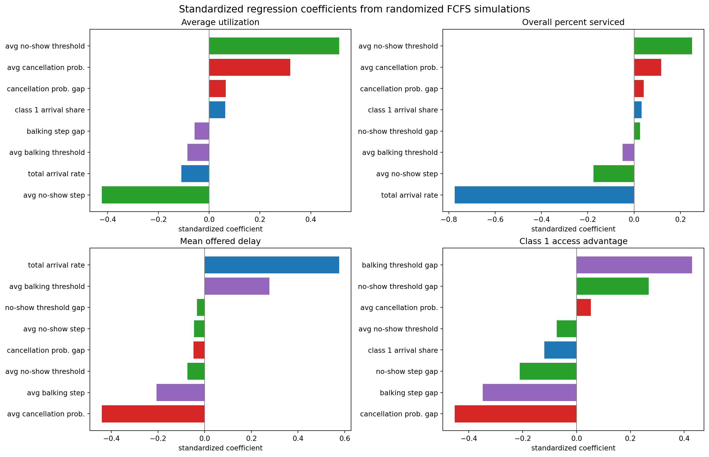

This is the canonical source for the metric-focused study. Rendered HTML, PDF,
Markdown, and TeX outputs should be treated as generated artifacts derived from
this QMD.

The report is organized by metric. Each metric section starts with simple
one-driver plots where Class 1 varies and Class 2 stays fixed at baseline, then
moves to interaction heatmaps or regression evidence.

The baseline treats Class 1 and Class 2 symmetrically: same arrival rate,
cancellation probability, balking rule, no-show rule, and value. Symmetric
heatmaps mostly show absolute parameter effects. Class advantage appears when
the class assumptions differ.

## Reading the Figures

In the driver plots, each panel uses one driver-family color:

| Color | Meaning |
|---|---|
| Blue | arrival pressure, arrival mix, and demand-load changes |
| Purple | balking step, balking threshold, and balking-rate diagnostics |
| Green | no-show step and no-show threshold changes |
| Red | cancellation probability changes |
| Gray dashed line | baseline assumption |
| Black/white dashed crosshair | baseline Class 1 and Class 2 assumptions in two-axis heatmaps |
| Class-gap heatmaps | muted driver-adjacent diverging scale centered on near-white zero; the colorbar sign shows whether Class 1 or Class 2 is higher |

Line style and marker distinguish overall, Class 1, and Class 2 within the same
driver family. For utilization, the class lines are each class's completed slots
divided by all available slots.

## Metrics

| Metric | Meaning | Main drivers |
|---|---|---|
| `average_utilization` | completed visits / available slots | no-show risk, cancellation, demand |
| `overall_percent_serviced` | served arrivals / all arrivals | total demand, no-show, cancellation, balking |
| `mean_offered_booking_delay` | average offered delay among patients who received an offer | demand, balking tolerance, cancellation |
| `overall_balking_rate` | balked / offered | balking step and threshold |
| `access_advantage_class_1` | Class 1 served rate minus Class 2 served rate | class-specific behavior gaps |

Baseline summary:

| Scenario | Utilization | Overall served | Accepted wait | Offered wait | Class gap | Delay gap |
|---|---:|---:|---:|---:|---:|---:|
| Baseline | 0.839 | 0.269 | 8.35 | 9.30 | 0.001 | 0.003 |
| Scenario 2 | 1.000 | 0.395 | 4.29 | 5.06 | -0.008 | 0.005 |

Scenario 2 changes several assumptions at once, so treat it as a comparison
point rather than a one-parameter causal test.

## Known Measurement Semantics

This report preserves the current simulation semantics.

- Class-level patient metrics are tracked for patients who arrive during the
  measurement window.
- Slot utilization is tracked for service days during the measurement window.
- If `cooldown_days < horizon_days - 1`, some late measurement-window bookings
  can remain unresolved after the simulation ends. These patients are currently
  not counted as served, canceled, or no-show.
- `total_value` is service-day based. It increments when a patient is served,
  including untracked burn-in or cooldown bookings, so it is not cohort-aligned
  with tracked class metrics.
- The engine can support more than two classes, but this report and its class
  gap metrics are explicitly two-class analyses.

## Average Utilization

`average_utilization` is completed visits per available slot. No-shows do not
count because the slot did not become a completed visit.

No-show behavior is the clearest direct driver. Demand pressure is more subtle:
utilization can stay high even when access is poor.

## Overall Served Rate

`overall_percent_serviced` is the main access metric: served arrivals divided by
all arrivals.

The strongest aggregate driver is total arrival pressure. No-shows and
cancellations reduce completed visits after booking. Balking reduces served rate
because patients reject long-delay offers.

## Mean Offered Booking Delay

`mean_offered_booking_delay` averages the delay offered to patients who received
an offer, including patients who later balked. Patients with `no_offer` are
excluded.

Demand pressure raises offered wait. Balking and cancellation need careful
interpretation because shorter waits can happen when patients leave the system,
not only when access improves.

## Balking Rate

`overall_balking_rate` is `balked / offered`. It is a diagnostic for rejected
offers, not a final success metric.

Higher balking step raises rejection after the threshold. Lower threshold starts
that high rejection probability earlier.

## Class Served-Rate Gap

`access_advantage_class_1 = percent_serviced_1 - percent_serviced_2`. Positive
means Class 1 is served more often; negative means Class 2 is served more often.

Higher Class 1 cancellation probability, balking step, or no-show step moves the
Class 1 line below the Class 2 line. A higher Class 1 balking threshold helps
Class 1 because it tolerates longer offered waits.

## Balking Deep Dive

The balking deep dive isolates Class 1 balking behavior while Class 2 stays at
baseline. This explains why a lower accepted delay can be a selection effect
rather than a patient-access improvement.

### Class 1 High Balking Probability

This sweep varies only the high balking probability for Class 1. All other
simulation parameters, including Class 2 behavior, stay fixed.

Aggregate utilization remains nearly flat across Class 1 high balking
probabilities. Total demand remains high enough to keep capacity used even when
more Class 1 patients reject long-delay offers.

Class 1 accepted delay declines as high balking probability increases because
long-delay Class 1 patients increasingly reject appointments and leave the
accepted sample.

Offered delay is the broader congestion measure because it includes both
accepted and balked patients. Once enough long-delay Class 1 patients reject
offers, congestion falls and both classes can receive shorter offered delays.

Percent serviced shows the class tradeoff: as Class 1 high balking probability
rises, Class 1 access falls while Class 2 access rises.

The balking-rate plot confirms that this is a behavioral rejection mechanism,
not just a capacity effect.

### Class 1 Balking Threshold

This sweep varies only the Class 1 balking threshold. Class 1's low and high
balking probabilities remain fixed. With `horizon_days = 14`, possible offered
delays are `tau = 0, 1, ..., 13`.

Aggregate utilization should be read as completed slot use. If the curve is
flat, the threshold mainly redistributes access rather than changing total
completed capacity.

Class 1 accepted delay generally rises as the threshold increases because Class
1 tolerates longer waits before high balking applies.

Mean offered delay shows how the booking horizon changes when Class 1 begins
balking earlier or later.

Percent serviced is the access metric that determines whether shorter accepted
waits are actually good for patients.

The service-gap figure directly shows whether changing the threshold primarily
redistributes service between classes.

## Regression Screen

The regression screen uses 240 randomized FCFS parameter settings with two seeds
per setting.

| Target metric | Most important feature | Standardized coefficient |
|---|---|---:|
| Utilization | average no-show threshold | 0.512 |
| Utilization | average no-show step | -0.423 |
| Utilization | average cancellation probability | 0.320 |
| Overall served rate | total arrival rate | -0.774 |
| Overall served rate | average no-show threshold | 0.251 |
| Offered wait | total arrival rate | 0.576 |
| Offered wait | average cancellation probability | -0.441 |
| Class gap | cancellation probability gap | -0.452 |
| Class gap | balking threshold gap | 0.429 |
| Class gap | balking step gap | -0.349 |

## Bottom Line

Use `overall_percent_serviced` for access and `average_utilization` for capacity
use. Use `mean_offered_booking_delay` for patient-facing wait. Use balking rate
and class gaps as diagnostics that explain why the final metrics moved.
