## Introduction

This report is the canonical source for the metric-focused simulation study. It evaluates how selected input assumptions affect clinic performance under the FCFS appointment-booking model. The report is organized by metric, so each section asks which parameters matter most for a particular outcome, such as utilization, served rate, offered wait, or class advantage.

The sensitivity analysis is a model-based stress test, not an empirical causal estimate. All experiments use the same FCFS simulation engine and measurement definitions. Across experiments, only selected scenario parameters and random seeds vary.

## Baseline Setting

The baseline is `configs/baseline.yaml`. It uses two symmetric patient classes:

- 32 slots per day
- 14-day booking horizon
- 50 arrivals per class per day
- cancellation probability of 0.10
- balking threshold of 9
- high-delay balking probability of 0.50
- no-show threshold of 6
- high-delay no-show probability of 0.30
- low balking and no-show probabilities of 0.00
- equal value of 1.00 for both classes

Because the two classes are symmetric at baseline, differences between classes appear only when an experiment changes one class’s assumptions relative to the other. Symmetric heatmaps therefore mainly show absolute system effects, while class-asymmetric experiments show class advantage.

## Sensitivity Design

Each sensitivity block varies one family of assumptions around the baseline. Each block is designed to answer four questions:

1. What parameter changes?
2. What baseline value is it varied around?
3. What stays fixed?
4. What hypothesis does the plot test?

The analysis includes five main parameter families: arrival load and mix, balking behavior, no-show behavior, cancellation probability, and common threshold-jump rules.

## Sensitivity Blocks

### Arrival Load and Mix

Arrival-load experiments test demand pressure. Class-specific arrival slices vary one class’s `lambda_per_day` from 25 to 75 while holding the other class and all behavioral rules fixed. Arrival-mix heatmaps vary total daily arrivals from 50 to 150 and Class 1’s share from 0.1 to 0.9. FCFS stress curves use a wider total-arrival range of 30 to 170 at the baseline 50/50 class mix.

These runs test whether higher demand against fixed capacity lowers served rate and raises offered wait, even when utilization remains high.

### Balking Behavior

Balking-step experiments vary the high-delay rejection increase, defined as `high - low`. The baseline balking step is 0.50, and the grid ranges from 0.00 to 1.00. One-driver slices vary Class 1 while Class 2 stays at baseline. Two-class heatmaps vary both classes independently.

Balking-threshold experiments vary the offered delay at which high balking begins. The baseline threshold is 9, and the grid uses thresholds 0 through 13. Since the horizon is 14 days, threshold 13 means high balking never applies within the booking horizon.

These runs test whether stronger or earlier balking reduces access for the affected class and whether lower accepted wait can reflect selection rather than improved access.

### No-Show Behavior

No-show-step experiments vary the high-delay no-show increase. The baseline no-show step is 0.30, and the grid ranges from 0.00 to 1.00. No-show-threshold experiments vary the accepted delay at which high no-show risk begins, using thresholds 0 through 13.

These runs test whether higher no-show risk reduces completed visits, lowers utilization, and creates served-rate gaps against the class with higher no-show risk.

### Cancellation Probability

Cancellation experiments vary each class’s future-appointment cancellation probability from 0.00 to 0.30 around the baseline value of 0.10.

These runs test whether after-booking losses reduce completed service for the affected class and whether cancellations shorten offered wait by freeing future capacity while still worsening access.

### Common Threshold-Jump Rules

Common threshold-jump grids vary a shared threshold and shared jump level for both classes. These are not class-advantage tests. They show how the shape of a symmetric behavioral rule changes aggregate utilization, access, and offered wait.

## Balking Deep Dives

Two focused Class 1 balking sweeps are included. The high-balking sweep changes only Class 1’s high balking probability from 0.0 to 0.9. The threshold sweep changes only Class 1’s balking threshold from 3 to 13. Class 2 and all non-balking assumptions remain fixed.

Each point in these two deep dives uses 100 seeds. These runs test the selection hypothesis directly: accepted wait can fall because long-delay Class 1 patients reject appointments, even when Class 1 access worsens.

## Regression Screen

The randomized regression screen tests whether the main visual conclusions persist when many assumptions vary at once. It samples 240 parameter settings. For each setting, the simulation is run with two seeds, and the results are averaged.

The sampled inputs include total arrivals, Class 1 arrival share, class-specific balking steps, no-show steps, balking thresholds, no-show thresholds, and cancellation probabilities. Features are converted into average levels and Class 1-minus-Class 2 gaps. The regression uses OLS with HC3 robust standard errors and keeps coefficients with robust p-values below 0.05.

## Reproducibility Notes

The main two-class heatmaps use a fixed seed for each grid point and are intended as broad sensitivity maps. Baseline summary results are averaged over 30 seeds. One-way arrival and FCFS stress curves are averaged over 20 seeds. The Class 1 balking deep dives use 100 seeds per parameter value and report confidence intervals.

## Reading Guide and Baseline

### Baseline Summary

| Metric | Meaning | Main drivers |
|---|---|---|
| `average_utilization` | completed visits / available slots | no-show risk, cancellation, demand |
| `overall_percent_serviced` | served arrivals / all arrivals | total demand, no-show, cancellation, balking |
| `mean_accepted_booking_delay` | average offered delay among patients who accepted an offer | demand, balking selection, cancellation |
| `mean_offered_booking_delay` | average offered delay among patients who received an offer | demand, balking tolerance, cancellation |
| `overall_balking_rate` | balked / offered | balking step and threshold |
| `access_advantage_class_1` | Class 1 served rate minus Class 2 served rate | class-specific behavior gaps |
| `delay_advantage_class_1` | Class 2 offered wait minus Class 1 offered wait | class-specific wait gaps |

Baseline summary:

| Scenario | Utilization | Overall served | Accepted wait | Offered wait | Class gap | Delay gap |
|---|---:|---:|---:|---:|---:|---:|
| Baseline | 0.839 | 0.269 | 8.35 | 9.30 | 0.001 | 0.003 |

`Class gap` is `access_advantage_class_1`. Positive values mean Class 1 has the
higher served rate. `Delay gap` is `delay_advantage_class_1`. Positive values
mean Class 1 has the lower offered wait because the metric is Class 2 offered
wait minus Class 1 offered wait.

### Figure Reading Guide

In the driver plots, each panel uses one driver-family color:

| Color | Meaning |
|---|---|
| Blue | arrival pressure, arrival mix, and demand-load changes |
| Purple | balking step, balking threshold, and balking-rate diagnostics |
| Green | no-show step and no-show threshold changes |
| Red | cancellation probability changes |
| Gray dashed line | baseline assumption |
| Black/white dashed crosshair | baseline Class 1 and Class 2 assumptions in two-axis heatmaps |
| Class-gap heatmaps | muted driver-adjacent diverging scale centered on near-white zero; the colorbar sign shows whether Class 1 or Class 2 is higher |

Line style and marker distinguish overall, Class 1, and Class 2 within the same
driver family. For utilization, the class lines are each class's completed slots
divided by all available slots.

Behavior `step` and `jump level` both refer to the probability increase
`high - low` after the threshold. Threshold axes are in days of offered delay.

### Measurement Semantics

This report preserves the current simulation semantics.

- Class-level patient metrics are tracked for patients who arrive during the
  measurement window.
- Slot utilization is tracked for service days during the measurement window.
- If `cooldown_days < horizon_days - 1`, some late measurement-window bookings
  can remain unresolved after the simulation ends. These patients are currently
  not counted as served, canceled, or no-show.
- `total_value` is service-day based. It increments when a patient is served,
  including untracked burn-in or cooldown bookings, so it is not cohort-aligned
  with tracked class metrics.
- The engine can support more than two classes, but this report and its class
  gap metrics are explicitly two-class analyses.

## Metric Results

### Average Utilization

#### Definition

`average_utilization` is completed visits per available slot. No-shows do not
count because the slot did not become a completed visit.

#### Sensitivity Readout

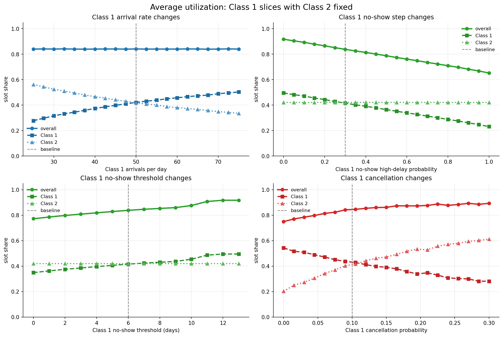
No-show probability graph: No show clearly impacts average utilization. As class
1 has higher no-show probability, class 2 stays constant because they do not get
to take up no-show slots.

No-show threshold graph: Slot share for class 1 gradually rises and has a
noticeable rise when the threshold is set to11. This suggests that there are
may class 1 patients scheduled for day 11 as later supported by Accepted Booking
Delay Distribution.

Overall, no-show behavior is the clearest direct driver. Demand pressure is more subtle:
utilization can stay high even when access is poor.

#### Accepted Booking Delay Distribution

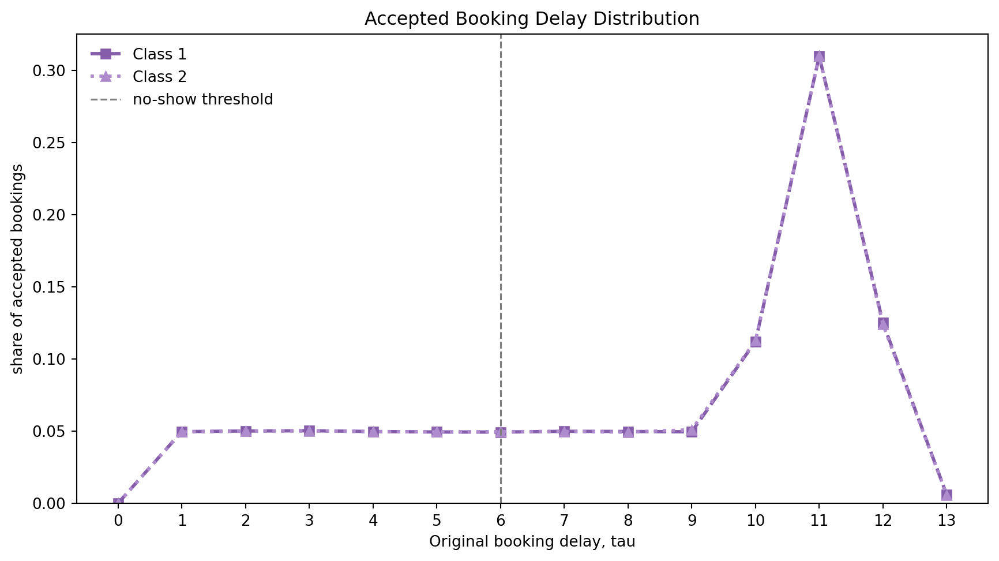

This figure shows the distribution of accepted bookings by original booking delay. It is useful for checking whether accepted appointments are concentrated around specific delay values, such as `tau = 11`, which can explain jumps in no-show-threshold sensitivity plots.

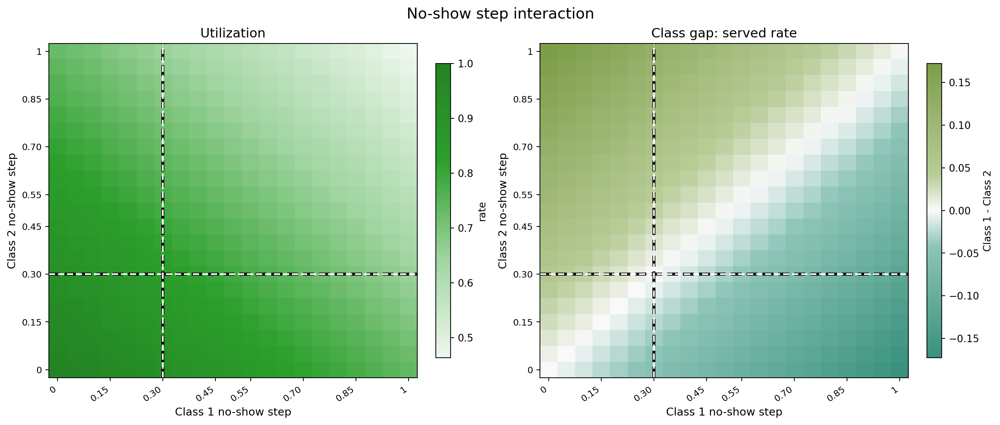

### Overall Served Rate

#### Definition

`overall_percent_serviced` is the main access metric: served arrivals divided by
all arrivals.

#### Sensitivity Readout

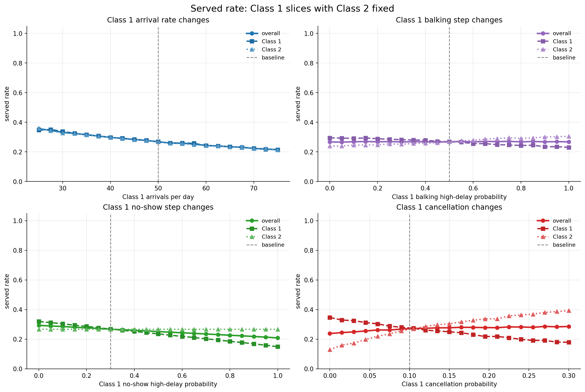

The strongest aggregate driver is total arrival pressure. No-shows and
cancellations reduce completed visits after booking. Balking reduces served rate
because patients reject long-delay offers.

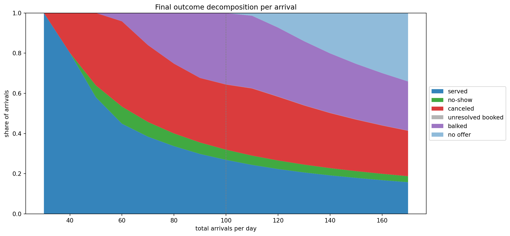

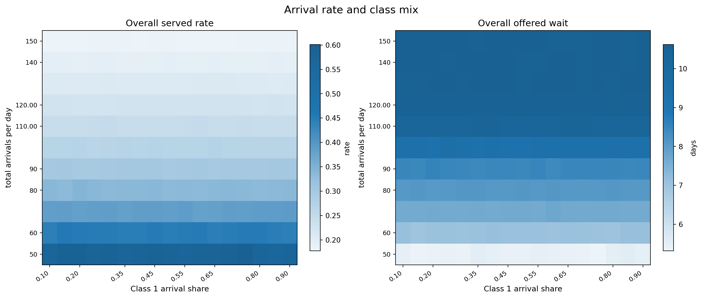

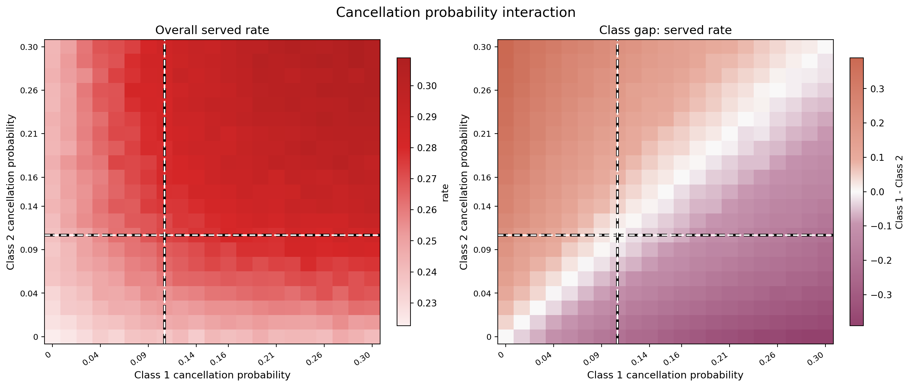

### Mean Offered Booking Delay

#### Definition

`mean_offered_booking_delay` averages the delay offered to patients who received
an offer, including patients who later balked. Patients with `no_offer` are
excluded.

#### Sensitivity Readout

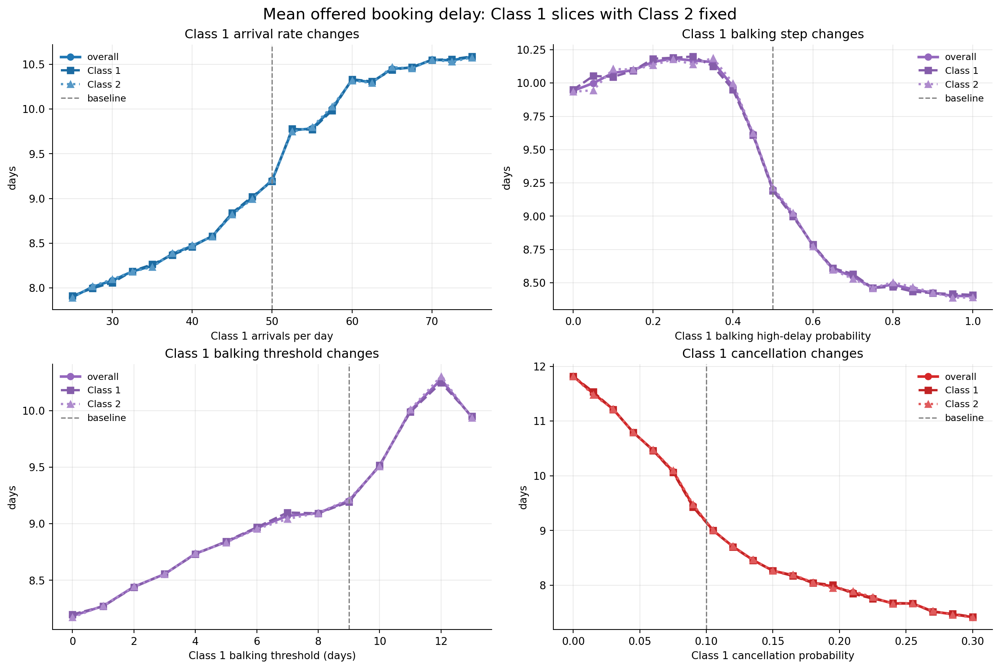

Demand pressure raises offered wait. Balking and cancellation need careful
interpretation because shorter waits can happen when patients leave the system,
not only when access improves.

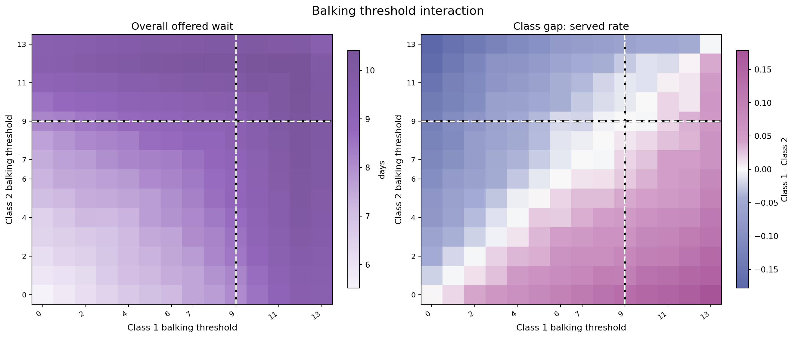

### Balking Rate

#### Definition

`overall_balking_rate` is `balked / offered`. It is a diagnostic for rejected
offers, not a final success metric.

#### Sensitivity Readout

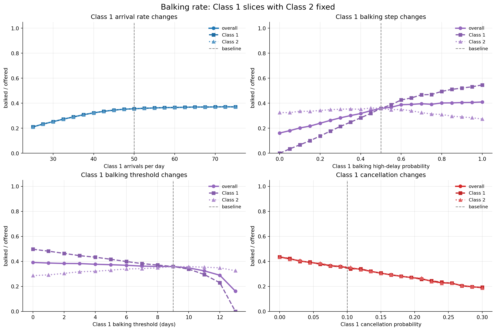

Higher balking step raises rejection after the threshold. Lower threshold starts
that high rejection probability earlier.

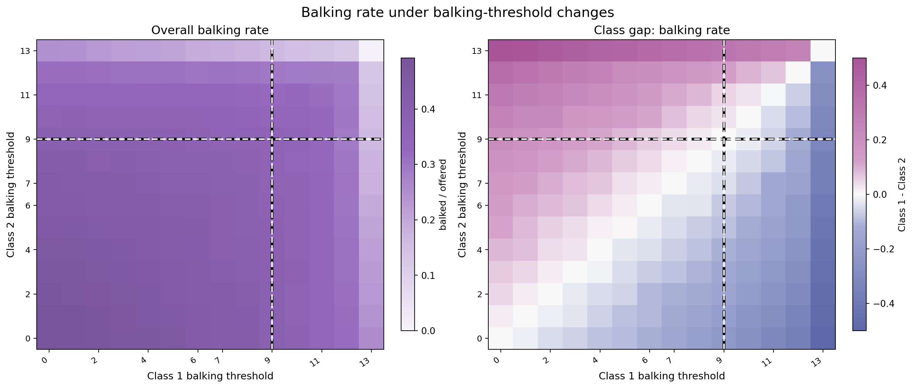

### Class Served-Rate Gap

#### Definition

`access_advantage_class_1 = percent_serviced_1 - percent_serviced_2`. Positive
means Class 1 is served more often; negative means Class 2 is served more often.

#### Sensitivity Readout

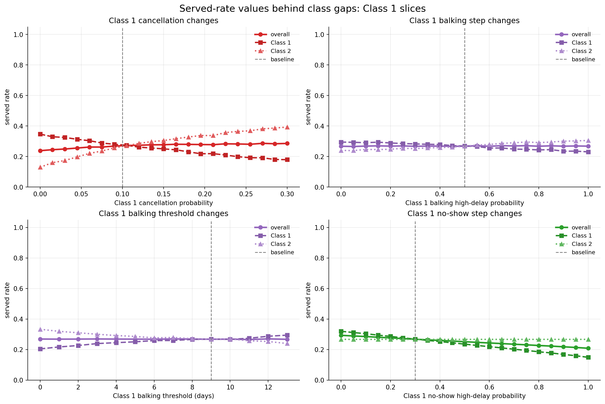

Higher Class 1 cancellation probability, balking step, or no-show step moves the
Class 1 line below the Class 2 line. A higher Class 1 balking threshold helps
Class 1 because it tolerates longer offered waits.

## Balking Deep Dive

The balking deep dive isolates Class 1 balking behavior while Class 2 stays at
baseline. This explains why a lower accepted delay can be a selection effect
rather than a patient-access improvement.

### Class 1 High Balking Probability

This sweep varies only the high balking probability for Class 1. All other
simulation parameters, including Class 2 behavior, stay fixed.

Aggregate utilization remains nearly flat across Class 1 high balking
probabilities. Total demand remains high enough to keep capacity used even when
more Class 1 patients reject long-delay offers.

Class 1 accepted delay declines as high balking probability increases because
long-delay Class 1 patients increasingly reject appointments and leave the
accepted sample.

Offered delay is the broader congestion measure because it includes both
accepted and balked patients. Once enough long-delay Class 1 patients reject
offers, congestion falls and both classes can receive shorter offered delays.

Percent serviced shows the class tradeoff: as Class 1 high balking probability
rises, Class 1 access falls while Class 2 access rises.

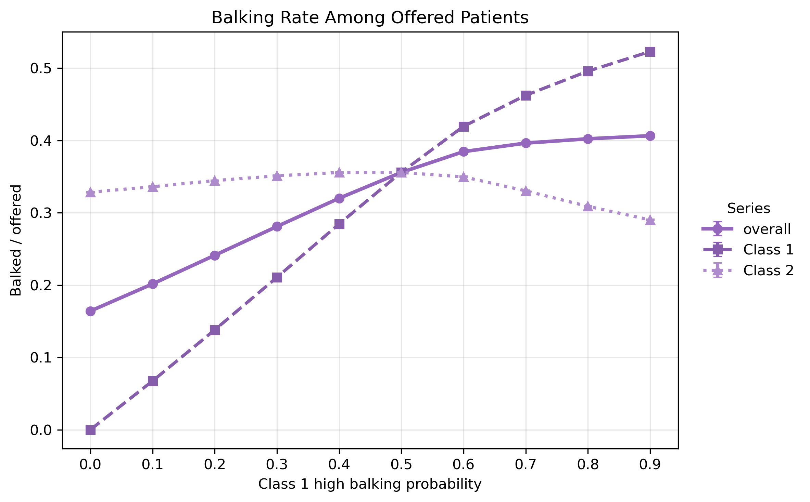

The balking-rate plot confirms that this is a behavioral rejection mechanism,
not just a capacity effect.

### Class 1 Balking Threshold

This sweep varies only the Class 1 balking threshold. Class 1's low and high
balking probabilities remain fixed. With `horizon_days = 14`, possible offered
delays are `tau = 0, 1, ..., 13`.

Aggregate utilization should be read as completed slot use. If the curve is
flat, the threshold mainly redistributes access rather than changing total
completed capacity.

Class 1 accepted delay generally rises as the threshold increases because Class
1 tolerates longer waits before high balking applies.

Mean offered delay shows how the booking horizon changes when Class 1 begins
balking earlier or later.

Percent serviced is the access metric that determines whether shorter accepted
waits are actually good for patients.

The service-gap figure directly shows whether changing the threshold primarily
redistributes service between classes.

## Regression Screen

The regression screen handles significance explicitly. All 12 standardized
coefficients for each target are saved in
`data/regression_standardized_coefficients.csv`
with HC3 robust standard errors, 95% robust confidence intervals, robust
p-values, and a `significant_05_hc3` flag. The figure and table below keep only
coefficients with HC3 robust p-values below 0.05.

For each of 240 randomized FCFS parameter settings, the simulation is run with
seeds `4101` and `4102`, and the two outputs are averaged before regression.
The sampled inputs are then converted into 12 features: total arrival rate,
Class 1 arrival share, average levels, and Class 1 minus Class 2 gaps for
balking step, balking threshold, no-show step, no-show threshold, and
cancellation probability. Four targets are modeled separately:
`average_utilization`, `overall_percent_serviced`, `mean_offered_booking_delay`,
and `access_advantage_class_1`.

The regression is ordinary least squares on standardized variables. Each feature
and each target is centered and scaled before fitting, so a coefficient is read
as the change in target standard deviations associated with a one standard
deviation increase in the feature, holding the other sampled features fixed.
The sign gives direction; the absolute value ranks significant coefficients
within each target.

Significance is assessed with `statsmodels` ordinary least squares and HC3 robust
standard errors. The tested null hypothesis is that the partial standardized
coefficient equals zero after controlling for the other 11 sampled features in
this randomized design. A coefficient is treated as significant when its robust
p-value is below 0.05. This is a screening test for stable linear association in
the simulation design, not proof of a causal effect in real appointment data.

Full-sample and 80/20 train-test R-squared values are saved in
`data/regression_model_scores.csv` as a rough
check that the linear screen is explaining meaningful variation.

| Target metric | Significant feature | Standardized coefficient | 95% HC3 CI | HC3 p-value |
|---|---|---:|---:|---:|
| Utilization | average no-show threshold | 0.512 | [0.433, 0.591] | <0.001 |
| Utilization | average no-show step | -0.423 | [-0.501, -0.346] | <0.001 |
| Utilization | average cancellation probability | 0.320 | [0.247, 0.393] | <0.001 |
| Utilization | total arrival rate | -0.109 | [-0.188, -0.031] | 0.006 |
| Utilization | average balking threshold | -0.086 | [-0.162, -0.009] | 0.028 |
| Overall served rate | total arrival rate | -0.774 | [-0.855, -0.694] | <0.001 |
| Overall served rate | average no-show threshold | 0.251 | [0.193, 0.308] | <0.001 |
| Overall served rate | average no-show step | -0.175 | [-0.232, -0.119] | <0.001 |
| Overall served rate | average cancellation probability | 0.117 | [0.058, 0.176] | <0.001 |
| Offered wait | total arrival rate | 0.576 | [0.499, 0.653] | <0.001 |
| Offered wait | average cancellation probability | -0.441 | [-0.506, -0.376] | <0.001 |
| Offered wait | average balking threshold | 0.278 | [0.202, 0.353] | <0.001 |
| Offered wait | average balking step | -0.206 | [-0.291, -0.122] | <0.001 |
| Class gap | cancellation probability gap | -0.452 | [-0.558, -0.347] | <0.001 |
| Class gap | balking threshold gap | 0.429 | [0.331, 0.528] | <0.001 |
| Class gap | balking step gap | -0.349 | [-0.431, -0.266] | <0.001 |
| Class gap | no-show threshold gap | 0.268 | [0.179, 0.357] | <0.001 |
| Class gap | no-show step gap | -0.211 | [-0.286, -0.136] | <0.001 |
| Class gap | class 1 arrival share | -0.120 | [-0.209, -0.030] | 0.009 |

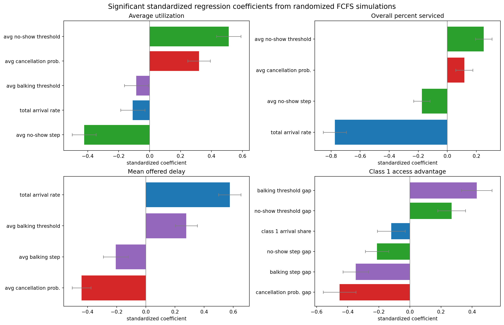

## Bottom Line

Use `overall_percent_serviced` for access and `average_utilization` for capacity
use. Use `mean_offered_booking_delay` for patient-facing wait. Use balking rate
and class gaps as diagnostics that explain why the final metrics moved.
