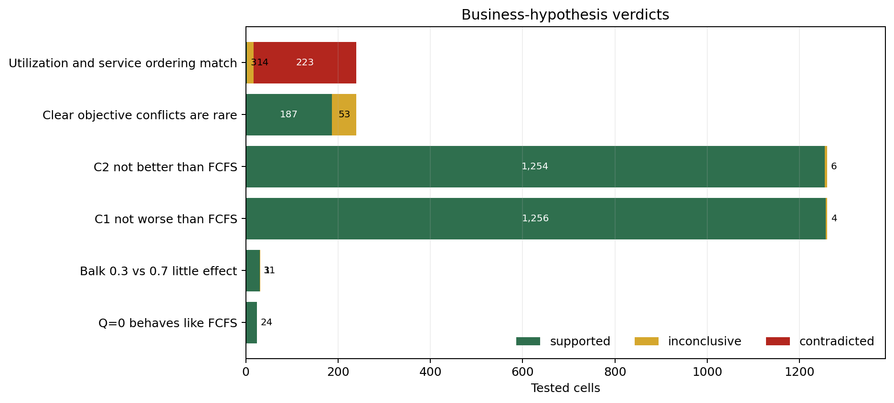
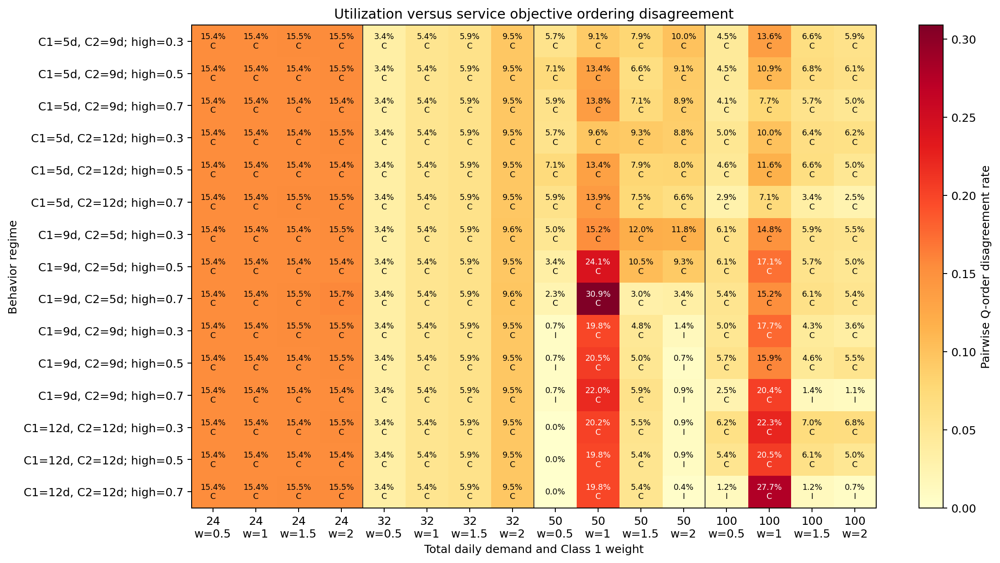
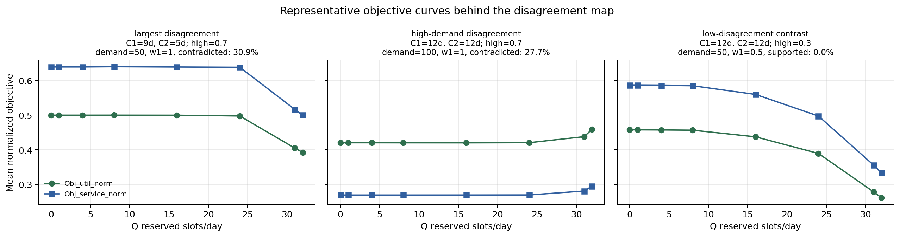
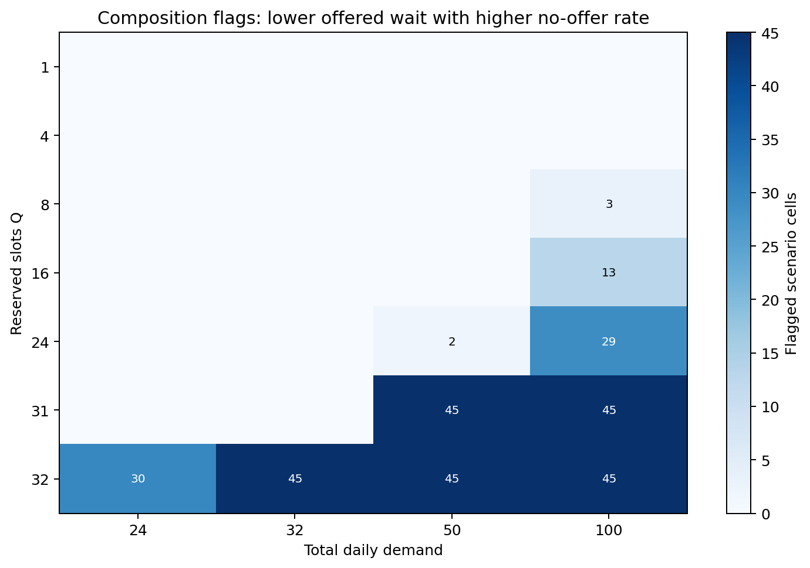

# Strict Reservation Assumption Diagnostics

> **Conclusion.** The strict-reservation simulation passed all hard implementation checks across 28,800 tasks. Most business hypotheses were supported. The objective-ordering checks now use the same primary objectives as the policy-selection report: `Obj_util_norm` and `Obj_service_norm`. Offered-wait improvements also need access checks, because lower offered wait can coincide with higher no-offer rates.

## 1. Purpose

This report is diagnostic. It does not rank reservation quantities, recommend a policy, or assume monotonicity in `Q`. Its goal is to check whether strict Class 1 reservation behaves consistently with the business hypotheses used for later policy comparison.

## 2. Experiment Grid

- 15 behavior regimes: 5 threshold pairs times 3 post-threshold balking rates.
- `C1` and `C2` are class-specific balking thresholds in days; `high` is the post-threshold balking probability.
- `Q = [0,1,4,8,16,24,31,32]` reserved slots per day.
- Total daily demand `[24,32,50,100]` and Class 1 shares `[0.25,0.50,0.75]`.
- 20 seeds per cell, `S=32`, horizon 14, burn-in 30, measurement 365, cooldown 14.
- Profile `standard`; sweep complete: `True`.

## 3. Hard-Check Diagnostics

All hard checks passed: 0 checks had failures and the failed task-count sum was 0. These checks cover configuration validity, accounting, capacity bounds, reservation ownership, deterministic replay, `Q=0` FCFS equivalence, and `Q=32` Class 2 exclusion.

## 4. Business Hypotheses Tested

Verdicts use paired seed-level bootstrap 95% confidence intervals. `supported` means the full interval satisfies the stated tolerance; `contradicted` means the full interval crosses the material boundary in the opposite direction; otherwise the result is `inconclusive`.

| hypothesis | supported | inconclusive | contradicted |
|---|---|---|---|
| Balk 0.3 vs 0.7 little effect | 31 | 1 | 0 |
| C1 not worse than FCFS | 1256 | 4 | 0 |
| C2 not better than FCFS | 1254 | 6 | 0 |
| Q=0 behaves like FCFS | 24 | 0 | 0 |
| Utilization and service ordering match | 3 | 14 | 223 |
| Clear objective conflicts are rare | 187 | 53 | 0 |

Different hypotheses have different numbers of tested cells because they are checked at different aggregation levels. The Class 1 and Class 2 FCFS comparisons are tested for every strict-reservation `Q > 0`, demand level, Class 1 share, and behavior regime. The `Q=0` sanity check only applies when there are no reserved slots, the arrival mix is 50/50, and the class thresholds are symmetric. In that case the reservation rule should reduce to pooled FCFS, so the two class served rates should be similar. The balking-rate check only applies to heavy symmetric-demand settings comparing `high=0.3` with `high=0.7`. The two objective-ordering checks only apply to equal-demand cells, and each is repeated for every tested Class 1 weight. A tested cell is therefore one bootstrap verdict for one hypothesis context, not one simulation run. With this grid, that gives 1,260 Class 1 FCFS-comparison cells, 1,260 Class 2 FCFS-comparison cells, 24 `Q=0` sanity-check cells, 32 balking-rate cells, 240 exact objective-ordering cells, and 240 material-conflict objective cells.

## 5. Main Findings

- Hard implementation checks passed for 28,800 evaluated tasks.
- Business-hypothesis cells: 2,755 supported, 78 inconclusive, and 223 contradicted.
- The Class 1 protection hypothesis was not contradicted: Class 1 service did not materially fall versus matched FCFS in the tested cells.
- The Class 2 non-improvement hypothesis was not contradicted: strict reservation did not materially improve Class 2 service versus FCFS.
- The `Q=0` sanity check passed: with no reserved slots and symmetric inputs, the reservation implementation did not create an artificial class difference.
- The exact objective-ordering check asks whether the utilization objective and the service-rate objective rank every pair of `Q` values in the same way. This is intentionally strict and can flag flat or near-flat regions where the mean curves look visually similar.
- The clear-conflict check asks the more practical question: when both objectives see a real difference between two `Q` values, do they clearly pull in opposite directions? No cells contradicted that narrower assumption.

## 6. Contradicted Or Inconclusive Hypotheses

| hypothesis | status | cells | demand_values | q_values | regimes | minimum_effect | maximum_effect |
|---|---|---|---|---|---|---|---|
| Utilization and service ordering match | contradicted | 223 | 24, 32, 50, 100 | n/a | 15 | 0.0232 | 0.3089 |
| Balk 0.3 vs 0.7 little effect | inconclusive | 1 | 100 | 31 | 0 | 0.003 | 0.003 |
| C1 not worse than FCFS | inconclusive | 4 | 50 | 1 | 4 | -0.0032 | 0.0013 |
| C2 not better than FCFS | inconclusive | 6 | 50, 100 | 1, 4, 8 | 5 | -0.0006 | 0.0032 |
| Clear objective conflicts are rare | inconclusive | 53 | 24, 32, 50, 100 | n/a | 15 | 0.0018 | 0.0125 |
| Utilization and service ordering match | inconclusive | 14 | 50, 100 | n/a | 6 | 0.0036 | 0.0143 |

The exact objective-ordering rows compare `Obj_util_norm` with `Obj_service_norm`, the two primary objectives from the policy-selection report. A disagreement means the two objectives rank at least one pair of `Q` values differently within the same seed, demand, behavior regime, and weight. This can happen even when the plotted means do not cross, because the check is pairwise and seed-level. The clear-conflict rows are easier to read with the plots: they ignore tiny differences and only ask whether the two objectives clearly prefer opposite `Q` values. In this run, that narrower check had no contradicted cells, so the objectives often differ in detailed ordering but rarely give a strong visual conflict. `T_wait_offered` is not included in either ordering hypothesis because it is conditional on receiving an offer and can look better when access worsens. In the figure, `C` marks contradicted cells and `I` marks inconclusive cells.

The example lines below show a few cells from the heatmap. They plot seed-averaged `Obj_util_norm` and `Obj_service_norm` against `Q`, so the disagreement is easier to see: the two curves can be flat, peak at different reservation quantities, or move at different rates.

## 7. Composition Effects: Offered Wait Versus No-Offer Rate

302 of 1,260 checked cells show a confidently lower offered wait together with a confidently higher no-offer rate. This is a composition warning, not a policy benefit. 255 of those flags occur at `Q=31` or `Q=32`, where protected capacity can remove patients from the offered population.

| total_demand | flagged_cells |
|---|---|
| 24 | 30 |
| 32 | 45 |
| 50 | 92 |
| 100 | 135 |

## 8. Limitations

- The checks test model behavior under the chosen sweep; they do not prove the policy is operationally acceptable.
- Same seeds provide matched labels, but policy-dependent RNG use means they are not exact common-random-number experiments.
- The 0.005 tolerance is a practical threshold, not a clinical or operational access requirement.
- Offered waiting time is conditional on receiving an offer, so it must be read with no-offer and service-rate diagnostics.
- Objective-ordering disagreement, if present, means normalized utilization and normalized service rate should not be treated as interchangeable objectives.

## 9. Next Steps

Next steps are tracked in the shared reservation note: [Reservation Analysis Next Steps](../next_steps.md).

## Files

- Hard-check summary: `tables/violation_summary.csv`
- Business assumptions: `tables/business_assumptions.csv`
- Composition flags: `tables/composition_flags.csv`
- Cell summary: `tables/cell_summary.csv`
- Compact hypothesis status: `tables/hypothesis_status_summary.csv`
- Non-supported hypotheses: `tables/non_supported_hypotheses.csv`
- Composition summary: `tables/composition_summary.csv`
