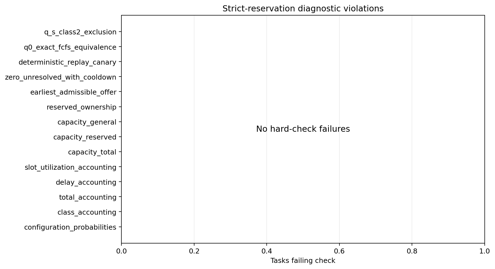
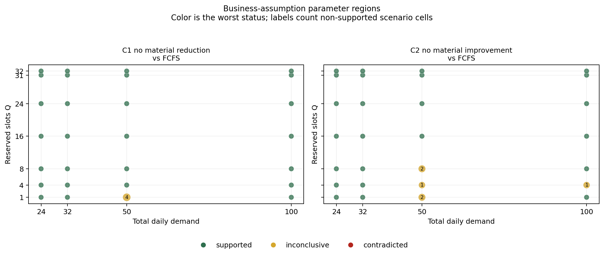

# Strict Reservation Assumption Diagnostics

- Profile: `standard`
- Tasks analyzed: 28,800 of 28,800
- Sweep complete: `True`
- Hard-check failed task-count sum: 0
- Paired bootstrap draws: 4,000
- Material-effect tolerance: 0.005

This report is diagnostic. It does not rank reservation quantities, recommend a policy, or assume monotonicity in Q.

## Hard Checks

| check | tasks_evaluated | failed_tasks | passed_tasks |
|---|---|---|---|
| configuration_probabilities | 28800 | 0 | 28800 |
| class_accounting | 28800 | 0 | 28800 |
| total_accounting | 28800 | 0 | 28800 |
| delay_accounting | 28800 | 0 | 28800 |
| slot_utilization_accounting | 28800 | 0 | 28800 |
| capacity_total | 28800 | 0 | 28800 |
| capacity_reserved | 28800 | 0 | 28800 |
| capacity_general | 28800 | 0 | 28800 |
| reserved_ownership | 28800 | 0 | 28800 |
| earliest_admissible_offer | 28800 | 0 | 28800 |
| zero_unresolved_with_cooldown | 28800 | 0 | 28800 |
| deterministic_replay_canary | 2 | 0 | 2 |
| q0_exact_fcfs_equivalence | 3600 | 0 | 3600 |
| q_s_class2_exclusion | 3600 | 0 | 3600 |

## Business Assumptions

Verdicts use paired seed-level bootstrap 95% confidence intervals. `supported` means the full interval satisfies the stated tolerance; `contradicted` means the full interval crosses the material boundary in the opposite direction; otherwise the result is `inconclusive`.

| Status | Cells |
|---|---:|
| supported | 2,595 |
| inconclusive | 12 |
| contradicted | 29 |

### Results By Assumption

| assumption | supported | inconclusive | contradicted |
|---|---|---|---|
| Additive and pooled objective ordering is consistent | 30 | 1 | 29 |
| Balk 0.3 vs 0.7 has little heavy symmetric effect | 31 | 1 | 0 |
| C1 no material reduction vs FCFS | 1256 | 4 | 0 |
| C2 no material improvement vs FCFS | 1254 | 6 | 0 |
| Symmetric FCFS has similar class served rates | 24 | 0 | 0 |

### Contradicted Assumptions

| assumption | cells | demand_values | regimes | minimum_effect | maximum_effect |
|---|---|---|---|---|---|
| Additive and pooled objective ordering is consistent | 29 | 50, 100 | 15 | 0.0125 | 0.2304 |

For the objective-ordering check, equal demand means equal configured arrival rates. Realized Poisson arrivals can still differ between classes within a seed, so the additive and pooled formulas are not guaranteed to be proportional.

## Composition Diagnostic

302 cells show a confidently lower offered wait together with a confidently higher no-offer rate. Such cells are flagged as denominator-composition diagnostics, not policy benefits.

## Files

- Hard-check summary: `tables/violation_summary.csv`
- Business assumptions: `tables/business_assumptions.csv`
- Composition flags: `tables/composition_flags.csv`
- Cell summary: `tables/cell_summary.csv`
