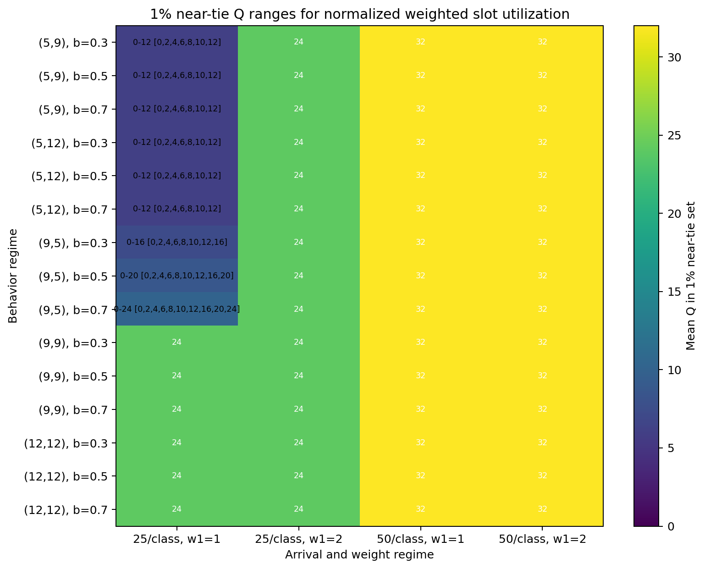
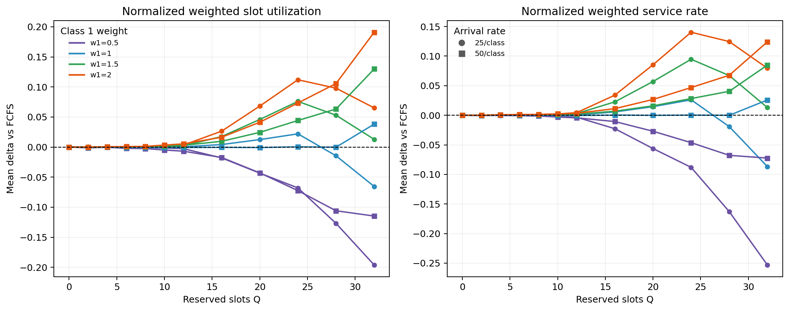
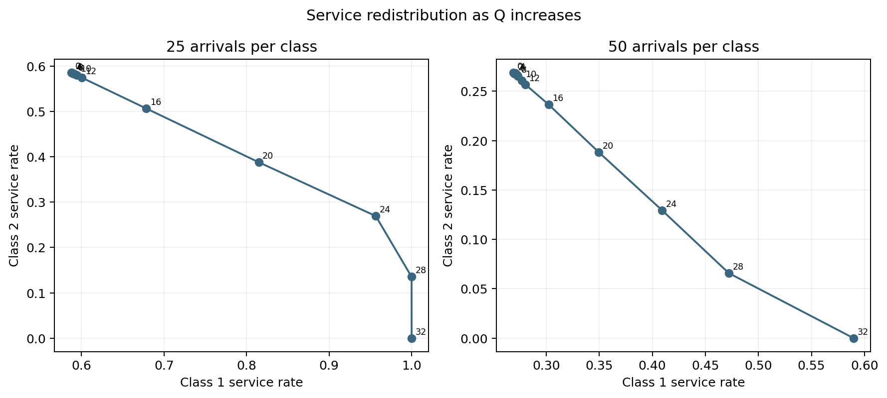
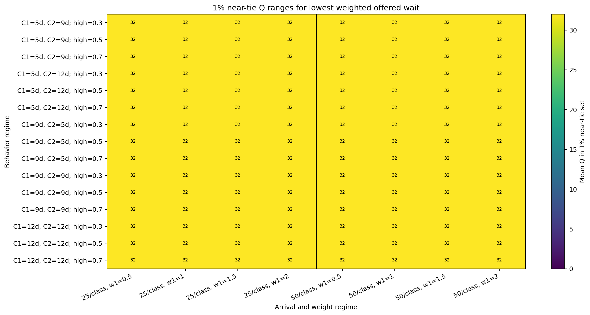
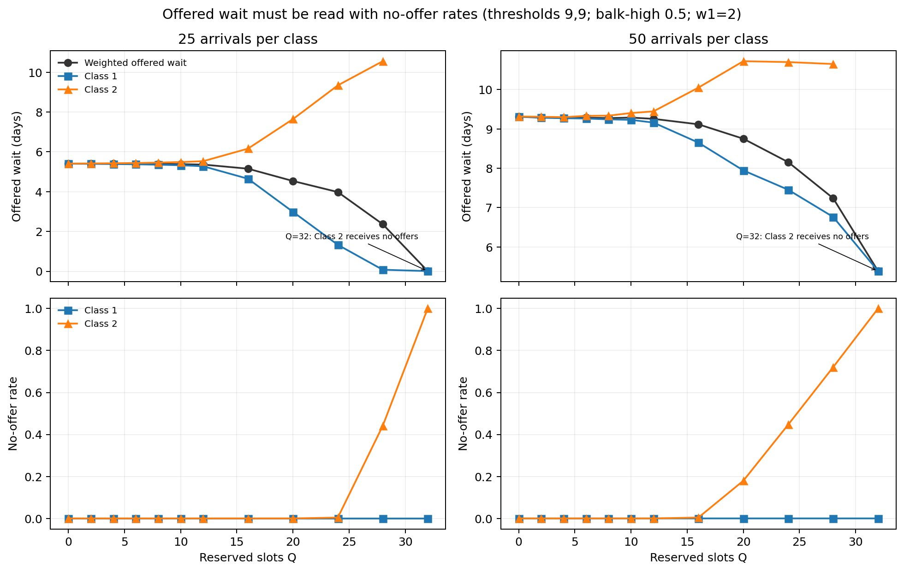
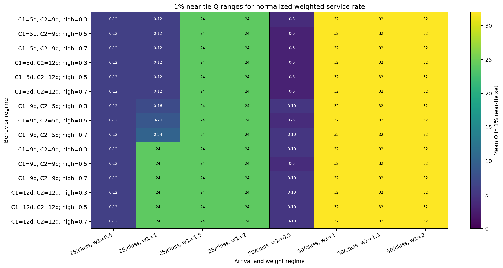

# Strict Class 1 Reservation: Policy-Selection Results

> **Conclusion.** Strict reservation raises both normalized weighted objectives in many tested cells, but the gains are produced by moving service toward Class 1. The expanded weight sweep shows why the chosen Class 1 weight matters: low `w1` keeps low-Q ranges competitive, while `w1 >= 1` pushes high-demand settings toward `Q=32`. The lowest offered waiting time is not an overall access improvement.

## 1. Purpose

This report identifies reservation quantities that perform similarly under two primary normalized objectives. It compares every Q with pooled FCFS (`Q=0`) and does not treat offered waiting time as an access objective by itself.

## 2. Experiment Grid

- 5 balking-threshold pairs and 3 common post-threshold balking rates.
- Equal Class 1 and Class 2 arrival rates of 25 or 50 per day.
- `Q = [0,2,4,6,8,10,12,16,20,24,28,32]`.
- Class 1 weights `w1 = [0.5,1,1.5,2]` with `w2 = 1`; 20 seeds per simulation cell.
- Capacity 32/day, horizon 14, burn-in 30, measurement 365, cooldown 14.

## 3. Objective Definitions

With `S = 32 × 365` measured slots:

$$Obj_{util,raw}=w_1\frac{Y_1}{S}+w_2\frac{Y_2}{S},\qquad Obj_{util,norm}=\frac{Obj_{util,raw}}{w_1+w_2}.$$

$$Obj_{service,raw}=w_1\frac{Y_1}{A_1}+w_2\frac{Y_2}{A_2},\qquad Obj_{service,norm}=\frac{Obj_{service,raw}}{w_1+w_2}.$$

$$T_{wait,offered}=\frac{w_1\sum\tau_{offered,1}+w_2\sum\tau_{offered,2}}{w_1\,\mathrm{offered}_1+w_2\,\mathrm{offered}_2}.$$

The normalized utilization and service values are the primary comparison objectives. Raw values are retained. Offered waiting time is secondary and conditional on receiving an offer.

## 4. Main Findings

- A positive-Q policy exceeds FCFS in mean normalized utilization in 93 of 120 scenario-weight cells; a positive Q appears in the 1% near-tie set in 120 cells. The median best-strict delta is +0.041.
- A positive-Q policy exceeds FCFS in mean normalized service rate in 102 of 120 cells; a positive Q appears in the 1% near-tie set in 120 cells. The median best-strict delta is +0.051.
- Several Q values are effectively equivalent in 39 utilization cells and 39 service-rate cells.
- At 25 arrivals per class, the utilization ranges are sensitive to `w1`: lower Class 1 weights keep more low-Q and FCFS-equivalent ranges, while larger weights move the range upward.
- At 50 arrivals per class, the utilization ranges concentrate at high `Q`. These cells must be read with Class 2 access because high `Q` approaches full Class 1 protection.

## 5. Utilization Best-Q Ranges By Regime

The heatmap below shows 1% near-tie ranges for normalized weighted slot utilization, not forced unique optima. These are mathematical candidates, not access-constrained policy recommendations. The detailed tables are moved to the appendix.
`C1` and `C2` are the class-specific balking thresholds in days; `high` is the post-threshold balking probability. The solid vertical line separates 25 arrivals per class from 50 arrivals per class.

The utilization map shows how weighting Class 1 and increasing demand move the practically equivalent reservation region.

## 6. FCFS Comparison

Positive values indicate improvement over matched-seed FCFS. The representative symmetric regime sweeps `w1` from 0.5 to 2.0 in steps of 0.5. Color shows the Class 1 weight; marker shape shows the arrival rate. The improvement is weighted: it does not mean both classes improve.

## 7. Class Tradeoffs

Increasing Q generally moves service toward Class 1 and away from Class 2. The star marks the highest service objective in this representative slice for `w1=2`, and the dashed line shows an example iso-objective line: points on it have the same weighted service value. The lighter diamond and X show where the utilization and offered-wait objectives point on the same service-rate tradeoff curve. An objective improvement should therefore be read as a weighted tradeoff, not as a simultaneous improvement for both classes.

## 8. Offered Waiting Time And No-Offer Composition Effects

The offered-wait heatmap shows the Q ranges that minimize `T_wait_offered`. This heatmap must be read with the no-offer diagnostic below, because lower offered wait can come from excluding patients from offers.

Under the pre-specified strict flag, both class no-offer rates rise in 0 of 120 minimum-wait cells. However, all 120 minimum-wait cells select `Q=32`, where Class 2 receives no offers and its waiting-time line is undefined. The lower weighted offered wait is therefore an access-composition effect, not a true overall waiting-time improvement.

## 9. Limitations

- Same seeds provide matched labels, but policy-dependent RNG use means they are not exact common-random-number experiments.
- The utilization objective follows measured-arrival cohorts through cooldown; it is not identical to measured-service-day utilization.
- Results use a 1% practical-equivalence rule and 20 seeds.
- No reservation cost or external access constraint is imposed.
- The reported best Q values maximize the stated weighted objectives; they should not be adopted without a Class 2 access requirement.

## 10. Next Steps

Next steps are tracked in the shared reservation note: [Reservation Analysis Next Steps](../next_steps.md).

## Appendix: Detailed Utilization Tables

These tables give the full 1% near-tie Q ranges behind the utilization heatmap. Bracketed lists show the tested Q values represented by each range.

### Lambda = 25 arrivals per class

| behavior | w1=0.5 | w1=1 | w1=1.5 | w1=2 |
|---|---|---|---|---|
| C1=12d, C2=12d; high=0.3 | 0-12 [0,2,4,6,8,10,12] | 24 | 24 | 24 |
| C1=12d, C2=12d; high=0.5 | 0-12 [0,2,4,6,8,10,12] | 24 | 24 | 24 |
| C1=12d, C2=12d; high=0.7 | 0-12 [0,2,4,6,8,10,12] | 24 | 24 | 24 |
| C1=5d, C2=12d; high=0.3 | 0-12 [0,2,4,6,8,10,12] | 0-12 [0,2,4,6,8,10,12] | 24 | 24 |
| C1=5d, C2=12d; high=0.5 | 0-12 [0,2,4,6,8,10,12] | 0-12 [0,2,4,6,8,10,12] | 24 | 24 |
| C1=5d, C2=12d; high=0.7 | 0-12 [0,2,4,6,8,10,12] | 0-12 [0,2,4,6,8,10,12] | 24 | 24 |
| C1=5d, C2=9d; high=0.3 | 0-12 [0,2,4,6,8,10,12] | 0-12 [0,2,4,6,8,10,12] | 24 | 24 |
| C1=5d, C2=9d; high=0.5 | 0-12 [0,2,4,6,8,10,12] | 0-12 [0,2,4,6,8,10,12] | 24 | 24 |
| C1=5d, C2=9d; high=0.7 | 0-12 [0,2,4,6,8,10,12] | 0-12 [0,2,4,6,8,10,12] | 24 | 24 |
| C1=9d, C2=5d; high=0.3 | 0-12 [0,2,4,6,8,10,12] | 0-16 [0,2,4,6,8,10,12,16] | 24 | 24 |
| C1=9d, C2=5d; high=0.5 | 0-12 [0,2,4,6,8,10,12] | 0-20 [0,2,4,6,8,10,12,16,20] | 24 | 24 |
| C1=9d, C2=5d; high=0.7 | 0-12 [0,2,4,6,8,10,12] | 0-24 [0,2,4,6,8,10,12,16,20,24] | 24 | 24 |
| C1=9d, C2=9d; high=0.3 | 0-12 [0,2,4,6,8,10,12] | 24 | 24 | 24 |
| C1=9d, C2=9d; high=0.5 | 0-12 [0,2,4,6,8,10,12] | 24 | 24 | 24 |
| C1=9d, C2=9d; high=0.7 | 0-12 [0,2,4,6,8,10,12] | 24 | 24 | 24 |

### Lambda = 50 arrivals per class

| behavior | w1=0.5 | w1=1 | w1=1.5 | w1=2 |
|---|---|---|---|---|
| C1=12d, C2=12d; high=0.3 | 0-8 [0,2,4,6,8] | 32 | 32 | 32 |
| C1=12d, C2=12d; high=0.5 | 0-10 [0,2,4,6,8,10] | 32 | 32 | 32 |
| C1=12d, C2=12d; high=0.7 | 0-10 [0,2,4,6,8,10] | 32 | 32 | 32 |
| C1=5d, C2=12d; high=0.3 | 0-8 [0,2,4,6,8] | 32 | 32 | 32 |
| C1=5d, C2=12d; high=0.5 | 0-8 [0,2,4,6,8] | 32 | 32 | 32 |
| C1=5d, C2=12d; high=0.7 | 0-6 [0,2,4,6] | 32 | 32 | 32 |
| C1=5d, C2=9d; high=0.3 | 0-8 [0,2,4,6,8] | 32 | 32 | 32 |
| C1=5d, C2=9d; high=0.5 | 0-8 [0,2,4,6,8] | 32 | 32 | 32 |
| C1=5d, C2=9d; high=0.7 | 0-8 [0,2,4,6,8] | 32 | 32 | 32 |
| C1=9d, C2=5d; high=0.3 | 0-10 [0,2,4,6,8,10] | 32 | 32 | 32 |
| C1=9d, C2=5d; high=0.5 | 0-10 [0,2,4,6,8,10] | 32 | 32 | 32 |
| C1=9d, C2=5d; high=0.7 | 0-10 [0,2,4,6,8,10] | 32 | 32 | 32 |
| C1=9d, C2=9d; high=0.3 | 0-10 [0,2,4,6,8,10] | 32 | 32 | 32 |
| C1=9d, C2=9d; high=0.5 | 0-8 [0,2,4,6,8] | 32 | 32 | 32 |
| C1=9d, C2=9d; high=0.7 | 0-10 [0,2,4,6,8,10] | 32 | 32 | 32 |

## Appendix: Service-Rate Heatmap

The service-rate objective is retained as a secondary primary objective, but its heatmap is placed here so the main body focuses on the utilization view requested for visual selection.

The service-rate map separates access performance from capacity-based performance; the two objectives need not choose the same range.

Data tables: `tables/scenario_level_summary.csv` and `tables/best_q_summary.csv`; explicit near-tie members are in `tables/near_tie_q_ranges.csv`. Full run-level outputs remain under `outputs/strict_reservation_policy_selection/standard/`.
