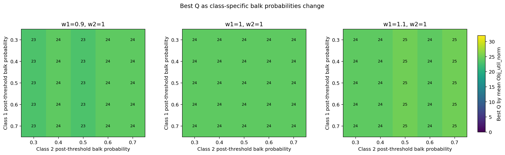
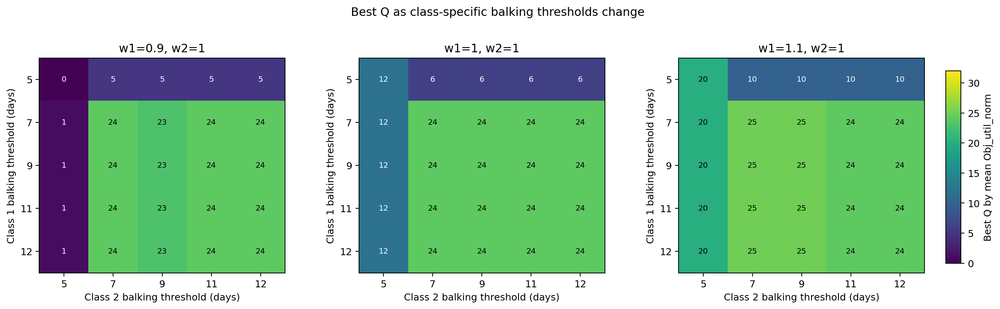
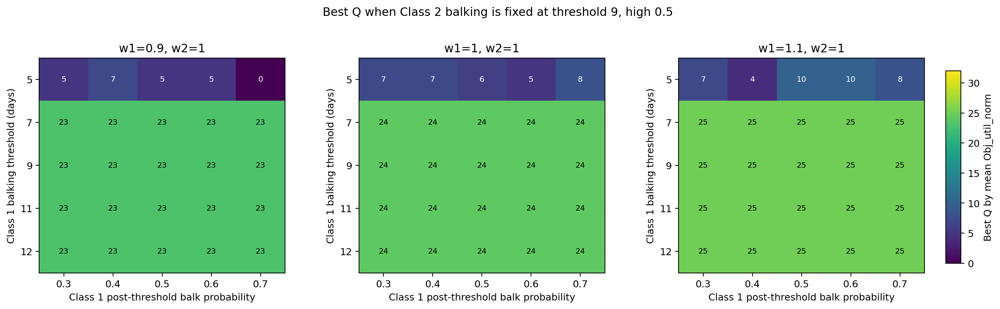
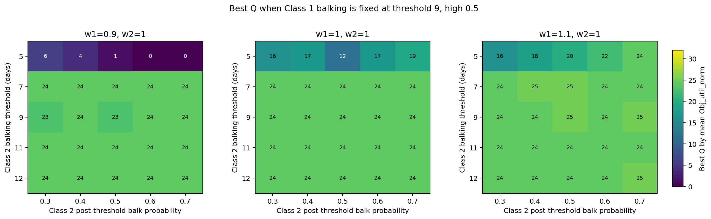
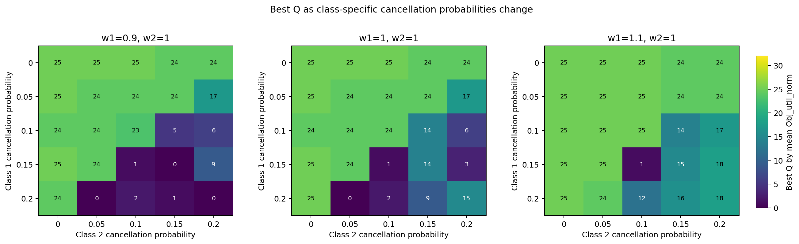
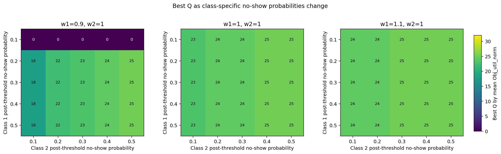
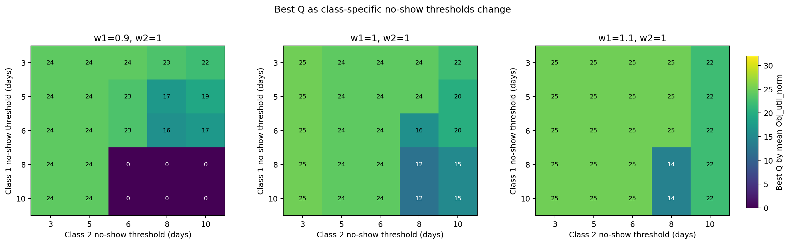
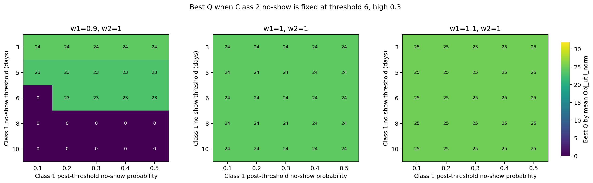
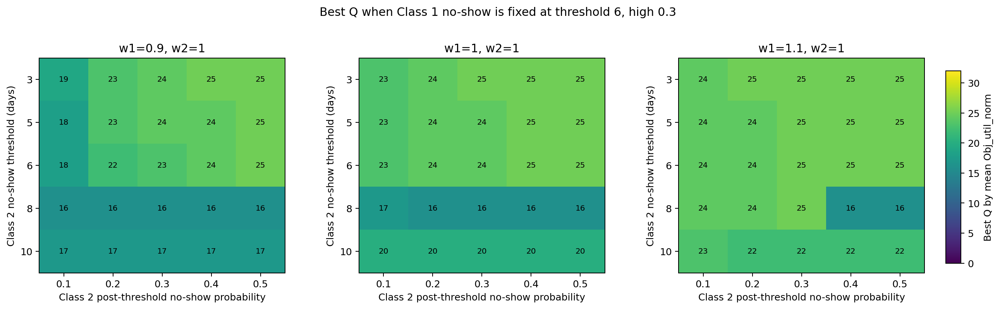

# Local Weight And Behavior Sensitivity For Strict Reservation

> **Conclusion.** This report checks whether small changes around equal class weights change the reservation quantity selected by the normalized utilization objective. It varies `w1 = [0.9, 1.0, 1.1]` with `w2 = 1.0` under equal demand of 25 arrivals per class, then varies balking, cancellation, and no-show behavior one block at a time.

## 1. Purpose

The goal is to see how sensitive the best reservation quantity `Q` is to small changes in Class 1 weight and to class-specific patient behavior. This is exploratory and does not recommend a policy.

## 2. Experiment Grid

- Strict Class 1 reservation only.
- Equal demand: `lambda_1 = lambda_2 = 25` per day.
- `Q` uses every integer from 0 through 32.
- Weights: `w1 = [0.9,1.0,1.1]`, `w2 = 1.0`.
- Balk probabilities: `[0.3,0.4,0.5,0.6,0.7]`.
- Balking thresholds: `[5,7,9,11,12]` days.
- Cancellation probabilities: `[0,0.05,0.1,0.15,0.2]`.
- No-show probabilities: `[0.1,0.2,0.3,0.4,0.5]`.
- No-show thresholds: `[3,5,6,8,10]` days.
- 20 seeds, capacity 32/day, horizon 14, burn-in 30, measurement 365, cooldown 14.
- In each behavior block, the other two behaviors are fixed at baseline: cancellation 0.10, balking threshold 9/high 0.50, and no-show threshold 6/high 0.30.

## 3. Objective Used In The Plots

The plots use normalized weighted slot utilization:

$$Obj_{util,norm}=\frac{w_1\frac{Y_1}{S}+w_2\frac{Y_2}{S}}{w_1+w_2}.$$

Color and cell labels show the best `Q` by mean objective value across seeds. `Q=0` is pooled FCFS. Near-tie ranges are saved in `tables/best_q_summary.csv`.

## 4. Summary By Analysis Family

| analysis_family | w1 | median_best_q | low_best_q | high_best_q | median_delta_vs_fcfs |
|---|---|---|---|---|---|
| balk_probability_grid | 0.9 | 24.0 | 23.0 | 24.0 | 0.0077 |
| balk_probability_grid | 1.0 | 24.0 | 24.0 | 24.0 | 0.0219 |
| balk_probability_grid | 1.1 | 24.0 | 24.0 | 25.0 | 0.0351 |
| balk_threshold_grid | 0.9 | 23.0 | 0.0 | 24.0 | 0.0067 |
| balk_threshold_grid | 1.0 | 24.0 | 6.0 | 24.0 | 0.021 |
| balk_threshold_grid | 1.1 | 24.0 | 10.0 | 25.0 | 0.0339 |
| cancellation_probability_grid | 0.9 | 24.0 | 0.0 | 25.0 | 0.0352 |
| cancellation_probability_grid | 1.0 | 24.0 | 0.0 | 25.0 | 0.0442 |
| cancellation_probability_grid | 1.1 | 24.0 | 1.0 | 25.0 | 0.0524 |
| class1_balk_surface | 0.9 | 23.0 | 0.0 | 23.0 | 0.0074 |
| class1_balk_surface | 1.0 | 24.0 | 5.0 | 24.0 | 0.0215 |
| class1_balk_surface | 1.1 | 25.0 | 4.0 | 25.0 | 0.0349 |
| class1_no_show_surface | 0.9 | 23.0 | 0.0 | 24.0 | 0.0006 |
| class1_no_show_surface | 1.0 | 24.0 | 24.0 | 24.0 | 0.0144 |
| class1_no_show_surface | 1.1 | 25.0 | 25.0 | 25.0 | 0.0275 |
| class2_balk_surface | 0.9 | 24.0 | 0.0 | 24.0 | 0.0079 |
| class2_balk_surface | 1.0 | 24.0 | 12.0 | 24.0 | 0.0222 |
| class2_balk_surface | 1.1 | 24.0 | 16.0 | 25.0 | 0.0351 |
| class2_no_show_surface | 0.9 | 19.0 | 16.0 | 25.0 | 0.0158 |
| class2_no_show_surface | 1.0 | 23.0 | 16.0 | 25.0 | 0.0215 |
| class2_no_show_surface | 1.1 | 24.0 | 16.0 | 25.0 | 0.0349 |
| no_show_probability_grid | 0.9 | 22.0 | 0.0 | 25.0 | 0.0079 |
| no_show_probability_grid | 1.0 | 24.0 | 23.0 | 25.0 | 0.0215 |
| no_show_probability_grid | 1.1 | 25.0 | 24.0 | 25.0 | 0.0349 |
| no_show_threshold_grid | 0.9 | 23.0 | 0.0 | 24.0 | 0.0143 |
| no_show_threshold_grid | 1.0 | 24.0 | 12.0 | 25.0 | 0.0264 |
| no_show_threshold_grid | 1.1 | 25.0 | 14.0 | 25.0 | 0.0382 |

## 5. Balking Sensitivity

This grid varies the post-threshold balking probability for both classes while keeping both thresholds at 9 days. Cancellation and no-show behavior are fixed at baseline.

This grid varies the balking threshold for both classes while keeping both post-threshold balking probabilities at 0.5.

Class 2 is fixed at threshold 9 days and post-threshold balking probability 0.5. Class 1 threshold and post-threshold balking probability vary.

Class 1 is fixed at threshold 9 days and post-threshold balking probability 0.5. Class 2 threshold and post-threshold balking probability vary.

## 6. Cancellation Sensitivity

This grid varies the cancellation probability for both classes. Balking and no-show behavior are fixed at baseline.

## 7. No-Show Sensitivity

This grid varies the post-threshold no-show probability for both classes while keeping both no-show thresholds at 6 days. Balking and cancellation behavior are fixed at baseline.

This grid varies the no-show threshold for both classes while keeping both post-threshold no-show probabilities at 0.3.

Class 2 no-show behavior is fixed at threshold 6 days and post-threshold probability 0.3. Class 1 no-show threshold and post-threshold probability vary.

Class 1 no-show behavior is fixed at threshold 6 days and post-threshold probability 0.3. Class 2 no-show threshold and post-threshold probability vary.

## 8. Interpretation Notes

- These plots show mathematical best Q values for `Obj_util_norm`; they are not access-constrained recommendations.
- Small changes from `w1=0.9` to `w1=1.1` are useful for detecting whether the equal-weight case is fragile.
- Service-rate objective results are saved in `tables/best_q_summary.csv` but not plotted here to keep the report compact.
- Offered wait is not used as a selection objective in this report.

## Files

- Best-Q table: `tables/best_q_summary.csv`
- Compact family summary: `tables/family_weight_summary.csv`
