```{python}
from pathlib import Path
import numpy as np
import pandas as pd
import matplotlib.pyplot as plt
from IPython.display import display, Markdown

# -------------------------------------------------------------------
# Locate repository and load finalized factorial outputs.
# -------------------------------------------------------------------
cwd = Path.cwd().resolve()
repo_candidates = [cwd, *cwd.parents]

REPO = next(
    (
        p for p in repo_candidates
        if (p / "full_run_summaries").exists()
        and (p / "outputs").exists()
    ),
    None,
)

if REPO is None:
    raise FileNotFoundError(
        "Could not locate the CUIMC-Appointment-Simulation repository root."
    )

ROOT = (
    REPO
    / "full_run_summaries"
    / "patient_behavior_factorial_3_5"
    / "release"
)

required = [
    ROOT / "selected_policy_seed_outcomes.csv",
    ROOT / "selected_policy_outcomes.csv",
]

missing = [p for p in required if not p.exists()]
if missing:
    raise FileNotFoundError(
        "Required report inputs are missing.\n\n"
        "Expected the finalized 3×3 release outputs locally under:\n"
        f"{ROOT}\n\n"
        "Missing:\n"
        + "\n".join(str(p) for p in missing)
    )

seed = pd.read_csv(ROOT / "selected_policy_seed_outcomes.csv")
selected = pd.read_csv(ROOT / "selected_policy_outcomes.csv")

# The finalized release files already carry the factorial/background metadata
# needed by this report. Do not require the old experiment-bank CSV.

FIG = Path("figures")
FIG.mkdir(parents=True, exist_ok=True)

AVG_OBJ = "average_utilization"
WEIGHTED_OBJ = "priority_weighted_utilization"

POLICIES = ["horizon_only", "reservation_only", "both_flexible"]
POLICY_LABELS = {
    "horizon_only": "Horizon only",
    "reservation_only": "Reservation only",
    "both_flexible": "Both flexible",
}

LEVEL_ORDER = ["low", "medium", "high"]
LEVEL_LABELS = {
    "low": "Low",
    "medium": "Medium",
    "high": "High",
}

# -------------------------------------------------------------------
# Normalize/restore design metadata from the finalized release files.
# -------------------------------------------------------------------
def _standardize_design_columns(frame):
    out = frame.copy()

    # Standardize common alternative column names if necessary.
    aliases = {
        "daily_capacity": "capacity",
        "slots_per_day": "capacity",
        "class_1_share": "class1_share",
        "no_show_level": "noshow_level",
        "balking_level": "balk_level",
    }

    for source, target in aliases.items():
        if target not in out.columns and source in out.columns:
            out[target] = out[source]

    # Derive rho/share only when raw arrival-rate columns are available.
    if "rho" not in out.columns:
        if {
            "lambda_1",
            "lambda_2",
            "capacity",
        }.issubset(out.columns):
            out["rho"] = (
                out["lambda_1"] + out["lambda_2"]
            ) / out["capacity"]

    if "class1_share" not in out.columns:
        if {"lambda_1", "lambda_2"}.issubset(out.columns):
            total_arrival = out["lambda_1"] + out["lambda_2"]
            out["class1_share"] = np.where(
                total_arrival > 0,
                out["lambda_1"] / total_arrival,
                np.nan,
            )

    # Recover behavior labels only when the underlying probabilities are present.
    if "noshow_level" not in out.columns and "noshow_high_1" in out.columns:
        ns_map = {
            0.05: "low",
            0.15: "medium",
            0.25: "high",
        }
        out["noshow_level"] = (
            out["noshow_high_1"]
            .round(6)
            .map(ns_map)
        )

    if "balk_level" not in out.columns and "balk_high_1" in out.columns:
        bk_map = {
            0.10: "low",
            0.20: "medium",
            0.30: "high",
        }
        out["balk_level"] = (
            out["balk_high_1"]
            .round(6)
            .map(bk_map)
        )

    return out


seed = _standardize_design_columns(seed)
selected = _standardize_design_columns(selected)

# If one release file has metadata that the other lacks, merge it by background.
needed_meta = [
    "rho",
    "class1_share",
    "capacity",
    "noshow_level",
    "balk_level",
]

meta_source_cols = [
    "background_id",
    *[
        c for c in needed_meta
        if c in selected.columns
    ],
]

meta_source = (
    selected[meta_source_cols]
    .drop_duplicates("background_id")
)

for c in needed_meta:
    if c not in seed.columns and c in meta_source.columns:
        seed = seed.merge(
            meta_source[["background_id", c]],
            on="background_id",
            how="left",
            validate="many_to_one",
        )

# Fail with a targeted message only if the finalized release files truly
# lack metadata needed for the report.
missing_meta = [
    c for c in needed_meta
    if c not in seed.columns or c not in selected.columns
]

if missing_meta:
    raise ValueError(
        "The finalized release files are missing design metadata required "
        f"for the report: {missing_meta}. "
        "Please confirm that selected_policy_seed_outcomes.csv and "
        "selected_policy_outcomes.csv are the finalized 3×3 postprocessed files."
    )

# Headline range matches the average-utilization report.
seed = seed[seed["rho"] <= 2.5].copy()
selected = selected[selected["rho"] <= 2.5].copy()

# -------------------------------------------------------------------
# Validate that the two independently optimized objectives are present.
# -------------------------------------------------------------------
available_objectives = set(seed["selection_objective"].dropna().unique())

for objective in [AVG_OBJ, WEIGHTED_OBJ]:
    if objective not in available_objectives:
        raise ValueError(
            f"Expected selection objective {objective!r} was not found. "
            f"Available objectives: {sorted(available_objectives)}"
        )

# -------------------------------------------------------------------
# Build matched seed-level objective-switch dataset:
# weighted-optimal outcome minus average-utilization-optimal outcome.
# -------------------------------------------------------------------
metrics = [
    "priority_weighted_utilization",
    "average_utilization",
    "class_1_percent_serviced",
    "class_2_percent_serviced",
]

avg = seed[
    (seed["selection_objective"] == AVG_OBJ)
    & (seed["policy"].isin(POLICIES))
].copy()

wgt = seed[
    (seed["selection_objective"] == WEIGHTED_OBJ)
    & (seed["policy"].isin(POLICIES))
].copy()

join_keys = ["background_id", "policy", "seed"]

keep_avg = join_keys + metrics
keep_wgt = join_keys + metrics

paired = wgt[keep_wgt].merge(
    avg[keep_avg],
    on=join_keys,
    suffixes=("_weighted", "_average"),
    how="inner",
    validate="one_to_one",
)

# Bring design metadata back once.
meta_cols = [
    "background_id",
    "rho",
    "class1_share",
    "capacity",
    "noshow_level",
    "balk_level",
]
meta = (
    seed[meta_cols]
    .drop_duplicates("background_id")
)

paired = paired.merge(
    meta,
    on="background_id",
    how="left",
    validate="many_to_one",
)

for metric in metrics:
    paired[f"delta_{metric}"] = (
        paired[f"{metric}_weighted"]
        - paired[f"{metric}_average"]
    )

# Collapse the ten paired evaluation seeds to one matched effect per background.
delta_cols = [f"delta_{m}" for m in metrics]

group_cols = [
    "background_id",
    "policy",
    "rho",
    "class1_share",
    "capacity",
    "noshow_level",
    "balk_level",
]

background = (
    paired.groupby(
        group_cols,
        as_index=False,
    )[delta_cols]
    .mean()
)

# Add simple paired-seed uncertainty intervals so we can identify
# win-win and win/neutral cases for the weighted objective comparison.
for metric in [
    "delta_class_1_percent_serviced",
    "delta_class_2_percent_serviced",
    "delta_average_utilization",
    "delta_priority_weighted_utilization",
]:
    stats = (
        paired.groupby(group_cols)[metric]
        .agg(["mean", "std", "count"])
        .reset_index()
    )
    se = stats["std"] / np.sqrt(stats["count"])
    stats[f"{metric}_ci_low"] = stats["mean"] - 1.96 * se
    stats[f"{metric}_ci_high"] = stats["mean"] + 1.96 * se
    stats = stats[
        group_cols + [f"{metric}_ci_low", f"{metric}_ci_high"]
    ]
    background = background.merge(
        stats,
        on=group_cols,
        how="left",
        validate="one_to_one",
    )

BAND = 0.005

def access_status(r):
    c1 = r["delta_class_1_percent_serviced"]
    c1lo = r["delta_class_1_percent_serviced_ci_low"]
    c1hi = r["delta_class_1_percent_serviced_ci_high"]

    c2 = r["delta_class_2_percent_serviced"]
    c2lo = r["delta_class_2_percent_serviced_ci_low"]
    c2hi = r["delta_class_2_percent_serviced_ci_high"]

    c1gain = c1 >= BAND and c1lo > 0
    c2gain = c2 >= BAND and c2lo > 0
    c1harm = c1 <= -BAND and c1hi < 0
    c2harm = c2 <= -BAND and c2hi < 0
    c1neutral = c1lo >= -BAND and c1hi <= BAND
    c2neutral = c2lo >= -BAND and c2hi <= BAND

    if c1gain and c2gain:
        return "Win-win"
    if c1gain and c2neutral:
        return "C1 win / C2 neutral"
    if c2gain and c1neutral:
        return "C2 win / C1 neutral"
    if c1gain and c2harm:
        return "C1 gain / C2 harm"
    if c2gain and c1harm:
        return "C2 gain / C1 harm"
    if c1neutral and c2neutral:
        return "Both neutral"
    return "Uncertain / mixed"

background["access_classification"] = background.apply(access_status, axis=1)

# -------------------------------------------------------------------
# Match the selected H/Q/window under the two objectives.
# -------------------------------------------------------------------
settings_cols = [
    "background_id",
    "policy",
    "selection_objective",
    "selected_horizon_days",
    "selected_Q",
    "selected_window",
]

missing_settings = [
    c for c in settings_cols
    if c not in selected.columns
]
if missing_settings:
    raise ValueError(
        "selected_policy_outcomes.csv is missing required policy-setting "
        f"columns: {missing_settings}"
    )

avg_s = selected[
    (selected["selection_objective"] == AVG_OBJ)
    & (selected["policy"].isin(POLICIES))
][settings_cols].copy()

wgt_s = selected[
    (selected["selection_objective"] == WEIGHTED_OBJ)
    & (selected["policy"].isin(POLICIES))
][settings_cols].copy()

settings = wgt_s.merge(
    avg_s,
    on=["background_id", "policy"],
    suffixes=("_weighted", "_average"),
    how="inner",
    validate="one_to_one",
)

settings = settings.merge(
    meta,
    on="background_id",
    how="left",
    validate="many_to_one",
)

settings["delta_H"] = (
    settings["selected_horizon_days_weighted"]
    - settings["selected_horizon_days_average"]
)

settings["delta_Q"] = (
    settings["selected_Q_weighted"]
    - settings["selected_Q_average"]
)

settings["delta_window"] = (
    settings["selected_window_weighted"]
    - settings["selected_window_average"]
)

settings["same_exact_cell"] = (
    (settings["selected_horizon_days_weighted"]
     == settings["selected_horizon_days_average"])
    & (settings["selected_Q_weighted"]
       == settings["selected_Q_average"])
    & (settings["selected_window_weighted"]
       == settings["selected_window_average"])
)

# -------------------------------------------------------------------
# Helper functions
# -------------------------------------------------------------------
def fmt_pp(x, digits=2):
    return f"{100*x:+.{digits}f} pp"


def design_grid():
    fig, ax = plt.subplots(figsize=(9.6, 6.8))

    ns_probs = {"low": 5, "medium": 15, "high": 25}
    bk_probs = {"low": 10, "medium": 20, "high": 30}

    for i, ns in enumerate(LEVEL_ORDER):
        for j, bk in enumerate(LEVEL_ORDER):
            rect = plt.Rectangle(
                (j, i), 1, 1,
                fill=False,
                linewidth=1.3,
            )
            ax.add_patch(rect)

            ax.text(
                j + 0.5,
                i + 0.5,
                f"No-show {ns_probs[ns]}%\nBalk {bk_probs[bk]}%",
                ha="center",
                va="center",
                fontsize=11.5,
            )

    ax.set_xlim(0, 3)
    ax.set_ylim(3, 0)

    ax.set_xticks(
        [0.5, 1.5, 2.5],
        ["Low (10%)", "Medium (20%)", "High (30%)"],
    )
    ax.set_yticks(
        [0.5, 1.5, 2.5],
        ["Low (5%)", "Medium (15%)", "High (25%)"],
    )

    ax.set_xlabel(
        "Class 1 balking severity after 5-day threshold  →",
        labelpad=16,
    )
    ax.set_ylabel(
        "Class 1 no-show severity after 3-day threshold  ↓",
        labelpad=18,
    )
    ax.set_title(
        "3×3 Class 1 behavior factorial",
        pad=18,
        fontsize=15,
    )

    fig.text(
        0.5,
        0.035,
        "Pre-threshold probability is 5% for both behaviors; "
        "only post-threshold severity changes.",
        ha="center",
        va="bottom",
        fontsize=10,
    )

    for spine in ax.spines.values():
        spine.set_visible(False)

    ax.tick_params(length=0)
    fig.subplots_adjust(
        left=0.19,
        right=0.98,
        top=0.88,
        bottom=0.20,
    )
    fig.savefig(
        FIG / "rwc3_00_design_grid.png",
        dpi=180,
        bbox_inches="tight",
    )
    plt.close(fig)


def three_by_three_profile(
    frame,
    policy,
    value_col,
    ylabel,
    title,
    filename,
    scale=100,
    zero=True,
):
    z = frame[frame["policy"] == policy].copy()

    g = (
        z.groupby(
            ["noshow_level", "balk_level"],
            as_index=False,
        )[value_col]
        .median()
    )

    fig, ax = plt.subplots(figsize=(7.5, 4.9))

    styles = {
        "low": ("o", ":"),
        "medium": ("s", "--"),
        "high": ("^", "-"),
    }

    for ns in LEVEL_ORDER:
        y = (
            g[g["noshow_level"] == ns]
            .set_index("balk_level")
            .reindex(LEVEL_ORDER)[value_col]
            .to_numpy()
            * scale
        )

        marker, linestyle = styles[ns]

        ax.plot(
            ["Low", "Medium", "High"],
            y,
            marker=marker,
            linestyle=linestyle,
            linewidth=2.0,
            markersize=7,
            label=f"Class 1 no-show {LEVEL_LABELS[ns]}",
        )

    if zero:
        ax.axhline(0, linewidth=0.8)

    ax.set_xlabel("Balking severity")
    ax.set_ylabel(ylabel)
    ax.set_title(title)
    ax.legend(
        frameon=False,
        title="Class 1 no-show severity",
    )

    fig.tight_layout()
    fig.savefig(FIG / filename, dpi=180)
    plt.close(fig)


def combined_utilization_bargrid(
    frame,
    filename,
):
    z = frame.copy()

    g = (
        z.groupby(
            ["policy", "noshow_level", "balk_level"],
            as_index=False,
        )["delta_average_utilization"]
        .median()
    )

    color_map = {
        "horizon_only": "#1f77b4",
        "reservation_only": "#ff7f0e",
        "both_flexible": "#2ca02c",
    }

    fig, axes = plt.subplots(
        3, 3,
        figsize=(10.5, 8.2),
        sharey=True,
    )

    ymax = max(
        0.1,
        float(np.nanmax(np.abs(100 * g["delta_average_utilization"]))) * 1.25
    )

    for i, ns in enumerate(LEVEL_ORDER):
        for j, bk in enumerate(LEVEL_ORDER):
            ax = axes[i, j]
            cell = (
                g[
                    (g["noshow_level"] == ns)
                    & (g["balk_level"] == bk)
                ]
                .set_index("policy")
                .reindex(POLICIES)
            )

            vals = 100 * cell["delta_average_utilization"].to_numpy()
            xpos = np.arange(len(POLICIES))

            ax.bar(
                xpos,
                vals,
                width=0.72,
                color=[color_map[p] for p in POLICIES],
            )
            ax.axhline(0, linewidth=0.8)
            ax.set_ylim(-ymax, ymax)

            ax.set_xticks(xpos, ["H", "R", "B"])
            if i == 0:
                ax.set_title(f"Balk {LEVEL_LABELS[bk]}", fontsize=11.5)
            if j == 0:
                ax.set_ylabel(
                    f"No-show {LEVEL_LABELS[ns]}\nΔ avg util (pp)",
                    fontsize=10.5,
                )

    handles = [
        plt.Rectangle((0, 0), 1, 1, color=color_map[p])
        for p in POLICIES
    ]
    labels = [
        "Horizon only",
        "Reservation only",
        "Both flexible",
    ]

    fig.legend(
        handles,
        labels,
        ncol=3,
        frameon=False,
        loc="upper center",
        bbox_to_anchor=(0.5, 0.99),
    )

    fig.suptitle(
        "Change in average utilization when optimization switches to the weighted objective",
        y=1.03,
        fontsize=14,
    )

    fig.text(
        0.5,
        0.02,
        "Each cell is one Class 1 behavior scenario. Bars show weighted-optimal minus average-utilization-optimal average utilization.",
        ha="center",
        fontsize=10,
    )

    fig.tight_layout(rect=[0.04, 0.05, 1, 0.95])
    fig.savefig(FIG / filename, dpi=180, bbox_inches="tight")
    plt.close(fig)

def access_grid_profile(
    frame,
    policy,
    title,
    filename,
):
    z = frame[frame["policy"] == policy].copy()

    c1 = (
        z.groupby(
            ["noshow_level", "balk_level"],
            as_index=False,
        )["delta_class_1_percent_serviced"]
        .median()
    )

    c2 = (
        z.groupby(
            ["noshow_level", "balk_level"],
            as_index=False,
        )["delta_class_2_percent_serviced"]
        .median()
    )

    x = np.arange(3, dtype=float)

    class_colors = {
        "Class 1": "#1f77b4",
        "Class 2": "#ff7f0e",
    }

    styles = {
        "low": ("o", ":"),
        "medium": ("s", "--"),
        "high": ("^", "-"),
    }

    # Tiny offsets only prevent coincident lines from becoming invisible.
    offsets = {
        "low": -0.025,
        "medium": 0.0,
        "high": 0.025,
    }

    fig, ax = plt.subplots(figsize=(8.0, 5.2))

    for ns in LEVEL_ORDER:
        marker, linestyle = styles[ns]

        y1 = (
            c1[c1["noshow_level"] == ns]
            .set_index("balk_level")
            .reindex(LEVEL_ORDER)["delta_class_1_percent_serviced"]
            .to_numpy()
            * 100
        )

        y2 = (
            c2[c2["noshow_level"] == ns]
            .set_index("balk_level")
            .reindex(LEVEL_ORDER)["delta_class_2_percent_serviced"]
            .to_numpy()
            * 100
        )

        ax.plot(
            x + offsets[ns],
            y1,
            color=class_colors["Class 1"],
            marker=marker,
            linestyle=linestyle,
            markerfacecolor="white",
            markeredgewidth=1.5,
            linewidth=2.0,
            label=f"Class 1 outcome — C1 NS {LEVEL_LABELS[ns]}",
        )

        ax.plot(
            x + offsets[ns],
            y2,
            color=class_colors["Class 2"],
            marker=marker,
            linestyle=linestyle,
            markerfacecolor="white",
            markeredgewidth=1.5,
            linewidth=2.0,
            label=f"Class 2 outcome — C1 NS {LEVEL_LABELS[ns]}",
        )

    ax.axhline(0, linewidth=0.8)
    ax.set_xticks(x, ["Low", "Medium", "High"])
    ax.set_xlabel("Balking severity")
    ax.set_ylabel(
        "Served-rate change: weighted-opt minus utilization-opt (pp)"
    )
    ax.set_title(title)
    ax.legend(
        frameon=False,
        ncol=2,
        fontsize=9,
        title="Color = outcome class; marker/line = Class 1 no-show severity",
    )

    fig.tight_layout()
    fig.savefig(FIG / filename, dpi=180)
    plt.close(fig)


def demand_behavior_profile(
    frame,
    policy,
    value_col,
    ylabel,
    title,
    filename,
    scale=100,
):
    z = frame[frame["policy"] == policy].copy()

    ns = (
        z.groupby(
            ["rho", "noshow_level"],
            as_index=False,
        )[value_col]
        .median()
    )

    bk = (
        z.groupby(
            ["rho", "balk_level"],
            as_index=False,
        )[value_col]
        .median()
    )

    behavior_colors = {
        "No-show": "#1f77b4",
        "Balking": "#ff7f0e",
    }

    line_styles = {
        "low": ":",
        "medium": "--",
        "high": "-",
    }

    markers = {
        "low": "o",
        "medium": "s",
        "high": "^",
    }

    fig, ax = plt.subplots(figsize=(8.2, 5.2))

    for level in LEVEL_ORDER:
        s = ns[
            ns["noshow_level"] == level
        ].sort_values("rho")

        ax.plot(
            s["rho"],
            scale * s[value_col],
            color=behavior_colors["No-show"],
            linestyle=line_styles[level],
            marker=markers[level],
            markerfacecolor="white",
            markeredgewidth=1.5,
            linewidth=2.0,
            markersize=7,
            label=f"No-show {LEVEL_LABELS[level]}",
        )

    for level in LEVEL_ORDER:
        s = bk[
            bk["balk_level"] == level
        ].sort_values("rho")

        ax.plot(
            s["rho"],
            scale * s[value_col],
            color=behavior_colors["Balking"],
            linestyle=line_styles[level],
            marker=markers[level],
            markerfacecolor="white",
            markeredgewidth=1.5,
            linewidth=2.0,
            markersize=7,
            label=f"Balking {LEVEL_LABELS[level]}",
        )

    ax.axhline(0, linewidth=0.8)
    ax.set_xlabel("Demand-to-capacity ratio (rho)")
    ax.set_ylabel(ylabel)
    ax.set_title(title)
    ax.legend(
        frameon=False,
        ncol=2,
        fontsize=9,
        title="Color = behavior; marker/line = severity",
    )

    fig.tight_layout()
    fig.savefig(FIG / filename, dpi=180)
    plt.close(fig)


def access_scatter(frame, policy, title, filename):
    z = frame[frame["policy"] == policy].copy()

    fig, ax = plt.subplots(figsize=(7.2, 6.0))

    for ns in LEVEL_ORDER:
        s = z[z["noshow_level"] == ns]
        ax.scatter(
            100 * s["delta_class_1_percent_serviced"],
            100 * s["delta_class_2_percent_serviced"],
            s=28,
            alpha=0.55,
            label=f"Class 1 no-show {LEVEL_LABELS[ns]}",
        )

    ax.axvline(0, linewidth=0.8)
    ax.axhline(0, linewidth=0.8)
    ax.axvline(0.5, linestyle="--", linewidth=0.8)
    ax.axvline(-0.5, linestyle="--", linewidth=0.8)
    ax.axhline(0.5, linestyle="--", linewidth=0.8)
    ax.axhline(-0.5, linestyle="--", linewidth=0.8)

    ax.set_xlabel(
        "Change in Class 1 served rate (pp)"
    )
    ax.set_ylabel(
        "Change in Class 2 served rate (pp)"
    )
    ax.set_title(title)
    ax.legend(
        frameon=False,
        title="Class 1 no-show severity",
    )

    fig.tight_layout()
    fig.savefig(FIG / filename, dpi=180)
    plt.close(fig)


def setting_profile(
    frame,
    policy,
    value_col,
    ylabel,
    title,
    filename,
):
    z = frame[frame["policy"] == policy].copy()

    g = (
        z.groupby(
            ["noshow_level", "balk_level"],
            as_index=False,
        )[value_col]
        .mean()
    )

    fig, ax = plt.subplots(figsize=(7.5, 4.9))

    styles = {
        "low": ("o", ":"),
        "medium": ("s", "--"),
        "high": ("^", "-"),
    }

    for ns in LEVEL_ORDER:
        y = (
            g[g["noshow_level"] == ns]
            .set_index("balk_level")
            .reindex(LEVEL_ORDER)[value_col]
            .to_numpy()
        )

        marker, linestyle = styles[ns]

        ax.plot(
            ["Low", "Medium", "High"],
            y,
            marker=marker,
            linestyle=linestyle,
            linewidth=2.0,
            markersize=7,
            label=f"Class 1 no-show {LEVEL_LABELS[ns]}",
        )

    ax.axhline(0, linewidth=0.8)
    ax.set_xlabel("Balking severity")
    ax.set_ylabel(ylabel)
    ax.set_title(title)
    ax.legend(
        frameon=False,
        title="Class 1 no-show severity",
    )

    fig.tight_layout()
    fig.savefig(FIG / filename, dpi=180)
    plt.close(fig)


def share_access_profile(
    frame,
    policy,
    title,
    filename,
):
    z = frame[frame["policy"] == policy].copy()

    g1 = (
        z.groupby(
            ["class1_share", "noshow_level"],
            as_index=False,
        )["delta_class_1_percent_serviced"]
        .median()
    )

    g2 = (
        z.groupby(
            ["class1_share", "noshow_level"],
            as_index=False,
        )["delta_class_2_percent_serviced"]
        .median()
    )

    class_colors = {
        "Class 1": "#1f77b4",
        "Class 2": "#ff7f0e",
    }

    styles = {
        "low": ("o", ":"),
        "medium": ("s", "--"),
        "high": ("^", "-"),
    }

    fig, ax = plt.subplots(figsize=(8.2, 5.2))

    for ns in LEVEL_ORDER:
        marker, linestyle = styles[ns]

        s1 = g1[
            g1["noshow_level"] == ns
        ].sort_values("class1_share")

        s2 = g2[
            g2["noshow_level"] == ns
        ].sort_values("class1_share")

        ax.plot(
            s1["class1_share"],
            100 * s1["delta_class_1_percent_serviced"],
            color=class_colors["Class 1"],
            marker=marker,
            linestyle=linestyle,
            markerfacecolor="white",
            markeredgewidth=1.5,
            linewidth=2.0,
            label=f"Class 1 outcome — C1 NS {LEVEL_LABELS[ns]}",
        )

        ax.plot(
            s2["class1_share"],
            100 * s2["delta_class_2_percent_serviced"],
            color=class_colors["Class 2"],
            marker=marker,
            linestyle=linestyle,
            markerfacecolor="white",
            markeredgewidth=1.5,
            linewidth=2.0,
            label=f"Class 2 outcome — C1 NS {LEVEL_LABELS[ns]}",
        )

    ax.axhline(0, linewidth=0.8)
    ax.set_xlabel("Class 1 share of arrivals")
    ax.set_ylabel(
        "Served-rate change: weighted-opt minus utilization-opt (pp)"
    )
    ax.set_title(title)
    ax.legend(
        frameon=False,
        ncol=2,
        fontsize=9,
        title="Color = outcome class; marker/line = Class 1 no-show severity",
    )

    fig.tight_layout()
    fig.savefig(FIG / filename, dpi=180)
    plt.close(fig)


# -------------------------------------------------------------------
# Summary tables used in the text.
# -------------------------------------------------------------------
headline = (
    background.groupby("policy", as_index=False)
    .agg(
        delta_weighted=(
            "delta_priority_weighted_utilization",
            "median",
        ),
        delta_utilization=(
            "delta_average_utilization",
            "median",
        ),
        delta_c1=(
            "delta_class_1_percent_serviced",
            "median",
        ),
        delta_c2=(
            "delta_class_2_percent_serviced",
            "median",
        ),
    )
)

headline["Policy"] = headline["policy"].map(POLICY_LABELS)
headline = headline[
    [
        "Policy",
        "delta_weighted",
        "delta_utilization",
        "delta_c1",
        "delta_c2",
    ]
]

# Low-to-high main-effect summaries of the objective-switch effect.
factor_rows = []

for policy in POLICIES:
    z = background[background["policy"] == policy]

    for factor, col in [
        ("No-show", "noshow_level"),
        ("Balking", "balk_level"),
    ]:
        low = (
            z[z[col] == "low"][delta_cols]
            .mean()
        )
        high = (
            z[z[col] == "high"][delta_cols]
            .mean()
        )
        diff = high - low

        factor_rows.append({
            "Policy": POLICY_LABELS[policy],
            "Behavior": factor,
            "Weighted objective effect":
                diff["delta_priority_weighted_utilization"],
            "Average utilization effect":
                diff["delta_average_utilization"],
            "Class 1 served-rate effect":
                diff["delta_class_1_percent_serviced"],
            "Class 2 served-rate effect":
                diff["delta_class_2_percent_serviced"],
        })

factor_summary = pd.DataFrame(factor_rows)

# Same exact cell by behavior scenario.
same_cell_grid = (
    settings.groupby(
        ["policy", "noshow_level", "balk_level"],
        as_index=False,
    )["same_exact_cell"]
    .mean()
)


favorable_cases = background[
    background["access_classification"].isin(
        ["Win-win", "C1 win / C2 neutral", "C2 win / C1 neutral"]
    )
].copy()

favorable_summary = (
    favorable_cases.groupby(
        ["policy", "access_classification"],
        as_index=False,
    )
    .size()
    .rename(columns={"size": "Cases"})
)

policy_totals = (
    background.groupby("policy")
    .size()
    .rename("Total")
    .reset_index()
)

favorable_summary = favorable_summary.merge(
    policy_totals,
    on="policy",
    how="left",
    validate="many_to_one",
)

favorable_summary["Share"] = (
    100 * favorable_summary["Cases"] / favorable_summary["Total"]
)

favorable_summary["Policy"] = (
    favorable_summary["policy"].map(POLICY_LABELS)
)

favorable_summary = favorable_summary[
    ["Policy", "access_classification", "Cases", "Share"]
].rename(
    columns={
        "access_classification": "Case type",
        "Share": "Share of backgrounds",
    }
)


# Summarize WHERE favorable cases occur rather than listing every background.
favorable_behavior = (
    favorable_cases.groupby(
        [
            "policy",
            "access_classification",
            "noshow_level",
            "balk_level",
        ],
        as_index=False,
    )
    .size()
    .rename(columns={"size": "Cases"})
)

favorable_policy_totals = (
    favorable_cases.groupby("policy")
    .size()
    .rename("Favorable total")
    .reset_index()
)

favorable_behavior = favorable_behavior.merge(
    favorable_policy_totals,
    on="policy",
    how="left",
    validate="many_to_one",
)

favorable_behavior["Share of favorable cases"] = (
    100
    * favorable_behavior["Cases"]
    / favorable_behavior["Favorable total"]
)

favorable_behavior["Policy"] = favorable_behavior["policy"].map(
    POLICY_LABELS
)
favorable_behavior["Case type"] = favorable_behavior[
    "access_classification"
]
favorable_behavior["No-show severity"] = favorable_behavior[
    "noshow_level"
].map(LEVEL_LABELS)
favorable_behavior["Balking severity"] = favorable_behavior[
    "balk_level"
].map(LEVEL_LABELS)

favorable_behavior_display = favorable_behavior[
    [
        "Policy",
        "Case type",
        "No-show severity",
        "Balking severity",
        "Cases",
        "Share of favorable cases",
    ]
].copy()

favorable_behavior_display["Share of favorable cases"] = (
    favorable_behavior_display["Share of favorable cases"]
    .map(lambda x: f"{x:.1f}%")
)

# Common clinic conditions within each policy × favorable-case type.
def modal_summary(series, formatter=str):
    counts = series.value_counts(dropna=False)
    if len(counts) == 0:
        return "—"

    top = int(counts.iloc[0])
    vals = counts[counts == top].index.tolist()
    value_text = ", ".join(formatter(v) for v in vals)
    share = 100 * top / len(series)
    return f"{value_text} ({share:.0f}%)"


common_rows = []

for (policy, case_type), g in favorable_cases.groupby(
    ["policy", "access_classification"],
    dropna=False,
):
    common_rows.append({
        "Policy": POLICY_LABELS[policy],
        "Case type": case_type,
        "Cases": len(g),
        "Most common no-show":
            modal_summary(
                g["noshow_level"],
                lambda x: LEVEL_LABELS.get(x, str(x)),
            ),
        "Most common balking":
            modal_summary(
                g["balk_level"],
                lambda x: LEVEL_LABELS.get(x, str(x)),
            ),
        "Most common rho":
            modal_summary(
                g["rho"],
                lambda x: f"{float(x):.1f}",
            ),
        "Most common Class 1 share":
            modal_summary(
                g["class1_share"],
                lambda x: f"{float(x):.1f}",
            ),
        "Most common capacity":
            modal_summary(
                g["capacity"],
                lambda x: f"{int(x)}",
            ),
    })

favorable_common = pd.DataFrame(common_rows)

# Short prose patterns: only call a feature "common" if >=50% of cases share it.
pattern_lines = []

for (policy, case_type), g in favorable_cases.groupby(
    ["policy", "access_classification"],
    dropna=False,
):
    policy_label = POLICY_LABELS[policy]
    n = len(g)
    features = []

    for col, label, formatter in [
        ("noshow_level", "no-show", lambda x: LEVEL_LABELS.get(x, str(x))),
        ("balk_level", "balking", lambda x: LEVEL_LABELS.get(x, str(x))),
        ("rho", "rho", lambda x: f"{float(x):.1f}"),
        ("class1_share", "Class 1 share", lambda x: f"{float(x):.1f}"),
        ("capacity", "capacity", lambda x: f"{int(x)}"),
    ]:
        counts = g[col].value_counts(dropna=False)
        if len(counts) == 0:
            continue
        top_count = int(counts.iloc[0])
        if top_count / n >= 0.5:
            vals = counts[counts == top_count].index.tolist()
            vals_text = "/".join(formatter(v) for v in vals)
            features.append(f"{label} {vals_text} ({top_count}/{n})")

    if n == 1:
        pattern_lines.append(
            f"**{policy_label} — {case_type}:** only one favorable background, "
            "so its characteristics are descriptive rather than a recurring pattern."
        )
    elif features:
        pattern_lines.append(
            f"**{policy_label} — {case_type}:** common features are "
            + "; ".join(features)
            + "."
        )
    else:
        pattern_lines.append(
            f"**{policy_label} — {case_type}:** favorable cases are dispersed; "
            "no single behavior severity or clinic condition appears in at least half of them."
        )

favorable_pattern_markdown = "\n\n".join(pattern_lines)

# -------------------------------------------------------------------
# Generate figures.
# -------------------------------------------------------------------
design_grid()

for policy, stem in [
    ("horizon_only", "horizon"),
    ("reservation_only", "reservation"),
    ("both_flexible", "both"),
]:
    three_by_three_profile(
        background,
        policy,
        "delta_priority_weighted_utilization",
        "Weighted-utilization gain from changing objective (pp)",
        f"{POLICY_LABELS[policy]}: weighted-service gain across the 3×3 design",
        f"rwc3_01_{stem}_weighted_gain.png",
    )

    three_by_three_profile(
        background,
        policy,
        "delta_average_utilization",
        "Change in average utilization (pp)",
        f"{POLICY_LABELS[policy]}: throughput effect across the 3×3 design",
        f"rwc3_02_{stem}_utilization.png",
    )

    access_grid_profile(
        background,
        policy,
        f"{POLICY_LABELS[policy]}: access redistribution across the 3×3 design",
        f"rwc3_03_{stem}_access_grid.png",
    )

    demand_behavior_profile(
        background,
        policy,
        "delta_priority_weighted_utilization",
        "Weighted-utilization gain from changing objective (pp)",
        f"{POLICY_LABELS[policy]}: objective-switch value by demand and behavior",
        f"rwc3_04_{stem}_demand_behavior.png",
    )

    access_scatter(
        background,
        policy,
        f"{POLICY_LABELS[policy]}: Class 1 vs Class 2 access change",
        f"rwc3_05_{stem}_access_scatter.png",
    )

combined_utilization_bargrid(background, "rwc3_02_combined_utilization_bargrid.png")

# Policy-setting changes.
setting_profile(
    settings,
    "horizon_only",
    "delta_H",
    "Mean change in selected horizon (days)",
    "Horizon only: how revenue weighting changes the selected horizon",
    "rwc3_06_horizon_delta_H.png",
)

setting_profile(
    settings,
    "both_flexible",
    "delta_H",
    "Mean change in selected horizon (days)",
    "Both flexible: how revenue weighting changes the selected horizon",
    "rwc3_07_both_delta_H.png",
)

setting_profile(
    settings,
    "reservation_only",
    "delta_Q",
    "Mean change in selected reservation quantity Q",
    "Reservation only: how revenue weighting changes protection",
    "rwc3_08_reservation_delta_Q.png",
)

setting_profile(
    settings,
    "both_flexible",
    "delta_Q",
    "Mean change in selected reservation quantity Q",
    "Both flexible: how revenue weighting changes protection",
    "rwc3_09_both_delta_Q.png",
)

# Class-1 share access consequences for policies that can reserve capacity.
share_access_profile(
    background,
    "reservation_only",
    "Reservation only: objective-switch access effect by Class 1 share",
    "rwc3_10_reservation_share_access.png",
)

share_access_profile(
    background,
    "both_flexible",
    "Both flexible: objective-switch access effect by Class 1 share",
    "rwc3_11_both_share_access.png",
)
```

This report asks the same core question as the earlier objective-comparison report:

> **For the same clinic background and the same policy regime, what changes when the optimizer targets total throughput versus weighted Class 1 service?**

The comparison is therefore **objective-to-objective**, not policy-to-baseline.

# Objective and comparison design

The current 3×3 factorial experiment optimizes two objectives:

1. **Average utilization**, which gives the same value to a completed Class 1 and Class 2 visit.
2. **Priority-weighted utilization**, which gives a completed Class 1 visit twice the value of a Class 2 visit.

The weighted metric is

$$
W_2=\frac{2Y_1+Y_2}{2M},
$$

where $Y_1$ and $Y_2$ are completed Class 1 and Class 2 visits and $M$ is measured appointment capacity.

Within a clinic background, maximizing $W_2$ is ranking-equivalent to maximizing

$$
R_2=2Y_1+Y_2.
$$

Thus this is the **$\alpha=2$ revenue-weighted service comparison**. Unlike the earlier report, the current factorial search does not independently optimize $\alpha=1.3$ and $\alpha=1.6$; the weighted objective actually searched in this experiment is the 2× Class 1 objective.

For each background and policy regime:

1. the average-utilization optimizer selects its best policy cell on the five search seeds;
2. the 2× Class 1 weighted optimizer independently selects its best policy cell;
3. both frozen cells are evaluated on the same ten independent evaluation seeds;
4. every result below is computed as

$$
\text{weighted-optimal outcome}
-
\text{average-utilization-optimal outcome}.
$$

This matched design isolates the effect of **changing the optimization objective** while holding the clinic background and policy family fixed.

# 3×3 patient-behavior design

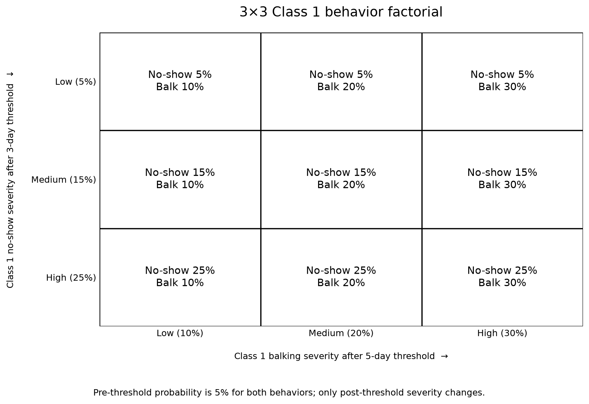

The figure contains the complete Class 1 3×3 design:

- no-show threshold fixed at **3 days**;
- post-threshold no-show probability = **5%, 15%, 25%**;
- balking threshold fixed at **5 days**;
- post-threshold balking probability = **10%, 20%, 30%**;
- the pre-threshold probability is **5%** for both behaviors.

Class 2 is held fixed throughout:

| Class 2 parameter | Fixed value |
|---|---|
| No-show | 5% before day 14; 15% after day 14 |
| Balking | 5% before day 16; 15% after day 16 |
| Cancellation | 20% |

Other problem parameters:

| Parameter | Values |
|---|---|
| Demand-to-capacity ratio, $\rho$ | 1.2, 1.4, 1.7, 2.0, 2.5; 3.0 retained outside headline range |
| Class 1 share | 0.1, 0.3, 0.5, 0.7, 0.9 |
| Daily capacity | 30, 50 |
| Headline range | $\rho\le2.5$ |
| Search seeds | 5 paired |
| Independent evaluation seeds | 10 paired |

Policy regimes remain:

| Policy | Horizon | Reservations |
|---|---|---|
| Horizon only | Optimized over 2–26 days | None |
| Reservation only | Effectively open horizon | Quantity/window optimized |
| Both flexible | Optimized over 2–26 days | Quantity/window optimized |

# Orientation: what changes when the objective switches?

The table below is intentionally only a compact orientation. The rest of the report dissects these effects by **no-show severity, balking severity, demand, policy, and Class 1 share** rather than relying on one pooled median.

```{python}
#| label: tbl-headline-objective-switch
#| tbl-cap: "Matched change from the average-utilization-optimal cell to the 2× Class 1 weighted-optimal cell."
headline_display = headline.copy()

for col in [
    "delta_weighted",
    "delta_utilization",
    "delta_c1",
    "delta_c2",
]:
    headline_display[col] = (
        100 * headline_display[col]
    ).map(lambda x: f"{x:+.2f} pp")

headline_display = headline_display.rename(
    columns={
        "delta_weighted": "Weighted utilization",
        "delta_utilization": "Average utilization",
        "delta_c1": "Class 1 served rate",
        "delta_c2": "Class 2 served rate",
    }
)

display(
    headline_display.style.hide(axis="index")
)
```

The key question is not simply whether the weighted objective is larger—it is optimized to be larger. The substantive questions are:

- **Does it gain weighted service by increasing total throughput or by changing who receives service?**
- **Which patient behaviors make the objective switch consequential?**
- **Does no-show severity affect the objective tradeoff differently from balking severity?**
- **Which policy lever—horizon or reservations—actually changes when Class 1 is given twice the value?**
- **When is the additional Class 1 access obtained with little Class 2 harm, and when is the tradeoff strongly redistributive?**

# Weighted-service gain across the 3×3 behavior design

For these figures:

- x-axis = **balking severity**;
- separate line/marker styles = **no-show severity**;
- separate figure = **policy regime**.

This preserves the factorial structure instead of averaging all nine behavior scenarios together.

## Horizon only

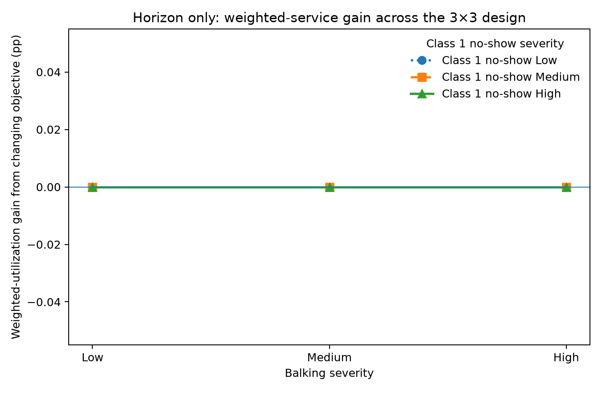

The slope within each line shows whether changing balking severity alters the value of switching objectives. The vertical separation between lines shows whether changing no-show severity alters that value.

## Reservation only

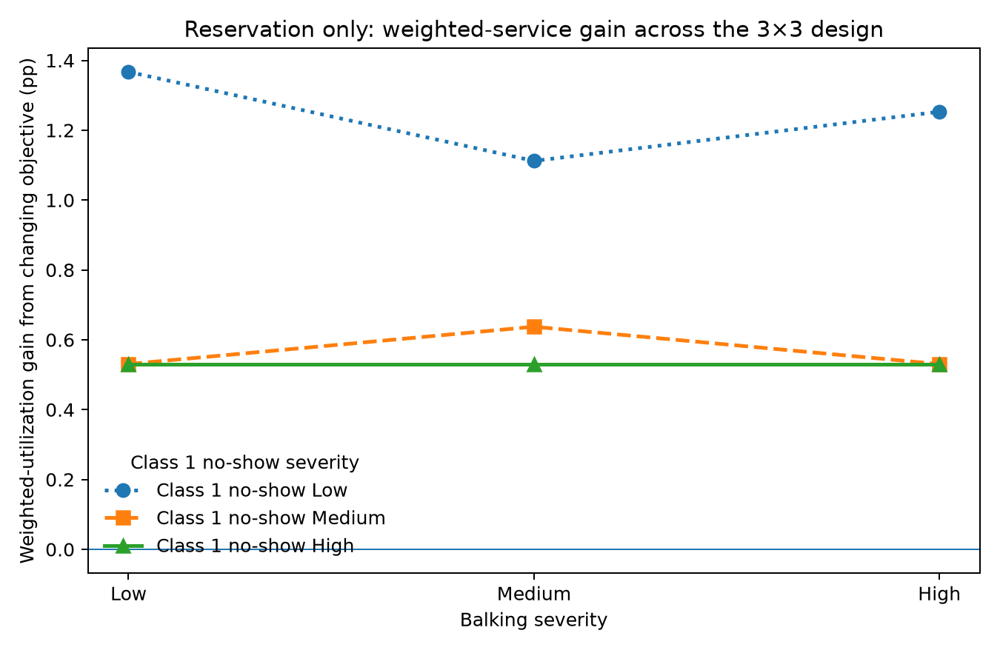

Because reservation-only can explicitly protect Class 1 capacity, this figure shows whether the value of the weighted objective depends on the Class 1 behavioral cell rather than only on the existence of a reservation lever.

## Both flexible

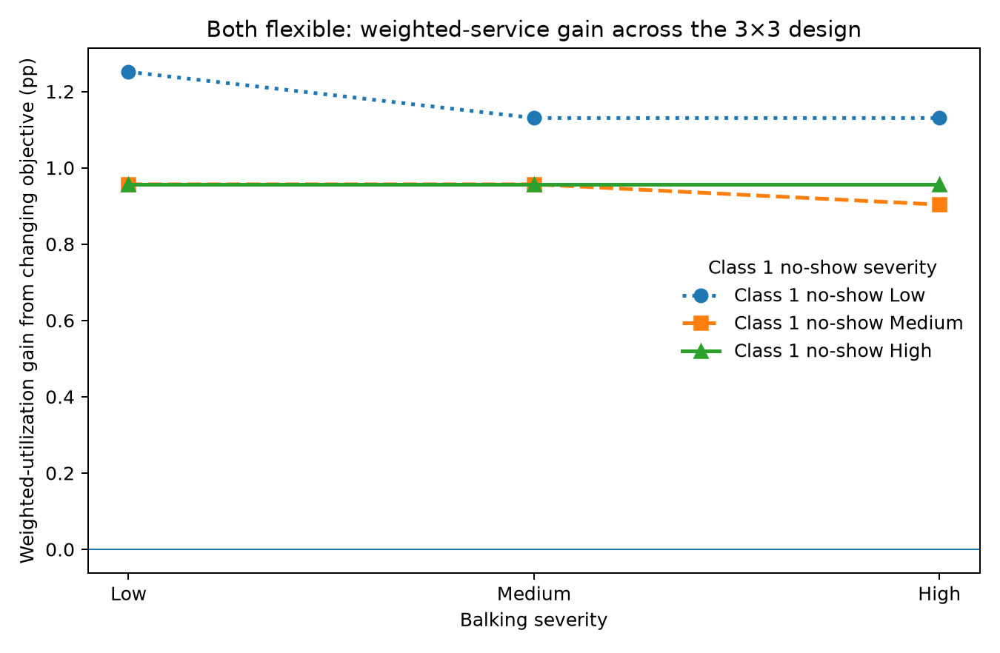

Both-flexible allows the optimizer to change both delay exposure and protected capacity. Comparing this figure with horizon-only and reservation-only identifies which lever makes the objective switch consequential.

# Does weighted optimization sacrifice throughput?

A weighted objective can improve $W_2$ either by finding additional completed service or by replacing some Class 2 service with Class 1 service. The figure below compresses the throughput comparison into a single behavior-by-behavior view.

- rows = **Class 1 no-show severity**
- columns = **Class 1 balking severity**
- bars inside each cell = **policy regime**
  - **H** = Horizon only
  - **R** = Reservation only
  - **B** = Both flexible

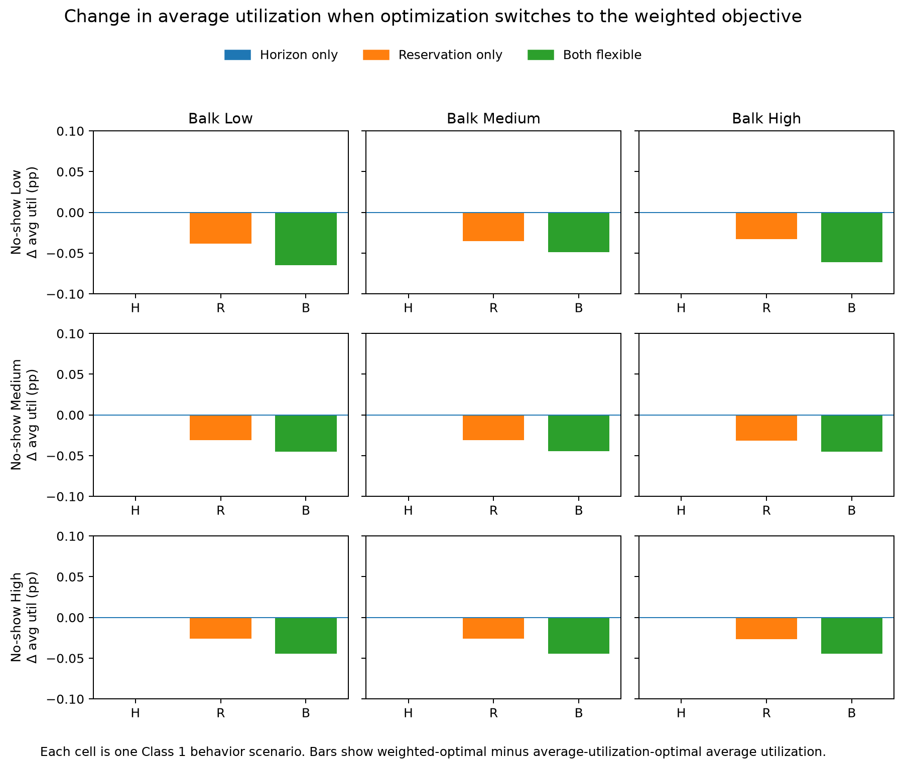

Bars near zero indicate that the weighted objective gains value mainly by **changing who is served** rather than by increasing total completed visits. A negative bar means the weighted-optimal cell sacrifices some ordinary average utilization relative to the average-utilization-optimal counterpart.

# Access is the main margin of adjustment

The next figures show Class 1 and Class 2 served-rate changes together within each policy.

- **Blue = Class 1 served-rate outcome**
- **Orange = Class 2 served-rate outcome**
- marker/line style = **Class 1 no-show severity**
- x-axis = **Class 1 balking severity**

**Class 2 behavior is fixed throughout.** The low/medium/high labels attached to both colored outcome lines refer to the **Class 1 behavior scenario** under which the Class 1 or Class 2 served rate is measured; they do not indicate different Class 2 behavior levels.

This makes it possible to see both the **Class 1 behavioral cell** and the **direction of redistribution** in one figure.

## Horizon only

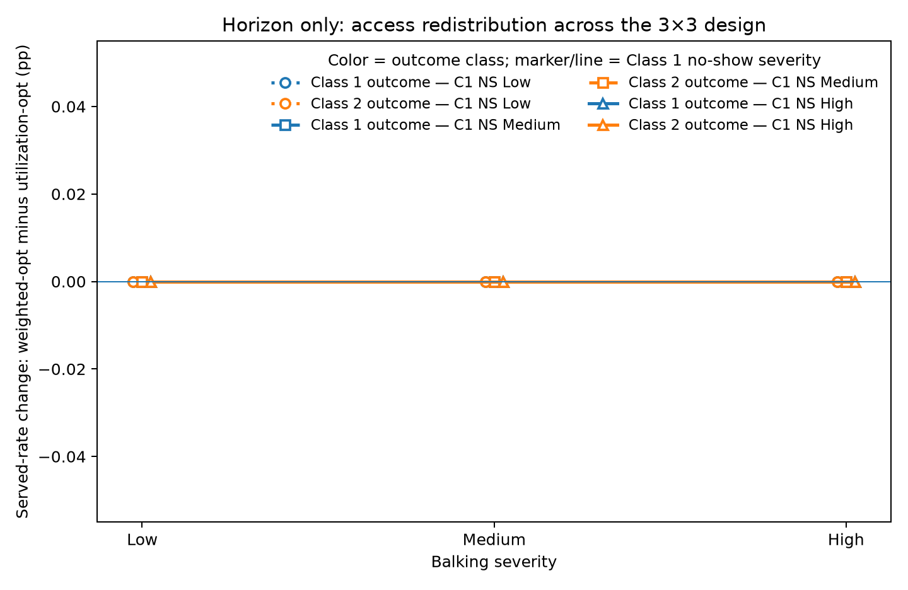

## Reservation only

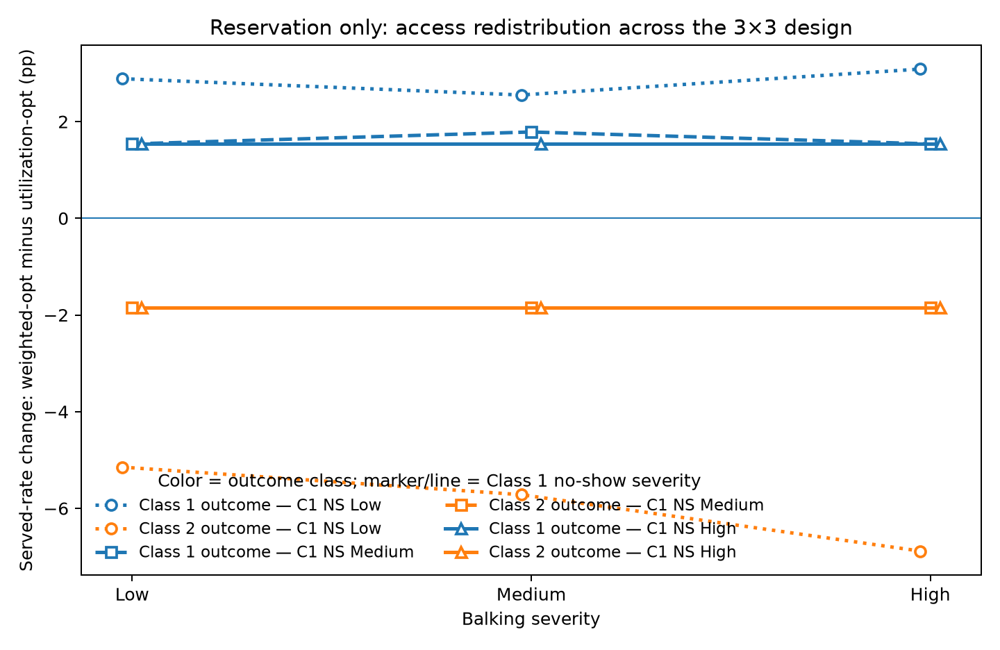

## Both flexible

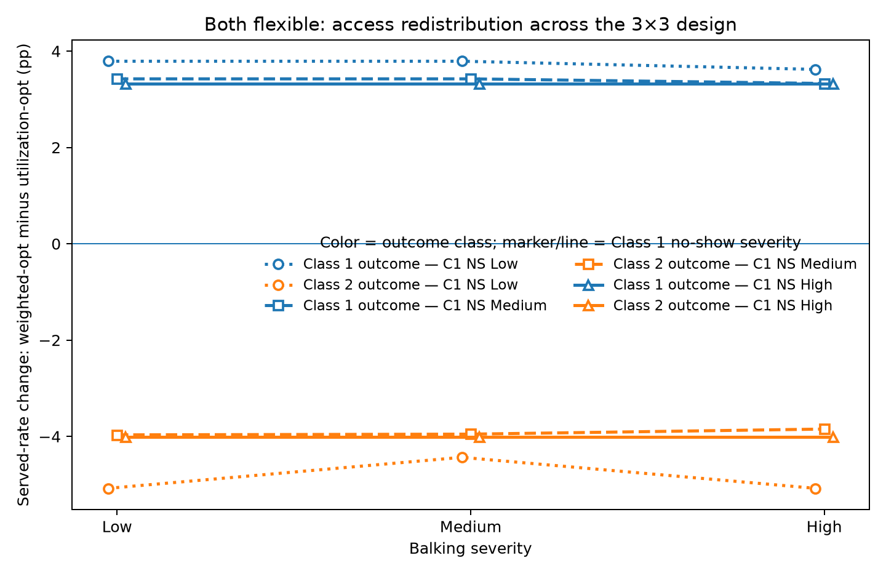

A pattern of positive Class 1 changes paired with negative Class 2 changes indicates that weighting changes **who occupies scarce capacity**, even when total utilization changes little.


# Demand: when do the behavioral differences become active?

Each policy now has one demand figure containing all six sensitivity profiles:

- **blue = no-show**
- **orange = balking**
- circle/dotted = low
- square/dashed = medium
- triangle/solid = high

For a no-show line, each point averages across the three balking levels. For a balking line, each point averages across the three no-show levels.

## Horizon only

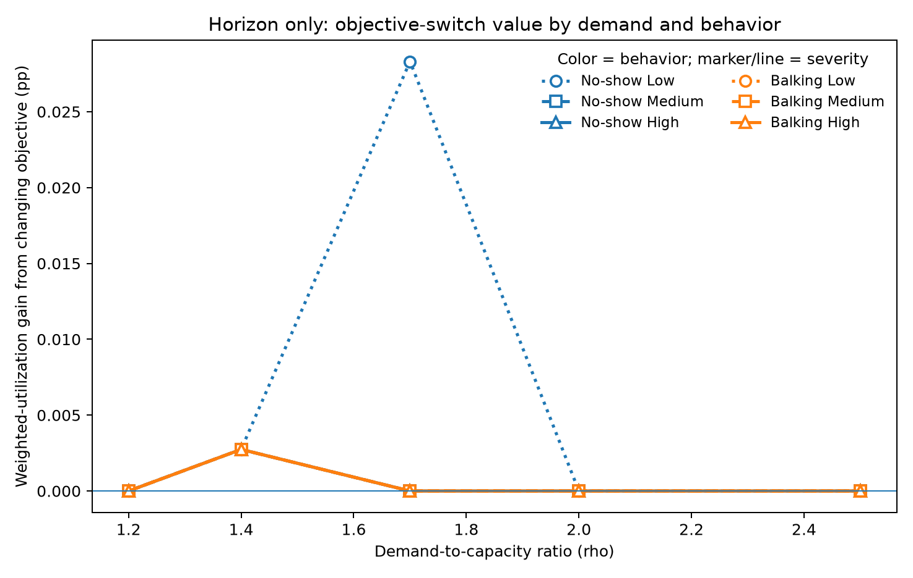

## Reservation only

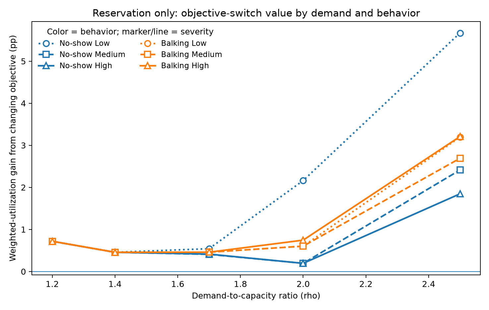

## Both flexible

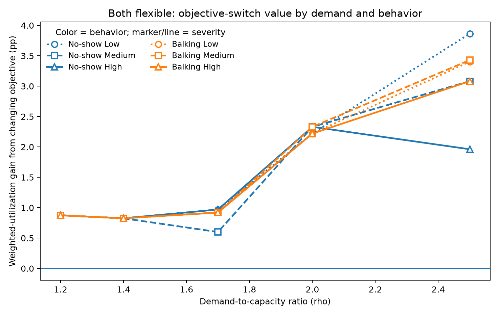

These figures show whether weighting begins to matter only after congestion exposes patients to the 3-day no-show or 5-day balking thresholds.

# Scenario-by-scenario access tradeoff

The scatterplots retain every headline-range background rather than reducing the comparison to a single average.

- **x-axis = change in Class 1 served rate (percentage points)**
- **y-axis = change in Class 2 served rate (percentage points)**

So the y-axis is **not** the Class 2 service level itself; it is the **difference** between the weighted-optimal and average-utilization-optimal cells. Dashed lines mark the ±0.5 percentage-point practical band.

## Horizon only

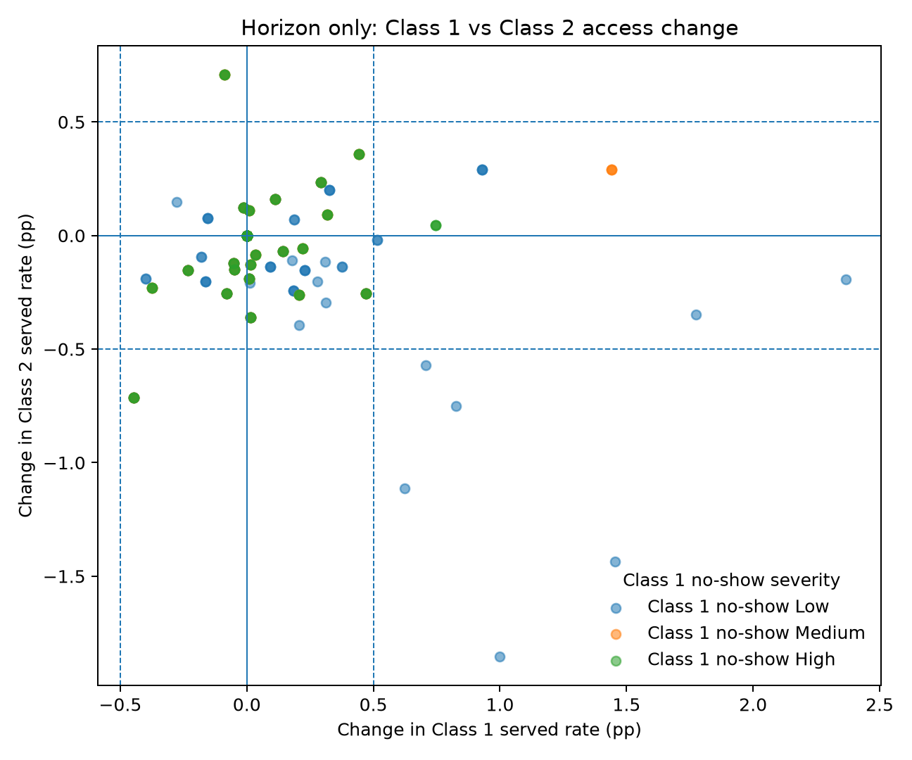

## Reservation only

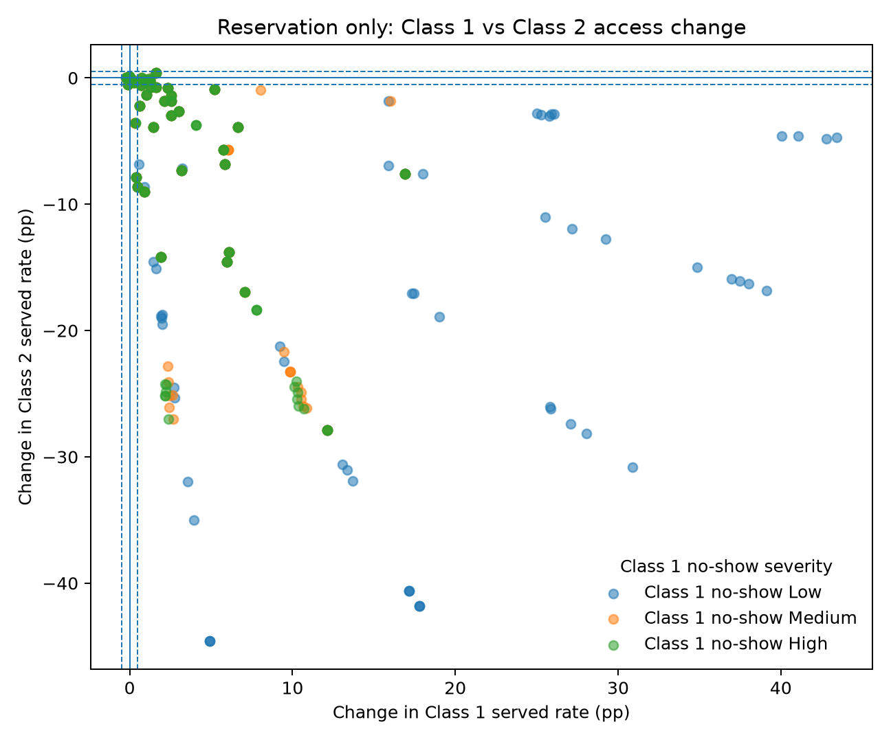

## Both flexible

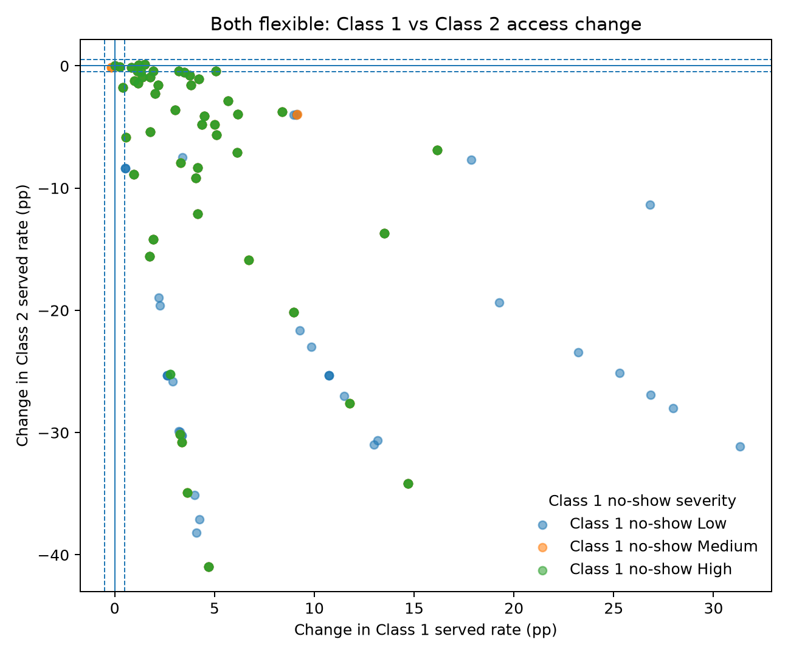

The scatterplots answer directly whether weighting creates:

- higher Class 1 access with little Class 2 change;
- higher Class 1 access with substantial Class 2 displacement;
- or little difference from the average-utilization solution.


# When does weighted optimization produce win-win or win/neutral access?

Using the same **±0.5 percentage-point practical band** as in the average-utilization report, the matched objective-switch result is classified as:

- **Win-win:** both Class 1 and Class 2 served rates increase by at least +0.5 pp, with both 95% confidence intervals above zero;
- **Class 1 win / Class 2 neutral:** Class 1 increases by at least +0.5 pp with a 95% confidence interval above zero, while the entire Class 2 95% confidence interval stays inside ±0.5 pp;
- **Class 2 win / Class 1 neutral:** the symmetric case for Class 2.

```{python}
#| label: tbl-weighted-favorable-summary
#| tbl-cap: "Win-win and win/neutral cases under weighted optimization relative to the average-utilization-optimal counterpart."
if len(favorable_summary) == 0:
    display(pd.DataFrame({"Result": ["No win-win or win/neutral cases were found in the headline range."]}))
else:
    fav_display = favorable_summary.copy()
    fav_display["Share of backgrounds"] = fav_display["Share of backgrounds"].map(lambda x: f"{x:.1f}%")
    display(fav_display.style.hide(axis="index"))
```

### Where do the favorable cases occur?

Rather than listing every favorable background, the next table summarizes the **behavior-severity cells** in which win-win or win/neutral cases occur. The percentage is the share of all favorable cases for that policy that fall in that Class 1 no-show × balking cell.

```{python}
#| label: tbl-weighted-favorable-severity
#| tbl-cap: "Behavior-severity concentration of win-win and win/neutral cases."
if len(favorable_behavior_display) == 0:
    display(pd.DataFrame({"Result": ["No win-win or win/neutral cases were found in the headline range."]}))
else:
    display(
        favorable_behavior_display
        .sort_values(
            ["Policy", "Case type", "No-show severity", "Balking severity"]
        )
        .style
        .hide(axis="index")
    )
```

### Similarities within each policy and favorable case type

The next table identifies the **most common severity and clinic conditions** within each policy × case-type group. Percentages in parentheses show the share of that group's favorable cases with the listed value. A high percentage indicates genuine clustering; a low percentage means the cases are spread across multiple conditions.

```{python}
#| label: tbl-weighted-favorable-common
#| tbl-cap: "Most common characteristics among win-win and win/neutral cases."
if len(favorable_common) == 0:
    display(pd.DataFrame({"Result": ["No win-win or win/neutral cases were found in the headline range."]}))
else:
    display(
        favorable_common.style
        .hide(axis="index")
    )
```

```{python}
#| label: txt-weighted-favorable-patterns
if favorable_pattern_markdown:
    display(Markdown(favorable_pattern_markdown))
```

This presentation emphasizes **what the favorable cases have in common** rather than enumerating individual backgrounds. Class 2 behavior remains fixed throughout; low/medium/high severity always refers to **Class 1** no-show or balking behavior.


# Class 1 population share changes the access tradeoff

The previous objective-comparison analysis showed that the size of the priority population changes how costly it is to redirect access. The new factorial allows that question to be examined while retaining no-show severity.

## Reservation only

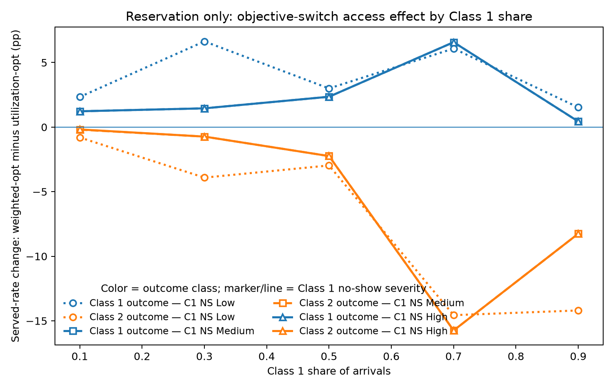

## Both flexible

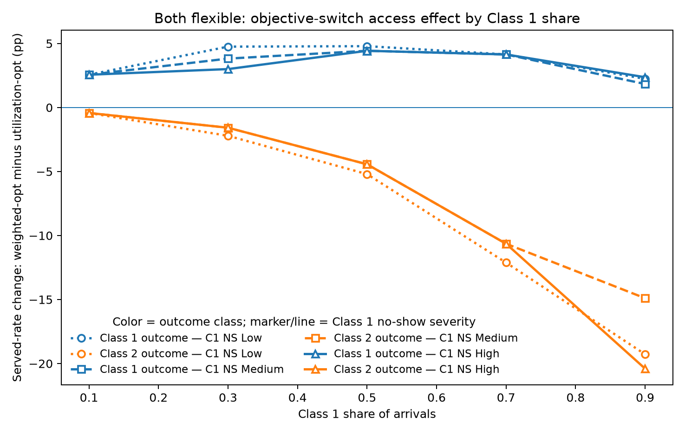

These figures distinguish:

- the **priority-population size effect** on the x-axis;
- **Class 1 versus Class 2 served-rate outcomes** by color;
- **Class 1 no-show severity** by marker and line style.

Again, Class 2 behavior is held fixed; the low/medium/high line styles describe the **Class 1 no-show scenario** in which the Class 2 outcome is observed.

This avoids treating all Class 1 patient-behavior scenarios as interchangeable when assessing the access cost of revenue weighting.


# Clinic-facing interpretation

Use the figures above in this order:

1. **Start with the 3×3 weighted-service figures.** Identify which behavioral cells make changing the objective consequential.
2. **Check the combined average-utilization bar grid.** If weighted value rises while the bars stay near zero, the gain is redistribution rather than additional throughput.
3. **Inspect Class 1 and Class 2 together.** Determine whether the weighted gain is obtained with a neutral Class 2 effect or with substantial displacement.
4. **Use the demand figures to identify when the tradeoff activates.**
5. **Check the win-win / win-neutral summaries** to see whether favorable access cases occur and which Class 1 severity and clinic conditions they have in common.
6. **Finally condition on Class 1 share.** The same Class 1 gain can imply very different Class 2 costs depending on how large the priority population is.

The objective choice should therefore be interpreted as a **clinic preference decision**. Average utilization is appropriate when total completed service is the primary goal. The weighted objective is appropriate only when the clinic intentionally assigns additional value to Class 1 service and accepts the access consequences identified in the detailed behavioral and demand scenarios.

---

Primary data inputs:

- `full_run_summaries/patient_behavior_factorial_3_5/release/selected_policy_seed_outcomes.csv`
- `full_run_summaries/patient_behavior_factorial_3_5/release/selected_policy_outcomes.csv`

All objective-switch results are matched within the **same background, policy regime, and independent evaluation seed**.
