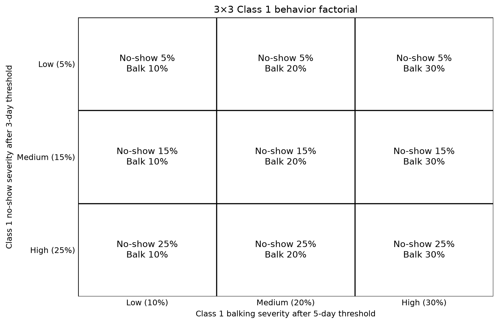
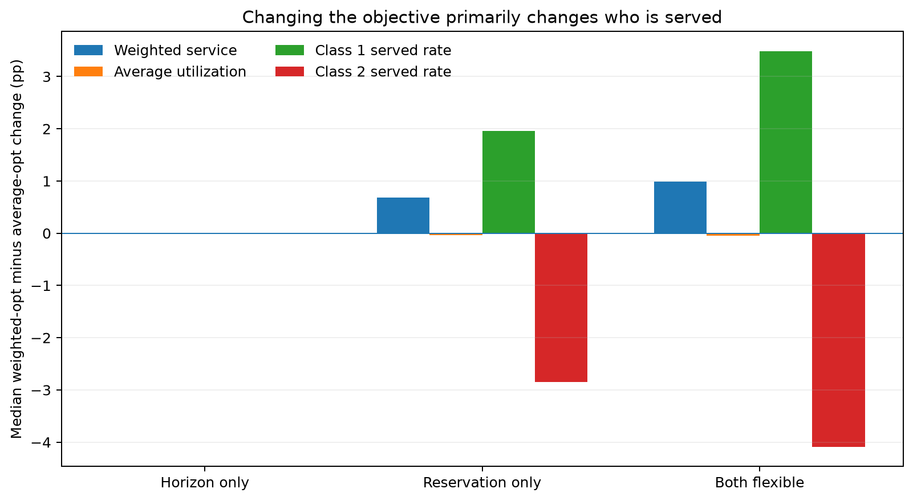
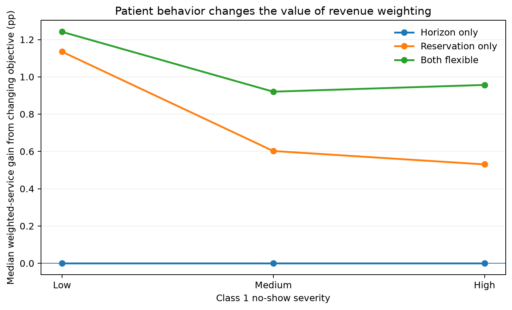
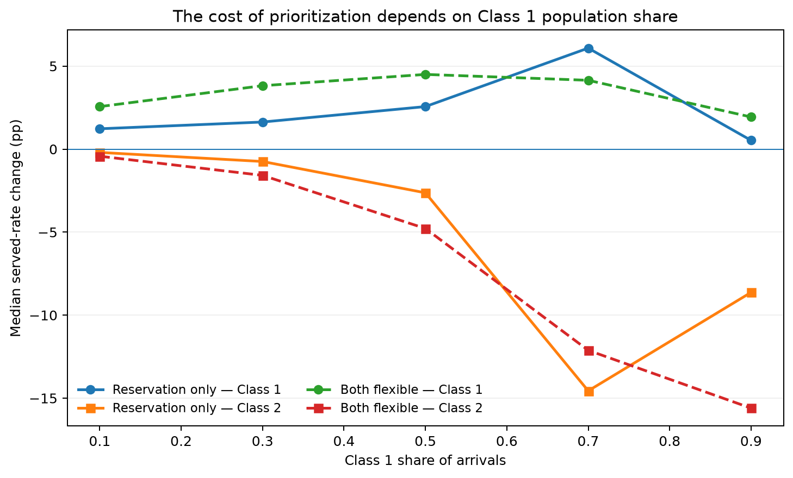

```{python}
from pathlib import Path
import numpy as np
import pandas as pd
import matplotlib.pyplot as plt
from IPython.display import display, Markdown

# -------------------------------------------------------------------
# Locate repository and load finalized factorial outputs.
# -------------------------------------------------------------------
cwd = Path.cwd().resolve()
repo_candidates = [cwd, *cwd.parents]

REPO = next(
    (
        p for p in repo_candidates
        if (p / "full_run_summaries").exists()
        and (p / "outputs").exists()
    ),
    None,
)

if REPO is None:
    raise FileNotFoundError(
        "Could not locate the CUIMC-Appointment-Simulation repository root."
    )

ROOT = (
    REPO
    / "full_run_summaries"
    / "patient_behavior_factorial_3_5"
    / "release"
)

required = [
    ROOT / "selected_policy_seed_outcomes.csv",
    ROOT / "selected_policy_outcomes.csv",
]

missing = [p for p in required if not p.exists()]
if missing:
    raise FileNotFoundError(
        "Required report inputs are missing.\n\n"
        "Expected the finalized 3×3 release outputs locally under:\n"
        f"{ROOT}\n\n"
        "Missing:\n"
        + "\n".join(str(p) for p in missing)
    )

seed = pd.read_csv(ROOT / "selected_policy_seed_outcomes.csv")
selected = pd.read_csv(ROOT / "selected_policy_outcomes.csv")

FIG = Path("figures")
FIG.mkdir(parents=True, exist_ok=True)

AVG_OBJ = "average_utilization"
WEIGHTED_OBJ = "priority_weighted_utilization"

POLICIES = ["horizon_only", "reservation_only", "both_flexible"]
POLICY_LABELS = {
    "horizon_only": "Horizon only",
    "reservation_only": "Reservation only",
    "both_flexible": "Both flexible",
}
LEVEL_ORDER = ["low", "medium", "high"]
LEVEL_LABELS = {
    "low": "Low",
    "medium": "Medium",
    "high": "High",
}

def _standardize_design_columns(frame):
    out = frame.copy()

    aliases = {
        "daily_capacity": "capacity",
        "slots_per_day": "capacity",
        "class_1_share": "class1_share",
        "no_show_level": "noshow_level",
        "balking_level": "balk_level",
    }

    for source, target in aliases.items():
        if target not in out.columns and source in out.columns:
            out[target] = out[source]

    if "rho" not in out.columns:
        if {"lambda_1", "lambda_2", "capacity"}.issubset(out.columns):
            out["rho"] = (
                out["lambda_1"] + out["lambda_2"]
            ) / out["capacity"]

    if "class1_share" not in out.columns:
        if {"lambda_1", "lambda_2"}.issubset(out.columns):
            total_arrival = out["lambda_1"] + out["lambda_2"]
            out["class1_share"] = np.where(
                total_arrival > 0,
                out["lambda_1"] / total_arrival,
                np.nan,
            )

    if "noshow_level" not in out.columns and "noshow_high_1" in out.columns:
        out["noshow_level"] = (
            out["noshow_high_1"]
            .round(6)
            .map({0.05: "low", 0.15: "medium", 0.25: "high"})
        )

    if "balk_level" not in out.columns and "balk_high_1" in out.columns:
        out["balk_level"] = (
            out["balk_high_1"]
            .round(6)
            .map({0.10: "low", 0.20: "medium", 0.30: "high"})
        )

    return out

seed = _standardize_design_columns(seed)
selected = _standardize_design_columns(selected)

needed_meta = [
    "rho",
    "class1_share",
    "capacity",
    "noshow_level",
    "balk_level",
]

meta_source_cols = [
    "background_id",
    *[c for c in needed_meta if c in selected.columns],
]

meta_source = (
    selected[meta_source_cols]
    .drop_duplicates("background_id")
)

for c in needed_meta:
    if c not in seed.columns and c in meta_source.columns:
        seed = seed.merge(
            meta_source[["background_id", c]],
            on="background_id",
            how="left",
            validate="many_to_one",
        )

missing_meta = [
    c for c in needed_meta
    if c not in seed.columns or c not in selected.columns
]
if missing_meta:
    raise ValueError(
        "The finalized release files are missing design metadata required "
        f"for the report: {missing_meta}."
    )

# Headline range.
seed = seed[seed["rho"] <= 2.5].copy()
selected = selected[selected["rho"] <= 2.5].copy()

available_objectives = set(seed["selection_objective"].dropna().unique())
for objective in [AVG_OBJ, WEIGHTED_OBJ]:
    if objective not in available_objectives:
        raise ValueError(
            f"Expected selection objective {objective!r} was not found. "
            f"Available objectives: {sorted(available_objectives)}"
        )

# -------------------------------------------------------------------
# Matched objective-switch data:
# weighted-optimal minus average-utilization-optimal.
# -------------------------------------------------------------------
metrics = [
    "priority_weighted_utilization",
    "average_utilization",
    "class_1_percent_serviced",
    "class_2_percent_serviced",
]

avg = seed[
    (seed["selection_objective"] == AVG_OBJ)
    & (seed["policy"].isin(POLICIES))
].copy()

wgt = seed[
    (seed["selection_objective"] == WEIGHTED_OBJ)
    & (seed["policy"].isin(POLICIES))
].copy()

join_keys = ["background_id", "policy", "seed"]

paired = wgt[join_keys + metrics].merge(
    avg[join_keys + metrics],
    on=join_keys,
    suffixes=("_weighted", "_average"),
    how="inner",
    validate="one_to_one",
)

meta_cols = [
    "background_id",
    "rho",
    "class1_share",
    "capacity",
    "noshow_level",
    "balk_level",
]
meta = seed[meta_cols].drop_duplicates("background_id")

paired = paired.merge(
    meta,
    on="background_id",
    how="left",
    validate="many_to_one",
)

for metric in metrics:
    paired[f"delta_{metric}"] = (
        paired[f"{metric}_weighted"]
        - paired[f"{metric}_average"]
    )

delta_cols = [f"delta_{m}" for m in metrics]

group_cols = [
    "background_id",
    "policy",
    "rho",
    "class1_share",
    "capacity",
    "noshow_level",
    "balk_level",
]

background = (
    paired.groupby(group_cols, as_index=False)[delta_cols]
    .mean()
)

# Simple paired-seed intervals, retained from v5.
for metric in delta_cols:
    stats = (
        paired.groupby(group_cols)[metric]
        .agg(["mean", "std", "count"])
        .reset_index()
    )
    se = stats["std"] / np.sqrt(stats["count"])
    stats[f"{metric}_ci_low"] = stats["mean"] - 1.96 * se
    stats[f"{metric}_ci_high"] = stats["mean"] + 1.96 * se
    background = background.merge(
        stats[
            group_cols
            + [f"{metric}_ci_low", f"{metric}_ci_high"]
        ],
        on=group_cols,
        how="left",
        validate="one_to_one",
    )

BAND = 0.005

def access_status(r):
    c1 = r["delta_class_1_percent_serviced"]
    c1lo = r["delta_class_1_percent_serviced_ci_low"]
    c1hi = r["delta_class_1_percent_serviced_ci_high"]

    c2 = r["delta_class_2_percent_serviced"]
    c2lo = r["delta_class_2_percent_serviced_ci_low"]
    c2hi = r["delta_class_2_percent_serviced_ci_high"]

    c1gain = c1 >= BAND and c1lo > 0
    c2gain = c2 >= BAND and c2lo > 0
    c1harm = c1 <= -BAND and c1hi < 0
    c2harm = c2 <= -BAND and c2hi < 0
    c1neutral = c1lo >= -BAND and c1hi <= BAND
    c2neutral = c2lo >= -BAND and c2hi <= BAND

    if c1gain and c2gain:
        return "Win-win"
    if c1gain and c2neutral:
        return "C1 win / C2 neutral"
    if c2gain and c1neutral:
        return "C2 win / C1 neutral"
    if c1gain and c2harm:
        return "C1 gain / C2 harm"
    if c2gain and c1harm:
        return "C2 gain / C1 harm"
    if c1neutral and c2neutral:
        return "Both neutral"
    return "Uncertain / mixed"

background["access_classification"] = background.apply(
    access_status,
    axis=1,
)

# -------------------------------------------------------------------
# Match policy settings selected under the two objectives.
# -------------------------------------------------------------------
settings_cols = [
    "background_id",
    "policy",
    "selection_objective",
    "selected_horizon_days",
    "selected_Q",
    "selected_window",
]

missing_settings = [c for c in settings_cols if c not in selected.columns]
if missing_settings:
    raise ValueError(
        "selected_policy_outcomes.csv is missing required policy-setting "
        f"columns: {missing_settings}"
    )

avg_s = selected[
    (selected["selection_objective"] == AVG_OBJ)
    & (selected["policy"].isin(POLICIES))
][settings_cols].copy()

wgt_s = selected[
    (selected["selection_objective"] == WEIGHTED_OBJ)
    & (selected["policy"].isin(POLICIES))
][settings_cols].copy()

settings = wgt_s.merge(
    avg_s,
    on=["background_id", "policy"],
    suffixes=("_weighted", "_average"),
    how="inner",
    validate="one_to_one",
)

settings = settings.merge(
    meta,
    on="background_id",
    how="left",
    validate="many_to_one",
)

settings["delta_H"] = (
    settings["selected_horizon_days_weighted"]
    - settings["selected_horizon_days_average"]
)
settings["delta_Q"] = (
    settings["selected_Q_weighted"]
    - settings["selected_Q_average"]
)
settings["delta_window"] = (
    settings["selected_window_weighted"]
    - settings["selected_window_average"]
)
settings["same_exact_cell"] = (
    (settings["selected_horizon_days_weighted"]
     == settings["selected_horizon_days_average"])
    & (settings["selected_Q_weighted"]
       == settings["selected_Q_average"])
    & (settings["selected_window_weighted"]
       == settings["selected_window_average"])
)

# -------------------------------------------------------------------
# Compact summaries.
# -------------------------------------------------------------------
headline = (
    background.groupby("policy", as_index=False)
    .agg(
        delta_weighted=("delta_priority_weighted_utilization", "median"),
        delta_utilization=("delta_average_utilization", "median"),
        delta_c1=("delta_class_1_percent_serviced", "median"),
        delta_c2=("delta_class_2_percent_serviced", "median"),
    )
)
headline["Policy"] = headline["policy"].map(POLICY_LABELS)

same_cell = (
    settings.groupby("policy", as_index=False)
    .agg(
        same_cell_share=("same_exact_cell", "mean"),
        delta_H=("delta_H", "median"),
        delta_Q=("delta_Q", "median"),
        delta_window=("delta_window", "median"),
    )
)
same_cell["Policy"] = same_cell["policy"].map(POLICY_LABELS)

# Behavior effects: high minus low on the objective-switch outcome.
factor_rows = []
for policy in POLICIES:
    z = background[background["policy"] == policy]

    for factor, col in [
        ("No-show", "noshow_level"),
        ("Balking", "balk_level"),
    ]:
        low = z[z[col] == "low"][delta_cols].mean()
        high = z[z[col] == "high"][delta_cols].mean()
        diff = high - low

        factor_rows.append({
            "policy": policy,
            "Policy": POLICY_LABELS[policy],
            "Behavior": factor,
            "Weighted service effect":
                diff["delta_priority_weighted_utilization"],
            "Average utilization effect":
                diff["delta_average_utilization"],
            "Class 1 effect":
                diff["delta_class_1_percent_serviced"],
            "Class 2 effect":
                diff["delta_class_2_percent_serviced"],
        })

factor_summary = pd.DataFrame(factor_rows)

# Favorable access cases.
favorable_types = [
    "Win-win",
    "C1 win / C2 neutral",
    "C2 win / C1 neutral",
]
favorable_cases = background[
    background["access_classification"].isin(favorable_types)
].copy()

favorable_counts = (
    favorable_cases.groupby(
        ["policy", "access_classification"],
        as_index=False,
    )
    .size()
    .rename(columns={"size": "Cases"})
)

policy_totals = (
    background.groupby("policy")
    .size()
    .rename("Total")
    .reset_index()
)

favorable_counts = favorable_counts.merge(
    policy_totals,
    on="policy",
    how="right",
)
favorable_counts["Cases"] = favorable_counts["Cases"].fillna(0).astype(int)
favorable_counts["Share"] = (
    100 * favorable_counts["Cases"] / favorable_counts["Total"]
)
favorable_counts["Policy"] = favorable_counts["policy"].map(POLICY_LABELS)

# -------------------------------------------------------------------
# Figures used in the concise report.
# -------------------------------------------------------------------
def design_grid():
    fig, ax = plt.subplots(figsize=(8.8, 5.8))

    ns_probs = {"low": 5, "medium": 15, "high": 25}
    bk_probs = {"low": 10, "medium": 20, "high": 30}

    for i, ns in enumerate(LEVEL_ORDER):
        for j, bk in enumerate(LEVEL_ORDER):
            rect = plt.Rectangle(
                (j, i), 1, 1, fill=False, linewidth=1.3
            )
            ax.add_patch(rect)
            ax.text(
                j + 0.5,
                i + 0.5,
                f"No-show {ns_probs[ns]}%\nBalk {bk_probs[bk]}%",
                ha="center",
                va="center",
                fontsize=11,
            )

    ax.set_xlim(0, 3)
    ax.set_ylim(3, 0)
    ax.set_xticks(
        [0.5, 1.5, 2.5],
        ["Low (10%)", "Medium (20%)", "High (30%)"],
    )
    ax.set_yticks(
        [0.5, 1.5, 2.5],
        ["Low (5%)", "Medium (15%)", "High (25%)"],
    )
    ax.set_xlabel("Class 1 balking severity after 5-day threshold")
    ax.set_ylabel("Class 1 no-show severity after 3-day threshold")
    ax.set_title("3×3 Class 1 behavior factorial")
    for spine in ax.spines.values():
        spine.set_visible(False)
    ax.tick_params(length=0)
    fig.tight_layout()
    fig.savefig(
        FIG / "rwc3_concise_00_design_grid.png",
        dpi=180,
        bbox_inches="tight",
    )
    plt.close(fig)


def pooled_objective_switch_figure():
    z = headline.set_index("policy").reindex(POLICIES)

    x = np.arange(len(POLICIES))
    width = 0.19
    series = [
        ("delta_weighted", "Weighted service"),
        ("delta_utilization", "Average utilization"),
        ("delta_c1", "Class 1 served rate"),
        ("delta_c2", "Class 2 served rate"),
    ]

    fig, ax = plt.subplots(figsize=(9.0, 5.0))

    for i, (col, label) in enumerate(series):
        vals = 100 * z[col].to_numpy()
        ax.bar(
            x + (i - 1.5) * width,
            vals,
            width,
            label=label,
        )

    ax.axhline(0, linewidth=0.8)
    ax.set_xticks(
        x,
        [POLICY_LABELS[p] for p in POLICIES],
    )
    ax.set_ylabel("Median weighted-opt minus average-opt change (pp)")
    ax.set_title("Changing the objective primarily changes who is served")
    ax.legend(frameon=False, ncol=2)
    ax.grid(axis="y", alpha=0.2)
    fig.tight_layout()
    fig.savefig(
        FIG / "rwc3_concise_01_pooled_switch.png",
        dpi=180,
        bbox_inches="tight",
    )
    plt.close(fig)


def behavior_modifier_figure():
    # Median weighted-service gain by no-show severity, averaging over balking.
    g = (
        background.groupby(
            ["policy", "noshow_level"],
            as_index=False,
        )["delta_priority_weighted_utilization"]
        .median()
    )

    fig, ax = plt.subplots(figsize=(7.8, 4.8))

    for policy in POLICIES:
        s = (
            g[g["policy"] == policy]
            .set_index("noshow_level")
            .reindex(LEVEL_ORDER)
        )
        ax.plot(
            ["Low", "Medium", "High"],
            100 * s["delta_priority_weighted_utilization"],
            marker="o",
            linewidth=2,
            label=POLICY_LABELS[policy],
        )

    ax.axhline(0, linewidth=0.8)
    ax.set_xlabel("Class 1 no-show severity")
    ax.set_ylabel("Median weighted-service gain from changing objective (pp)")
    ax.set_title("Patient behavior changes the value of revenue weighting")
    ax.legend(frameon=False)
    ax.grid(axis="y", alpha=0.2)
    fig.tight_layout()
    fig.savefig(
        FIG / "rwc3_concise_02_behavior_modifier.png",
        dpi=180,
        bbox_inches="tight",
    )
    plt.close(fig)


def share_tradeoff_figure():
    z = background[
        background["policy"].isin(
            ["reservation_only", "both_flexible"]
        )
    ].copy()

    g = (
        z.groupby(
            ["policy", "class1_share"],
            as_index=False,
        )
        .agg(
            c1=("delta_class_1_percent_serviced", "median"),
            c2=("delta_class_2_percent_serviced", "median"),
        )
    )

    fig, ax = plt.subplots(figsize=(8.2, 5.0))

    for policy, linestyle in [
        ("reservation_only", "-"),
        ("both_flexible", "--"),
    ]:
        s = g[g["policy"] == policy].sort_values("class1_share")

        ax.plot(
            s["class1_share"],
            100 * s["c1"],
            marker="o",
            linestyle=linestyle,
            linewidth=2,
            label=f"{POLICY_LABELS[policy]} — Class 1",
        )
        ax.plot(
            s["class1_share"],
            100 * s["c2"],
            marker="s",
            linestyle=linestyle,
            linewidth=2,
            label=f"{POLICY_LABELS[policy]} — Class 2",
        )

    ax.axhline(0, linewidth=0.8)
    ax.set_xlabel("Class 1 share of arrivals")
    ax.set_ylabel("Median served-rate change (pp)")
    ax.set_title("The cost of prioritization depends on Class 1 population share")
    ax.legend(frameon=False, ncol=2, fontsize=9)
    ax.grid(axis="y", alpha=0.2)
    fig.tight_layout()
    fig.savefig(
        FIG / "rwc3_concise_03_share_tradeoff.png",
        dpi=180,
        bbox_inches="tight",
    )
    plt.close(fig)


design_grid()
pooled_objective_switch_figure()
behavior_modifier_figure()
share_tradeoff_figure()
```

This report asks a focused question:

> **For the same clinic background and policy regime, what changes when the optimizer values a completed Class 1 visit twice as much as a Class 2 visit?**

The comparison is **objective-to-objective**, not policy-to-baseline.

Average-utilization optimization values completed visits equally. The weighted objective is

$$
W_2=\frac{2Y_1+Y_2}{2M},
$$

so within a clinic background it ranks policies equivalently to maximizing $2Y_1+Y_2$.

For every background and policy regime:

1. the average-utilization objective and the 2× Class 1 objective are optimized independently;
2. both frozen policy cells are evaluated on the same 10 independent seeds;
3. every reported effect is **weighted-optimal minus average-utilization-optimal**.

# 3×3 patient-behavior design



The factorial changes only Class 1 severity:

- no-show threshold fixed at **3 days**, with post-threshold probability **5%, 15%, 25%**;
- balking threshold fixed at **5 days**, with post-threshold probability **10%, 20%, 30%**;
- pre-threshold probability is **5%** for both behaviors;
- Class 2 behavior is fixed throughout.

The headline range is $\rho\le2.5$.

# Finding 1 — Revenue weighting changes who is served more than how much is served

The key consequence of the 2× Class 1 objective is **access redistribution**, not a large change in total completed service.



```{python}
#| label: txt-main-redistribution
rows = headline.set_index("policy").reindex(POLICIES)

lines = []
for policy in POLICIES:
    r = rows.loc[policy]
    lines.append(
        f"- **{POLICY_LABELS[policy]}:** "
        f"weighted service {100*r['delta_weighted']:+.2f} pp; "
        f"average utilization {100*r['delta_utilization']:+.2f} pp; "
        f"Class 1 served rate {100*r['delta_c1']:+.2f} pp; "
        f"Class 2 served rate {100*r['delta_c2']:+.2f} pp."
    )

display(Markdown("\n".join(lines)))
```

**Interpretation:** if weighted service rises while average utilization stays near zero, the objective is achieving its gain mainly by **redirecting scarce capacity toward Class 1**, not by generating many additional completed visits.

# Finding 2 — Reservation capacity is the direct lever for changing the priority mix

The objective switch can matter only if the policy family gives the optimizer a way to favor Class 1. Reservation-capable policies have the clearest direct lever because they can change protected capacity.

```{python}
#| label: tbl-policy-response
setting_display = same_cell[
    ["Policy", "same_cell_share", "delta_H", "delta_Q", "delta_window"]
].copy()

setting_display["same_cell_share"] = (
    100 * setting_display["same_cell_share"]
).map(lambda x: f"{x:.1f}%")

for col in ["delta_H", "delta_Q", "delta_window"]:
    setting_display[col] = setting_display[col].map(
        lambda x: f"{x:+.1f}"
    )

setting_display = setting_display.rename(
    columns={
        "same_cell_share": "Same exact policy cell",
        "delta_H": "Median ΔH",
        "delta_Q": "Median ΔQ",
        "delta_window": "Median Δwindow",
    }
)

display(setting_display.style.hide(axis="index"))
```

```{python}
#| label: txt-policy-response
shift = (
    background.groupby("policy")[
        "delta_class_1_percent_serviced"
    ]
    .apply(lambda s: np.median(np.abs(s)))
    .sort_values(ascending=False)
)

largest_policy = shift.index[0]

display(
    Markdown(
        f"- **{POLICY_LABELS[largest_policy]}** has the largest median absolute "
        f"Class 1 access response to changing the objective "
        f"({100*shift.iloc[0]:.2f} pp).\n"
        "- The **same-cell percentage** shows how often changing the objective "
        "does not change the selected policy parameters at all.\n"
        "- Changes in **Q/window** indicate that the weighted objective is using "
        "reservation protection directly; changes in **H** indicate that it is "
        "also changing delay exposure."
    )
)
```

# Finding 3 — Patient behavior changes how valuable the objective switch is

The objective switch is not equally consequential in every behavior cell.



The matched high-minus-low contrasts identify whether **no-show** or **balking** changes the value of revenue weighting more strongly.

```{python}
#| label: tbl-behavior-modifiers
behavior_display = factor_summary[
    [
        "Policy",
        "Behavior",
        "Weighted service effect",
        "Average utilization effect",
        "Class 1 effect",
        "Class 2 effect",
    ]
].copy()

for col in [
    "Weighted service effect",
    "Average utilization effect",
    "Class 1 effect",
    "Class 2 effect",
]:
    behavior_display[col] = (
        100 * behavior_display[col]
    ).map(lambda x: f"{x:+.2f} pp")

display(behavior_display.style.hide(axis="index"))
```

```{python}
#| label: txt-behavior-dominance
trend_lines = []

for policy in POLICIES:
    z = factor_summary[factor_summary["policy"] == policy].copy()
    z["magnitude"] = z["Weighted service effect"].abs()
    top = z.sort_values("magnitude", ascending=False).iloc[0]
    other = z.sort_values("magnitude", ascending=False).iloc[1]

    if top["magnitude"] > 1.25 * other["magnitude"]:
        trend_lines.append(
            f"- **{POLICY_LABELS[policy]}:** {top['Behavior'].lower()} severity "
            f"is the clearer behavioral modifier of weighted-objective value "
            f"({100*top['Weighted service effect']:+.2f} pp high-minus-low versus "
            f"{100*other['Weighted service effect']:+.2f} pp for {other['Behavior'].lower()})."
        )
    else:
        trend_lines.append(
            f"- **{POLICY_LABELS[policy]}:** no-show and balking have similar-sized "
            f"effects on weighted-objective value "
            f"({100*z.loc[z['Behavior']=='No-show','Weighted service effect'].iloc[0]:+.2f} "
            f"vs {100*z.loc[z['Behavior']=='Balking','Weighted service effect'].iloc[0]:+.2f} pp)."
        )

display(Markdown("\n".join(trend_lines)))
```

The point of the 3×3 analysis is therefore not to show nine separate curves. It is to identify **which behavioral dimension materially changes the objective tradeoff**.

# Finding 4 — Class 1 population share changes the cost of prioritization

When a larger share of demand belongs to the priority class, the amount of Class 2 displacement required to improve Class 1 access can change substantially.



```{python}
#| label: txt-share-trend
share_lines = []

for policy in ["reservation_only", "both_flexible"]:
    z = background[background["policy"] == policy]
    s = (
        z.groupby("class1_share", as_index=False)
        .agg(
            c1=("delta_class_1_percent_serviced", "median"),
            c2=("delta_class_2_percent_serviced", "median"),
        )
        .sort_values("class1_share")
    )

    max_c1_row = s.loc[s["c1"].abs().idxmax()]
    max_c2_row = s.loc[s["c2"].abs().idxmax()]

    share_lines.append(
        f"- **{POLICY_LABELS[policy]}:** the largest median Class 1 shift occurs at "
        f"Class 1 share {max_c1_row['class1_share']:.1f} "
        f"({100*max_c1_row['c1']:+.2f} pp), while the largest median Class 2 shift "
        f"occurs at share {max_c2_row['class1_share']:.1f} "
        f"({100*max_c2_row['c2']:+.2f} pp)."
    )

display(Markdown("\n".join(share_lines)))
```

**Interpretation:** the same 2× weighting rule can imply a very different access tradeoff depending on how large the priority population is.

# Win/neutral situations — favorable objective switches are the exception, not the default

Using the same ±0.5 percentage-point practical band as the average-utilization report:

- **Win-win:** both classes improve by at least +0.5 pp and both 95% CIs are above zero.
- **C1 win / C2 neutral:** Class 1 improves by at least +0.5 pp with CI above zero, while the entire Class 2 CI stays inside ±0.5 pp.
- **C2 win / C1 neutral:** the symmetric case.

The report does **not** list every favorable background. It summarizes only the recurring trends.

```{python}
#| label: tbl-favorable-summary
if len(favorable_counts) == 0:
    display(
        pd.DataFrame({
            "Result": [
                "No win-win or win/neutral cases were found in the headline range."
            ]
        })
    )
else:
    fav_display = favorable_counts[
        ["Policy", "access_classification", "Cases", "Share"]
    ].copy()
    fav_display["Share"] = fav_display["Share"].map(
        lambda x: f"{x:.1f}%"
    )
    fav_display = fav_display.rename(
        columns={
            "access_classification": "Case type",
            "Share": "Share of backgrounds",
        }
    )
    display(fav_display.style.hide(axis="index"))
```

## Trends among the favorable cases

```{python}
#| label: txt-favorable-trends
if len(favorable_cases) == 0:
    display(Markdown("- **No favorable cases were found in the headline range.**"))
else:
    lines = []

    for (policy, case_type), g in favorable_cases.groupby(
        ["policy", "access_classification"],
        dropna=False,
    ):
        n = len(g)
        features = []

        for col, label, formatter in [
            ("noshow_level", "no-show", lambda x: LEVEL_LABELS.get(x, str(x))),
            ("balk_level", "balking", lambda x: LEVEL_LABELS.get(x, str(x))),
            ("rho", "rho", lambda x: f"{float(x):.1f}"),
            ("class1_share", "Class 1 share", lambda x: f"{float(x):.1f}"),
            ("capacity", "capacity", lambda x: f"{int(x)}"),
        ]:
            vc = g[col].value_counts(dropna=False)
            if len(vc) == 0:
                continue

            top_count = int(vc.iloc[0])
            if top_count / n >= 0.5:
                vals = vc[vc == top_count].index.tolist()
                features.append(
                    f"{label} = {'/'.join(formatter(v) for v in vals)} "
                    f"({top_count}/{n})"
                )

        if n == 1:
            lines.append(
                f"- **{POLICY_LABELS[policy]} — {case_type}:** only one case; "
                "its characteristics are descriptive rather than a recurring trend."
            )
        elif features:
            lines.append(
                f"- **{POLICY_LABELS[policy]} — {case_type}:** recurring features are "
                + "; ".join(features)
                + "."
            )
        else:
            lines.append(
                f"- **{POLICY_LABELS[policy]} — {case_type}:** cases are dispersed; "
                "no single behavior severity or clinic condition appears in at least "
                "half of them."
            )

    display(Markdown("\n".join(lines)))
```

A characteristic is surfaced only when the same value appears in at least **50%** of that policy × case-type group. This keeps the section focused on trends rather than individual scenarios.

# Conclusions

- **Changing the objective primarily changes the distribution of access, not total throughput.**
- **Reservation protection is the most direct mechanism for translating a 2× Class 1 weight into a different service mix.**
- **The 3×3 design identifies which patient behavior materially changes the value of weighting instead of averaging all behavior profiles together.**
- **Class 1 population share changes the size of the access tradeoff.**
- **Win-win and win/neutral cases should be treated as special operating regions, not as the typical consequence of revenue weighting.**

The clinic decision is therefore an **objective-choice decision**: use the weighted objective when additional Class 1 service is explicitly worth the accompanying redistribution identified in the relevant patient-behavior and population-share scenario.

---

Primary data inputs:

- `full_run_summaries/patient_behavior_factorial_3_5/release/selected_policy_seed_outcomes.csv`
- `full_run_summaries/patient_behavior_factorial_3_5/release/selected_policy_outcomes.csv`

All objective-switch results are matched within the **same background, policy regime, and independent evaluation seed**.
