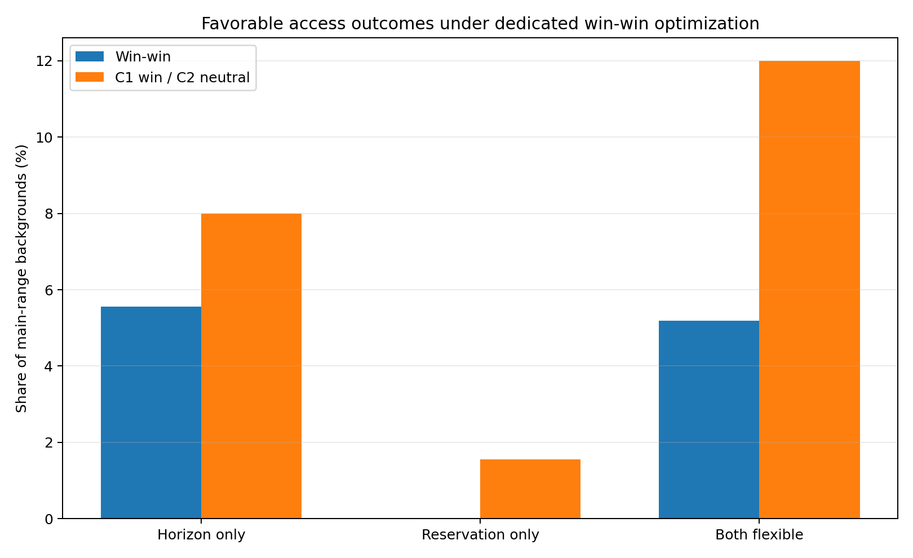
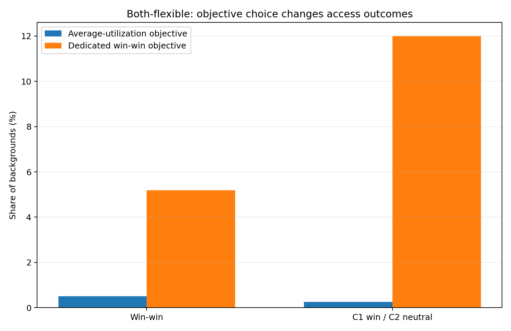
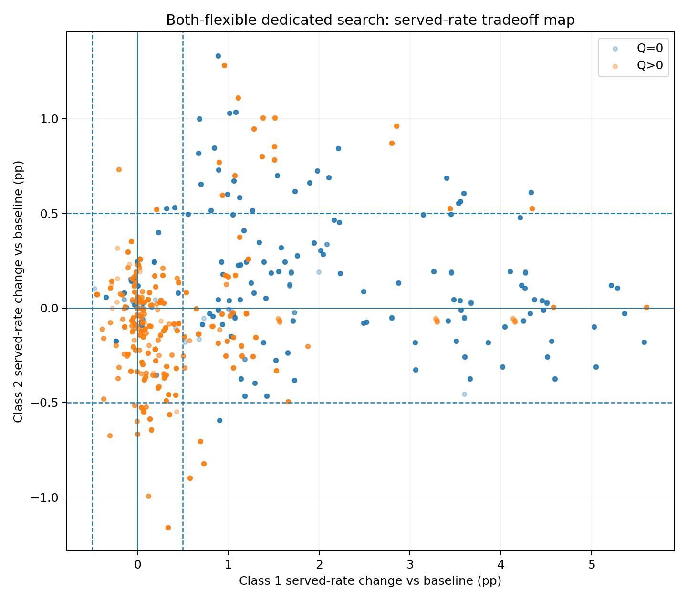
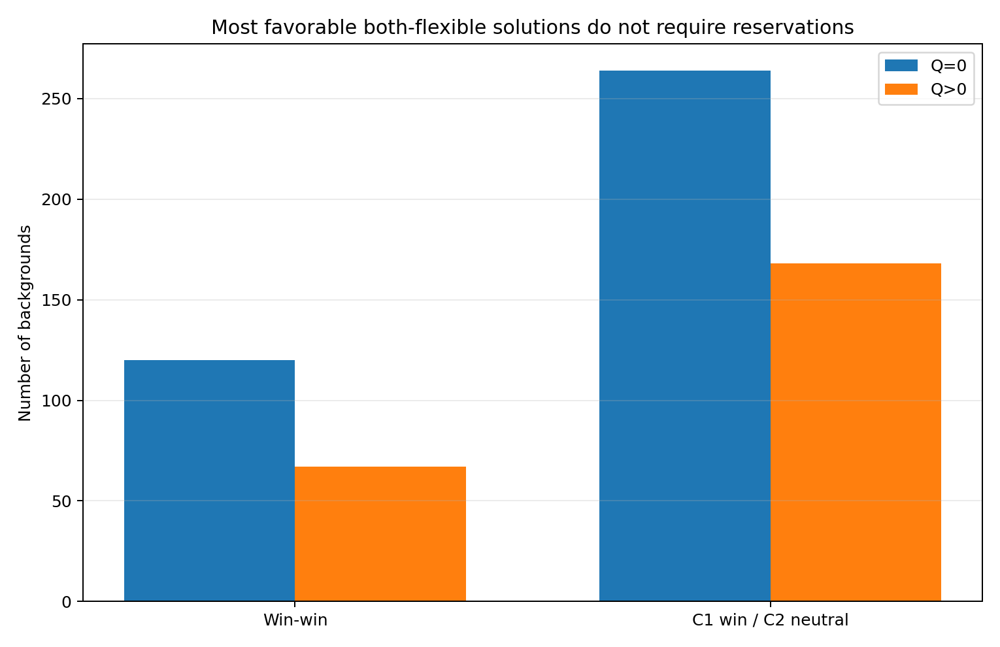
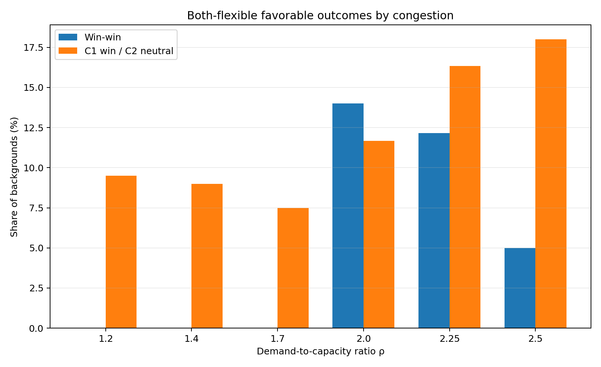
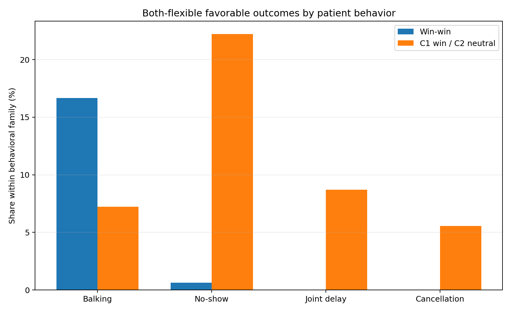

This report asks a different question from the average-utilization and revenue-weighted analyses: **can the scheduling policy improve access for both patient classes, or improve Class 1 while keeping Class 2 practically unchanged?**

The primary analysis uses the expanded main demand range **ρ = 1.2, 1.4, 1.7, 2.0, 2.25, and 2.5** and the **3,600 heterogeneous clinic backgrounds**. The 600 backgrounds at ρ=3.0 remain a stress condition. Same-behavior controls are excluded from headline percentages and medians.

# The dedicated access objective

For each policy family, the search maximizes the **worse of the two class-specific served-rate changes**:

**maximize min(Δ Class 1 served rate, Δ Class 2 served rate)**

subject to average utilization being no more than **0.5 percentage points below baseline**.

Baseline-equivalent cells are included in the candidate set. Therefore, on the search seeds, the optimizer does not need to accept a negative worst-class access change when it can choose the baseline-equivalent policy instead. The selected cell is then evaluated on **10 independent paired seeds**; confidence intervals use **2,000 paired bootstrap draws**.

The access classifications use the primary **±0.5 pp** practical band:

- **Win-win:** both classes have a point estimate of at least +0.5 pp and a 95% interval above zero.
- **Class 1 win / Class 2 neutral:** Class 1 has a meaningful gain and Class 2's entire 95% interval lies within ±0.5 pp.
- **Both neutral:** both class intervals lie within ±0.5 pp.
- **Class 1 gain / Class 2 harm:** Class 1 has a meaningful gain and Class 2 has a meaningful loss.
- **Uncertain / mixed:** the intervals do not support one of the preceding conclusions.

# Headline result

| Policy vs baseline | Win-win | C1 win / C2 neutral | Both neutral | Uncertain / mixed | C1 gain / C2 harm |
|---|---:|---:|---:|---:|---:|
| Horizon only | **5.6%** | **8.0%** | 63.2% | 23.2% | 0.0% |
| Reservation only | **0.0%** | **1.6%** | 86.8% | 11.5% | 0.1% |
| Both flexible | **5.2%** | **12.0% | 47.9% | 34.3% | 0.5% |

Three conclusions are immediate:

- **Win-win opportunities exist, but they require horizon flexibility.** Horizon-only and both-flexible each produce supported win-win outcomes in about 5%–6% of backgrounds.
- **Reservation-only does not produce a supported win-win in any headline background.** Its best role under this objective is occasionally to improve Class 1 while leaving Class 2 neutral.
- **Both flexible creates the largest win-neutral region:** 12.0% of backgrounds have a meaningful Class 1 gain with supported-neutral Class 2 access.

# Why the dedicated objective changes the both-flexible result

Under average-utilization optimization, the both-flexible policy produced very few favorable access outcomes because reservations were selected for utilization even when they shifted access from Class 2 to Class 1. The dedicated objective explicitly rewards the weaker class outcome.

For **both flexible**:

| Objective | Win-win | C1 win / C2 neutral | Combined favorable |
|---|---:|---:|---:|
| Average-utilization optimization | **0.5%** | **0.3%** | **0.8%** |
| Dedicated win-win optimization | **5.2%** | **12.0%** | **17.2%** |

The access improvement does not require meaningful clinic-wide utilization harm. Relative to the **average-utilization-optimal both-flexible cell in the same background**, the dedicated access objective changes median utilization by only **-0.02 pp**. The mean difference is larger (**-0.76 pp**) because some backgrounds deliberately give up part of a large utilization optimum to balance access.

Across all 3,600 headline backgrounds, **no selected horizon-only, reservation-only, or both-flexible cell falls more than 0.5 pp below baseline utilization on the independent evaluation seeds**.

# Both-flexible: where do favorable outcomes come from?

The favorable both-flexible cases split into two mechanisms.

| Outcome | Reservation use | n | Median H | Median Q | Median W | Median ΔU | Median ΔSR1 | Median ΔSR2 |
|---|---|---:|---:|---:|---:|---:|---:|---:|
| Win-win | Q=0 | 120 | 4 | 0 | — | **+2.06 pp** | **+1.63 pp** | **+0.68 pp** |
| Win-win | Q>0 | 67 | 4 | 5 | 2 | **+2.06 pp** | **+1.38 pp** | **+0.87 pp** |
| C1 win / C2 neutral | Q=0 | 264 | 4 | 0 | — | **+1.83 pp** | **+2.52 pp** | 0.02 pp |
| C1 win / C2 neutral | Q>0 | 168 | 4 | 3 | 4 | 0.00 pp | **+1.03 pp** | -0.03 pp |

## True win-win with reservations

There are **187** supported both-flexible win-win backgrounds. **120 select Q=0**, so they are effectively horizon-only policies. The remaining **67 use a genuine reservation**.

Those 67 reservation-based win-wins are highly concentrated:

- **66 of 67** are in the **balking-sensitivity** family.
- **48** occur at ρ=2.0 and **19** at ρ=2.25.
- The selected horizon is always **2 or 4 days**; the median is **4 days**.
- Median reservation quantity is **Q=5** and median reservation window is **2 days**.
- Median utilization improves by about **2.06 pp**, while Class 1 and Class 2 served rates improve by about **1.38 pp** and **0.87 pp**, respectively.

The mechanism is **recovered capacity first, prioritization second**. A short horizon reduces delay-sensitive attrition enough to create additional completed service. A modest reservation can then steer some of that recovered access toward Class 1 without pushing Class 2 below its baseline access.

This is why simply increasing Q would not necessarily help. Q protects capacity for Class 1; it is not a cap on Class 1 bookings. A larger Q can begin to displace Class 2 and destroy the win-win.

## Win-neutral with reservations

There are **432** both-flexible Class 1 win / Class 2 neutral backgrounds. **168 use Q>0**.

The genuine-reservation win-neutral cases have a different pattern:

- **111 of 168** occur at low demand, ρ=1.2 or 1.4.
- **132 of 168** have Class 1 share **0.1**.
- Median settings are approximately **H=4, Q=3, W=4**.
- Median Class 1 served-rate gain is about **+1.03 pp**.
- Median Class 2 change is essentially zero (**−0.03 pp**).
- Median utilization change is essentially zero.

These cases are driven by **slack capacity and a small priority population**. A limited reservation can improve Class 1 access without requiring meaningful displacement of Class 2.

The majority of favorable both-flexible outcomes still select **Q=0**. Reservations can support favorable access, but they are not the main source of the win-win region.

# Congestion determines which favorable mechanism is available

| ρ | Win-win | C1 win / C2 neutral | Combined favorable |
|---:|---:|---:|---:|
| 1.20 | 0.0% | 9.5% | **9.5%** |
| 1.40 | 0.0% | 9.0% | **9.0%** |
| 1.70 | 0.0% | 7.5% | **7.5%** |
| 2.00 | 14.0% | 11.7% | **25.7%** |
| 2.25 | 12.2% | 16.3% | **28.5%** |
| 2.50 | 5.0% | 18.0% | **23.0%** |

Two regimes emerge:

- **Low demand (ρ=1.2–1.4):** there are no supported win-wins, but about 9% of backgrounds can produce **Class 1 win / Class 2 neutral** outcomes. These are predominantly slack-capacity reservation cases.
- **High demand (ρ=2.0–2.5):** true win-wins appear. The combined favorable rate peaks at **28.5% at ρ=2.25**. These results are driven primarily by short-horizon recovery of delay-sensitive losses.

Thus, win-neutral and win-win are not the same phenomenon. **Win-neutral is easiest when there is slack; win-win is most plausible when congestion is high enough that reducing delay-sensitive attrition creates new effective capacity.**

# Patient behavior determines whether both classes can gain

| Behavioral family | Win-win | C1 win / C2 neutral | Combined favorable |
|---|---:|---:|---:|
| Balking | 16.7% | 7.2% | **23.9%** |
| No-show | 0.6% | 22.2% | **22.9%** |
| Joint delay | 0.0% | 8.7% | **8.7%** |
| Cancellation | 0.0% | 5.6% | **5.6%** |

The behavioral mechanisms are sharply different:

- **Balking sensitivity is the main true win-win environment.** About **16.7%** of balking backgrounds are supported win-wins under both flexible. Keeping patients from balking can increase the pool of patients who remain available to use capacity.
- **No-show sensitivity produces mostly win-neutral rather than win-win outcomes.** About **22.2%** of no-show backgrounds give Class 1 a meaningful gain while Class 2 remains neutral, but only **0.6%** are supported win-wins.
- **Joint-delay sensitivity produces win-neutral cases but no supported win-wins** in the headline main range. The two mechanisms interact, but the reservation/access tradeoff prevents both classes from clearing the meaningful-gain threshold simultaneously.
- **Cancellation propensity produces few favorable outcomes** because cancellation is not delay-dependent in this design and canceled capacity can reopen.

# Class 1 population share

The size of the priority group strongly affects whether Class 1 can improve without displacing Class 2.

| Class 1 share | Win-win | C1 win / C2 neutral | Combined favorable |
|---:|---:|---:|---:|
| 0.1 | 10.8% | 26.7% | **37.5%** |
| 0.3 | 5.8% | 21.0% | **26.8%** |
| 0.5 | 4.2% | 4.4% | **8.6%** |
| 0.7 | 3.3% | 7.9% | **11.2%** |
| 0.9 | 1.8% | 0.0% | **1.8%** |

The favorable rate is highest when Class 1 is small: **37.5% at a 10% Class 1 share** and **26.8% at 30%**. A small protected population requires relatively little capacity to create a meaningful Class 1 served-rate improvement. At a 90% Class 1 share, the favorable rate falls to only **1.8%** because there is little remaining Class 2 service that can be protected from displacement.

# Why reservation-only still cannot create a true win-win

Under the dedicated search, reservation-only has:

- **0 supported win-win backgrounds**;
- **56 Class 1 win / Class 2 neutral backgrounds (1.6%)**; and
- **74.9% of selected reservation-only cells choose Q=0**, making them baseline-equivalent.

This is a structural result. Reservation-only changes **who has first claim on existing capacity**, but it does not shorten delay. When capacity is scarce enough for reservations to materially improve Class 1 access, the gain typically comes from capacity Class 2 would otherwise use.

Horizon flexibility is different because it can reduce behavioral losses and increase the amount of capacity that is actually converted into completed visits. That recovered capacity is what makes true win-win outcomes possible.

# Sensitivity to the utilization floor

The search was repeated allowing either a **0.5 pp** or **1.0 pp** reduction in average utilization. The selected H, Q, and W cells are **identical in 100% of the 3,600 headline backgrounds for all four policy regimes**.

Therefore, the 0.5 pp utilization floor is not binding in a way that suppresses additional win-win opportunities. Allowing twice as much utilization loss does not change the selected policies.

# Clinic-facing conclusions

- **Use horizon flexibility as the primary win-win lever.** Supported win-wins appear under horizon-only and both-flexible policies, but not under reservation-only.
- **True reservation-based win-wins exist, but they are uncommon.** Only 67 of 3,600 backgrounds combine a supported win-win with Q>0; almost all are balking-sensitive clinics at ρ=2.0–2.25 using a very short horizon and modest reservation.
- **Win-neutral reservation cases are more common when Class 1 is small and the clinic has slack.** This is the clearest setting for improving priority-group access without measurable Class 2 harm.
- **Do not interpret Q as a cap on Class 1.** Increasing Q protects more capacity for Class 1 and can increase Class 2 displacement.
- **The dedicated objective substantially changes the both-flexible policy.** Favorable both-flexible outcomes rise from about 0.8% under average-utilization optimization to **17.2%** under explicit access balancing.
- **The 1 pp utilization-loss sensitivity does not uncover additional policy regimes.** The same cells are selected as under the primary 0.5 pp floor.

---

Primary data inputs:

- `full_run_summaries/h1_patient_characteristics_expanded/release/selected_policy_outcomes.csv`
- `full_run_summaries/h1_patient_characteristics_expanded/release/pairwise_group_deltas.csv`

Same-behavior controls remain available in the release data but are excluded from headline means, medians, percentages, figures, and tables.
