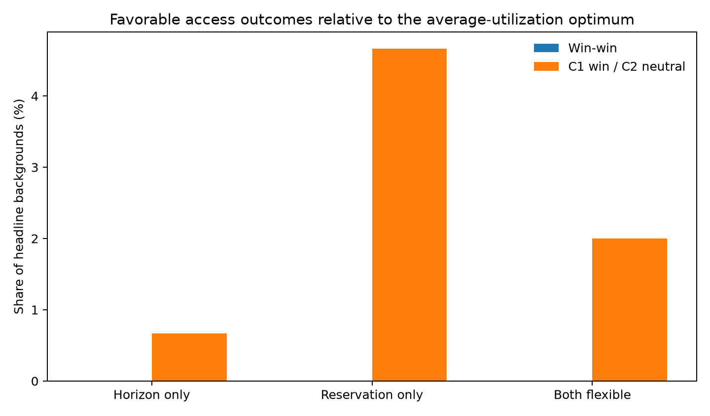
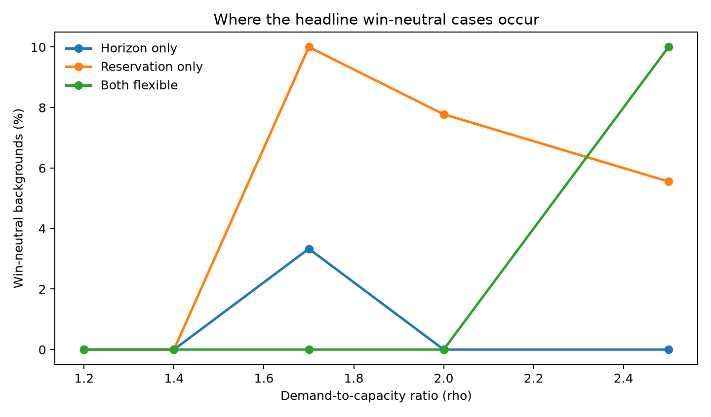
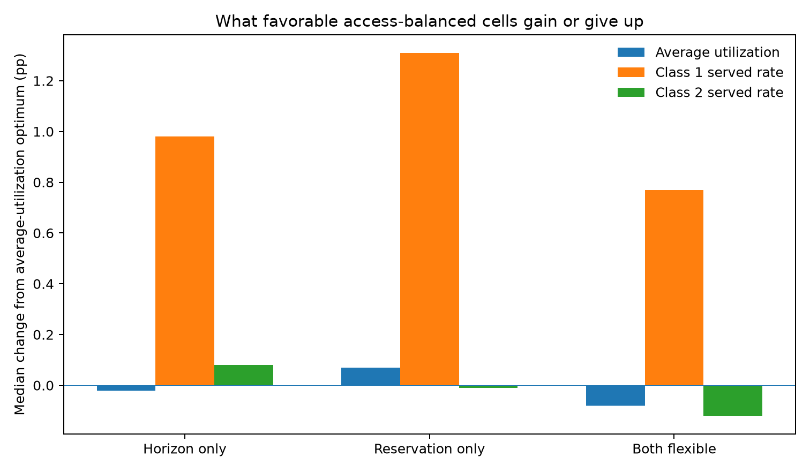

```{python}
from pathlib import Path
import numpy as np
import pandas as pd
import matplotlib.pyplot as plt
from IPython.display import display

FIG = Path("figures")
FIG.mkdir(parents=True, exist_ok=True)

# Finalized summaries from the completed 3×3 access-optimization analysis.
# They are embedded so this report does not depend on generated CSVs being
# present in the local repository clone.

# Headline range: rho <= 2.5; 450 backgrounds per policy.
headline = pd.DataFrame({
    "Policy": ["Horizon only", "Reservation only", "Both flexible"],
    "Win-win": [0, 0, 0],
    "C1 win / C2 neutral": [3, 21, 9],
    "Total backgrounds": [450, 450, 450],
})
headline["Win-win rate"] = 100 * headline["Win-win"] / headline["Total backgrounds"]
headline["Win-neutral rate"] = 100 * headline["C1 win / C2 neutral"] / headline["Total backgrounds"]

# Each rho contains 90 backgrounds per policy in the headline range.
demand_counts = pd.DataFrame([
    ["Horizon only", 1.2, 0], ["Horizon only", 1.4, 0],
    ["Horizon only", 1.7, 3], ["Horizon only", 2.0, 0],
    ["Horizon only", 2.5, 0],
    ["Reservation only", 1.2, 0], ["Reservation only", 1.4, 0],
    ["Reservation only", 1.7, 9], ["Reservation only", 2.0, 7],
    ["Reservation only", 2.5, 5],
    ["Both flexible", 1.2, 0], ["Both flexible", 1.4, 0],
    ["Both flexible", 1.7, 0], ["Both flexible", 2.0, 0],
    ["Both flexible", 2.5, 9],
], columns=["Policy", "rho", "Favorable cases"])
demand_counts["Favorable rate"] = 100 * demand_counts["Favorable cases"] / 90

behavior_summary = pd.DataFrame([
    {
        "Policy": "Horizon only",
        "No-show severity": "High: 3",
        "Balking severity": "Low: 1; Medium: 1; High: 1",
        "Demand": "rho = 1.7 only",
        "Class 1 share": "0.1 only",
    },
    {
        "Policy": "Reservation only",
        "No-show severity": "Low: 4; Medium: 8; High: 9",
        "Balking severity": "Low: 8; Medium: 6; High: 7",
        "Demand": "rho 1.7: 9; 2.0: 7; 2.5: 5",
        "Class 1 share": "0.1: 20; 0.3: 1",
    },
    {
        "Policy": "Both flexible",
        "No-show severity": "Full design: Low 5; Medium 6; High 6",
        "Balking severity": "Full design: Low 5; Medium 6; High 6",
        "Demand": "Headline rho 2.5: 9; stress rho 3.0: 8",
        "Class 1 share": "0.1 only",
    },
])

# Median metric changes among all favorable cases in the completed design,
# relative to the average-utilization-optimal cell for the same background.
metrics = pd.DataFrame({
    "Policy": ["Horizon only", "Reservation only", "Both flexible"],
    "Delta average utilization": [-0.0002, 0.0007, -0.0008],
    "Delta Class 1 served rate": [0.0098, 0.0131, 0.0077],
    "Delta Class 2 served rate": [0.0008, -0.0001, -0.0012],
})

settings = pd.DataFrame({
    "Policy": ["Horizon only", "Reservation only", "Both flexible"],
    "Average-utilization optimum": ["H = 3", "H = 100, Q = 45", "H = 13, Q = 42"],
    "Access-balanced choice": ["H = 4", "H = 100, Q = 50", "H = 13, Q = 40"],
})


def favorable_policy_figure():
    z = headline.copy()
    x = np.arange(len(z))
    width = 0.34
    fig, ax = plt.subplots(figsize=(8.0, 4.7))
    ax.bar(x - width/2, z["Win-win rate"], width, label="Win-win")
    ax.bar(x + width/2, z["Win-neutral rate"], width, label="C1 win / C2 neutral")
    ax.set_xticks(x, z["Policy"])
    ax.set_ylabel("Share of headline backgrounds (%)")
    ax.set_title("Favorable access outcomes relative to the average-utilization optimum")
    ax.legend(frameon=False)
    fig.tight_layout()
    fig.savefig(FIG / "ww3s_01_headline.png", dpi=180)
    plt.close(fig)


def demand_figure():
    fig, ax = plt.subplots(figsize=(8.0, 4.7))
    for policy in ["Horizon only", "Reservation only", "Both flexible"]:
        s = demand_counts[demand_counts["Policy"] == policy].sort_values("rho")
        ax.plot(s["rho"], s["Favorable rate"], marker="o", linewidth=2, label=policy)
    ax.set_xlabel("Demand-to-capacity ratio (rho)")
    ax.set_ylabel("Win-neutral backgrounds (%)")
    ax.set_title("Where the headline win-neutral cases occur")
    ax.legend(frameon=False)
    fig.tight_layout()
    fig.savefig(FIG / "ww3s_02_demand.png", dpi=180)
    plt.close(fig)


def metric_figure():
    z = metrics.copy()
    x = np.arange(len(z))
    width = 0.24
    fig, ax = plt.subplots(figsize=(8.4, 4.9))
    cols = [
        ("Delta average utilization", "Average utilization"),
        ("Delta Class 1 served rate", "Class 1 served rate"),
        ("Delta Class 2 served rate", "Class 2 served rate"),
    ]
    for i, (col, label) in enumerate(cols):
        ax.bar(x + (i - 1) * width, 100 * z[col], width, label=label)
    ax.axhline(0, linewidth=0.8)
    ax.set_xticks(x, z["Policy"])
    ax.set_ylabel("Median change from average-utilization optimum (pp)")
    ax.set_title("What favorable access-balanced cells gain or give up")
    ax.legend(frameon=False)
    fig.tight_layout()
    fig.savefig(FIG / "ww3s_03_metrics.png", dpi=180)
    plt.close(fig)


favorable_policy_figure()
demand_figure()
metric_figure()
```

This report asks one narrow question:

> **After a policy has already been optimized for average utilization, can we move to another cell in the same policy family that improves access for one or both classes without materially sacrificing the other class?**

The reference point is the **average-utilization-optimal cell**, not the no-policy baseline. The access search is constrained to remain within **0.5 percentage points of the average-utilization optimum**. A **win-win** requires meaningful improvement for both classes. A **Class 1 win / Class 2 neutral** case requires a meaningful Class 1 served-rate gain while Class 2 remains practically and statistically neutral within the ±0.5 pp band.

# Main finding 1: there are no supported win-wins in the headline range



```{python}
#| label: tbl-headline
#| tbl-cap: "Headline favorable outcomes relative to the average-utilization-optimal cell (rho <= 2.5)."

headline_display = headline[[
    "Policy", "Win-win", "C1 win / C2 neutral", "Total backgrounds",
    "Win-win rate", "Win-neutral rate"
]].copy()
headline_display["Win-win rate"] = headline_display["Win-win rate"].map(lambda x: f"{x:.1f}%")
headline_display["Win-neutral rate"] = headline_display["Win-neutral rate"].map(lambda x: f"{x:.1f}%")
display(headline_display.style.hide(axis="index"))
```

The most important result is that **none of the three policy families produces a supported true win-win after average utilization has already been optimized**.

The favorable region consists only of **Class 1 win / Class 2 neutral** cases:

- **Horizon only:** 3 of 450 backgrounds, or **0.7%**.
- **Reservation only:** 21 of 450 backgrounds, or **4.7%**.
- **Both flexible:** 9 of 450 headline backgrounds, or **2.0%**.

This is a much harder benchmark than the earlier baseline-referenced analysis because most of the easy capacity-recovery opportunities have already been used by the average-utilization optimizer.

# Main finding 2: win-neutral cases occur in specific clinic regimes



```{python}
#| label: tbl-favorable-conditions
#| tbl-cap: "Common characteristics of the favorable access cases."

display(behavior_summary.style.hide(axis="index"))
```

**Horizon only** has a very narrow favorable region. All three cases occur at **rho = 1.7**, all have a **10% Class 1 share**, and all are in the **high no-show** scenario. Balking severity does not distinguish them: one case occurs at each balking level.

**Reservation only** has the broadest headline win-neutral region. Its 21 favorable cases occur at **rho = 1.7, 2.0, and 2.5**, and **20 of 21** have a **10% Class 1 share**. No-show and balking severity are comparatively diffuse. This indicates that **small Class 1 share is a much stronger common feature than a particular behavior-severity cell**.

**Both flexible** is also concentrated entirely at a **10% Class 1 share**. The nine headline cases occur at **rho = 2.5**. Another eight favorable cases appear only in the **rho = 3.0 stress condition**, so the both-flexible favorable region is concentrated at the highest demand levels. Across the full design, its favorable cases are spread almost evenly across low, medium, and high no-show and balking severity.

The common theme is:

> **Win-neutral access adjustments are most plausible when Class 1 is small. Demand determines which policy family can create that adjustment, while behavioral severity is generally a weaker discriminator.**

# Main finding 3: favorable cases buy modest Class 1 access, not a new source of utilization



The following values compare the access-balanced cell directly with the **average-utilization-optimal cell in the same background and policy family**.

```{python}
#| label: tbl-favorable-metrics
#| tbl-cap: "Median change among favorable cases relative to the average-utilization optimum."

metric_display = metrics.copy()
for col in ["Delta average utilization", "Delta Class 1 served rate", "Delta Class 2 served rate"]:
    metric_display[col] = (100 * metric_display[col]).map(lambda x: f"{x:+.2f} pp")
display(metric_display.style.hide(axis="index"))
```

The favorable cases are **small movements along the access/utilization frontier** rather than large new efficiency gains.

- **Horizon only:** median utilization changes by about **−0.02 pp**, Class 1 served rate improves by **+0.98 pp**, and Class 2 changes by only **+0.08 pp**.
- **Reservation only:** median utilization is essentially unchanged at **+0.07 pp**, Class 1 gains **+1.31 pp**, and Class 2 is essentially unchanged at **−0.01 pp**.
- **Both flexible:** median utilization changes by about **−0.08 pp**, Class 1 gains **+0.77 pp**, and Class 2 changes by about **−0.12 pp**.

These medians use all favorable cases in the completed design, including the both-flexible stress cases at rho = 3.0. The headline favorable-rate table above continues to use only rho <= 2.5.

The typical policy movement is also modest:

```{python}
#| label: tbl-favorable-settings
#| tbl-cap: "Typical policy movement among favorable cases."

display(settings.style.hide(axis="index"))
```

For horizon-only, the favorable move is typically from about **H = 3 to H = 4**. Reservation-only keeps the open **H = 100** horizon and changes protection from roughly **Q = 45 to Q = 50**. Both-flexible changes the reservation quantity modestly while leaving the median horizon unchanged.

# Operational interpretation

The access-balancing experiment gives a fairly specific answer. **There is no broad Pareto-improvement region after utilization has already been optimized.** The remaining opportunities are mostly small **Class 1 win / Class 2 neutral** adjustments.

The strongest common characteristic is a **small Class 1 population**. When Class 1 is only 10% of arrivals, the optimizer can sometimes improve its served rate by roughly one percentage point without producing a measurable Class 2 loss. When Class 1 is larger, that becomes much harder because improving Class 1 requires redirecting enough capacity to affect Class 2.

The practical decision is therefore not whether to abandon the utilization-optimal policy. It is whether a clinic values a **roughly one-percentage-point improvement in Class 1 access enough to make a small policy adjustment that leaves utilization almost unchanged**.

---

This standalone report embeds the finalized summaries from the completed 3×3 access-optimization analysis, so it can render without requiring `access_policy_deltas.csv` to be present in the local clone.
