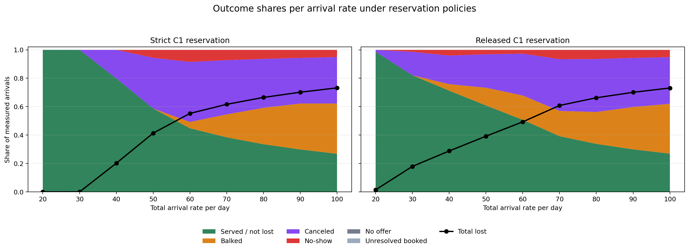
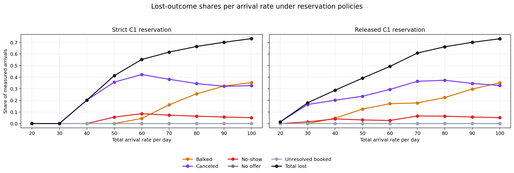

# Reservation Outcome Shares by Arrival Rate

**Stale after reservation-engine correction.** These plots and CSVs were generated before the Class-1-first backfill logic was corrected to process Class 1 with day-by-day reserved-then-general search. Regenerate this sweep before presenting or interpreting the numeric results.

This sweep compares the two reservation policies only:

- `Strict C1 reservation`
- `Class-1-first backfill reservation`

The total daily arrival rate varies from `20` to `100`. Class mix is kept symmetric, so each class receives half of the total arrival rate. All other assumptions follow the current editable scenario in `notebooks/05_reserved_slot_strategy.ipynb`: `S=32`, `H=14`, `Q=10`, 365 measured days, and 10 seeds per arrival-rate point.

## Outcome-Share Graph

The green area is `served / not lost`. All other stacked areas are lost outcomes: balked, canceled, no-show, no-offer, and unresolved booked. The black line is the total lost share.

## Lost-Outcome Detail

This second graph separates the lost components so small loss categories are easier to read.

## Mean Outcome Shares

| policy | lambda_total | served_share | balked_share | canceled_share | no_show_share | no_offer_share | unresolved_booked_share | lost_share |
|:--|--:|--:|--:|--:|--:|--:|--:|--:|
| Class-1-first backfill reservation | 20 | 0.9856 | 0.0000 | 0.0144 | 0.0000 | 0.0000 | 0.0000 | 0.0144 |
| Class-1-first backfill reservation | 30 | 0.8207 | 0.0001 | 0.1647 | 0.0146 | 0.0000 | 0.0000 | 0.1793 |
| Class-1-first backfill reservation | 40 | 0.7122 | 0.0461 | 0.2014 | 0.0403 | 0.0000 | 0.0000 | 0.2878 |
| Class-1-first backfill reservation | 50 | 0.6081 | 0.1250 | 0.2355 | 0.0313 | 0.0000 | 0.0000 | 0.3919 |
| Class-1-first backfill reservation | 60 | 0.5069 | 0.1715 | 0.2947 | 0.0267 | 0.0000 | 0.0001 | 0.4931 |
| Class-1-first backfill reservation | 70 | 0.3918 | 0.1778 | 0.3645 | 0.0655 | 0.0000 | 0.0004 | 0.6082 |
| Class-1-first backfill reservation | 80 | 0.3376 | 0.2247 | 0.3734 | 0.0639 | 0.0000 | 0.0003 | 0.6624 |
| Class-1-first backfill reservation | 90 | 0.2993 | 0.2979 | 0.3459 | 0.0566 | 0.0000 | 0.0003 | 0.7007 |
| Class-1-first backfill reservation | 100 | 0.2688 | 0.3512 | 0.3285 | 0.0511 | 0.0000 | 0.0003 | 0.7312 |
| Strict C1 reservation | 20 | 1.0000 | 0.0000 | 0.0000 | 0.0000 | 0.0000 | 0.0000 | 0.0000 |
| Strict C1 reservation | 30 | 0.9999 | 0.0000 | 0.0001 | 0.0000 | 0.0000 | 0.0000 | 0.0001 |
| Strict C1 reservation | 40 | 0.7982 | 0.0000 | 0.2018 | 0.0000 | 0.0000 | 0.0000 | 0.2018 |
| Strict C1 reservation | 50 | 0.5868 | 0.0000 | 0.3575 | 0.0558 | 0.0000 | 0.0000 | 0.4132 |
| Strict C1 reservation | 60 | 0.4477 | 0.0443 | 0.4226 | 0.0853 | 0.0000 | 0.0000 | 0.5523 |
| Strict C1 reservation | 70 | 0.3837 | 0.1617 | 0.3820 | 0.0726 | 0.0000 | 0.0000 | 0.6163 |
| Strict C1 reservation | 80 | 0.3352 | 0.2565 | 0.3448 | 0.0635 | 0.0000 | 0.0000 | 0.6648 |
| Strict C1 reservation | 90 | 0.2985 | 0.3232 | 0.3215 | 0.0567 | 0.0000 | 0.0000 | 0.7015 |
| Strict C1 reservation | 100 | 0.2679 | 0.3539 | 0.3270 | 0.0507 | 0.0001 | 0.0003 | 0.7321 |

## Data Files

- `reservation_outcome_shares_by_arrival_rate_runs.csv`: one row per policy, arrival rate, and seed.
- `reservation_outcome_shares_by_arrival_rate_mean.csv`: mean outcome shares used in the plots.
- `reservation_outcome_shares_by_arrival_rate_std.csv`: standard deviations by policy and arrival rate.
