# FCFS Appointment Simulation: Metric-Focused Sensitivity Report

Canonical source: `docs/reports/metric_analysis.qmd`. This Markdown file is a generated or
companion surface and should not be edited as an independent report.

This report is organized by metric. Each section starts with the simplest driver plots and then moves to class-by-class heatmaps or regression evidence.

In the metric driver plots, Class 1 varies on the x-axis while Class 2 stays fixed at its baseline value. Each plot shows the overall value plus Class 1 and Class 2 values when a class-level value exists. For utilization, the class lines are each class's served slots divided by all available slots.

The baseline treats Class 1 and Class 2 symmetrically: same arrival rate, cancellation probability, balking rule, no-show rule, and value. Symmetric heatmaps mostly show absolute parameter effects. Class advantage appears when the class assumptions differ.

## Metrics

| Metric | Meaning | Main drivers |
|---|---|---|
| `average_utilization` | Completed visits / available slots | no-show risk, cancellation, demand |
| `overall_percent_serviced` | served arrivals / all arrivals | total demand, no-show, cancellation, balking |
| `mean_offered_booking_delay` | average offered delay among patients who received an offer | demand, balking tolerance, cancellation |
| `overall_balking_rate` | balked / offered | balking step and threshold |
| `access_advantage_class_1` | Class 1 served rate minus Class 2 served rate | class-specific behavior gaps |

Baseline summary:

| Scenario | Utilization | Overall served | Accepted wait | Offered wait | Class gap | Delay gap |
|---|---:|---:|---:|---:|---:|---:|
| Baseline | 0.839 | 0.269 | 8.35 | 9.30 | 0.001 | 0.003 |
| Scenario 2 | 1.000 | 0.395 | 4.29 | 5.06 | -0.008 | 0.005 |

Scenario 2 changes several assumptions at once, so treat it as a comparison point rather than a one-parameter causal test.

Color code:

| Color | Meaning |
|---|---|
| Blue | arrival pressure, arrival mix, and demand-load changes |
| Purple | balking step, balking threshold, and balking-rate diagnostics |
| Green | no-show step and no-show threshold changes |
| Red | cancellation probability changes |
| Line style and marker | overall, Class 1, and Class 2 within the same driver family |
| Gray dashed line | baseline assumption |
| Driver-colored heatmaps | varied assumption family; for class gaps, lighter shades indicate Class 2 is higher and darker shades indicate Class 1 is higher |

## Average Utilization

`average_utilization` is completed visits per available slot. No-shows do not count because the slot did not become a completed visit.

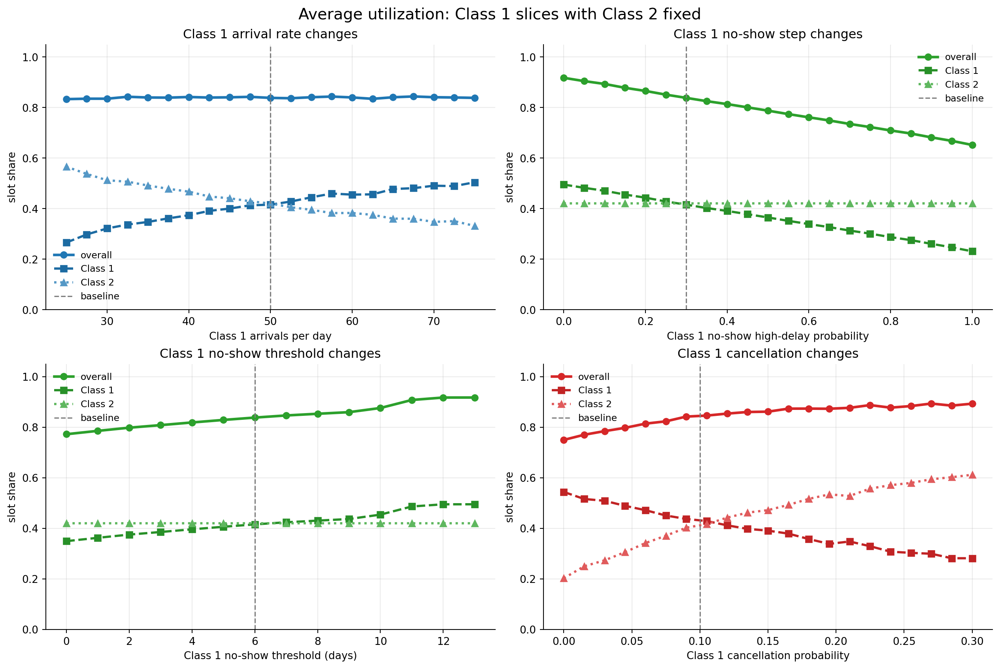

No-show behavior is the clearest direct driver. Demand pressure is more subtle: utilization can stay high even when access is poor. The Class 1 and Class 2 lines split utilization into each class's share of all available slots.

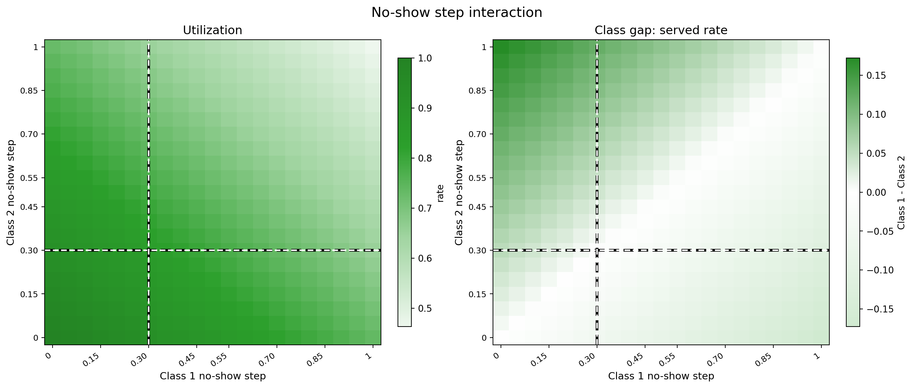

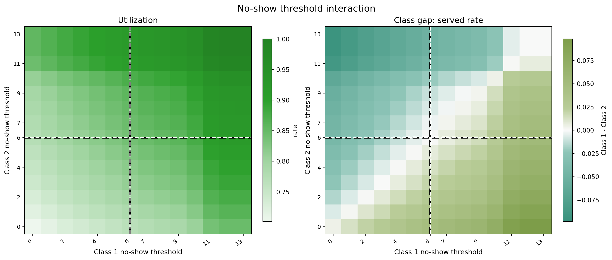

## Overall Served Rate

`overall_percent_serviced` is the main access metric: served arrivals divided by all arrivals.

The strongest aggregate driver is total arrival pressure. No-shows and cancellations reduce completed visits after booking. Balking reduces served rate because patients reject long-delay offers. In the driver plot, the vertical distance between Class 1 and Class 2 shows the class effect.

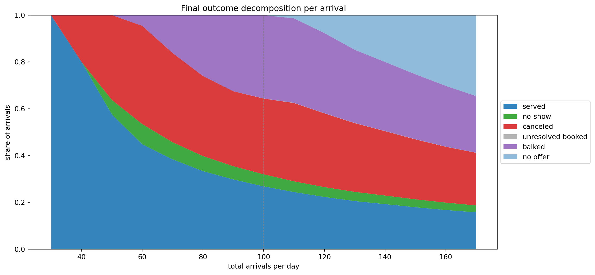

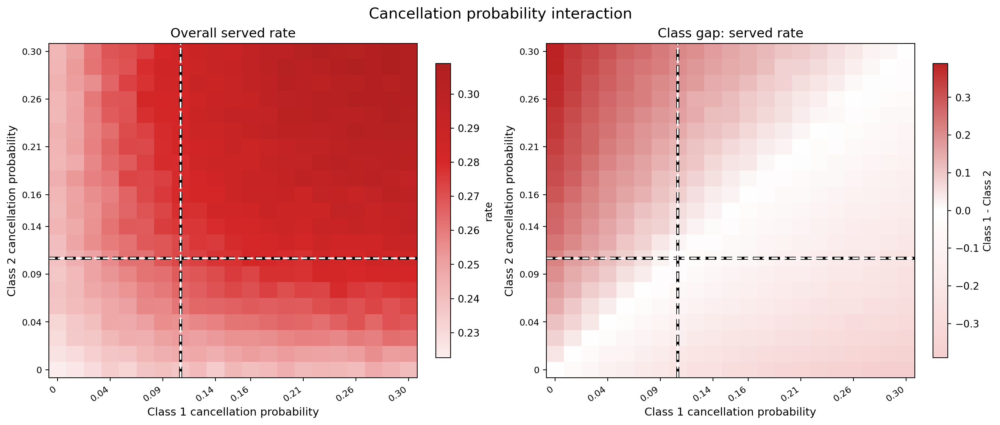

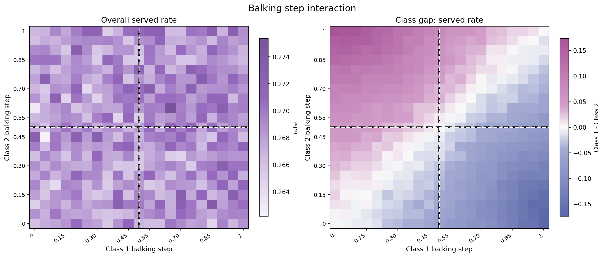

## Mean Offered Booking Delay

`mean_offered_booking_delay` averages the delay offered to patients who received an offer, including patients who later balked. Patients with `no_offer` are excluded.

Demand pressure raises offered wait. Balking and cancellation need careful interpretation because shorter waits can happen when patients leave the system, not only when access improves. The driver plot shows overall, Class 1, and Class 2 offered waits.

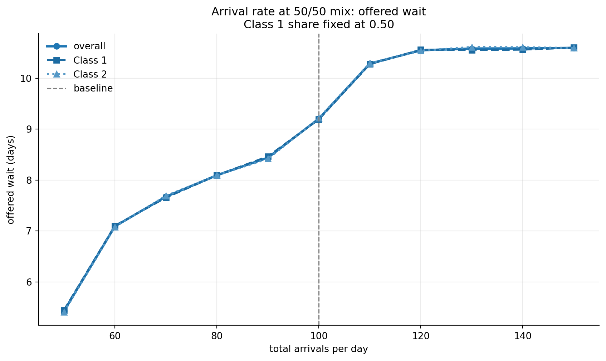

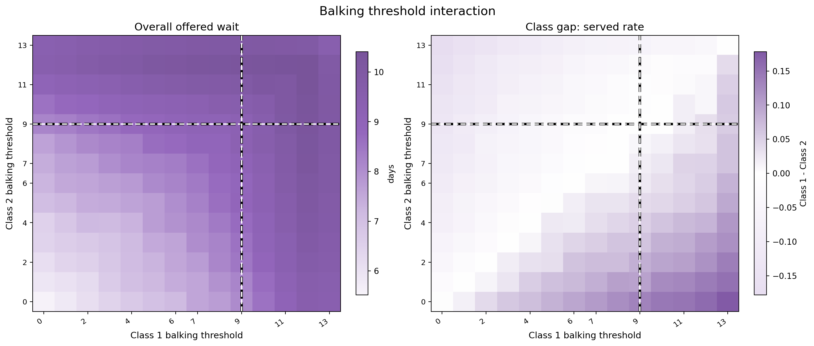

## Balking Rate

`overall_balking_rate` is `balked / offered`. It is a diagnostic for rejected offers, not a final success metric.

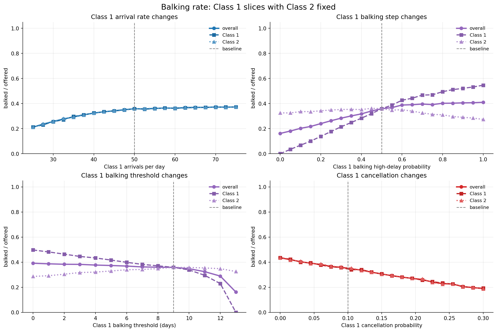

Higher balking step raises rejection after the threshold. Lower threshold starts that high rejection probability earlier. The driver plot shows overall, Class 1, and Class 2 balking rates.

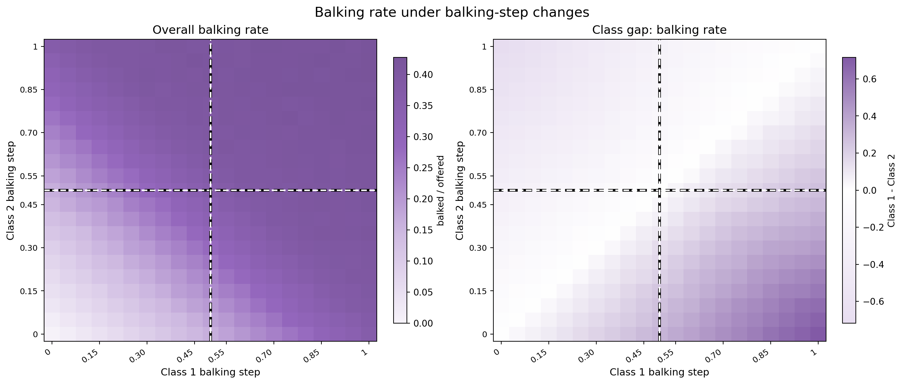

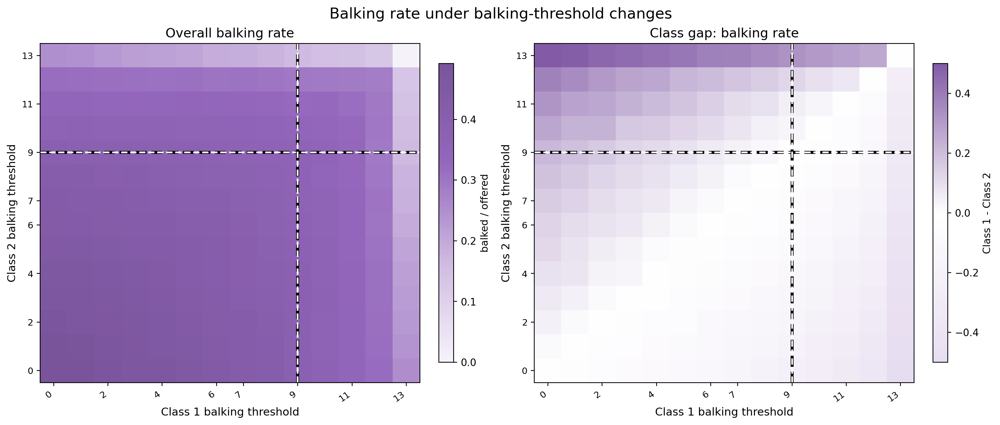

## Class Served-Rate Gap

`access_advantage_class_1 = percent_serviced_1 - percent_serviced_2`. Positive means Class 1 is served more often; negative means Class 2 is served more often.

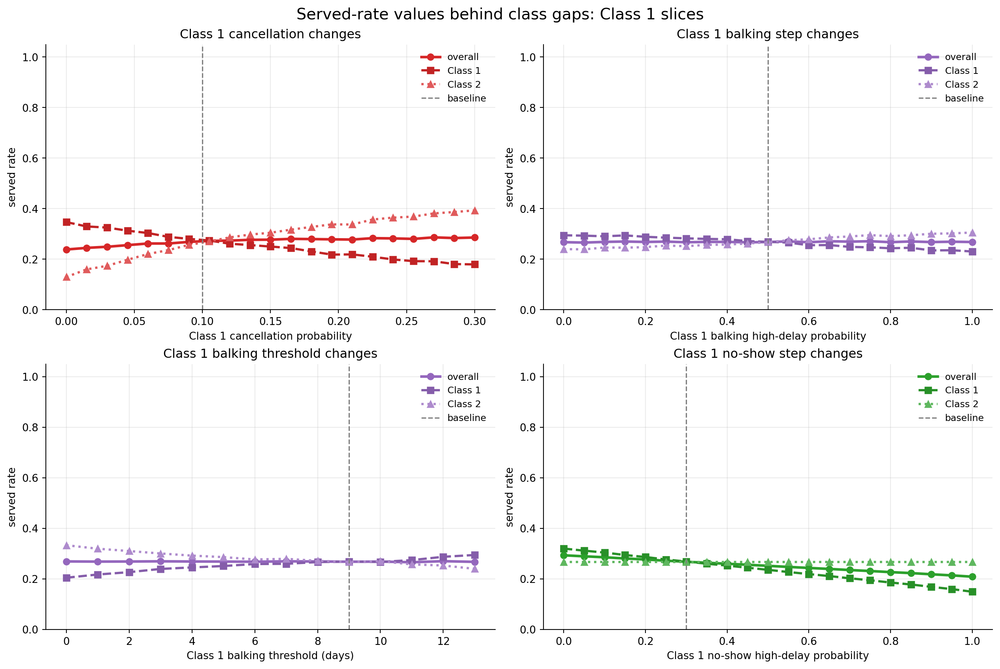

Higher Class 1 cancellation probability, balking step, or no-show step moves the Class 1 line below the Class 2 line. A higher Class 1 balking threshold helps Class 1 because it tolerates longer offered waits.

## Regression Screen

The regression screen uses 240 randomized FCFS parameter settings with two seeds
per setting. Significance is handled with `statsmodels` OLS using HC3 robust
standard errors. The table and figure keep only coefficients with robust
p-values below 0.05.

| Target metric | Significant feature | Standardized coefficient | 95% HC3 CI | HC3 p-value |
|---|---|---:|---:|---:|
| Utilization | average no-show threshold | 0.512 | [0.433, 0.591] | <0.001 |
| Utilization | average no-show step | -0.423 | [-0.501, -0.346] | <0.001 |
| Utilization | average cancellation probability | 0.320 | [0.247, 0.393] | <0.001 |
| Utilization | total arrival rate | -0.109 | [-0.188, -0.031] | 0.006 |
| Utilization | average balking threshold | -0.086 | [-0.162, -0.009] | 0.028 |
| Overall served rate | total arrival rate | -0.774 | [-0.855, -0.694] | <0.001 |
| Overall served rate | average no-show threshold | 0.251 | [0.193, 0.308] | <0.001 |
| Overall served rate | average no-show step | -0.175 | [-0.232, -0.119] | <0.001 |
| Overall served rate | average cancellation probability | 0.117 | [0.058, 0.176] | <0.001 |
| Offered wait | total arrival rate | 0.576 | [0.499, 0.653] | <0.001 |
| Offered wait | average cancellation probability | -0.441 | [-0.506, -0.376] | <0.001 |
| Offered wait | average balking threshold | 0.278 | [0.202, 0.353] | <0.001 |
| Offered wait | average balking step | -0.206 | [-0.291, -0.122] | <0.001 |
| Class gap | cancellation probability gap | -0.452 | [-0.558, -0.347] | <0.001 |
| Class gap | balking threshold gap | 0.429 | [0.331, 0.528] | <0.001 |
| Class gap | balking step gap | -0.349 | [-0.431, -0.266] | <0.001 |
| Class gap | no-show threshold gap | 0.268 | [0.179, 0.357] | <0.001 |
| Class gap | no-show step gap | -0.211 | [-0.286, -0.136] | <0.001 |
| Class gap | class 1 arrival share | -0.120 | [-0.209, -0.030] | 0.009 |

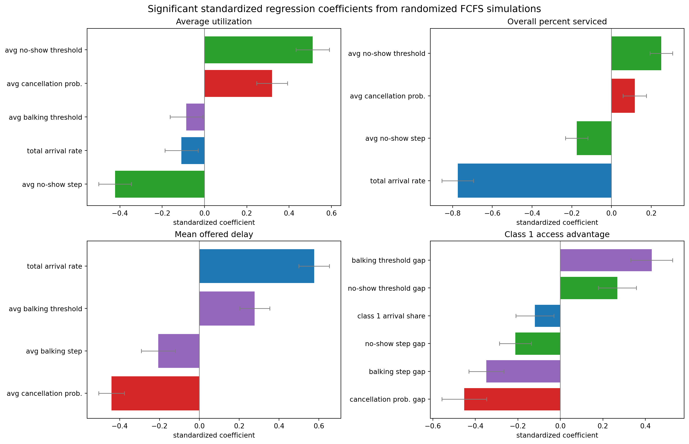

## Bottom Line

Use `overall_percent_serviced` for access and `average_utilization` for capacity use. Use `mean_offered_booking_delay` for patient-facing wait. Use balking rate and class gaps as diagnostics that explain why the final metrics moved.
